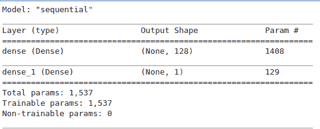
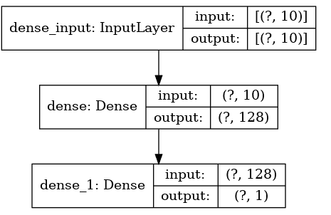
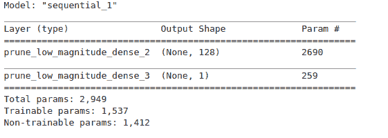
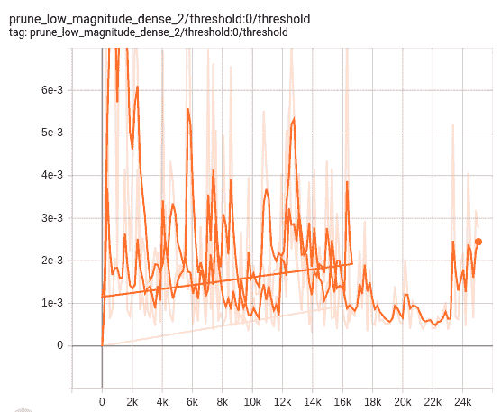
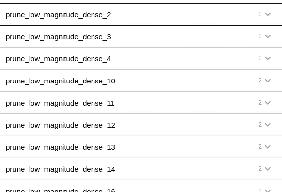

# TensorFlow 中的机器学习模型剪枝

> 原文：[`www.kdnuggets.com/2020/12/pruning-machine-learning-models-tensorflow.html`](https://www.kdnuggets.com/2020/12/pruning-machine-learning-models-tensorflow.html)

评论

[在上一篇文章中](https://heartbeat.fritz.ai/research-guide-pruning-techniques-for-neural-networks-d9b8440ab10d)，我们回顾了一些关于剪枝神经网络的主要文献。我们了解到剪枝是一种模型优化技术，涉及到在权重张量中消除不必要的值。这将导致更小的模型，其准确性非常接近基线模型。

在这篇文章中，我们将通过一个示例来应用剪枝，并查看对最终模型大小和预测误差的影响。

### 导入常见库

* * *

## 我们的前三个课程推荐

 1. [谷歌网络安全证书](https://www.kdnuggets.com/google-cybersecurity) - 快速进入网络安全职业。

 2. [谷歌数据分析专业证书](https://www.kdnuggets.com/google-data-analytics) - 提升你的数据分析技能

 3. [谷歌 IT 支持专业证书](https://www.kdnuggets.com/google-itsupport) - 支持组织的 IT 工作

* * *

我们的第一步是处理几个导入：

+   `Os` 和 `Zipfile` 将帮助我们评估模型的大小。

+   `tensorflow_model_optimization` 用于模型剪枝。

+   `load_model` 用于加载已保存的模型。

+   当然还包括 `tensorflow` 和 `keras`。

最后，我们初始化 TensorBoard，以便能够可视化模型：

```py
import os
import zipfile
import tensorflow as tf
import tensorflow_model_optimization as tfmot
from tensorflow.keras.models import load_model
from tensorflow import keras
%load_ext tensorboard
```

### 数据集生成

在这个实验中，我们将使用 scikit-learn 生成一个回归数据集。然后，我们将数据集拆分为训练集和测试集：

```py
from sklearn.datasets import make_friedman1
X, y = make_friedman1(n_samples=10000, n_features=10, random_state=0)from sklearn.model_selection import train_test_splitX_train, X_test, y_train, y_test = train_test_split(X, y, test_size=0.33, random_state=42)
```

### 模型无剪枝

我们将创建一个简单的神经网络来预测目标变量 `y`。然后检查均方误差。在此之后，我们将其与整个模型剪枝后的结果进行比较，然后与仅剪枝 `Dense` 层后的结果进行比较。

接下来，我们设置一个回调，在模型停止改进后停止训练，经过 30 轮。

```py
early_stop = keras.callbacks.EarlyStopping(monitor=’val_loss’, patience=30)
```

让我们打印出模型的摘要，以便将其与剪枝模型的摘要进行比较。

```py
model = setup_model()model.summary()
```



让我们编译模型并训练它。

```py
model.compile(optimizer=’adam’,
 loss=tf.keras.losses.mean_squared_error,
 metrics=[‘mae’, ‘mse’])model.fit(X_train,y_train,epochs=300,validation_split=0.2,callbacks=early_stop,verbose=0)
```

由于这是一个回归问题，我们监控的是平均绝对误差和均方误差。

这是绘制为图像的模型。输入是 10，因为我们生成的数据集有 10 个特征。

```py
tf.keras.utils.plot_model(
 model,
 to_file=”model.png”,
 show_shapes=True,
 show_layer_names=True,
 rankdir=”TB”,
 expand_nested=True,
 dpi=96,
)
```



现在让我们检查均方误差。我们可以继续到下一部分，看看剪枝整个模型时该误差如何变化。

```py
from sklearn.metrics import mean_squared_errorpredictions = model.predict(X_test)print(‘Without Pruning MSE %.4f’ % mean_squared_error(y_test,predictions.reshape(3300,)))Without Pruning MSE 0.0201
```

### 使用 ConstantSparsity 剪枝计划剪枝整个模型

让我们将上述均方误差与修剪整个模型后获得的均方误差进行比较。第一步是定义修剪参数。权重修剪是基于大小的。这意味着一些权重在训练过程中被转换为零。模型变得稀疏，从而使其更容易压缩。稀疏模型还使推理更快，因为零值可以被跳过。

期望的参数是修剪计划、块大小和块池化类型。

+   在这种情况下，我们设置了 50% 的 [稀疏性](https://www.tensorflow.org/model_optimization/api_docs/python/tfmot/sparsity/keras/ConstantSparsity)，意味着 50% 的权重将被置零。

+   `block_size` — 块的尺寸（高度、宽度）

    矩阵权重张量中的稀疏模式。

+   `block_pooling_type` — 用于池化权重的函数

    块。必须是 `AVG` 或 `MAX`。

现在我们可以通过应用我们的修剪参数来修剪整个模型。

让我们查看模型摘要。将其与未修剪模型的摘要进行比较。从下面的图像中我们可以看到整个模型已经被修剪——稍后我们将通过修剪一个密集层后获得的摘要看到不同之处。

```py
model_to_prune.summary()
```



在我们可以将模型拟合到训练和测试集之前，我们必须编译模型。

```py
model_to_prune.compile(optimizer=’adam’,
 loss=tf.keras.losses.mean_squared_error,
 metrics=[‘mae’, ‘mse’])
```

由于我们正在应用修剪，我们需要定义几个修剪回调函数，除了早期停止回调函数外。我们定义了记录模型的文件夹，然后创建了一个包含回调函数的列表。

`tfmot.sparsity.keras.UpdatePruningStep()` 更新修剪包装器与优化器步骤。如果不指定它，将会导致错误。

`tfmot.sparsity.keras.PruningSummaries()` 将修剪摘要添加到 Tensorboard。

```py
log_dir = ‘.models’
callbacks = [
 tfmot.sparsity.keras.UpdatePruningStep(),
 # Log sparsity and other metrics in Tensorboard.
 tfmot.sparsity.keras.PruningSummaries(log_dir=log_dir),
 keras.callbacks.EarlyStopping(monitor=’val_loss’, patience=10)
]
```

解决了这些问题后，我们可以将模型拟合到训练集。

```py
model_to_prune.fit(X_train,y_train,epochs=100,validation_split=0.2,callbacks=callbacks,verbose=0)
```

检查该模型的均方误差时，我们注意到它略高于未修剪模型的均方误差。

```py
prune_predictions = model_to_prune.predict(X_test)print(‘Whole Model Pruned MSE %.4f’ % mean_squared_error(y_test,prune_predictions.reshape(3300,)))Whole Model Pruned MSE  0.1830
```

### 仅使用 PolynomialDecay 修剪计划修剪密集层

现在，让我们实现相同的模型——但这一次，我们只修剪密集层。注意在修剪计划中使用的 `[PolynomialDecay](https://www.tensorflow.org/model_optimization/api_docs/python/tfmot/sparsity/keras/PolynomialDecay)` [函数](https://www.tensorflow.org/model_optimization/api_docs/python/tfmot/sparsity/keras/PolynomialDecay)。

从摘要中，我们可以看到只有第一个密集层将被修剪。

```py
model_layer_prunning.summary()
```


然后我们编译并拟合模型。

```py
model_layer_prunning.compile(optimizer=’adam’,
 loss=tf.keras.losses.mean_squared_error,
 metrics=[‘mae’, ‘mse’])model_layer_prunning.fit(X_train,y_train,epochs=300,validation_split=0.1,callbacks=callbacks,verbose=0)
```

现在，让我们检查均方误差。

```py
layer_prune_predictions = model_layer_prunning.predict(X_test)print(‘Layer Prunned MSE %.4f’ % mean_squared_error(y_test,layer_prune_predictions.reshape(3300,)))Layer Prunned MSE 0.1388
```

我们无法将此处获得的 MSE 与之前的进行比较，因为我们使用了不同的剪枝参数。如果你想比较它们，请确保剪枝参数相似。经过测试，`layer_pruning_params` 在这种特定情况下比 `pruning_params` 的误差更低。比较不同剪枝参数获得的 MSE 很有用，以便你可以选择不会降低模型性能的参数。

### 比较模型大小

现在让我们比较有剪枝和无剪枝模型的大小。我们首先训练并保存模型权重以供后续使用。

我们将设置基础模型并加载保存的权重。然后我们剪枝整个模型。我们编译、训练模型，并在 Tensorboard 上可视化结果。

这是 TensorBoard 上剪枝总结的一个快照。



其他剪枝总结也可以在 Tensorboard 上查看。



现在让我们定义一个函数来计算模型的大小。

现在我们定义导出模型并计算其大小。

对于剪枝模型，` tfmot.sparsity.keras.strip_pruning()` 用于恢复原始模型的稀疏权重。注意被剪枝和未剪枝模型的大小差异。

```py
model_for_export = tfmot.sparsity.keras.strip_pruning(model_for_pruning)
```

```py
Size of gzipped pruned model without stripping: 6101.00 bytes
Size of gzipped pruned model with stripping: 5140.00 bytes
```

对两个模型进行预测，我们发现它们具有相同的均方误差。

```py
Model for Prunning Error 0.0264
Model for Export Error  0.0264
```

### 最终思考

你可以测试不同的剪枝计划如何影响模型的大小。显然，这里的观察结果并不普遍。你需要尝试不同的剪枝参数，了解它们如何影响你的模型大小、预测误差和/或准确性，具体取决于你的问题。

要进一步优化模型，**你可以对其进行量化**。如果你想深入了解这一点以及更多内容，请查看下面的资源和仓库。

### 资源

[**Keras 中的剪枝示例 | TensorFlow 模型优化**](https://www.tensorflow.org/model_optimization/guide/pruning/pruning_with_keras)

欢迎来到基于幅度的权重剪枝的端到端示例。有关剪枝是什么以及如何...

[**剪枝综合指南 | TensorFlow 模型优化**](https://www.tensorflow.org/model_optimization/guide/pruning/comprehensive_guide)

适用于移动和嵌入式设备的 TensorFlow Lite

[**mwitiderrick/TensorFlow 中的剪枝**](https://github.com/mwitiderrick/Pruning-in-TensorFlow)

在这篇文章中，我们通过一个示例来应用剪枝，并查看对最终模型大小的影响...

[**8 位量化和 TensorFlow Lite：通过低精度加速移动推理**](https://heartbeat.fritz.ai/8-bit-quantization-and-tensorflow-lite-speeding-up-mobile-inference-with-low-precision-a882dfcafbbd)

heartbeat.fritz.ai

**简介：德里克·姆维提**是一位数据科学家，对知识分享充满热情。他通过 Heartbeat、Towards Data Science、Datacamp、Neptune AI、KDnuggets 等博客积极参与数据科学社区。他的内容在互联网上的浏览量超过一百万次。德里克还是一名作者和在线讲师。他还与多个机构合作，实施数据科学解决方案并提升员工技能。德里克在多媒体大学学习了数学和计算机科学，还是 Meltwater 创业技术学校的校友。如果数据科学、机器学习和深度学习的世界引起了你的兴趣，你可能会想了解他的[Python 数据科学与机器学习完整课程](https://www.udemy.com/course/data-science-bootcamp-in-python/?referralCode=9F6DFBC3F92C44E8C7F4)。

[原文](https://heartbeat.fritz.ai/model-pruning-in-tensorflow-e4e8f5646f6f)。经许可转载。

**相关：**

+   使用 TensorFlow Serving 将训练好的模型部署到生产环境

+   处理机器学习中的不平衡数据

+   如何将 PyTorch Lightning 模型部署到生产环境

### 更多主题

+   [决策树剪枝：如何与为什么](https://www.kdnuggets.com/2022/09/decision-tree-pruning-hows-whys.html)

+   [PyTorch 还是 TensorFlow？比较流行的机器学习框架](https://www.kdnuggets.com/2022/02/packt-pytorch-tensorflow-comparing-popular-machine-learning-frameworks.html)

+   [TensorFlow 在计算机视觉中的应用 - 轻松实现迁移学习](https://www.kdnuggets.com/2022/01/tensorflow-computer-vision-transfer-learning-made-easy.html)

+   [Tensorflow 的“Hello World”](https://www.kdnuggets.com/2022/05/hello-world-tensorflow.html)

+   [使用 Tensorflow 训练图像分类模型指南](https://www.kdnuggets.com/2022/12/guide-train-image-classification-model-tensorflow.html)

+   [使用 TensorFlow 和 Keras 构建和训练你的第一个神经网络](https://www.kdnuggets.com/2023/05/building-training-first-neural-network-tensorflow-keras.html)
