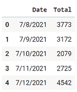
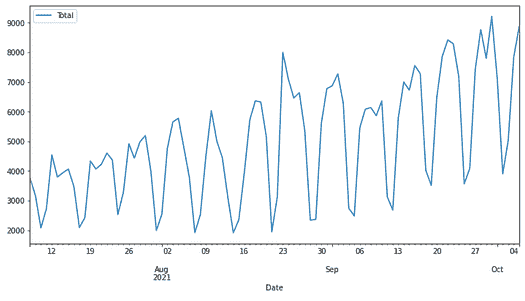
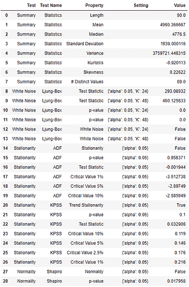
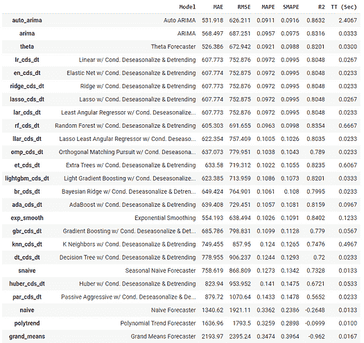

# 使用 PyCaret 的新时间序列模块

> 原文：[`www.kdnuggets.com/2021/12/pycaret-new-time-series-module.html`](https://www.kdnuggets.com/2021/12/pycaret-new-time-series-module.html)

评论

**作者及创始人 [Moez Ali](https://www.linkedin.com/in/profile-moez/)**


(图像来自作者) PyCaret 新时间序列模块

## ???? **介绍**

PyCaret 是一个开源的低代码机器学习库，能够自动化机器学习工作流。它是一个端到端的机器学习和模型管理工具，能显著加快实验周期，提高你的生产力。

与其他开源机器学习库相比，PyCaret 是一个低代码替代库，它可以用几行代码替代数百行代码。这使得实验变得快速且高效。PyCaret 本质上是多个机器学习库和框架（如 scikit-learn、XGBoost、LightGBM、CatBoost、spaCy、Optuna、Hyperopt、Ray 等）的 Python 封装。

PyCaret 的设计和简洁性受到了“公民数据科学家”这一新兴角色的启发，这一术语首次由 Gartner 提出。公民数据科学家是能够执行简单和中等复杂分析任务的高级用户，这些任务以前需要更多的技术专长。

## ⏰ **PyCaret 时间序列模块**

PyCaret 的新时间序列模块现已处于 beta 阶段。保持 PyCaret 的简洁性，它与现有 API 一致，并具有许多功能。包括统计测试、模型训练与选择（30+ 算法）、模型分析、自动化超参数调优、实验记录、云部署等。所有这些功能仅需少量代码（就像 pycaret 的其他模块一样）。如果你想尝试，可以查看官方的 [快速入门](https://nbviewer.org/github/pycaret/pycaret/blob/time_series_beta/time_series_101.ipynb) 笔记本。

你可以使用 pip 安装这个库。如果你在同一环境中安装了 PyCaret，你必须为 `pycaret-ts-alpha` 创建一个单独的环境，因为存在依赖冲突。`pycaret-ts-alpha` 将在下一个主要版本中与主 pycaret 包合并。

```py
pip install pycaret-ts-alpha
```

## ➡️ 示例工作流

PyCaret 的时间序列模块工作流程非常简单。它从 `setup` 函数开始，在这里你定义预测范围 `fh` 和折叠数 `folds`。你还可以将 `fold_strategy` 定义为 `expanding` 或 `sliding`。

在设置完成后，著名的 `compare_models` 函数会训练和评估 30+ 种算法，从 ARIMA 到 XGboost（TBATS、FBProphet、ETS 等）。

`plot_model` 函数可以在训练前或训练后使用。在训练前使用时，它提供了一系列时间序列 EDA 图表，使用 plotly 接口。当与模型一起使用时，`plot_model` 对模型残差进行处理，并可用于评估模型拟合情况。

最后，`predict_model` 用于生成预测。

## ???? 加载数据

```py
import pandas as pd
from pycaret.datasets import get_data
data = get_data('pycaret_downloads')
data['Date'] = pd.to_datetime(data['Date'])
data = data.groupby('Date').sum()
data = data.asfreq('D')
data.head()
```



（图像来自作者）

```py
# plot the data
data.plot()
```



（图像来自作者）‘pycaret_downloads’的时间序列图

这个时间序列是 PyCaret 库从 pip 每日下载次数的数据。

## ⚙️ 初始化设置

```py
**# with functional API** from pycaret.time_series import *
setup(data, fh = 7, fold = 3, session_id = 123)**# with new object-oriented API** from pycaret.internal.pycaret_experiment import TimeSeriesExperiment
exp = TimeSeriesExperiment()
exp.setup(data, fh = 7, fold = 3, session_id = 123)
```


（图像来自作者）setup 函数的输出

## ???? 统计测试

```py
check_stats()
```



（图像来自作者）check_stats 函数的输出

## ???? 探索性数据分析

```py
**# functional API**
plot_model(plot = 'ts')**# object-oriented API** exp.plot_model(plot = 'ts')
```


（图像来自作者）

```py
**# cross-validation plot** plot_model(plot = 'cv')
```


（图像来自作者）

```py
**# ACF plot** plot_model(plot = 'acf')
```


```py
**# Diagnostics plot** plot_model(plot = 'diagnostics')
```


```py
**# Decomposition plot**
plot_model(plot = 'decomp_stl')
```


## ✈️ 模型训练与选择

```py
**# functional API** best = compare_models()**# object-oriented API** best = exp.compare_models()
```



（图像来自作者）compare_models 函数的输出

`create_model` 在时间序列模块中的工作方式与在其他模块中的工作方式完全相同。

```py
**# create fbprophet model** prophet = create_model('prophet')
print(prophet)
```


（图像来自作者）create_model 函数的输出


（图像来自作者）打印函数的输出

`tune_model` 也没有太大区别。

```py
tuned_prophet = tune_model(prophet)
print(tuned_prophet)
```


（图像来自作者）tune_model 函数的输出


（图像来自作者）打印函数的输出

```py
plot_model(best, plot = 'forecast')
```


（图像来自作者）

```py
**# forecast in unknown future** plot_model(best, plot = 'forecast', data_kwargs = {'fh' : 30})
```


（图像来自作者）

```py
# in-sample plot
plot_model(best, plot = 'insample')
```


```py
# residuals plot
plot_model(best, plot = 'residuals')
```


```py
# diagnostics plot
plot_model(best, plot = 'diagnostics')
```


## ???? 部署

```py
**# finalize model** final_best = finalize_model(best)**# generate predictions** predict_model(final_best, fh = 90)
```


（图像来自作者）

```py
**# save the model** save_model(final_best, 'my_best_model')
```


（图像来自作者）

该模块仍处于 beta 版。我们每天都在添加新功能，并进行每周的 pip 发布。请确保创建一个独立的 Python 环境，以避免与主 pycaret 的依赖冲突。该模块的最终版本将与下一次主要版本的 pycaret 合并。

???? [时间序列文档](https://pycaret.readthedocs.io/en/time_series/api/time_series.html)

❓ [时间序列常见问题解答](https://github.com/pycaret/pycaret/discussions/categories/faqs?discussions_q=category%3AFAQs+label%3Atime_series)

???? [功能与路线图](https://github.com/pycaret/pycaret/issues/1648)

**开发人员：**

[Nikhil Gupta](https://www.linkedin.com/in/guptanick/) (主讲), [Antoni Baum](https://www.linkedin.com/in/ACoAAC6B1zoB5huoVojMy654afrzR4tUEWKlbL4) [Satya Pattnaik](https://www.linkedin.com/in/ACoAACLyZ04Bd3JjLtD7TdtO9Hh3eYcKoYt8JRU) [Miguel Trejo Marrufo](https://www.linkedin.com/in/ACoAACuHB6gBQDxxiipWjh6pDMbgp71l1MXS4NI) [Krishnan S G](https://www.linkedin.com/in/ACoAAC3uy_oBo7BhZYL9uTUZ2fcOLAmyPjZJy4w)

使用这个轻量级的 Python 工作流自动化库，你可以实现无限可能。如果你觉得有用，请不要忘记在我们的 GitHub 仓库上给我们 ⭐️。

想了解更多关于 PyCaret 的信息，请关注我们 [LinkedIn](https://www.linkedin.com/company/pycaret/) 和 [Youtube](https://www.youtube.com/channel/UCxA1YTYJ9BEeo50lxyI_B3g)。

加入我们的 Slack 频道。邀请链接 [这里](https://join.slack.com/t/pycaret/shared_invite/zt-p7aaexnl-EqdTfZ9U~mF0CwNcltffHg)。

## 重要链接

⭐ [教程](https://github.com/pycaret/pycaret/tree/master/tutorials) 新手入门 PyCaret？查看我们的官方笔记本！

???? [示例笔记本](https://github.com/pycaret/pycaret/tree/master/examples) 由社区创建。

???? [博客](https://github.com/pycaret/pycaret/tree/master/resources) 贡献者的教程和文章。

???? [文档](https://pycaret.readthedocs.io/en/latest/index.html) PyCaret 的详细 API 文档

???? [视频教程](https://www.youtube.com/channel/UCxA1YTYJ9BEeo50lxyI_B3g) 我们的各类活动视频教程。

???? [讨论区](https://github.com/pycaret/pycaret/discussions) 有问题？与社区和贡献者互动。

????️ [更新日志](https://github.com/pycaret/pycaret/blob/master/CHANGELOG.md) 变更和版本历史。

???? [路线图](https://github.com/pycaret/pycaret/issues/1756) PyCaret 的软件和社区发展计划。

**个人简介：[Moez Ali](https://www.linkedin.com/in/profile-moez/)** 讨论 PyCaret 及其实际应用。如果你希望自动接收通知，可以在 [Medium](https://medium.com/@moez-62905)、[LinkedIn](https://www.linkedin.com/in/profile-moez/) 和 [Twitter](https://twitter.com/moezpycaretorg1) 上关注 Moez。

[原文](https://towardsdatascience.com/announcing-pycarets-new-time-series-module-b6e724d4636c)。经允许转载。

**相关：**

+   多变量时间序列分析与基于 LSTM 的 RNN

+   PyCaret 2.3.5 新版发布！了解新功能

+   前 5 大时间序列方法

* * *

## 我们的前 3 名课程推荐

 1\. [Google 网络安全证书](https://www.kdnuggets.com/google-cybersecurity) - 快速进入网络安全职业道路。

 2\. [Google 数据分析专业证书](https://www.kdnuggets.com/google-data-analytics) - 提升你的数据分析技能

 3\. [Google IT 支持专业证书](https://www.kdnuggets.com/google-itsupport) - 支持您的组织的 IT

* * *

### 更多相关主题

+   [告别 Print()：使用 Logging 模块进行有效调试](https://www.kdnuggets.com/say-goodbye-to-print-use-logging-module-for-effective-debugging)

+   [如何使用 Scikit-learn 的 Imputer 模块处理缺失数据](https://www.kdnuggets.com/how-to-handle-missing-data-with-scikit-learns-imputer-module)

+   [使用 PyCaret 进行二分类简介](https://www.kdnuggets.com/2021/12/introduction-binary-classification-pycaret.html)

+   [使用 PyCaret 进行 Python 聚类简介](https://www.kdnuggets.com/2021/12/introduction-clustering-python-pycaret.html)

+   [宣布 PyCaret 3.0：开源、低代码的 Python 机器学习](https://www.kdnuggets.com/2023/03/announcing-pycaret-30-opensource-lowcode-machine-learning-python.html)

+   [开始使用 PyCaret](https://www.kdnuggets.com/2022/11/getting-started-pycaret.html)
