# 使用 PyCaret 预测客户流失（正确的方法）

> 原文：[`www.kdnuggets.com/2021/07/pycaret-predict-customer-churn-right-way.html`](https://www.kdnuggets.com/2021/07/pycaret-predict-customer-churn-right-way.html)

评论

**由 [Moez Ali](https://www.linkedin.com/in/profile-moez/)，PyCaret 的创始人和作者**


使用 PyCaret 预测客户流失（正确的方法） — 图片由作者提供

### **介绍**

客户留存是采用订阅制商业模式的公司主要的关键绩效指标之一。竞争尤其在 SaaS 市场中非常激烈，因为客户可以从众多供应商中自由选择。一旦发生糟糕的体验，客户可能会转向竞争对手，从而导致客户流失。

### **什么是客户流失？**

客户流失是指在某个时间范围内停止使用贵公司产品或服务的客户百分比。计算流失率的一种方法是将某个时间间隔内流失的客户数量除以该时间段开始时的活跃客户数量。例如，如果你有 1000 个客户，上个月流失了 50 个，那么你的月流失率就是 5%。

预测客户流失是一个具有挑战性但极其重要的业务问题，尤其是在客户获取成本（CAC）较高的行业，如技术、电信、金融等。预测某个客户面临高流失风险的能力，同时还有时间采取措施，代表了公司一个巨大的潜在收入来源。

### 客户流失机器学习模型在实践中如何使用？

客户流失预测模型的主要目标是通过主动与客户互动来留住那些流失风险最高的客户。例如：提供礼品券或任何促销价格，并将他们锁定一年或两年，以延长他们对公司的终身价值。

这里有两个广泛的概念需要理解：

+   我们希望客户流失预测模型能提前预测流失（例如，提前一个月、三个月或甚至六个月——这取决于具体用例）。这意味着你必须非常小心截止日期，即你不应在机器学习模型中使用截止日期之后的信息作为特征，否则会出现数据泄露。截止日期之前的时间段称为**事件**。

+   通常，对于客户流失预测，你需要花一些时间创建一个***目标列***，它通常不会以你希望的形式存在。例如，你想预测客户是否会在下一个季度流失，因此你需要遍历事件截止日期时的所有活跃客户，并检查他们是否在下一个季度离开了公司（1 表示是，0 表示否）。在这种情况下，季度被称为**绩效窗口**。


如何创建客户流失数据集 — 作者提供的图片

### 客户流失模型工作流程

现在你已经理解了数据来源和流失目标的创建（这是问题中最具挑战性的部分之一），让我们讨论一下这个机器学习模型将在业务中如何使用。请从左到右阅读下图：

+   模型在客户流失历史上进行训练（X 特征的事件期和目标变量的性能窗口）。

+   每个月，活跃的客户基础会被传递给**机器学习预测模型**，以返回每个客户的流失概率（在商业术语中，这有时称为流失评分）。

+   列表将按从最高到最低的概率值（或称为评分）进行排序，客户保留团队将开始与客户互动以防止流失，通常是通过提供某种促销或礼品卡来锁定更多的年份。

+   流失概率非常低的客户（或模型预测为无流失）是满意的客户。对此不会采取任何行动。

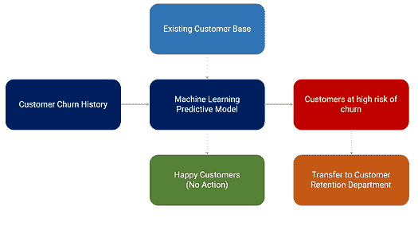

客户流失模型工作流程 — 作者提供的图片

### 让我们开始一个实际的例子

在本节中，我将展示机器学习模型训练与选择、超参数调优、结果分析和解释的完整端到端工作流程。我还将讨论可以优化的指标以及为什么像 AUC、准确率、召回率等传统指标可能不适合客户流失模型。我将使用[PyCaret](https://www.pycaret.org/)——一个开源的低代码机器学习库来进行此实验。本教程假设你对 PyCaret 有基本了解。

### PyCaret

[PyCaret](https://www.pycaret.org/) 是一个开源的低代码机器学习库和端到端模型管理工具，基于 Python 构建，用于自动化机器学习工作流程。PyCaret 因其易用性、简洁性和快速高效地构建和部署端到端机器学习管道的能力而闻名。要了解更多关于 PyCaret 的信息，请查看他们的 [GitHub](https://www.github.com/pycaret/pycaret)。

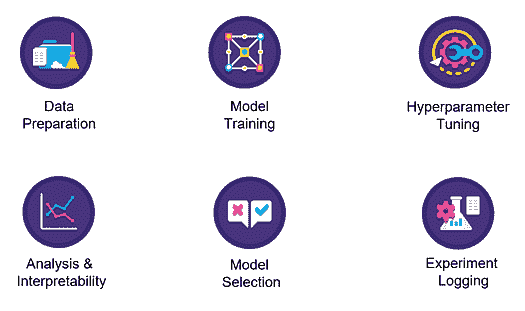

PyCaret 的特点 — 作者提供的图片

### 安装 PyCaret

```py
**# install pycaret** pip install pycaret
```

### ????数据集

对于本教程，我使用的是来自 Kaggle 的[电信客户流失](https://www.kaggle.com/blastchar/telco-customer-churn)数据集。数据集中已经包含了我们可以直接使用的目标列。你可以直接从这个[GitHub](https://raw.githubusercontent.com/srees1988/predict-churn-py/main/customer_churn_data.csv)链接读取这个数据集。（*特别鸣谢 srees1988*）

```py
**# import libraries**
import pandas as pd
import numpy as np**# read csv data** data **=** pd.read_csv('[`raw.githubusercontent.com/srees1988/predict-churn-py/main/customer_churn_data.csv'`](https://raw.githubusercontent.com/srees1988/predict-churn-py/main/customer_churn_data.csv'))
```


示例数据集 — 作者提供的图片

### **???? 探索性数据分析**

```py
**# check data types** data.dtypes
```

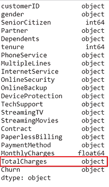

数据类型 — 作者提供的图片

注意到 `TotalCharges` 是 `object` 类型而不是 `float64`。经过调查，我发现这一列中有一些空格，这导致 Python 强制将数据类型设为 `object`。要解决这个问题，我们需要在更改数据类型之前修剪空格。

```py
**# replace blanks with np.nan**
data['TotalCharges'] = data['TotalCharges'].replace(' ', np.nan)**# convert to float64**
data['TotalCharges'] = data['TotalCharges'].astype('float64')
```

直观上，合同类型、合同期限（客户的停留时间）和定价计划在客户流失或留存方面是非常重要的信息。让我们探索一下它们之间的关系：

[`gist.github.com/moezali1/2624c9a5eaf78d9a7ffa1b97195a4812`](https://gist.github.com/moezali1/2624c9a5eaf78d9a7ffa1b97195a4812)

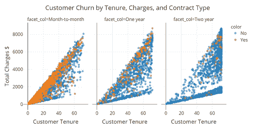

根据合同期限、费用和合同类型的客户流失（图片由作者提供）

注意到大部分流失现象出现在“按月合同”中。这很有道理。此外，我还发现随着合同期限的增加和总费用的增加，拥有高期限和低费用的客户的可能性相较于拥有高期限和高费用的客户要低。

**缺失值**

```py
**# check missing values** data.isnull().sum()
```


缺失值 — 图片由作者提供

注意到由于我们用 `np.nan` 替换了空白值，现在 `TotalCharges` 中有 11 行缺失值。没问题 — 我会让 PyCaret 自动进行填补。

### **????数据准备**

在 PyCaret 的所有模块中，`setup` 是任何机器学习实验中第一个也是唯一一个强制性的步骤。这个函数处理了模型训练前所需的所有数据准备工作。除了执行一些基本的默认处理任务外，PyCaret 还提供了广泛的数据预处理功能。要了解 PyCaret 中所有预处理功能的更多信息，可以查看这个[链接](https://pycaret.org/preprocessing/)。

```py
**# init setup**
from pycaret.classification import *
s = setup(data, target = 'Churn', ignore_features = ['customerID'])
```

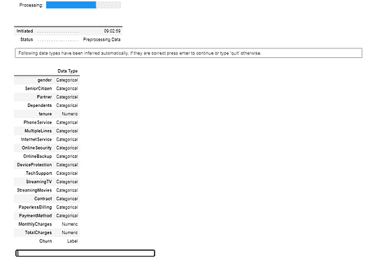

pycaret.classification 中的 setup 函数 — 图片由作者提供

每当你在 PyCaret 中初始化 `setup` 函数时，它会对数据集进行分析并推断所有输入特征的数据类型。在这种情况下，你可以看到除了 `tenure`、`MonthlyCharges` 和 `TotalCharges`，其他所有特征都是类别型的，这样是正确的，你现在可以按回车键继续。如果数据类型推断不正确（这有时会发生），你可以使用 `numeric_feature` 和 `categorical_feature` 来覆盖数据类型。

同样注意到，我在 `setup` 函数中传递了 `ignore_features = ['customerID']`，这样在训练模型时它将不会被考虑。这样做的好处是 PyCaret 不会从数据集中删除该列，它只是会在模型训练时在后台忽略它。因此，当你最终生成预测时，你不需要担心自己再将 ID 重新合并回来。


setup 函数的输出 — 为了显示而截断 — 图片由作者提供

### ???? 模型训练与选择

数据准备完成后，让我们通过使用`compare_models`功能开始训练过程。该功能训练模型库中所有可用的算法，并使用交叉验证评估多个性能指标。

```py
**# compare all models**
best_model = compare_models(sort='AUC')
```


compare_models 的输出 — 作者提供的图片

基于**AUC**的最佳模型是`Gradient Boosting Classifier`。使用 10 折交叉验证的 AUC 为 0.8472。

```py
**# print best_model parameters**
print(best_model)
```


最佳模型参数 — 作者提供的图片

### **超参数调优**

你可以使用 PyCaret 中的`tune_model`函数来自动调优模型的超参数。

```py
**# tune best model**
tuned_best_model = tune_model(best_model)
```

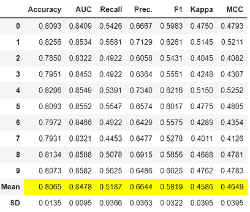

tune_model 结果 — 作者提供的图片

请注意，AUC 从`0.8472`略微增加到`0.8478`。

### 模型分析

```py
**# AUC Plot**
plot_model(tuned_best_model, plot = 'auc')
```

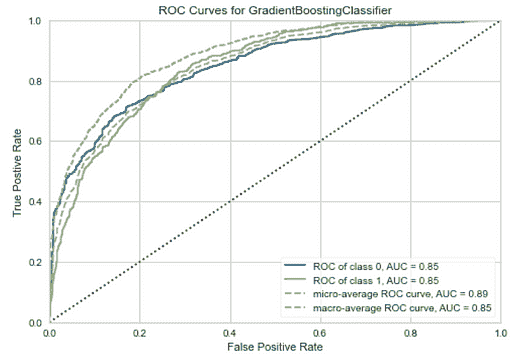

AUC 图 — 作者提供的图片

```py
**# Feature Importance Plot**
plot_model(tuned_gbc, plot = 'feature')
```

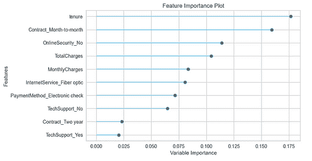

特征重要性图 — 作者提供的图片

```py
**# Confusion Matrix**
plot_model(tuned_best_model, plot = 'confusion_matrix')
```

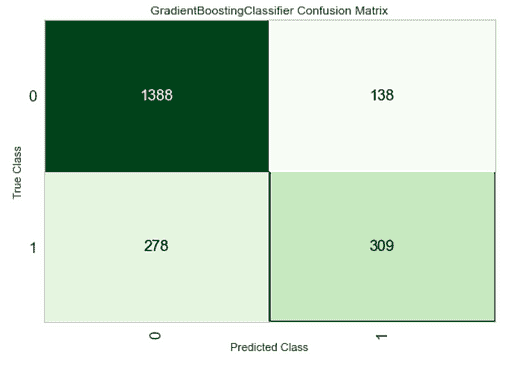

混淆矩阵梯度提升分类器 — 作者提供的图片

这个混淆矩阵是在测试集上生成的，其中包含我们数据的 30%（2,113 行）。我们有 309 个***真正例***（15%）——这些客户我们将能够延长生命周期价值。如果我们没有做出预测，那么就没有干预的机会。

我们还有 138 个（7%）***假正例***，因为向这些客户提供的促销只是额外的成本，我们将因此亏损。

1,388 个（66%）是真正负例（优质客户），278 个（13%）是***假负例***（这是一个错失的机会）。

到目前为止，我们已经训练了多个模型以选择 AUC 最高的最佳模型，然后调优该模型的超参数，以在 AUC 方面挤出更多的性能。然而，最佳 AUC 不一定能转化为最佳的商业模型。

在流失模型中，***真正例***的奖励通常与***假正例***的成本大相径庭。我们使用以下假设：

+   $1,000 的优惠券将提供给所有被识别为流失（真正例 + 假正例）的客户；

+   如果我们能够阻止客户流失，我们将获得$5,000 的客户生命周期价值。

使用这些假设和上述混淆矩阵，我们可以计算该模型的$影响：


$ 模型对 2,113 名客户的影响 — 作者提供的图片

这是一个不错的模型，但问题在于它不是一个商业智能模型。与没有模型相比，它的表现相当不错，但我们如何训练和选择一个能够最大化商业价值的模型呢？为了实现这一点，我们必须使用商业指标而非传统指标如 AUC 或准确率来训练、选择和优化模型。

### **???? 在 PyCaret 中添加自定义指标**

多亏了 PyCaret，使用 `add_metric` 函数实现这一点变得极其简单。

```py
**# create a custom function** def calculate_profit(y, y_pred):
    tp = np.where((y_pred==1) & (y==1), (5000-1000), 0)
    fp = np.where((y_pred==1) & (y==0), -1000, 0)
    return np.sum([tp,fp])**# add metric to PyCaret** add_metric('profit', 'Profit', calculate_profit)
```

现在让我们运行 `compare_models` 看看魔法。

```py
**# compare all models**
best_model = compare_models(sort='Profit')
```


compare_models 输出 — 图片由作者提供

注意这次新增了一个列 `Profit`，令人惊讶的是，虽然朴素贝叶斯在 `AUC` 方面表现较差，但在利润方面却是最佳模型。我们来看看原因：

```py
**# confusion matrix**
plot_model(best_model, plot = 'confusion_matrix')
```

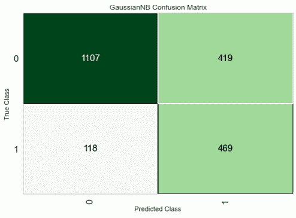

混淆矩阵 朴素贝叶斯 — 图片由作者提供

总客户数量仍然相同（测试集中的 2,113 位客户），变化的是模型在假阳性和假阴性上的错误情况。让我们使用相同的假设（如上所述）来为其添加一些 $ 价值：


$ 模型对 2,113 位客户的影响 — 图片由作者提供

> ***哇！**** 我们刚刚用一个 AUC 比最佳模型少 2% 的模型增加了大约 $400,000 的利润。这是怎么发生的？首先，AUC 或任何其他现成的分类指标（*准确率、召回率、精确度、F1、Kappa 等*）并不是一个商业智能指标，因此没有考虑风险和回报。添加自定义指标并将其用于模型选择或优化是一个很好的主意，也是正确的做法。*

我希望你会欣赏 PyCaret 的简洁和易用性。仅需几行代码，我们就能训练多个模型，并选择对业务最重要的模型。我是一名常规博主，主要写关于 PyCaret 及其在实际应用中的用例。如果你希望自动接收通知，可以关注我的 [Medium](https://medium.com/@moez-62905)、 [LinkedIn](https://www.linkedin.com/in/profile-moez/) 和 [Twitter](https://twitter.com/moezpycaretorg1)。


PyCaret — 图片由作者提供

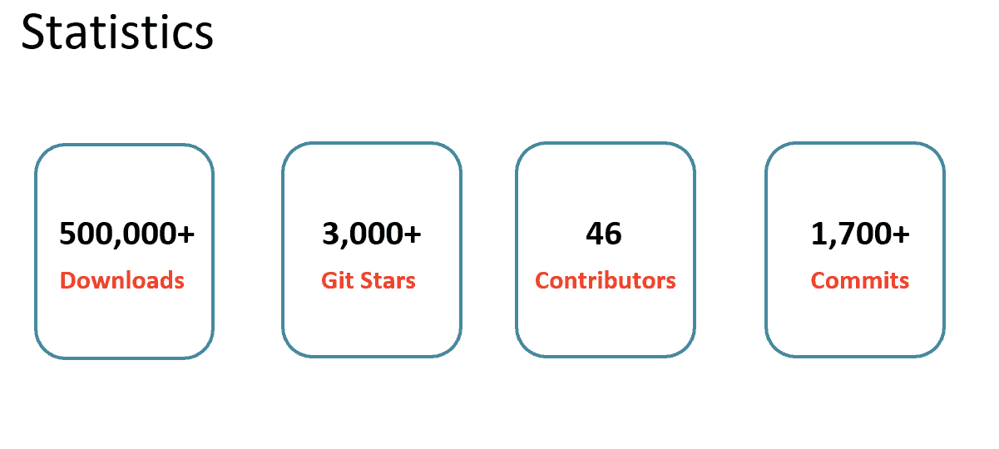

PyCaret — 图片由作者提供

使用这个轻量级的 Python 工作流自动化库，你可以实现无限的可能。如果你觉得这有用，请不要忘记在我们的 GitHub 仓库上给我们 ⭐️。

想要了解更多关于 PyCaret 的信息，请关注我们的 [LinkedIn](https://www.linkedin.com/company/pycaret/) 和 [YouTube](https://www.youtube.com/channel/UCxA1YTYJ9BEeo50lxyI_B3g)。

加入我们的 Slack 频道。邀请链接 [在这里](https://join.slack.com/t/pycaret/shared_invite/zt-p7aaexnl-EqdTfZ9U~mF0CwNcltffHg)。

### 重要链接

[文档](https://pycaret.readthedocs.io/en/latest/installation.html)

[博客](https://medium.com/@moez_62905)

[GitHub](https://www.github.com/pycaret/pycaret)

[StackOverflow](https://stackoverflow.com/questions/tagged/pycaret)

[安装 PyCaret](https://pycaret.readthedocs.io/en/latest/installation.html) [笔记本教程](https://pycaret.readthedocs.io/en/latest/tutorials.html) [贡献 PyCaret](https://pycaret.readthedocs.io/en/latest/contribute.html)

### 更多 PyCaret 相关教程：

[**在 Alteryx 中使用 PyCaret 进行机器学习**](https://towardsdatascience.com/machine-learning-in-alteryx-with-pycaret-fafd52e2d4a)

一个逐步教程，讲解如何在 Alteryx Designer 中使用 PyCaret 训练和部署机器学习模型

[**在 KNIME 中使用 PyCaret 进行机器学习**](https://towardsdatascience.com/machine-learning-in-knime-with-pycaret-420346e133e2)

一个逐步指南，讲解如何在 KNIME 中使用 PyCaret 训练和部署端到端的机器学习管道

[**用 PyCaret 和 MLflow 实现简单 MLOps**](https://towardsdatascience.com/easy-mlops-with-pycaret-mlflow-7fbcbf1e38c6)

一个适合初学者的逐步教程，讲解如何在机器学习实验中集成 MLOps，使用 PyCaret

[**使用 PyCaret 编写和训练自定义机器学习模型**](https://towardsdatascience.com/write-and-train-your-own-custom-machine-learning-models-using-pycaret-8fa76237374e)

[**用 PyCaret 构建，使用 FastAPI 部署**](https://towardsdatascience.com/build-with-pycaret-deploy-with-fastapi-333c710dc786)

一个适合初学者的逐步教程，讲解如何使用 PyCaret 构建端到端的机器学习管道……

[**用 PyCaret 进行时间序列异常检测**](https://towardsdatascience.com/time-series-anomaly-detection-with-pycaret-706a6e2b2427)

一个逐步教程，讲解如何使用 PyCaret 对时间序列数据进行无监督异常检测

[**用 PyCaret 和 Gradio 提升你的机器学习实验**](https://towardsdatascience.com/supercharge-your-machine-learning-experiments-with-pycaret-and-gradio-5932c61f80d9)

一个逐步教程，快速开发和互动机器学习管道

[**使用 PyCaret 进行多时间序列预测**](https://towardsdatascience.com/multiple-time-series-forecasting-with-pycaret-bc0a779a22fe)

使用 PyCaret 进行多时间序列预测的逐步教程

**简介：[Moez Ali](https://www.linkedin.com/in/profile-moez/)** 是一名数据科学家，也是 PyCaret 的创始人兼作者。

[原文](https://towardsdatascience.com/predict-customer-churn-the-right-way-using-pycaret-8ba6541608ac)。经许可转载。

**相关：**

+   PyCaret 101：初学者介绍

+   5 个你不知道的 PyCaret 相关内容

+   客户流失预测：全球性能研究

* * *

## 我们的前三大课程推荐

 1\. [Google 网络安全证书](https://www.kdnuggets.com/google-cybersecurity) - 快速进入网络安全职业生涯。

 2\. [Google 数据分析专业证书](https://www.kdnuggets.com/google-data-analytics) - 提升你的数据分析技能

 3\. [谷歌 IT 支持专业证书](https://www.kdnuggets.com/google-itsupport) - 支持您的组织的 IT 部门

* * *

### 了解更多这个话题

+   [学习现代预测技术，帮助预测未来业务结果……](https://www.kdnuggets.com/2022/12/sphere-learn-modern-forecasting-techniques-help-predict-future-business-outcomes.html)

+   [如何使用 Python 和机器学习预测足球比赛结果](https://www.kdnuggets.com/2023/01/python-machine-learning-predict-football-match-winners.html)

+   [使用 PyCaret 介绍二分类](https://www.kdnuggets.com/2021/12/introduction-binary-classification-pycaret.html)

+   [使用 PyCaret 介绍 Python 中的聚类](https://www.kdnuggets.com/2021/12/introduction-clustering-python-pycaret.html)

+   [宣布 PyCaret 3.0：Python 中的开源、低代码机器学习](https://www.kdnuggets.com/2023/03/announcing-pycaret-30-opensource-lowcode-machine-learning-python.html)

+   [开始使用 PyCaret](https://www.kdnuggets.com/2022/11/getting-started-pycaret.html)
