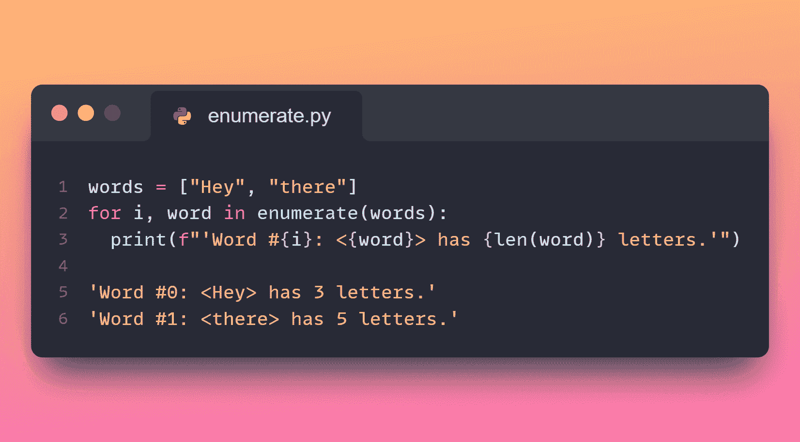
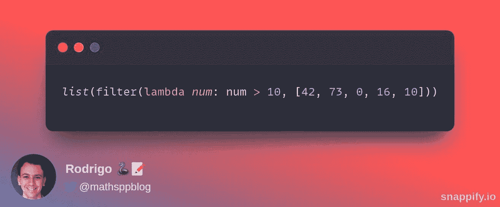

# Pydon’ts – 编写优雅的 Python 代码：免费书评

> 原文：[`www.kdnuggets.com/2022/05/pydonts-write-elegant-python-code-free-book-review.html`](https://www.kdnuggets.com/2022/05/pydonts-write-elegant-python-code-free-book-review.html)

图片由作者提供

当我开始学习 Python 时，我的全部关注点都在学习数据科学，而不是编程语言的工程方面。我错过了许多核心概念，这些概念本可以帮助我编写干净且可重复的代码。

* * *

## 我们的三大课程推荐

 1\. [谷歌网络安全证书](https://www.kdnuggets.com/google-cybersecurity) - 快速进入网络安全职业轨道。

 2\. [谷歌数据分析专业证书](https://www.kdnuggets.com/google-data-analytics) - 提升你的数据分析水平

 3\. [谷歌 IT 支持专业证书](https://www.kdnuggets.com/google-itsupport) - 支持你组织的 IT

* * *

我在这条路上并不孤单。我的一些同事和其他数据科学家也遇到类似的问题，他们只是想用编写不良代码的方式解决数据科学问题。这些代码难以阅读、繁琐且更难以重现和维护。大多数数据专业人员使用函数式编程而不是面向对象的方法，这适合实验但不适合生产。有些人甚至不知道链式比较运算符、海象运算符、repr、序列索引、切片和模式匹配是什么。

这些糟糕的编码习惯会导致延迟和冲突，因为很难理解和优化现有代码。因此，我开始学习针对软件工程师的 Python。我参加了多个课程并阅读了有关掌握 Python 的书籍。这些资源帮助我理解了面向对象编程、编码风格、清晰且可重复的代码、重构和测试驱动开发。但这还不是全部。我想要学习更多。我想学习如何编写优雅、引人注目且富有表现力的代码。这时我发现了一本免费的书籍，叫做 [Pydon'ts](https://mathspp.gumroad.com/l/pydonts)，它帮助我理解了在编码实践中遗漏了什么。

在这本简短的书评中，我提到了我喜欢这本书的地方，以及你如何利用这本书来给你的同事留下深刻印象，并提高编写优雅代码的能力。

# 书评

[Pydon'ts](https://mathspp.gumroad.com/l/pydonts) 是完全免费的，包含超过 330 页的纯知识。这本书适合所有希望提高编写优雅且可用于生产的代码能力的专业人士和爱好者。尤其是那些仍在编写只能自己理解的代码的数据科学家。书中包括 20 章内容，讲解了 Python 内置函数及其各种用法模式。每章包括介绍、单个函数的各种用法模式、编码示例、结论和参考资料。简而言之，每章都像是一篇详细解释每个概念的短博客，并附有真实项目示例。

书的作者 [Rodrigo](https://twitter.com/mathsppblog) 编写 Python 已有七年半，他有一个博客 [Mathspp Blog](https://mathspp.com/blog/tag:python)，涵盖了数学和编程语言的有趣概念。他在 Python 社区中备受尊敬，他的愿景是免费教导人们 Python 语言的最佳实践。Python 是一门丰富的语言，本书中的每一章都详细探讨了单一特性，并附有覆盖所有角度的代码示例。

**本书详细涵盖的 Python 特性**：

+   代码风格很重要

+   命名很重要

+   链式比较操作符

+   赋值表达式和 walrus 操作符 :=

+   Truthy、Falsy 和 bool

+   深度解包

+   使用星号赋值进行解包

+   EAFP 和 LBYL 编码风格

+   Zip up

+   str 和 repr

+   结构化模式匹配教程

+   结构化模式匹配反模式

+   注意递归

+   序列索引

+   习惯用法的序列切片

+   掌握序列切片

+   序列切片的内部工作

+   reduce 的力量

+   下划线的用法

+   名字 dunder 属性

+   小规模重构

+   字符串的 translate 和 maketrans 方法

+   使用 REPL 提高生产力

+   set 和 frozenset

+   列表推导式基础

+   条件表达式

+   值传递、引用和赋值

+   字符串格式化比较

要下载免费书籍，您需要点击这个 [链接](https://mathspp.gumroad.com/l/pydonts)，然后将价格设置为$0 以购买书籍。它会要求您添加姓名和电子邮件，然后带您到一个新窗口，您可以在其中下载 pdf。您还可以以$5 购买一本书以表示感谢，或者以$13 购买以表示对作者工作的更多喜爱。完全由您决定。

# 结束语

Python 在数据专业人士中很受欢迎。我们用它来进行统计实验、数据分析、数据管理、商业智能和机器学习。但我们并不完全了解所有可以帮助我们编写优雅有效程序的内置函数。我们只是对语言有一个基本的理解，通过试错产生解决方案。这种实践仅限于实验，并且在生产环境中会失败。

《Pydon’ts》是一本编写得很好的有趣书籍。如果你是一个非常有动力的专业人士，可以利用这本书来提升你对 Python 内置功能的知识。此外，你还可以用这本书来学习如何编写简洁和富有表现力的代码。这本书的独特之处在于它包括了来自真实项目的 Python 代码示例。

在 Twitter 上关注 [Rodrigo ????????](https://twitter.com/mathsppblog/status/1519227653835923456/photo/2)，他会发布带解释的代码片段。目前，他正在教授 Python 列表推导式。这些课程简短，学习和理解这些迷你课程只需 5 分钟。

**[Abid Ali Awan](https://www.polywork.com/kingabzpro)** ([@1abidaliawan](https://twitter.com/1abidaliawan)) 是一位认证的数据科学专业人士，热衷于构建机器学习模型。目前，他专注于内容创作，并撰写关于机器学习和数据科学技术的技术博客。Abid 拥有技术管理硕士学位和电信工程学士学位。他的愿景是利用图神经网络构建一个 AI 产品，帮助那些挣扎于心理疾病的学生。

### 相关主题

+   [8 个内置 Python 装饰器，编写优雅代码](https://www.kdnuggets.com/8-built-in-python-decorators-to-write-elegant-code)

+   [使用管道编写干净的 Python 代码](https://www.kdnuggets.com/2021/12/write-clean-python-code-pipes.html)

+   [如何编写高效的 Python 代码：初学者教程](https://www.kdnuggets.com/how-to-write-efficient-python-code-a-tutorial-for-beginners)

+   [如何用原生 Python 编写 SQL](https://www.kdnuggets.com/2022/02/easy-sql-native-python.html)

+   [PyTest 入门：轻松编写和运行 Python 测试](https://www.kdnuggets.com/getting-started-with-pytest-effortlessly-write-and-run-tests-in-python)

+   [统计学习导论，Python 版：免费书籍](https://www.kdnuggets.com/2023/07/introduction-statistical-learning-python-edition-free-book.html)
