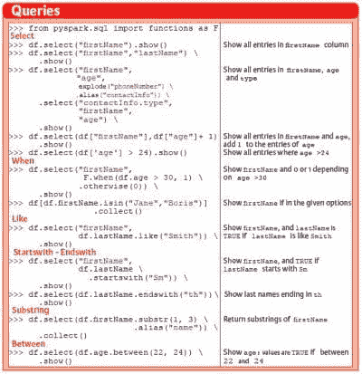
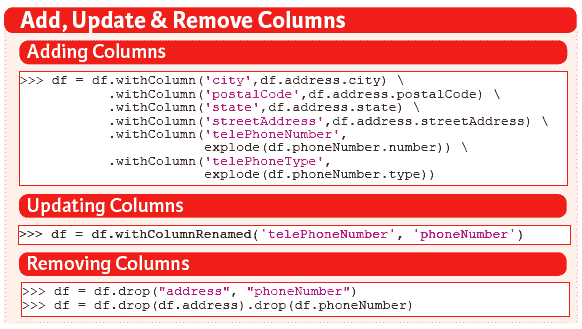

# PySpark SQL 备忘单：Python 中的大数据

> 原文：[`www.kdnuggets.com/2017/11/pyspark-sql-cheat-sheet-big-data-python.html`](https://www.kdnuggets.com/2017/11/pyspark-sql-cheat-sheet-big-data-python.html)

**由 Karlijn Willems， [DataCamp](https://www.datacamp.com/)。**

### 用 Python 处理大数据

大数据无处不在，通常以三个 V 特征来描述：速度（Velocity）、多样性（Variety）和体积（Volume）。大数据是快速的、多样的，并且体积庞大。作为数据科学家、数据工程师、数据架构师等角色，无论你在数据科学行业中担任何种角色，你都将早晚接触到大数据，因为公司现在收集了大量的数据。

* * *

## 我们的前 3 个课程推荐

 1\. [Google 网络安全证书](https://www.kdnuggets.com/google-cybersecurity) - 快速进入网络安全职业生涯。

 2\. [Google 数据分析专业证书](https://www.kdnuggets.com/google-data-analytics) - 提升你的数据分析技能

 3\. [Google IT Support Professional Certificate](https://www.kdnuggets.com/google-itsupport) - 支持你所在组织的 IT

* * *

然而，数据并不总是意味着信息，这就是你，数据科学爱好者，发挥作用的地方。你可以利用 Apache Spark，这是一款“用于大规模数据处理的快速且通用的引擎”，来开始解决大数据给你和你所在公司带来的挑战。

不过，当你在使用 Spark 时，疑问可能会不断出现。遇到问题时，可以查看 DataCamp 的 [Apache Spark 教程：ML with PySpark tutorial](https://www.datacamp.com/community/tutorials/apache-spark-tutorial-machine-learning) 或免费下载 [备忘单](https://www.datacamp.com/community/blog/pyspark-sql-cheat-sheet)！

接下来，我们将深入探讨备忘单的结构和内容。

### PySpark 备忘单

PySpark 是 Spark 的 Python API，将 Spark 编程模型暴露给 Python。Spark SQL 是 PySpark 的一个模块，允许你以 DataFrames 的形式处理结构化数据。这与通常用于处理非结构化数据的 RDDs 相对。

**提示：** 如果你想了解更多关于 RDD 和 DataFrame 之间的差异，以及 Spark DataFrames 与 pandas DataFrames 的不同之处，你一定要查看 [Apache Spark in Python: 初学者指南](https://www.datacamp.com/community/tutorials/apache-spark-python)。

### 初始化 SparkSession

如果你想使用 PySpark 开始进行 Spark SQL 工作，你需要先启动一个 SparkSession：你可以用它来创建 DataFrames、将 DataFrames 注册为表、对表执行 SQL 查询以及读取 parquet 文件。即使这些对你来说听起来非常陌生，也不用担心——你会在本文后面了解更多关于这些的内容！

你通过首先从 pyspark 包附带的 sql 模块中导入 SparkSession 来启动一个 SparkSession。接下来，你可以初始化一个变量 spark，例如，不仅构建 SparkSession，还给应用程序命名，设置配置，然后使用 getOrCreate() 方法来获取已存在的 SparkSession，或者在尚不存在的情况下创建一个！最后这个方法将非常实用，特别是为了将来参考，因为它会防止你同时运行多个 SparkSessions！

很酷，不是吗？

### 检查数据

当你导入数据后，使用一些内置属性和方法检查 Spark DataFrame 是时候了。这样，你可以在开始操作 DataFrames 之前，更好地了解你的数据。

现在，你可能已经从使用 pandas DataFrames 或 NumPy 的经验中了解了本节中提到的大多数方法和属性，例如 dtypes、head()、describe()、count()，等等。还有一些可能对你来说是新的方法，例如 take() 或 printSchema() 方法，或 schema 属性。

尽管如此，你会发现提升过程相当温和，因为你可以最大限度地利用你在数据科学包方面的前期知识。

### 重复值

在检查数据时，你可能会发现一些重复值。为了解决这个问题，你可以使用 dropDuplicates() 方法，例如，在你的 Spark DataFrame 中删除重复值。

### 查询

你可能还记得，使用 Spark DataFrames 的主要原因之一是你有一种更结构化的数据处理方式——查询就是处理数据的一种更结构化的方式，无论你是在关系型数据库中使用 SQL、在 No-SQL 数据库中使用类似 SQL 的语言、还是在 Pandas DataFrames 中使用 [query()](https://pandas.pydata.org/pandas-docs/stable/generated/pandas.DataFrame.query.html?highlight=query#pandas.DataFrame.query) 方法，等等。

现在我们在讨论 Pandas DataFrames 时，你会注意到 Spark DataFrames 遵循类似的原则：你使用方法来更好地了解你的数据。然而，在这种情况下，你不会使用 query()。相反，你需要利用其他方法来获取你想要的结果：在第一次使用时，select() 和 show() 将是你获取 DataFrames 信息的好帮手。

在这些方法中，你可以构建你的查询。和标准 SQL 一样，你可以在 select() 中指定你想要返回的确切列。你可以使用常规字符串来完成，也可以借助 DataFrame 本身来指定列名，如以下示例：df.lastName 或 df[“firstName”]。

请注意，后者的方法在某些情况下会给你更多的自由，特别是当你想用额外的函数如 isin() 或 startswith() 精确指定你要检索的信息时。

除了 select() 外，你还可以利用 PySpark SQL 的 functions 模块来指定查询中的 when 子句，例如，如下表所示：

总的来说，你可以看到，使用 select()、help() 和 functions 模块的功能，有很多可能性可以帮助你更大程度地处理和了解你的数据。

### 添加、更新和删除列

你可能还希望查看如何向 Spark DataFrame 添加、更新或删除某些列。你可以使用 withColumn()、withColumnRenamed() 和 drop() 方法轻松完成。你现在可能已经知道，当你使用 Pandas DataFrames 时，你也可以使用 drop() 方法。你可以在[这里](https://pandas.pydata.org/pandas-docs/stable/generated/pandas.DataFrame.drop.html?highlight=drop#pandas.DataFrame.drop)阅读更多信息。

### 按组

同样，就像 Pandas DataFrames 一样，你可能希望按某些值分组并聚合一些值 - 下面的示例展示了如何使用 groupBy() 方法，并结合 count() 和 show() 来检索和显示你的数据，以年龄为分组，并显示具有该年龄的人数。

### 相关主题

+   [用于数据科学的 PySpark](https://www.kdnuggets.com/2023/02/pyspark-data-science.html)

+   [使用 Pandera 对 PySpark 应用进行数据验证](https://www.kdnuggets.com/2023/08/data-validation-pyspark-applications-pandera.html)

+   [使用 Python 进行数据清理的备忘单](https://www.kdnuggets.com/2023/02/data-cleaning-python-cheat-sheet.html)

+   [构建生成式 AI 应用的最佳 Python 工具备忘单](https://www.kdnuggets.com/2023/08/best-python-tools-generative-ai-cheat-sheet.html)

+   [Python 控制流备忘单](https://www.kdnuggets.com/2022/11/python-control-flow-cheatsheet.html)

+   [KDnuggets 新闻，7 月 5 日：一个糟糕的数据科学项目 • 10 人工智能…](https://www.kdnuggets.com/2023/n24.html)
