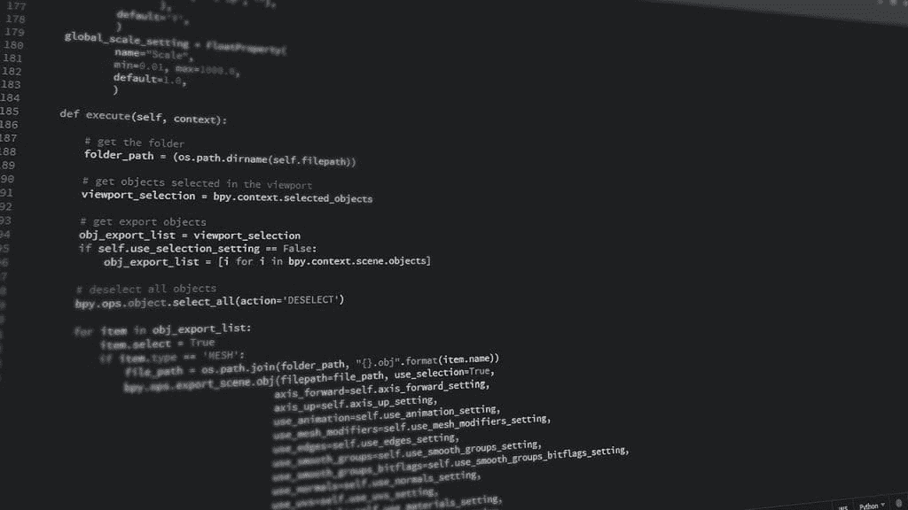

# 如何以正确的方式学习 Python 数据科学

> 原文：[`www.kdnuggets.com/2019/06/python-data-science-right-way.html`](https://www.kdnuggets.com/2019/06/python-data-science-right-way.html)

评论

大多数有志于成为数据科学家的新人通过参加为开发人员准备的编程课程开始学习 Python。他们还开始在像[LeetCode](https://leetcode.com/)这样的网站上解决 Python 编程谜题，假设在开始使用 Python 分析数据之前，他们必须掌握编程概念。

* * *

## 我们的前三名课程推荐

 1\. [Google 网络安全证书](https://www.kdnuggets.com/google-cybersecurity) - 快速进入网络安全职业生涯。

 2\. [Google 数据分析专业证书](https://www.kdnuggets.com/google-data-analytics) - 提升你的数据分析能力

 3\. [Google IT 支持专业证书](https://www.kdnuggets.com/google-itsupport) - 支持您的组织 IT

* * *

这是一个巨大的错误，因为数据科学家使用 Python 来检索、清理、可视化和构建模型，而不是开发软件应用程序。因此，你必须把大部分时间集中在学习 Python 中的模块和库上，以执行这些任务。

遵循这些逐步的步骤来学习 Python 数据科学。

### 配置你的编程环境

Jupyter Notebook 是一个强大的编程环境，用于开发和展示数据科学项目。

在你的计算机上安装 Jupyter Notebook 最简单的方法是安装 Anaconda。Anaconda 是数据科学中最广泛使用的 Python 发行版，预装了所有最流行的库。

你可以阅读标题为 “[使用 Anaconda 发行版安装 Jupyter Notebook 的初学者指南](https://medium.com/better-programming/beginners-quick-guide-for-handling-issues-launching-jupyter-notebook-for-python-using-anaconda-8be3d57a209b)” 的博客文章，了解如何安装 Anaconda。在安装 Anaconda 时，选择最新的 Python 3 版本。

安装 Anaconda 后，请阅读 [这篇文章](https://www.codecademy.com/articles/how-to-use-jupyter-notebooks) 以了解如何使用 Jupyter Notebooks。

### **仅学习 Python 的基础知识**

[Code Academy](https://www.codecademy.com/learn/learn-python-3) 提供了一个优秀的 Python 课程，完成大约需要 20 小时。你不需要升级到 Pro 版本，因为你的目标只是熟悉 Python 编程语言的基础。

### **Numpy 和 Pandas - 学习它们的绝佳资源**

Python 在处理大量数据和数值密集型算法时较慢。你可能会问，为什么 Python 是数据科学中最受欢迎的编程语言？

答案是，在 Python 中，很容易将数字计算任务以 C 或 Fortran 扩展的形式转移到底层。这正是 Numpy 和 Pandas 所做的。

首先，你应该学习 Numpy。它是 Python 科学计算的最基础模块。Numpy 提供了高度优化的多维数组支持，这些数组是大多数机器学习算法的基本数据结构。

接下来，你应该学习 Pandas。数据科学家大部分时间都在清理数据，这也被称为数据清洗或数据处理。

Pandas 是用于数据处理的最流行的 Python 库。Pandas 是 NumPy 的扩展。Pandas 的底层代码广泛使用了 NumPy 库。Pandas 的主要数据结构叫做数据框。

Pandas 的创建者 Wes McKinney 写了一本极好的书，叫做《[Python 数据分析](https://www.amazon.com/Python-Data-Analysis-Wrangling-IPython-ebook/dp/B075X4LT6K)》。请阅读第 4、5、7、8 和 10 章以学习 Pandas 和 Numpy。这些章节涵盖了处理数据时最常用的 Numpy 和 Pandas 特性。

### **学习使用 Matplotlib 可视化数据**

Matplotlib 是创建基本可视化的基础 Python 包。你必须学习如何使用 Matplotlib 来创建一些最常见的图表，如折线图、柱状图、散点图、直方图和箱线图。

另一个良好的绘图库是建立在 Matplotlib 之上并与 Pandas 紧密集成的 Seaborn。在这个阶段，我建议你快速学习如何在 Matplotlib 中创建基本图表，而不是专注于 Seaborn。

我写了一个四部分的教程，讲解如何使用 Matplotlib 开发基本图表。

第一部分：[Matplotlib 中的基本图形](http://nbviewer.ipython.org/gist/manujeevanprakash/138c66c44533391a5af1)

第二部分：[如何控制图形的样式和颜色，例如标记、线条粗细、线条模式以及使用颜色映射](https://nbviewer.jupyter.org/gist/manujeevanprakash/7dc56e7906ee83e0bbe6)。

第三部分：[注释、控制坐标轴范围、纵横比和坐标系统](https://nbviewer.jupyter.org/gist/manujeevanprakash/7cdf7d659cd69d0c22b2)

第四部分：[处理复杂图形](https://nbviewer.jupyter.org/gist/manujeevanprakash/7d8a9860f8e43f6237cc)

你可以通过这些教程掌握 Matplotlib 的基础知识。

快速说明，你不需要花费太多时间学习 Matplotlib，因为现在公司已经开始采用像 Tableau 和 Qlik 这样的工具来创建交互式可视化。

### **如何使用 SQL 和 Python**

在组织中，数据存储在数据库中。因此，你需要知道如何使用 SQL 检索数据，并使用 Python 在 Jupyter Notebook 中进行分析。

数据科学家使用 SQL 和 Pandas 操作数据。因为有些数据操作任务使用 SQL 更为简单，而有些任务使用 Pandas 更高效。我个人喜欢用 SQL 来检索数据，然后在 Pandas 中进行操作。

今天，公司使用像[Mode Analytics](https://mode.com/)和[Databricks](https://databricks.com/)这样的分析平台来轻松处理 Python 和 SQL。

因此，你应该知道如何高效地结合使用 SQL 和 Python。要学习这一点，你可以在计算机上安装 SQLite 数据库，存储一个 CSV 文件，并使用 Python 和 SQL 进行分析。这里有一篇很棒的博客文章展示了如何做到这一点：[使用 SQLite 在 Python 中编程数据库](https://medium.com/analytics-vidhya/programming-with-databases-in-python-using-sqlite-4cecbef51ab9)。

在阅读上述博客文章之前，你应该了解 SQL 的基础。Mode Analytics 有一个很好的 SQL 教程：[SQL 简介](https://mode.com/sql-tutorial/introduction-to-sql/)。阅读他们的 BASIC SQL 部分，以真正掌握 SQL 的基础，因为每个数据科学家都应该知道如何高效地使用 SQL 检索数据。

### **用 Python 学习基础统计学**

大多数有志的数据科学家直接跳到学习机器学习，而没有学习统计学的基础。

不要犯这个错误，因为统计学是数据科学的基石。另一方面，志向远大的数据科学家在学习统计学时只是学习理论概念，而不是实际应用概念。

所谓实际概念是指你应该了解统计学可以解决什么问题。理解使用统计学可以克服什么挑战。

这里是你应该了解的一些基础统计概念：

采样、频率分布、均值、中位数、众数、变异度量、概率基础、显著性检验、标准差、z 分数、置信区间和假设检验（包括 A/B 测试）。

一本很好的实用统计学书籍是《[数据科学家的实用统计学：50 个基本概念](https://www.amazon.com/Practical-Statistics-Data-Scientists-Essential/dp/9352135652)》。不幸的是，对于像我这样的 Python 爱好者来说，书中的代码示例是用 R 语言编写的。我建议你阅读书中的前四章。阅读前四章以理解我之前提到的基础统计概念，忽略代码示例，仅理解概念。书中的其余章节主要集中在机器学习上。我将在下一节讨论如何学习机器学习。

大多数人推荐 [Think Stats](https://www.amazon.com/Think-Stats-Allen-B-Downey/dp/1449307116) 来学习用 Python 进行统计分析，但作者教授的是他自己定制的函数，而不是使用像 Statsmodels 这样的标准 Python 库来进行统计。这就是我没有推荐这本书的原因。

完成后，你的目标是用 Python 实现你学到的基本概念。StatsModels 是一个流行的 Python 库，用于在 Python 中构建统计模型。StatsModels 网站上有 [很好的教程](https://www.statsmodels.org/stable/index.html) 介绍如何使用 Python 实现统计概念。

或者，你也可以观看 Gaël Varoquaux 的视频。他展示了如何使用 Pandas 和 Stats Models 进行推论统计和探索性统计。

### **使用 Scikit-Learn 进行机器学习**

Scikit-Learn 是 Python 中最受欢迎的机器学习库之一。你的目标是学习如何使用 Scikit-Learn 实现一些最常见的机器学习算法。

以下是如何操作的。

首先，观看 Andrew Ng 在 Coursera 上的 [机器学习](https://www.coursera.org/learn/machine-learning) 课程的第 1、2、3、6、7 和 8 周的视频。我跳过了神经网络部分，因为作为起点，你需要集中精力学习最广泛使用的机器学习技术。

完成后，阅读 “[动手机器学习：使用 Scikit-Learn 和 TensorFlow](https://www.amazon.com/Hands-Machine-Learning-Scikit-Learn-TensorFlow/dp/1491962291)” 一书。只需阅读书的前一部分（大约 300 页）。这是一本非常实用的机器学习书籍。

通过完成本书中的编码练习，你将学习如何使用 Python 实现你在 Andrew Ng 课程中学到的理论概念。

### **结论**

最后的步骤是做一个数据科学项目，涵盖以上所有步骤。你可以找到一个你喜欢的数据集，然后提出一些通过分析它来回答的有趣商业问题。但是，不要选择像 Titanic [机器学习](https://www.kaggle.com/c/titanic) 这样通用的数据集。你可以阅读 "[寻找免费数据集的 19 个地方](https://www.dataquest.io/blog/free-datasets-for-projects/)" 来寻找数据集。

另一种方法是将数据科学应用于你感兴趣的领域。例如，如果你想预测股票市场价格，你可以从 [Yahoo Finance](https://www.scrapehero.com/scrape-yahoo-finance-stock-market-data/) 抓取实时数据并存储在 SQL 数据库中，然后使用机器学习来预测股票价格。

如果你想从其他行业转行到数据科学，我建议你从一个利用你领域专业知识的项目开始。我在之前的博客文章中对这种方法进行了深入的解释，分别是 "[将职业转向数据科学的分步指南 – 第一部分](https://www.kdnuggets.com/2019/05/guide-transitioning-career-data-science-part-1.html)" 和 "[将职业转向数据科学的分步指南 – 第二部分](https://www.kdnuggets.com/2019/06/guide-transitioning-career-data-science-part-2.html)"。

如果你有任何问题，请在评论中告诉我！

**相关：**

+   初学者的数据科学 Python

+   全面学习 Python 数据分析和数据科学指南

+   动手实践：数据分析的 Python 入门

### 更多相关内容

+   [成为优秀数据科学家所需的 5 项关键技能](https://www.kdnuggets.com/2021/12/5-key-skills-needed-become-great-data-scientist.html)

+   [每个初学者数据科学家应掌握的 6 个预测模型](https://www.kdnuggets.com/2021/12/6-predictive-models-every-beginner-data-scientist-master.html)

+   [2021 年最佳 ETL 工具](https://www.kdnuggets.com/2021/12/mozart-best-etl-tools-2021.html)

+   [停止学习数据科学以寻找目标，并找到目标...](https://www.kdnuggets.com/2021/12/stop-learning-data-science-find-purpose.html)

+   [每个数据科学家都应该了解的三种 R 库（即使你使用 Python）](https://www.kdnuggets.com/2021/12/three-r-libraries-every-data-scientist-know-even-python.html)

+   [使用管道编写清晰的 Python 代码](https://www.kdnuggets.com/2021/12/write-clean-python-code-pipes.html)
