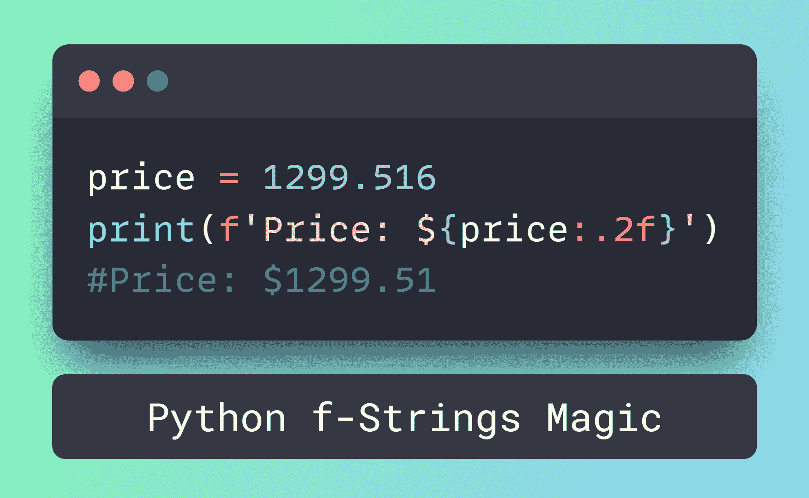

# Python f-Strings 魔法：每个编码人员都需要知道的 5 个改变游戏规则的技巧

> 原文：[`www.kdnuggets.com/python-fstrings-magic-5-gamechanging-tricks-every-coder-needs-to-know`](https://www.kdnuggets.com/python-fstrings-magic-5-gamechanging-tricks-every-coder-needs-to-know)



编辑器提供的图片

如果你使用 Python 已有一段时间，你可能已经停止使用传统的 `format()` 方法来格式化字符串，并转而使用更简洁、更易于维护的 f-Strings [自 Python 3.6 引入](https://peps.python.org/pep-0498/)。但这还不是全部。

* * *

## 我们的前三大课程推荐

 1\. [谷歌网络安全证书](https://www.kdnuggets.com/google-cybersecurity) - 快速进入网络安全职业生涯。

 2\. [谷歌数据分析专业证书](https://www.kdnuggets.com/google-data-analytics) - 提升你的数据分析技能

 3\. [谷歌 IT 支持专业证书](https://www.kdnuggets.com/google-itsupport) - 支持你的组织的 IT 需求

* * *

从 Python 3.8 开始，你可以使用一些巧妙的 f-string 特性进行调试、格式化日期时间对象和浮点数等。我们将在本教程中深入探讨这些使用案例。

> **注意**：要运行代码示例，你需要安装 Python 3.8 或更高版本。

# 1\. 更轻松的调试

当你编写代码时，你可能会使用 `print()` 语句来打印变量，以验证它们的值是否如你所预期。使用 f-strings，你可以包含变量名 *以及* 它们的值，从而更轻松地调试。

请考虑以下示例：

```py
length = 4.5
breadth = 7.5
height = 9.0

print(f'{length=}, {breadth=}, {height=}')
```

这会输出：

```py
Output >>> length=4.5, breadth=7.5, height=9.0
```

当你想了解调试过程中变量的状态时，这一特性尤其有用。然而，对于生产代码，你应该设置所需的日志级别。

# 2\. 优雅地格式化浮点数和日期

在 Python 中打印浮点数和日期时间对象时，你需要：

+   将浮点数格式化为在小数点后包含固定数量的数字

+   以特定的统一格式格式化日期

f-strings 提供了一种直接的方式来根据你的需求格式化浮点数和日期。

在这个例子中，你可以通过指定 `{price:.2f}` 来格式化 `price` 变量，以显示小数点后两位：

```py
price = 1299.500
print(f'Price: ${price:.2f}')
```

```py
Output >>> Price: $1299.50
```

你可能会使用 [strftime()](https://docs.python.org/3/library/datetime.html#datetime.date.strftime) 方法来格式化 Python 中的日期时间对象。但你也可以使用 f-strings 来完成。以下是一个示例：

```py
from datetime import datetime
current_time = datetime.now()
print(f'Current date and time: {current_time:%Y-%m-%d %H:%M:%S}')
```

```py
Output >>> Current date and time: 2023-10-12 15:25:08
```

让我们编写一个简单的示例，包括日期和浮点数格式化：

```py
price = 1299.500
purchase_date = datetime(2023, 10, 12, 15, 30)
print(f'Product purchased for ${price:.2f} on {purchase_date:%B %d, %Y at %H:%M}')
```

```py
Output >>>
Product purchased for $1299.50 on October 12, 2023 at 15:30
```

# 3\. 数值中的基数转换

F-strings 支持数值数据类型的进制转换，允许你将数字从一个进制转换到另一个进制。因此，你无需编写单独的进制转换函数或 lambda 来查看不同进制的数字。

要打印十进制数字 42 的二进制和十六进制等效值，你可以使用 f-string，如下所示：

```py
num = 42
print(f'Decimal {num}, in binary: {num:b}, in hexadecimal: {num:x}')
```

```py
Output >>>
Decimal 42, in binary: 101010, in hexadecimal: 2a
```

如所见，当你需要以不同进制（如二进制或十六进制）打印数字时，这非常有用。我们再来看一个从十进制到八进制转换的例子：

```py
num = 25
print(f'Decimal {num}, in octal: {num:o}')
```

```py
Output >>> Decimal 25, in octal: 31
```

记得 10 月 31 日 = 12 月 25 日吗？是的，这个例子灵感来源于 *“为什么开发者会把万圣节和圣诞节搞混？”* 的 meme。

# 4\. 有用的 ASCII 和 repr 转换

你可以在 f-strings 中使用 **!a** 和 **!r** 转换标志，将字符串格式化为 ASCII 和 `repr` 字符串。

有时你可能需要将字符串转换为 ASCII 表示法。这里是如何使用 **!a** 标志来做到这一点：

```py
emoji = "🙂" 
print(f'ASCII representation of Emoji: {emoji!a}')
```

```py
Output >>>
ASCII representation of Emoji: '\U0001f642'
```

要访问任何对象的 `repr`，你可以使用带有 **!r** 标志的 f-strings：

```py
from dataclasses import dataclass

@dataclass
class Point3D:
	x: float = 0.0
	y: float = 0.0
	z: float = 0.0

point = Point3D(0.5, 2.5, 1.5)
print(f'Repr of 3D Point: {point!r}')
```

[Python 数据类](https://docs.python.org/3/library/dataclasses.html) 默认实现了 `__repr__`，因此我们不必显式地编写一个。

```py
Output >>>
Repr of 3D Point: Point3D(x=0.5, y=2.5, z=1.5)
```

# 5\. 格式化 LLM 提示模板

在处理大型语言模型如 Llama 和 GPT-4 时，f-strings 对于创建提示模板非常有用。

不需要硬编码提示字符串，你可以使用 f-strings 创建 *可重用且可组合的提示模板*。然后你可以根据需要插入变量、问题或上下文。

如果你使用像 LangChain 这样的框架，你可以使用该框架的 [PromptTemplate](https://python.langchain.com/docs/modules/model_io/prompts/prompt_templates) 功能。但即使没有，你仍然可以使用基于 f-string 的提示模板。

提示可以简单到：

```py
prompt_1 = "Give me the top 5 best selling books of Stephen King."
```

或者一个稍微更灵活（但仍然非常简单）的：

```py
num = 5
author = 'Stephen King'
prompt_2 = f"Give me the top {num} best selling books of {author}."
```

在某些情况下，在提示中提供上下文和一些示例是很有帮助的。

考虑一下这个例子：

```py
# context
user_context = "I'm planning to travel to Paris; I need some information."

# examples
few_shot_examples = [
	{
    	"query": "What are some popular tourist attractions in Paris?",
    	"answer": "The Eiffel Tower, Louvre Museum, and Notre-Dame Cathedral are some popular attractions.",
	},
	{
    	"query": "What's the weather like in Paris in November?",
    	"answer": "In November, Paris experiences cool and damp weather with temperatures around 10-15°C.",
	},
]

# question
user_question = "Can you recommend some good restaurants in Paris?"
```

这是一个使用 f-strings 的可重用提示模板。你可以在任何上下文、示例、查询用例中使用：

```py
# Constructing the Prompt using a multiline string
prompt = f'''
Context: {user_context}

Examples:
'''
for example in few_shot_examples:
	prompt += f'''
Question:  {example['query']}\nAnswer: {example['answer']}\n'''
prompt += f'''

Query: {user_question}
'''

print(prompt)
```

这是我们这个例子的提示：

```py
Output >>>
Context: I'm planning to travel to Paris; I need some information.

Examples:

Question:  What are some popular tourist attractions in Paris?
Answer: The Eiffel Tower, Louvre Museum, and Notre-Dame Cathedral are some popular attractions.

Question:  What's the weather like in Paris in November?
Answer: In November, Paris experiences cool and damp weather with temperatures around 10-15°C.

Query: Can you recommend some good restaurants in Paris?
```

# 总结

就这样。我希望你能发现一些可以添加到你的程序员工具箱中的 Python f-string 特性。如果你有兴趣学习 Python，可以查看我们编纂的 5 本免费书籍助你掌握 Python。祝学习愉快！

**[](https://twitter.com/balawc27)**[Bala Priya C](https://www.kdnuggets.com/wp-content/uploads/bala-priya-author-image-update-230821.jpg)**** 是来自印度的开发者和技术作家。她喜欢在数学、编程、数据科学和内容创作的交汇处工作。她的兴趣和专长领域包括 DevOps、数据科学和自然语言处理。她喜欢阅读、写作、编程和喝咖啡！目前，她致力于通过撰写教程、操作指南、观点文章等与开发者社区分享她的知识。Bala 还创建了有趣的资源概述和编码教程。

### 更多相关主题

+   [每位程序员都应该知道的 11 个 Python 魔法方法](https://www.kdnuggets.com/11-python-magic-methods-every-programmer-should-know)

+   [每位数据科学家需要的软技能](https://www.kdnuggets.com/soft-skills-every-data-scientist-needs)

+   [2024 年每位数据科学家需要的 5 项核心技能](https://www.kdnuggets.com/5-essential-skills-every-data-scientist-needs-in-2024)

+   [未来证明你的数据游戏：2023 年每位数据科学家需要的顶级技能](https://www.kdnuggets.com/futureproof-your-data-game-top-skills-every-data-scientist-needs-in-2023)

+   [2024 年每位数据科学家工具箱中需要的 5 个工具](https://www.kdnuggets.com/5-tools-every-data-scientist-needs-in-their-toolbox-in-2024)

+   [免费电子书：10 个实用的 Python 编程技巧](https://www.kdnuggets.com/2023/04/free-ebook-10-practical-python-programming-tricks.html)
