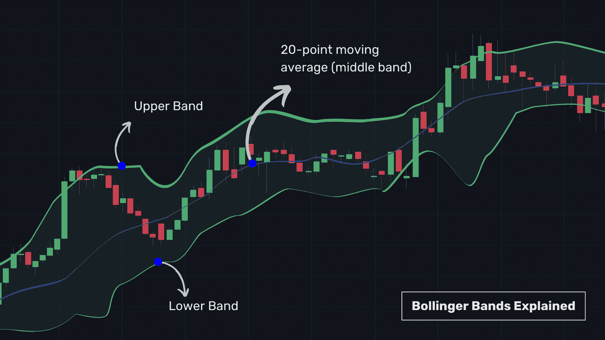

# Python 在金融中的应用：Jupyter Notebook 内的实时数据流

> 原文：[`www.kdnuggets.com/python-in-finance-real-time-data-streaming-within-jupyter-notebook`](https://www.kdnuggets.com/python-in-finance-real-time-data-streaming-within-jupyter-notebook)


在本博客中，你将学习如何在你最喜欢的工具 Jupyter Notebook 中实时可视化数据流。

* * *

## 我们的三大课程推荐

 1\. [Google 网络安全证书](https://www.kdnuggets.com/google-cybersecurity) - 快速进入网络安全职业生涯。

 2\. [Google 数据分析专业证书](https://www.kdnuggets.com/google-data-analytics) - 提升你的数据分析能力。

 3\. [Google IT 支持专业证书](https://www.kdnuggets.com/google-itsupport) - 支持你的组织进行 IT 管理。

* * *

在大多数项目中，Jupyter Notebooks 中的动态图表需要手动更新；例如，可能需要你点击重新加载以获取新数据并更新图表。这对于任何快节奏的行业，包括金融，都效果不佳。想象一下，因为用户没有在那个时刻点击重新加载，错过了关键的买入信号或欺诈警报。

在这里，我们将展示如何从手动更新过渡到在 Jupyter Notebook 中使用流式或实时方法，从而使你的项目更高效、更具响应性。

**涵盖内容：**

+   **实时可视化：** 你将学习如何让数据生动起来，实时观看数据的每一秒变化。

+   **Jupyter Notebook 精通：** 充分利用 Jupyter Notebook 的强大功能，不仅用于静态数据分析，还用于动态流数据。

+   **Python 在量化金融中的应用案例：** 探索一个实际的金融应用，实施在金融领域广泛使用的解决方案，使用真实世界的数据。

+   **流数据处理：** 理解实时处理数据的基础和好处，这一技能在今天快节奏的数据世界中变得越来越重要。

在本博客结束时，你将学会如何在你的 Jupyter Notebook 中构建类似下面的实时可视化效果。


# 快速回顾实时数据处理

我们项目的核心在于流处理的概念。

简而言之，流处理就是实时处理和分析生成的数据。可以把它想象成高峰时段的 Google Maps，你可以实时看到交通更新，从而做出即时且高效的路线调整。

有趣的是，根据高盛 CIO 在这期 Forbes [播客](https://youtu.be/tleX4KGNnWo?t=1439)中所说，向流数据或实时数据处理的发展是我们正在前进的重大趋势之一。

# Jupyter Notebooks 作为实时数据分析工具

这就是将实时数据处理的强大功能与 Jupyter Notebooks 的互动和熟悉环境结合起来。

此外，Jupyter Notebooks 与容器化环境配合良好。因此，我们的项目不仅仅局限于本地机器；我们可以将它们带到任何地方——在从同事的笔记本电脑到云服务器的任何设备上平稳运行。

# 我们在 Python 中的应用案例：布林带

在金融领域，每一秒都至关重要，无论是用于欺诈检测还是交易，这也是流数据处理变得至关重要的原因。这里的重点是[布林带](https://www.fidelity.com/learning-center/trading-investing/technical-analysis/technical-indicator-guide/bollinger-bands)，这是一个对金融交易有帮助的工具。该工具包括：

+   **中间带：** 这是一个 20 周期移动平均线，计算过去 20 个周期（例如高频分析中的 20 分钟）的平均股价，提供近期价格趋势的快照。

+   **外带波段：** 位于中间带上下 2 个标准差的位置，它们指示市场波动性——带子越宽表明波动性越大，带子越窄则表明波动性较小。



在布林带中，当移动平均价格触及或超过上带时（通常标记为红色，提示卖出），表明可能存在超买情况；当价格跌破下带时（通常标记为绿色，提示买入），则表明可能存在超卖情况。

算法交易者通常将布林带与其他技术指标配合使用。

在生成布林带时，我们通过整合交易量进行了一个重要的调整。传统上，布林带不考虑交易量，仅基于价格数据进行计算。

因此，我们在 VWAP ± 2 × VWSTD 的距离上标记了布林带，其中：

+   VWAP：一个**1 分钟成交量加权平均价格**，提供更具成交量敏感度的视角。

+   VWSTD：代表一个集中**20 分钟标准差**，即市场波动性的度量。

**技术实现：**

+   我们使用时间[滑动窗口](https://towardsdatascience.com/reservoir-sampling-for-fficient-stream-processing-97f47f85c11b)（‘pw.temporal.sliding’）来分析 20 分钟的时间段数据，类似于在实时数据上移动放大镜。

+   我们使用[减少器](https://pathway.com/developers/api-docs/reducers)（‘pw.reducers’），它们处理每个窗口中的数据，以为每个窗口产生特定的结果，例如此情况下的标准差。

# 查看在我们的 Jupyter Notebook 中实现实时流数据的工具

+   **Polygon.io:** 实时和历史市场数据提供商。虽然你可以使用它的 API 获取实时数据，但我们已经将一些数据预先保存到 CSV 文件中，以便于演示，便于跟随而无需 API 密钥。

+   **Pathway:** 一个开源的 Python 框架，用于快速数据处理。它处理批量（静态）和流数据（实时）。

+   **Bokeh:** 理想的动态可视化工具，Bokeh 通过引人入胜的交互式图表让我们的流数据生动起来。

+   **Panel**: 为我们的项目增强实时仪表板功能，与 Bokeh 协作，随着新数据流入更新我们的可视化。

# 步骤教程：在 Jupyter Notebook 中可视化实时数据。

这包括六个步骤：

1.  执行 pip 安装相关框架并导入相关库。

1.  获取样本数据

1.  设置计算的数据源

1.  计算布林带所需的统计数据

1.  使用 Bokeh 和 Panel 创建仪表板

1.  执行运行命令

## 1\. 导入和设置

首先，让我们快速安装必要的组件。

```py
%%capture --no-display
!pip install pathway
```

首先导入必要的库。这些库将帮助进行数据处理、可视化以及构建互动仪表板。

```py
# Importing libraries for data processing, visualization, and dashboard creation

import datetime
import bokeh.models
import bokeh.plotting
import panel
import pathway as pw
```

## 2\. 获取样本数据

接下来，从 GitHub 下载样本数据。这一步对于访问我们的可视化数据至关重要。在这里，我们获取了苹果公司（AAPL）的股票价格。

```py
# Command to download the sample APPLE INC stock prices extracted via Polygon API and stored in a CSV for ease of review of this notebook.

%%capture --no-display
!wget -nc https://gist.githubusercontent.com/janchorowski/e351af72ecd8d206a34763a428826ab7/raw/ticker.csv
```

> **注意:** 本教程利用了一个发布在 [*这里*](https://pathway.com/developers/showcases/live_data_jupyter) 的展示

## 3\. 数据源设置

使用 CSV 文件创建一个流数据源。这模拟了一个实时数据流，为处理实时数据提供了一种实际的方法，而不需要 API 密钥，同时也简化了首次构建项目的过程。

```py
# Creating a streaming data source from a CSV file

fname = "ticker.csv"
schema = pw.schema_from_csv(fname)
data = pw.demo.replay_csv(fname, schema=schema, input_rate=1000)

# Uncommenting the line below will override the data table defined above and switch the data source to static mode, which is helpful for initial testing
# data = pw.io.csv.read(fname, schema=schema, mode="static")

# Parsing the timestamps in the data

data = data.with_columns(t=data.t.dt.utc_from_timestamp(unit="ms"))
```

> **注意:** 数据处理不会立即发生，而是在最后执行运行命令时进行。

## 4\. 计算布林带所需的统计数据

在这里，我们将简要构建我们上述讨论的交易算法。我们有一个虚拟的苹果公司股票价格流。现在，要创建布林带，

1.  我们将计算加权 20 分钟标准差（VWSTD）

1.  价格的 1 分钟加权运行平均（VWAP）

1.  将上述两者合并。

```py
# Calculating the 20-minute rolling statistics for Bollinger Bands

minute_20_stats = (
    data.windowby(
        pw.this.t,
        window=pw.temporal.sliding(
            hop=datetime.timedelta(minutes=1),
            duration=datetime.timedelta(minutes=20),
        ),
        behavior=pw.temporal.exactly_once_behavior(),
        instance=pw.this.ticker,
    )
    .reduce(
        ticker=pw.this._pw_instance,
        t=pw.this._pw_window_end,
        volume=pw.reducers.sum(pw.this.volume),
        transact_total=pw.reducers.sum(pw.this.volume * pw.this.vwap),
        transact_total2=pw.reducers.sum(pw.this.volume * pw.this.vwap**2),
    )
    .with_columns(vwap=pw.this.transact_total / pw.this.volume)
    .with_columns(
        vwstd=(pw.this.transact_total2 / pw.this.volume - pw.this.vwap**2)
        ** 0.5
    )
    .with_columns(
        bollinger_upper=pw.this.vwap + 2 * pw.this.vwstd,
        bollinger_lower=pw.this.vwap - 2 * pw.this.vwstd,
    )
)
```

```py
# Computing the 1-minute rolling statistics

minute_1_stats = (
    data.windowby(
        pw.this.t,
        window=pw.temporal.tumbling(datetime.timedelta(minutes=1)),
        behavior=pw.temporal.exactly_once_behavior(),
        instance=pw.this.ticker,
    )
    .reduce(
        ticker=pw.this._pw_instance,
        t=pw.this._pw_window_end,
        volume=pw.reducers.sum(pw.this.volume),
        transact_total=pw.reducers.sum(pw.this.volume * pw.this.vwap),
    )
    .with_columns(vwap=pw.this.transact_total / pw.this.volume)
)
```

```py
# Joining the 1-minute and 20-minute statistics for comprehensive analysis

joint_stats = (
    minute_1_stats.join(
        minute_20_stats,
        pw.left.t == pw.right.t,
        pw.left.ticker == pw.right.ticker,
    )
    .select(
        *pw.left,
        bollinger_lower=pw.right.bollinger_lower,
        bollinger_upper=pw.right.bollinger_upper
    )
    .with_columns(
        is_alert=(pw.this.volume > 10000)
        & (
            (pw.this.vwap > pw.this.bollinger_upper)
            | (pw.this.vwap < pw.this.bollinger_lower)
        )
    )
    .with_columns(
        action=pw.if_else(
            pw.this.is_alert,
            pw.if_else(
                pw.this.vwap > pw.this.bollinger_upper, "sell", "buy"
            ),
            "hold",
        )
    )
)
alerts = joint_stats.filter(pw.this.is_alert)
```

你可以查看笔记本 [这里](https://colab.research.google.com/github/pathwaycom/pathway-examples/blob/main/showcases/live-data-jupyter.ipynb) 以更深入地了解计算过程。

## 5\. 仪表板创建

是时候通过 Bokeh 图表和 Panel 表格可视化来实现我们的分析了。

```py
# Function to create the statistics plot

def stats_plotter(src):
    actions = ["buy", "sell", "hold"]
    color_map = bokeh.models.CategoricalColorMapper(
        factors=actions, palette=("#00ff00", "#ff0000", "#00000000")
    )

    fig = bokeh.plotting.figure(
        height=400,
        width=600,
        title="20 minutes Bollinger bands with last 1 minute average",
        x_axis_type="datetime",
        y_range=(188.5, 191),
    )
    fig.line("t", "vwap", source=src)
    band = bokeh.models.Band(
        base="t",
        lower="bollinger_lower",
        upper="bollinger_upper",
        source=src,
        fill_alpha=0.3,
        fill_color="gray",
        line_color="black",
    )
    fig.scatter(
        "t",
        "vwap",
        color={"field": "action", "transform": color_map},
        size=10,
        marker="circle",
        source=src,
    )
    fig.add_layout(band)
    return fig

# Combining the plot and table in a Panel Row

viz = panel.Row(
    joint_stats.plot(stats_plotter, sorting_col="t"),
    alerts.select(
        pw.this.ticker, pw.this.t, pw.this.vwap, pw.this.action
    ).show(include_id=False, sorters=[{"field": "t", "dir": "desc"}]),
)
viz
```

当你运行这个单元格时，笔记本中会为图表和表格创建占位容器。计算开始后，它们会被实时数据填充。

## 6\. 运行计算

所有准备工作已完成，现在是时候运行数据处理引擎了。

```py
# Command to start the Pathway data processing engine
%%capture --no-display
pw.run() 
```

随着仪表板实时更新，你将看到布林带如何触发动作——绿色标记用于买入，红色标记用于卖出，通常是在稍高的价格。

> **注意：** 在小部件初始化并可见后，你应该手动运行 pw.run()。你可以在这个 GitHub 问题中找到更多细节 [这里](https://github.com/jupyter/notebook/issues/1622)。

# TL;DR

在这篇博客中，我们了解了布林带，并带你通过 Jupyter Notebook 实现实时金融数据的可视化。我们展示了如何利用布林带和一系列开源 Python 工具将实时数据流转化为可操作的洞察。

本教程提供了一个实时金融数据分析的实际例子，利用开源技术从数据获取到交互式仪表板的完整解决方案。你可以通过以下方式创建类似的项目：

+   通过从 Yahoo Finance、Polygon、Kraken 等 API 获取实时股票价格，为你选择的股票进行操作。

+   对你最喜欢的一组股票、ETF 等进行操作。

+   利用除布林带以外的其他交易工具。

通过将这些工具与 Jupyter Notebook 中的实时数据集成，你不仅是在分析市场，还在体验市场的发展过程。

祝你流媒体体验愉快！

**[](https://linkedin.com/in/muditjps)**[Mudit Srivastava](https://linkedin.com/in/muditjps)**** 在 Pathway 工作。在此之前，他是 AI Planet 的创始成员，并且在 LLMs 和实时机器学习领域活跃地建设社区。

### 更多相关话题

+   [数据科学家的 10 个 Jupyter Notebook 技巧和窍门](https://www.kdnuggets.com/2023/06/10-jupyter-notebook-tips-tricks-data-scientists.html)

+   [Jupyter Notebook 上的 5 个免费数据科学项目模板](https://www.kdnuggets.com/5-free-templates-for-data-science-projects-on-jupyter-notebook)

+   [如何在 Jupyter Notebook 中设置 Julia](https://www.kdnuggets.com/2022/11/setup-julia-jupyter-notebook.html)

+   [Jupyter Notebook 魔法方法速查表](https://www.kdnuggets.com/jupyter-notebook-magic-methods-cheat-sheet)

+   [如何处理每天 15 亿条日志并在 1 秒内完成大查询](https://www.kdnuggets.com/how-to-digest-15-billion-logs-per-day-and-keep-big-queries-within-1-second)

+   [通过集成 Jupyter 和 KNIME 来缩短实现时间](https://www.kdnuggets.com/2021/12/cutting-implementation-time-integrating-jupyter-knime.html)
