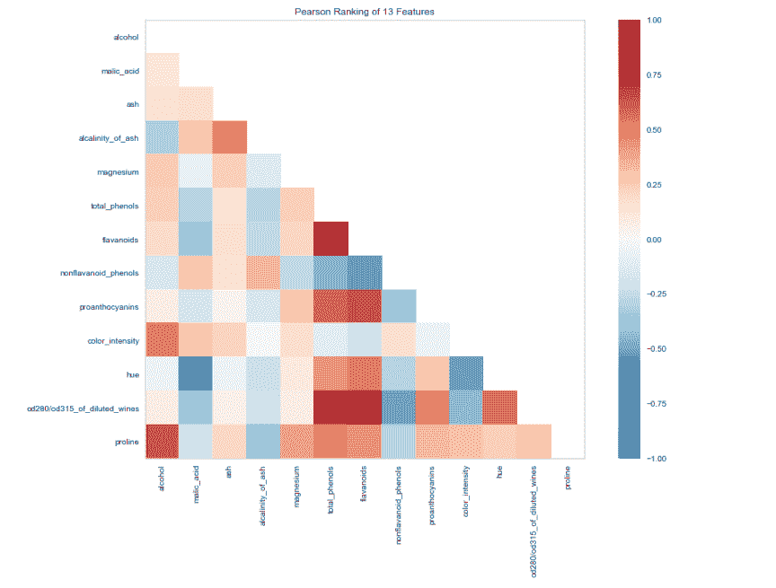
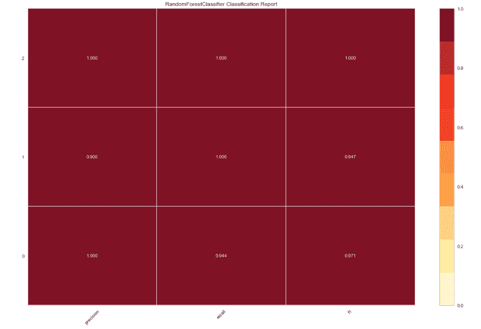
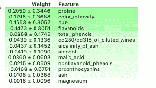

# 可解释机器学习的 Python 库

> 原文：[`www.kdnuggets.com/2019/09/python-libraries-interpretable-machine-learning.html`](https://www.kdnuggets.com/2019/09/python-libraries-interpretable-machine-learning.html)

评论

**由 [Rebecca Vickery](https://www.linkedin.com/in/rebecca-vickery-20b94133/), 数据科学家**


* * *

## 我们的前三个课程推荐

 1\. [谷歌网络安全证书](https://www.kdnuggets.com/google-cybersecurity) - 快速进入网络安全职业轨道。

 2\. [谷歌数据分析专业证书](https://www.kdnuggets.com/google-data-analytics) - 提升你的数据分析技能

 3\. [谷歌 IT 支持专业证书](https://www.kdnuggets.com/google-itsupport) - 支持你的组织的 IT

* * *

随着关于*[人工智能偏见](https://en.wikipedia.org/wiki/Algorithmic_bias)*的关注日益增加，企业能够解释其模型产生的预测以及模型本身的工作原理变得越来越重要。幸运的是，越来越多的*[数据科学 Python 库](https://www.kdnuggets.com/2020/11/top-python-libraries-data-science-data-visualization-machine-learning.html)*正在开发中，旨在解决这个问题。在以下内容中，我将简要介绍四个最成熟的解释和解释机器学习模型的包。

以下库均可通过 pip 安装，附带良好的文档，并强调视觉解释。

### [yellowbrick](https://www.scikit-yb.org/en/latest/quickstart.html)

这个库本质上是 scikit-learn 库的扩展，提供了一些非常有用且美观的机器学习模型可视化。可视化对象，即核心接口，是 scikit-learn 估计器，因此如果你习惯使用 scikit-learn，工作流程应该非常熟悉。

可以呈现的可视化内容包括模型选择、特征重要性和模型性能分析。

让我们通过几个简短的示例来说明。

这个库可以通过 pip 安装。

```py
pip install yellowbrick
```

为了说明一些特性，我将使用一个名为*[酒识别](https://scikit-learn.org/stable/modules/generated/sklearn.datasets.load_wine.html#sklearn.datasets.load_wine)*的 scikit-learn 数据集。该数据集包含 13 个特征和 3 个目标类别，可以直接从 scikit-learn 库中加载。在下面的代码中，我导入数据集并将其转换为数据框。数据可以在分类器中使用，无需额外预处理。

```py
import pandas as pd
from sklearn import datasets
wine_data = datasets.load_wine()
df_wine = pd.DataFrame(wine_data.data,columns=wine_data.feature_names)
df_wine['target'] = pd.Series(wine_data.target)

```

我还使用 scikit-learn 进一步将数据集拆分为测试集和训练集。

```py
from sklearn.model_selection import train_test_split
X = df_wine.drop(['target'], axis=1)
y = df_wine['target']
X_train, X_test, y_train, y_test = train_test_split(X, y, test_size=0.2)

```

接下来，让我们使用 Yellowbricks 可视化工具查看数据集中特征之间的相关性。

```py
from yellowbrick.features import Rank2D
import matplotlib.pyplot as plt
visualizer = Rank2D(algorithm="pearson",  size=(1080, 720))
visualizer.fit_transform(X_train)
visualizer.poof()

```



现在让我们拟合一个 RandomForestClassifier，并使用另一个可视化工具评估性能。

```py
from yellowbrick.classifier import ClassificationReport
from sklearn.ensemble import RandomForestClassifier
model = RandomForestClassifier()
visualizer = ClassificationReport(model, size=(1080, 720))
visualizer.fit(X_train, y_train)
visualizer.score(X_test, y_test)
visualizer.poof()

```



### [ELI5](https://eli5.readthedocs.io/en/latest/)

ELI5 是另一个有用的可视化库，用于调试机器学习模型并解释它们产生的预测。它与最常用的 Python 机器学习库兼容，包括 scikit-learn、XGBoost 和 Keras。

让我们使用 ELI5 来检查我们上述训练的模型的特征重要性。

```py
import eli5
eli5.show_weights(model, feature_names = X.columns.tolist())

```



默认情况下，`show_weights` 方法使用 `gain` 计算权重，但你可以通过添加 `importance_type` 参数来指定其他类型。

你还可以使用 `show_prediction` 来检查个别预测的原因。

```py
from eli5 import show_prediction
show_prediction(model, X_train.iloc[1], feature_names = X.columns.tolist(), 
                show_feature_values=True)

```


### [LIME](https://github.com/marcotcr/lime)

LIME（局部可解释模型无关解释）是一个用于解释机器学习算法预测的包。LIME 支持对各种分类器的个别预测进行解释，并且内置支持 scikit-learn。

让我们使用 LIME 来解释我们之前训练的模型的一些预测。

LIME 可以通过 pip 安装。

```py
pip install lime
```

首先，我们构建解释器。这需要一个训练数据集作为数组、模型中使用的特征名称以及目标变量中的类别名称。

```py
import lime.lime_tabular
explainer = lime.lime_tabular.LimeTabularExplainer(X_train.values,                                            
                 feature_names=X_train.columns.values.tolist(),                                        
                 class_names=y_train.unique())

```

接下来，我们创建一个使用模型对数据样本进行预测的 lambda 函数。这借鉴了这个出色的、更加深入的 [教程](https://www.guru99.com/scikit-learn-tutorial.html)。

```py
predict_fn = lambda x: model.predict_proba(x).astype(float)
```

然后我们使用解释器来解释对选定示例的预测。结果如下所示。LIME 生成一个可视化图，展示特征对这个特定预测的贡献。

```py
exp = explainer.explain_instance(X_test.values[0], predict_fn, num_features=6)
exp.show_in_notebook(show_all=False)

```


### [MLxtend](http://rasbt.github.io/mlxtend/)

这个库包含大量机器学习的辅助函数。它涵盖了如堆叠和投票分类器、模型评估、特征提取和工程以及绘图等内容。除了文档之外，这篇 [论文](https://sebastianraschka.com/pdf/software/mlxtend-latest.pdf) 是一个很好的资源，可以更详细地了解这个包。

让我们使用 MLxtend 来比较投票分类器与其组成分类器的决策边界。

同样，它可以通过 pip 安装。

```py
pip install mlxtend
```

我正在使用的导入包如下所示。

```py
from mlxtend.plotting import plot_decision_regions
from mlxtend.classifier import EnsembleVoteClassifier
import matplotlib.gridspec as gridspec
import itertoolsfrom sklearn import model_selection
from sklearn.linear_model import LogisticRegression
from sklearn.naive_bayes import GaussianNB
from sklearn.ensemble import RandomForestClassifier

```

下面的可视化只能同时处理两个特征，因此我们将首先创建一个包含特征 `proline` 和 `color_intensity` 的数组。我选择了这两个特征，因为它们在我们之前使用 ELI5 检查的所有特征中具有最高的权重。

```py
X_train_ml = X_train[['proline', 'color_intensity']].values
y_train_ml = y_train.values
```

接下来，我们创建分类器，将它们拟合到训练数据中，并使用 MLxtend 可视化决策边界。输出结果显示在代码下方。

```py
clf1 = LogisticRegression(random_state=1)
clf2 = RandomForestClassifier(random_state=1)
clf3 = GaussianNB()
eclf = EnsembleVoteClassifier(clfs=[clf1, clf2, clf3], weights=[1,1,1])
value=1.5
width=0.75
gs = gridspec.GridSpec(2,2)
fig = plt.figure(figsize=(10,8))
labels = ['Logistic Regression', 'Random Forest', 'Naive Bayes', 'Ensemble']
for clf, lab, grd in zip([clf1, clf2, clf3, eclf],
                         labels,
                         itertools.product([0, 1], repeat=2)):

    clf.fit(X_train_ml, y_train_ml)
    ax = plt.subplot(gs[grd[0], grd[1]])
    fig = plot_decision_regions(X=X_train_ml, y=y_train_ml, clf=clf)
    plt.title(lab)

```


这绝不是解释、可视化和说明机器学习模型的库的详尽列表。这个优秀的[帖子](https://skymind.ai/wiki/python-ai)包含了许多其他有用的库，可以尝试一下。

感谢阅读！

**个人简介：[Rebecca Vickery](https://www.linkedin.com/in/rebecca-vickery-20b94133/)** 正在通过自学学习数据科学。Holiday Extras 的数据科学家。alGo 的联合创始人。

[原文](https://towardsdatascience.com/python-libraries-for-interpretable-machine-learning-c476a08ed2c7)。经许可转载。

**相关：**

+   揭开黑箱：如何利用可解释机器学习

+   解释性机器学习/xAI 的数据科学手册

+   每个数据科学家都应该知道的命令行基础知识

### 更多相关话题

+   [每个数据科学家都应该知道的三个 R 库（即使你使用 Python）](https://www.kdnuggets.com/2021/12/three-r-libraries-every-data-scientist-know-even-python.html)

+   [成为伟大的数据科学家所需的 5 项关键技能](https://www.kdnuggets.com/2021/12/5-key-skills-needed-become-great-data-scientist.html)

+   [每个初学者数据科学家都应该掌握的 6 种预测模型](https://www.kdnuggets.com/2021/12/6-predictive-models-every-beginner-data-scientist-master.html)

+   [2021 年最佳 ETL 工具](https://www.kdnuggets.com/2021/12/mozart-best-etl-tools-2021.html)

+   [使用管道编写干净的 Python 代码](https://www.kdnuggets.com/2021/12/write-clean-python-code-pipes.html)

+   [为什么 Python 是初创企业的理想编程语言](https://www.kdnuggets.com/2021/12/makes-python-ideal-programming-language-startups.html)
