# Python 列表与列表操作

> 原文：[`www.kdnuggets.com/2019/11/python-lists-list-manipulation.html`](https://www.kdnuggets.com/2019/11/python-lists-list-manipulation.html)

评论

**由 [Michael Galarnyk](https://www.linkedin.com/in/michaelgalarnyk/)，数据科学家**

Python 列表与列表操作视频

在开始之前，我应该提到，本文博客和上述 [视频](https://www.youtube.com/watch?v=w9I8R3WSVqc) 中的代码可以在我的 [github](https://github.com/mGalarnyk/Python_Tutorials/blob/master/Python_Basics/Intro/Python3Basics_Part1.ipynb) 上找到。

### 定义列表

列表用方括号 [] 包裹


定义列表。此表中的第二行索引是访问列表项的方法。

```py
# Define a list
z = [3, 7, 4, 2]
```

列表存储一个有序的项集合，这些项可以是不同类型的。上面定义的列表中的所有项都是同一类型（int），但列表中的所有项不需要是相同类型，如下所示。

```py
# Define a list
heterogenousElements = [3, True, 'Michael', 2.0]
```

列表包含一个 int，一个 bool，一个字符串和一个 float。

### 访问列表中的值

列表中的每一项都有一个分配的索引值。需要注意的是，Python 是一个基于零索引的语言。这意味着列表中的第一个项的索引是 0。


访问索引为 0 的项（用蓝色标出）

```py
# Define a list
z = [3, 7, 4, 2]*# Access the first item of a list at index 0*
print(z[0])
```


访问索引为 0 的项的输出。

Python 还支持负索引。负索引从末尾开始。有时使用负索引来获取列表中的最后一项会更方便，因为你不需要知道列表的长度即可访问最后一项。


访问最后一个索引处的项。

```py
*# print last item in the list*
print(z[-1])
```

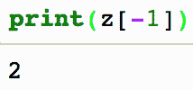

访问列表中最后一项的输出

作为提醒，你也可以使用正索引访问相同的项（如下所示）。


访问列表 z 中最后一项的替代方法

### 列表切片

切片适用于获取列表中的子集。以下示例代码将返回一个列表，其中包含从索引 0 开始到不包括索引 2 的项。


第一个索引是包含的（在 : 之前），而最后一个索引（在 : 之后）是不包含的

```py
# Define a list
z = [3, 7, 4, 2]print(z[0:2])
```

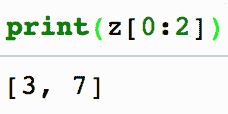

列表切片语法。


```py
*# everything up to but not including index 3*
print(z[:3])
```

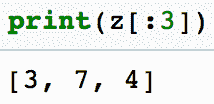


下面的代码返回一个包含从索引 1 到列表末尾的项的列表

```py
*# index 1 to end of list*
print(z[1:])
```

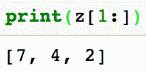

### **更新列表中的项**


Python 中的列表是可变的。这意味着在定义列表后，可以更新列表中的单个项。

```py
# Defining a list
z = [3, 7, 4, 2]# Update the item at index 1 with the string "fish"
z[1] = "fish"
print(z)
```

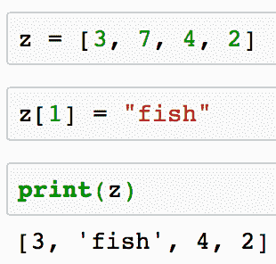

修改列表中项的代码

### 列表方法

Python 列表有不同的方法帮助你修改列表。本教程部分仅介绍各种 Python 列表方法。

### **索引方法**


```py
# Define a list
z = [4, 1, 5, 4, 10, 4]
```


索引方法返回值出现的第一个索引。在下面的代码中，它将返回 0。

```py
print(z.index(4))
```

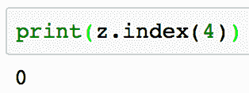


你还可以指定从哪里开始搜索。

```py
print(z.index(4, 3))
```


### **计数方法**

count 方法的作用如其名称所示。它计算一个值在列表中出现的次数

```py
random_list = [4, 1, 5, 4, 10, 4]
random_list.count(5)
```


### **排序方法**


对 Python 列表进行排序——实际代码为：z.sort()

sort 方法会原地对列表进行排序和修改。

```py
z = [3, 7, 4, 2]
z.sort()
print(z)
```

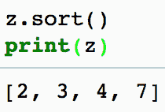

上面的代码将一个列表按从低到高排序。下面的代码显示了你也可以按从高到低的顺序对列表进行排序。


将 Python 列表按从高到低排序

```py
*# Sorting and Altering original list*
*# high to low*
z.sort(reverse = True)
print(z)
```

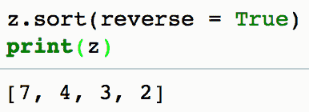

顺便提一下，你也可以将字符串列表按从 a 到 z 和从 z 到 a 进行排序，具体可以参见[这里](https://youtu.be/w9I8R3WSVqc?t=4m16s)。

### **追加方法**


将值 3 添加到列表的末尾。

append 方法将元素添加到列表的末尾。这会在原地发生。

```py
z = [7, 4, 3, 2]
z.append(3)
print(z)
```

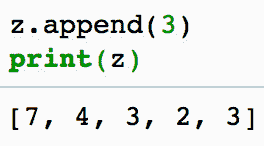

### 删除方法


remove 方法删除列表中第一次出现的值。

```py
z = [7, 4, 3, 2, 3]
z.remove(2)
print(z)
```

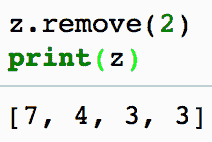

代码从列表 z 中删除值 2 的第一次出现

### 弹出方法


z.pop(1) 移除索引为 1 的值，并返回值 4。

pop 方法移除你提供的索引处的项。此方法还会返回你从列表中移除的项。如果你不提供索引，它将默认移除最后一个索引处的项。

```py
z = [7, 4, 3, 3]
print(z.pop(1))
print(z)
```


### 扩展方法


该方法通过附加项来扩展列表。其好处在于你可以将列表合并在一起。

```py
z = [7, 3, 3]
z.extend([4,5])
print(z)
```


将列表[4, 5]添加到列表 z 的末尾。

另外，也可以使用+运算符来完成相同的操作。

```py
print([1,2] + [3,4])
```


### 插入方法


在索引 4 处插入列表 [1,2]

插入方法在你提供的索引之前插入一个项目

```py
z = [7, 3, 3, 4, 5]
z.insert(4, [1, 2])
print(z)
```

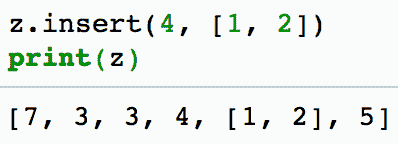

### 结语

如果你有任何问题，请通过这里或 [youtube 视频](https://www.youtube.com/watch?v=w9I8R3WSVqc) 的评论区或 [Twitter](https://twitter.com/GalarnykMichael) 告诉我！下篇文章将回顾 [python 字典](https://medium.com/@GalarnykMichael/python-basics-10-dictionaries-and-dictionary-methods-4e9efa70f5b9)。如果你想学习如何利用 Pandas、Matplotlib 或 Seaborn 库，请考虑参加我的 [Python 数据可视化 LinkedIn 学习课程](https://www.linkedin.com/learning/python-for-data-visualization/value-of-data-visualization)。这是一个 [免费预览视频](https://youtu.be/BE8CVGJuftI)。

**个人简介：[Michael Galarnyk](https://www.linkedin.com/in/michaelgalarnyk/)** 是一位数据科学家和企业培训师。他目前在斯克里普斯转化研究所工作。你可以在 Twitter (https://twitter.com/GalarnykMichael)、Medium (https://medium.com/@GalarnykMichael) 和 GitHub (https://github.com/mGalarnyk) 上找到他。

[原文](https://towardsdatascience.com/python-basics-6-lists-and-list-manipulation-a56be62b1f95)。已获许可转载。

**相关内容：**

+   理解箱线图

+   应用于 Pandas DataFrames 的集合操作

+   理解 Python 中的分类决策树

* * *

## 我们的前三个课程推荐

 1\. [Google 网络安全证书](https://www.kdnuggets.com/google-cybersecurity) - 快速开启网络安全职业生涯

 2\. [Google 数据分析专业证书](https://www.kdnuggets.com/google-data-analytics) - 提升你的数据分析技能

 3\. [Google IT 支持专业证书](https://www.kdnuggets.com/google-itsupport) - 支持你的组织 IT

* * *

### 更多相关内容

+   [5 种过滤 Python 列表的方法](https://www.kdnuggets.com/2022/11/5-ways-filtering-python-lists.html)

+   [8 个最佳 Python 图像处理工具](https://www.kdnuggets.com/2022/11/8-best-python-image-manipulation-tools.html)

+   [数据处理的必要 Python 库](https://www.kdnuggets.com/essential-python-libraries-for-data-manipulation)

+   [10 个 Pandas 一行代码进行数据访问、处理和管理](https://www.kdnuggets.com/2023/01/pandas-one-liners-data-access-manipulation-management.html)

+   [为什么不应过度使用 Python 列表推导式](https://www.kdnuggets.com/why-you-should-not-overuse-list-comprehensions-in-python)

+   [如何开始使用 SQL - 免费学习资源列表](https://www.kdnuggets.com/2022/10/get-running-sql-list-free-learning-resources.html)
