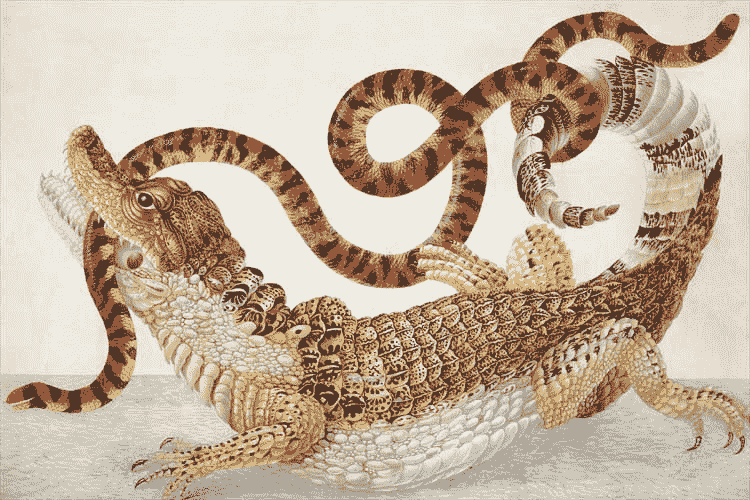

# Python 模式：使用 max 代替 if

> 原文：[`www.kdnuggets.com/2019/01/python-patterns-max-instead-if.html`](https://www.kdnuggets.com/2019/01/python-patterns-max-instead-if.html)

 评论



在编写 Python 代码时，我常常需要查看一组对象，为每个对象确定一个分数，并保存最佳分数及其相关对象。例如，寻找用我目前拥有的字母在 [Scrabble](https://en.wikipedia.org/wiki/Scrabble) 中能拼出的最高分单词。

* * *

## 我们的前 3 个课程推荐

 1\. [Google 网络安全证书](https://www.kdnuggets.com/google-cybersecurity) - 快速进入网络安全职业生涯。

 2\. [Google 数据分析专业证书](https://www.kdnuggets.com/google-data-analytics) - 提升你的数据分析技能

 3\. [Google IT 支持专业证书](https://www.kdnuggets.com/google-itsupport) - 支持你的组织 IT

* * *

一种方法是循环遍历所有对象，使用占位符记住到目前为止看到的最佳对象，如下所示：

```py
# Set up placeholder variables
best_score = 0
best_word = None

# Try all possible words, saving the best one seen
for word in possible_words(my_letters):
  score = score_word(word)

  if score > best_score:
    best_score = score
    best_word = word
```

你可能之前在自己的代码中写过这种逻辑。代码并不复杂，但我们仍然可以通过快速调整来提高其可读性。

### 使用 `max()` 简化

`if score > best_score` 让你想起了什么？我们可能会实现 `max()` 函数的方式！使用 `max()` 有助于我们简化代码：

```py
# Set up placeholder variables
best_seen = (0, None)

# Try all possible words, saving the best one seen
for word in possible_words(my_letters):
  score = score_word(word)

  newest_seen = (score, word)
  best_seen = max(best_seen, newest_seen)
```

将所有数据存储在一个元组中意味着分配和比较现在可以一次性处理。这降低了我们混淆分配的可能性，并使我们所做的事情更加明确。

这里有一个潜在的陷阱：`max()` 选择第一个元素最大的元组（在我们的例子中是分数），这是我们想要的。但如果两个元组的第一个元素相同，`max()` 会继续比较其余元素，直到打破平局。因此，如果两个单词具有相同的分数，`max()` 将继续比较单词，它是按字典顺序进行的。

为了让 `max()` 仅比较第一个元素，我们可以使用 `key` 参数。`key` 参数接受一个对每个对象调用的函数，并返回另一个用于比较的对象。我们可以使用它来选择第一个条目，如下所示：

```py
# Set up placeholder variables
best_seen = (0, None)

# Try all possible words, saving the best one seen
for word in possible_words(my_letters):
  score = score_word(word)

  newest_seen = (score, word)
  best_seen = max(best_seen, newest_seen, key=lambda x: x[0])
```

### 更简单

在上述示例中，我们想保存分数和单词，但如果我们只关心生成最高分的单词，而不是分数本身呢？那么就有一个更简单的方法！

默认情况下，`max()` 使用标准比较运算符，但我们可以将其更改为使用上面相同的 `key` 参数中的 `score_word()`。这样我们就有了：

```py
words = possible_words(my_letters)
best_word = max(words, key=score_word)
```

这给了我们一个非常紧凑（且相对可靠）的模式，将所有的循环和占位符都推入了`max()`的实现中。

**个人简介：[亚历山大·古德](https://www.linkedin.com/in/alexandergude/)** 目前是 Intuit 的数据科学家，使用机器学习进行欺诈预防。他获得了加州大学伯克利分校的物理学学士学位，以及明尼苏达大学双城分校的基础粒子物理学博士学位。

[原文](https://alexgude.com/blog/python-patterns-max-not-if/)。转载已获许可。

**相关：**

+   5 个“清洁代码”技巧将显著提高你的生产力

+   传统编程与机器学习有多大不同？

+   使用 Python 加速数据预处理 2–6 倍

### 更多相关话题

+   [在数据科学项目中停止硬编码 - 使用配置文件代替](https://www.kdnuggets.com/2023/06/stop-hard-coding-data-science-project-config-files-instead.html)

+   [为什么你应该使用线性回归模型而不是…](https://www.kdnuggets.com/2021/08/3-reasons-linear-regression-instead-neural-networks.html)

+   [忘掉 PIP、Conda 和 requirements.txt！改用 Poetry 并…](https://www.kdnuggets.com/2023/07/forget-pip-conda-requirementstxt-poetry-instead-thank-later.html)

+   [揭示隐藏模式：分层聚类入门](https://www.kdnuggets.com/unveiling-hidden-patterns-an-introduction-to-hierarchical-clustering)

+   [机器学习中的设计模式用于 MLOps](https://www.kdnuggets.com/2022/02/design-patterns-machine-learning-mlops.html)

+   [通过《Fast Python for Data Science》提升你的 Python 技能！](https://www.kdnuggets.com/2022/06/manning-step-python-game-fast-python-data-science.html)
