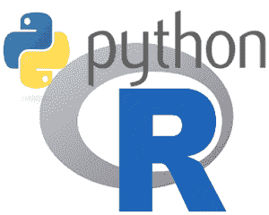

# Python 和 R 数据科学课程

> 原文：[`www.kdnuggets.com/2020/02/python-r-courses-data-science.html`](https://www.kdnuggets.com/2020/02/python-r-courses-data-science.html)

评论[来源](https://quantlabs.net/blog/2019/06/r-vs-python-which-is-a-better-programming-language-for-data-science/)

由于 Python 和 R 是今天数据科学家的必备技能，持续学习至关重要。在线课程无疑是职业生涯中提升技能的最佳和最灵活的方式。这个列表包含了知名课程，可以帮助任何想要开始了解每种语言及其专业应用的人。

* * *

## 我们的前三个课程推荐

 1\. [Google 网络安全证书](https://www.kdnuggets.com/google-cybersecurity) - 快速进入网络安全职业的快车道

 2\. [Google 数据分析专业证书](https://www.kdnuggets.com/google-data-analytics) - 提升你的数据分析技能

 3\. [Google IT 支持专业证书](https://www.kdnuggets.com/google-itsupport) - 支持你的组织 IT 工作

* * *

### 1\. [CS50 的计算机科学导论](https://www.edx.org/course/cs50s-introduction-to-computer-science)

[来源](https://www.edx.org/course/cs50s-introduction-to-computer-science)

本课程适合非计算机科学专业以及没有编程经验的人。根据课程描述，Python 是你将会熟悉的语言之一。虽然这与数据科学在统计和可视化方面并不直接相关，但基本的编程概念仍然非常重要。

### 2\. [应用数据科学与 Python 专业化](https://www.coursera.org/specializations/data-science-python)

[来源](https://www.coursera.org/specializations/data-science-python)

这是密歇根大学的一门中级课程。该专业包含 5 门课程，并通过 Python 进行讲解。课程涉及的主题包括统计学、机器学习、信息可视化、文本分析和社会网络分析。

### 3\. [CS50 的 Python 人工智能导论](https://www.edx.org/course/cs50s-introduction-to-artificial-intelligence-with-python)

[来源](https://www.edx.org/course/cs50s-introduction-to-artificial-intelligence-with-python)

这个课程也适合数据科学初学者。它带我们了解 AI 的基本概念，例如 AI 的算法基础、图搜索算法、分类、优化、强化学习等。根据课程网站，这也是一个免费课程，仅需支付费用以获得可验证的证书。

### 4\. [约翰霍普金斯大学的 R 编程课程](https://www.coursera.org/learn/r-programming)

[来源](https://www.coursera.org/learn/r-programming)

这是一个更适合有 R 编程经验的中级课程。它采用了更编程的方式，例如如何在 R 中构建函数和循环。课程中还使用了统计学作为示例。

### 5\. [线性模型和矩阵代数简介](https://online-learning.harvard.edu/course/data-analysis-life-sciences-2-introduction-linear-models-and-matrix-algebra?delta=0)

这门课程将带你通过线性代数在生命科学领域的应用。建议参加此课程的人应具备数学或统计学的基础知识。课程将使用 R 语言进行学习，涉及矩阵运算和统计推断等主题。

### 6\. [数据科学：生产力工具](https://online-learning.harvard.edu/course/data-science-productivity-tools?delta=0)

[来源](https://online-learning.harvard.edu/course/data-science-productivity-tools?delta=0)

尽管 R 不是像 Java 或 Python 那样传统的编程语言，但学习这个生产力工具仍然有用，它可以帮助你组织代码，并使用 IDE 更快、更高效地编写代码。

[这是包含所有哈佛大学 R 编程在线课程的网站。](https://online-learning.harvard.edu/subject/r)

[这是包含所有哈佛大学 Python 编程在线课程的网站](https://online-learning.harvard.edu/subject/python)

**相关：**

+   R 编程入门

+   成为数据工程师的 7 个资源

+   2019 年 5 大著名深度学习课程/学校

### 更多相关话题

+   [停止学习数据科学以找到目的，并找到目的…](https://www.kdnuggets.com/2021/12/stop-learning-data-science-find-purpose.html)

+   [每个数据科学家都应该知道的三个 R 库（即使你使用 Python）](https://www.kdnuggets.com/2021/12/three-r-libraries-every-data-scientist-know-even-python.html)

+   [是什么让 Python 成为初创公司的理想编程语言](https://www.kdnuggets.com/2021/12/makes-python-ideal-programming-language-startups.html)

+   [学习数据科学统计学的顶级资源](https://www.kdnuggets.com/2021/12/springboard-top-resources-learn-data-science-statistics.html)

+   [成功数据科学家的 5 个特征](https://www.kdnuggets.com/2021/12/5-characteristics-successful-data-scientist.html)

+   [一个 90 亿美元的人工智能失败案例，详细分析](https://www.kdnuggets.com/2021/12/9b-ai-failure-examined.html)
