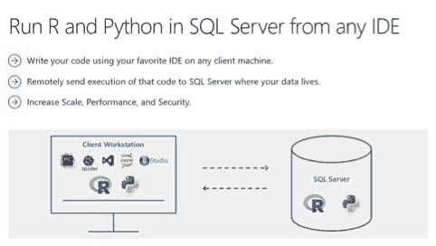
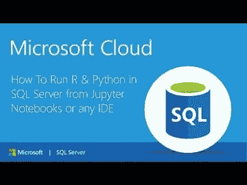
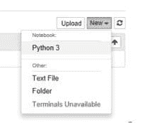

# 远程数据科学：如何从 Jupyter Notebooks 向 SQL Server 发送 R 和 Python 执行

> 原文：[`www.kdnuggets.com/2018/07/r-python-execution-sql-server-jupyter.html`](https://www.kdnuggets.com/2018/07/r-python-execution-sql-server-jupyter.html)

 评论

**由 [Kyle Weller](https://www.linkedin.com/in/ai-is-the-future/)**



### **简介**

你知道吗？你可以在 SQL Server 中通过 Jupyter Notebooks 或任何 IDE 远程执行 R 和 Python 代码。SQL Server 中的[机器学习服务](https://aka.ms/SQLMLOverview)消除了移动数据的需要。与其通过网络传输大量和敏感的数据或在 ML 训练中因样本 csv 文件而损失精度，不如让你的 R/Python 代码在数据库中执行。你可以在 Jupyter Notebooks、RStudio、PyCharm、VSCode、Visual Studio 等任何地方工作，然后将函数执行发送到 SQL Server，将智能带到你的数据所在之处。

本教程将展示如何将你的 Python 代码从 Jupyter Notebooks 发送到 SQL Server 执行。相同的原则也适用于 R 和任何其他 IDE。如果你更喜欢通过视频学习，本教程也在 YouTube 上发布，点击这里：



### **环境设置前提条件**

1.  **在 SQL Server 上安装 ML 服务**

为了让 R 或 Python 在 SQL 中执行，你首先需要安装和配置机器学习服务功能。请参阅此[操作指南](https://aka.ms/SetupMLServices)。

1.  **通过微软的 Python 客户端安装 RevoscalePy**

为了从 Jupyter Notebooks 向 SQL 发送 Python 执行，你需要使用微软的 RevoscalePy 包。要获取 RevoscalePy，请下载并安装微软的 ML Services Python 客户端。[文档页面](https://docs.microsoft.com/en-us/machine-learning-server/install/python-libraries-interpreter) 或 [直接下载链接](https://aka.ms/mls93-py)（适用于 Windows）。

下载完成后，以管理员身份打开 PowerShell 并导航到下载文件夹。使用此命令开始安装（可以自定义安装文件夹）：

```py
.\Install-PyForMLS.ps1 -InstallFolder "C:\Program Files\MicrosoftPythonClient"

```

请耐心等待，安装可能需要一些时间。安装完成后，导航到你安装的新路径。我们来创建一个空文件夹并打开 Jupyter Notebooks：

```py
mkdir JupyterNotebooks; cd JupyterNotebooks; ..\Scripts\jupyter-notebook

```

创建一个新的使用 Python 3 解释器的笔记本：



为了测试一切是否设置正确，请在第一个单元格中导入 revoscalepy 并执行。如果没有错误消息，你可以继续进行。


### **数据库设置（仅本教程需要）**

如果你不想复制所有代码，可以克隆 [Github 上的这个 Jupyter Notebook](https://aka.ms/RemoteExecJupyter)。这个数据库设置是确保你拥有与本教程相同的数据的一次性步骤。你不需要执行这些设置步骤来使用自己的数据。

1.  **创建数据库**

修改你的服务器连接字符串，并使用 pyodbc 创建一个新的数据库。

```py
import pyodbc
# creating a new db to load Iris sample in
new_db_name = "MLRemoteExec"
connection_string = "Driver=SQL Server;Server=localhost\
MSSQLSERVER2017;Database={0};Trusted_Connection=Yes;"

cnxn = pyodbc.connect(connection_string.format("master"), autocommit=True) 

cnxn.cursor().execute("IF EXISTS(SELECT * FROM sys.databases WHERE
[name] = '{0}') DROP DATABASE {0}".format(new_db_name)) 

cnxn.cursor().execute("CREATE DATABASE " + new_db_name)

cnxn.close()

print("Database created") 

```

1.  **从 SkLearn 导入 Iris 示例**

Iris 是一个受欢迎的初学者数据科学教程数据集。它默认包含在 sklearn 包中。

```py
from sklearn import datasets import pandas as pd
# SkLearn has the Iris sample dataset built in to the package
iris = datasets.load_iris()
df = pd.DataFrame(iris.data, columns=iris.feature_names)

```

1.  **使用 RecoscalePy APIs 创建表并加载 Iris 数据**

*(你也可以使用 pyodbc、sqlalchemy 或其他包来完成此操作)*

```py
from revoscalepy import RxSqlServerData, rx_data_step
# Example of using RX APIs to load data into SQL table
# You can also do this with pyodbc
table_ref = RxSqlServerData(connection_string=
connection_string.format(new_db_name), table="Iris")
rx_data_step(input_data = df, output_file = table_ref, overwrite = True) 
print("New Table Created: Iris")
print("Sklearn Iris sample loaded into Iris table")

```

### **定义一个发送到 SQL Server 的函数**

编写任何你想在 SQL 中执行的 Python 代码。在这个示例中，我们正在创建一个 Iris 数据集的散点矩阵，并只将 .png 的字节流返回到 Jupyter Notebooks 以在客户端渲染。

```py

def send_this_func_to_sql()
from revoscalepy import RxSqlServerData, rx_data_step
from pandas.tools.plotting import scatter_matrix
import matplotlib.pyplot as plt
import io
# remember the scope of the variables in this func are 
within our SQL Server Python Runtime

connection_string = "Driver=SQL Server;Server=localhost\MSSQLSERVER2017;
Database=MLRemoteExec;Trusted_Connection=Yes;"

# specify a query and load into pandas dataframe df
sql_query = RxSqlServerData(connection_string=connection_string, 
sql_query = "select * from Iris")

df = rx_import(sql_query)
scatter_matrix(df)

# return bytestream of image created by scatter_matrix
buf = io.BytesIO()
plt.save fig(buf, format="png")
buf.seek(0)
return buf.getvalue()

```

**将执行发送到 SQL**

现在我们终于完成了设置，看看远程执行真的有多简单吧！首先，导入 revoscalepy。创建一个 sql_compute_context，然后使用 RxExec 无缝地将任何函数的执行发送到 SQL Server。没有原始数据需要从 SQL 传输到 Jupyter Notebook。所有计算都在数据库内完成，只有图像文件被返回以供显示。

```py

from IPython import display
import matplotlib.pyplot as plt
from revoscalepy import RxInSqlServer, rx_exec
# create a remote compute context with connection to SQL Server

sql_compute_context = 
RxInSqlServer(connection_string=connection_string.format(new_db_name))

# use rx_exec to send the function execution to SQL Server

image = rx_exec(send_this_func_to_sql, 
compute_context=sql_compute_context)[0]

# only an image was returned to my jupyter client. 
#All data remained secure and was manipulated in my db.

display.Image(data=image)

```

尽管这个示例使用了 Iris 数据集很简单，但想象一下你现在解锁的额外规模、性能和安全能力。你可以使用任何最新的开源 R/Python 包，在 SQL Server 中处理大量数据，构建深度学习和人工智能应用程序。我们还提供微软 [领先边缘](https://cloudblogs.microsoft.com/sqlserver/2016/10/11/1000000-predictions-per-second/)、高性能的算法，分别在 [RevoScaleR](https://docs.microsoft.com/en-us/machine-learning-server/r-reference/revoscaler/revoscaler) 和 [RevoScalePy](https://docs.microsoft.com/en-us/sql/advanced-analytics/python/what-is-revoscalepy?view=sql-server-2017) APIs 中。将这些与开源世界中的最新创新结合使用，可以为你的应用程序带来无与伦比的选择、性能和规模。

### **了解更多**

查看 [SQL 机器学习服务文档](https://aka.ms/SQLMLDocs)，了解如何轻松部署你的 R/Python 代码，使用 SQL 存储过程使其在 ETL 过程或任何应用程序中可访问。在你的数据库中训练和存储机器学习模型，将智能带到数据所在的位置。

基本的 R 和 Python 执行在 SQL Server 中：[`aka.ms/BasicMLServicesExecution`](https://aka.ms/BasicMLServicesExecution)

设置 SQL Server 中的机器学习服务：[`aka.ms/SetupMLServices`](https://aka.ms/SetupMLServices)

Github 上的端到端教程解决方案：[`microsoft.github.io/sql-ml-tutorials/`](https://microsoft.github.io/sql-ml-tutorials/)

其他 YouTube 教程：

如何安装 SQL Server 机器学习服务： [`aka.ms/InstallMLServices`](https://aka.ms/InstallMLServices) 如何启用 SQL Server 机器学习服务： [`aka.ms/EnableMLServices`](https://aka.ms/EnableMLServices) SQL 中 R 和 Python 执行的基础： [`aka.ms/ExecuteMLServices`](https://aka.ms/ExecuteMLServices)

**个人简介**：[Kyle Weller](https://www.linkedin.com/in/ai-is-the-future/)是微软 Azure 机器学习团队的项目经理。在几家初创公司担任软件开发人员后，他加入微软，并在 Office 和 Bing 从事可扩展数据仪表、平台和 API 解决方案的工作。他曾在 Cortana 数据与分析团队负责测量策略，研究用户行为模式，标准化 KPI，并为产品识别增长机会。他现在从事 Azure 机器学习产品的工作，专注于将智能带到数据存储的位置。这包括 SQL Server 的新机器学习服务，允许在 SQL 中执行 R + Python。

**相关内容：**

+   [初学者的 Jupyter Notebook 教程](https://www.kdnuggets.com/2018/05/jupyter-notebook-beginners-tutorial.html)

+   [SQL 备忘单](https://www.kdnuggets.com/2018/07/sql-cheat-sheet.html)

+   [Python 中的遗传算法实现](https://www.kdnuggets.com/2018/07/genetic-algorithm-implementation-python.html)

* * *

## 我们的前三大课程推荐

 1\. [谷歌网络安全证书](https://www.kdnuggets.com/google-cybersecurity) - 快速进入网络安全职业生涯。

 2\. [谷歌数据分析专业证书](https://www.kdnuggets.com/google-data-analytics) - 提升你的数据分析技能

 3\. [谷歌 IT 支持专业证书](https://www.kdnuggets.com/google-itsupport) - 支持你的组织 IT 工作

* * *

### 更多相关话题

+   [Kubernetes 中的高可用 SQL Server Docker 容器](https://www.kdnuggets.com/2022/04/high-availability-sql-server-docker-containers-kubernetes.html)

+   [SQL 执行顺序的基本指南](https://www.kdnuggets.com/the-essential-guide-to-sql-execution-order)

+   [KDnuggets™新闻 22:n01, 1 月 5 日：3 种跟踪和可视化工具…](https://www.kdnuggets.com/2022/n01.html)

+   [跟踪和可视化你的 Python 代码执行的 3 种工具](https://www.kdnuggets.com/2021/12/3-tools-track-visualize-execution-python-code.html)

+   [数据科学中的远程工作：利与弊](https://www.kdnuggets.com/remote-work-in-data-science-pros-and-cons)

+   [如何找到最佳的数据科学远程工作](https://www.kdnuggets.com/2022/12/find-best-data-science-remote-jobs.html)
