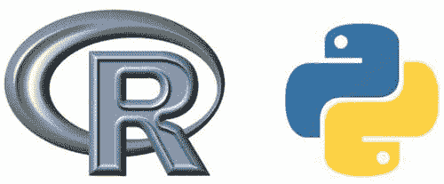

# 八个 R 用户在尝试学习 Python 时会感到沮丧的事情

> 原文：[`www.kdnuggets.com/2016/11/r-user-frustrating-learning-python.html`](https://www.kdnuggets.com/2016/11/r-user-frustrating-learning-python.html)

 评论

**作者：安迪·尼科尔斯，[芒果解决方案](http://www.mango-solutions.com/)**。

在与客户和其他 R 用户在如 LondonR 和 EARL 等活动中交流时，我注意到越来越多的人希望学习 Python 作为数据科学之旅的下一步。在芒果，我们的大多数顾问对使用任何一种语言都感到满意，但作为一个使用 R 已有 12 年的用户，我仅仅是尝试过 Python。然而，最近我发现自己不得不快速学习 Python，因此我想分享一些我的观察。

* * *

## 我们的前三大课程推荐

 1\. [谷歌网络安全证书](https://www.kdnuggets.com/google-cybersecurity) - 快速进入网络安全职业生涯。

 2\. [谷歌数据分析专业证书](https://www.kdnuggets.com/google-data-analytics) - 提升你的数据分析技能

 3\. [谷歌 IT 支持专业证书](https://www.kdnuggets.com/google-itsupport) - 支持你的组织在 IT 方面

* * *



在你停止阅读之前，我应该说我完全知道有许多博客文章讨论了每种语言的高层次优缺点。对于这篇文章，我想深入探讨一下。一个 R 用户在尝试学习 Python 时真正体验到了什么？特别是那些来自统计背景的 R 用户会经历什么？

就个人而言，我找到了八个（虽然我想要 10 个，但 Python 实在太棒了），它们如下：

1.  **缺乏 Hadley**。虽然有 Wes，但在功能上存在许多重复的包。开始时你导入统计包并找到均值函数，结果发现它已经被为 pandas 重写。后来你发现每个人对交叉验证的最佳实现方式都有自己的想法。这在开始时非常混乱。这让我想到：

1.  **绘图**。我听说了很多关于 matplotlib 和 seaborn 的好评，但在我看来，ggplot2 无疑领先很多。我甚至可以说 ggplot2 的学习曲线更平缓。

1.  **集成开发环境（IDEs）**。向 RStudio 致敬，它在 IDE 领域改变了 R 的世界。我记得在 RStudio 出现之前，R GUI、StatET 和 Tinn-R 是常态。事情的确有了很大改善。遗憾的是，Python 还没有完全达到这一点。作为一个 RStudio 用户，我选择了 Spyder。它还不错，但脚本编辑器需要改进。我与同事交流时发现 Jupyter Notebook 的集成似乎更好，但我不是很喜欢笔记本。

1.  **命名空间**。我已经记不清多少次在 R 入门课程中告诉学员，掩蔽几乎不会困扰到用户（除非你在构建包，真的不会）。可以说，在 Python 中你必须小心。引入太多东西，你会覆盖自己的对象并引起混乱。这意味着你根据需要引入东西。为了更改工作目录等而必须显式导入 OS 实用程序是令人沮丧的。也就是说，Python 在这一领域的能力稍微优于 R。

1.  **面向对象**。我渐渐喜欢上了 R 灵活的 S3 类，像这样的代码行：

```py` ``` > x <- 5    > class(x) <- "just_made_this_up"    > x    [1] 5    attr(,"class")    [1] "just_made_this_up" ```py ````

在 Python 中，我总是不太确定一个对象有哪些方法以及何时应该使用函数式编程。你也真的需要了解类才能有效地使用 Python，而随意使用 R 的用户甚至可以在不知道 R 有类系统的情况下使用它。

1.  **对 R 的依赖**。在我最近的项目中，我使用了 Python 中最好的统计能力。首先，我应该说它基本上都存在（除了某些奇怪原因的逐步 GLM）。然而，尽管我一直知道 Python 中的大多数统计建模功能都是从 R 移植过来的，但文档非常懒散，大部分只是指向 R 的文档。示例数据集甚至是一样的！说到文档。

1.  **帮助文档**。我只能谈论这两种语言中更流行的包，但 R 的文档要丰富得多，并且通常包含更多的示例。

1.  **零基数组**。我不能在没有提到这个的情况下写列表。我确实喜欢那些在其他语言中开发的自满编码者告诉我 R 是唯一一个从 1 开始索引的例外。然而，作为一个人，我从 1 开始计数，这对我来说总是更有意义。以 n-1 结束也是令人困惑的。对比一下：

```py` ``` # R    x = seq(2,10, by = 2)    x[1:3] # 选择前 3 个元素    [1] 2 4 6 ```py ````  ```py` ``` # Python    x = list(range(2,11, 2))    x[0:3] # 选择前 3 个元素    [2, 4, 6] ```py ````

我印象深刻的是 R 中广泛的统计能力已经被移植到 Python 中（例如，我没想到混合建模或生存分析的能力会像 R 中那样）。 然而，作为一个现有的 R 用户，实际上没有必要为了统计而转到 Python。 唯一的好处是如果你使用 Python 进行例如广泛的网页抓取，并且希望保持一致性。如果这是你的原因，那么让我把你指向 Chris Musselle 的博客文章“[整合 Python 和 R 第二部分——从 Python 执行 R 及反之亦然](http://www.mango-solutions.com/wp/2015/10/integrating-python-and-r-part-ii-executing-r-from-python-and-vice-versa/)”。 而且不要忘记你也可以直接使用*rvest*。

所以我的建议是，如果你打算学习 Python，不要以使用它来构建模型为目的来学习。 学习它是因为它是一种更灵活的全能编程语言，并且你有一些重的工作要做。 只需找一些在 R 中难做的事情，并尝试使用 Python 来完成。否则你会像我一样，写一篇抱怨的博客文章！

**简介：[安迪·尼科尔斯](https://www.linkedin.com/in/andy-nicholls-56225832)** 是 Mango Solutions 的数据科学主管，同时也是一位全面的顾问和统计学家。

[原文](http://www.mango-solutions.com/wp/2016/10/eight-not-10-things-an-r-user-will-find-frustrating-when-trying-to-learn-python/)。 经许可转载。

**相关：**

+   R 与 Python 在数据科学中的较量：赢家是...

+   R 还是 Python？考虑同时学习两者

+   R 与 Python：逐对数据分析

### 更多相关内容

+   [停止学习数据科学寻找目标，寻找目标来…](https://www.kdnuggets.com/2021/12/stop-learning-data-science-find-purpose.html)

+   [是什么让 Python 成为初创企业理想的编程语言](https://www.kdnuggets.com/2021/12/makes-python-ideal-programming-language-startups.html)

+   [每个数据科学家都应该知道的三个 R 库（即使你使用 Python）](https://www.kdnuggets.com/2021/12/three-r-libraries-every-data-scientist-know-even-python.html)

+   [一个 90 亿美元的 AI 失败案例分析](https://www.kdnuggets.com/2021/12/9b-ai-failure-examined.html)

+   [学习数据科学统计的顶级资源](https://www.kdnuggets.com/2021/12/springboard-top-resources-learn-data-science-statistics.html)

+   [成功数据科学家的 5 个特征](https://www.kdnuggets.com/2021/12/5-characteristics-successful-data-scientist.html)
