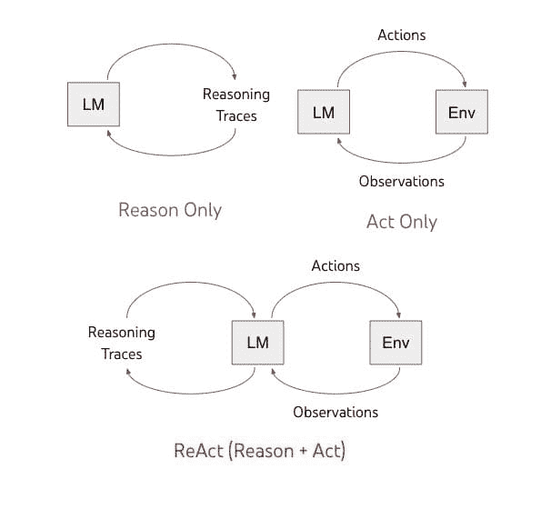

# ReAct，推理与行动通过工具增强 LLMs！

> 原文：[`www.kdnuggets.com/react-reasoning-and-acting-augments-llms-with-tools`](https://www.kdnuggets.com/react-reasoning-and-acting-augments-llms-with-tools)

# 介绍

缩写为推理与行动的这个[论文](https://arxiv.org/pdf/2210.03629.pdf)介绍了一个新概念，它提高了 LLMs 的性能，并为我们提供了更多的解释性和可解释性。

人工智能通用智能（AGI）的目标可能是人类文明可以实现的最重要目标之一。想象一下创建能够推广到许多问题的人工智能。对于 AGI 的定义有很多种解释，我们什么时候可以说我们已经实现了它？

在过去几十年里，最有前途的 AGI 方法是强化学习路径，更具体地说，是 DeepMind 在解决困难任务方面取得的成就，如 AlphaGo、AlphaStar 以及许多突破……

然而，ReAct 的表现超越了模仿学习和强化学习方法，分别提高了 34%和 10%的绝对成功率，同时仅使用一个或两个上下文示例。

通过这种结果（当然，前提是没有数据泄漏，我们可以信任论文中提供的评估方法），我们不能再忽视 LLMs 推理的潜力，并将复杂任务分解为逻辑步骤。

# 论文背后的动机

本文从一个观点出发，即迄今为止，大型语言模型（LLMs）在语言理解方面表现令人印象深刻，它们已被用于生成 CoT（思维链）来解决一些问题，并且也被用于行动和计划生成。

尽管这两者一直被分开研究，但本文旨在以交替的方式结合推理和行动，以增强 LLM 的性能。

这一观点背后的原因是，如果你考虑一下你作为一个人如何执行某项任务。

第一步是你使用“内在语言”或以某种方式写下或与自己沟通，说明“我如何执行任务 X？要完成任务 X，我需要先做步骤 1，然后做步骤 2，依此类推”

更具体地说，如果你在厨房里做一道菜，你可以这样使用 ReAct：

“现在一切都切好了，我应该加热水锅”，以处理例外情况或根据情况调整计划（“我没有盐，所以我用酱油和胡椒代替”），并意识到何时需要外部信息（“我怎么准备面团？让我在互联网上搜索”）。

你还可以采取行动（翻开食谱书阅读食谱，打开冰箱，检查配料）来支持推理并回答问题（“我现在可以做什么菜？”）。

这种推理与行动的结合使得人类即使在之前未见的情况下或面对信息不确定性时，仍能学习并完成任务。

# 仅有推理的方法

先前的研究展示了 LLMs 进行推理的能力，例如，思维链提示（Chain of Thought Prompting）展示了模型能够提出解决算术、常识和符号推理问题的计划。

然而，这里的模型仍然是一个“静态黑箱”，因为它使用其内部语言表示来回答这些问题，而这种表示可能并不总是准确或最新的，这会导致事实幻觉（从自身想象中得出事实）或错误传播（思维链中的一个错误传播到错误答案）。

如果没有采取某种行动和更新其知识的能力，模型将受到限制。

# 仅行动方法

也有一些研究使用 LLMs 根据语言进行动作，这些研究通常会接收多模态输入（音频、文本和图像），将其转换为文本，使用模型生成领域内的动作，然后使用控制器执行这些动作。

如果没有规划一些步骤和推理该做什么的能力，模型将简单地输出错误的动作。

# 将两者结合成 ReAct

本文的提议是结合上述两种方法。ReAct 提示 LLMs 以交替的方式生成与任务相关的口头推理痕迹和行动，这允许模型进行动态推理，创建、维护和调整高层次的行动计划（推理以行动），同时也与外部环境（例如维基百科）互动，将额外的信息纳入推理（行动以推理）。

下面的图示展示了这一点：

Reason、Act 和 ReAct 之间的区别（照片摘自论文）

# 动作空间

因此，为了改进推理提示，他们设计了一个动作空间，即模型在回答问题时允许使用的三种动作。

这是通过维基百科 API 完成的，该 API 提供以下内容：

+   **search[entity]**：返回对应实体维基页面的前 5 个句子（如果存在），否则建议维基百科搜索引擎中的前 5 个相似实体

+   **lookup**[string]，将返回包含字符串的页面中的下一句，模拟浏览器中的 Ctrl+F 功能

+   **finish**[answer]，将用答案完成当前任务

这里不常见的一点是，信息检索工具比上述提到的工具强大得多。

这样做的目标是模拟人类行为以及人类如何与维基百科互动并推理以找到答案。

# 提示

除了提供的工具，我们还需要正确提示 LLM，以提供推理并适当地链式执行动作。

为此，他们使用了多种思路组合来分解问题，例如（“我需要搜索 x，找到 y，然后找到 z”），从维基百科观察中提取信息（“x 起始于 1844”， “该段落没有告诉 x”），进行常识推理（“x 不是 y，所以 z 必须是…”）或算术推理（“1844 < 1989”），指导搜索重组（“也许我可以搜索/查找 x”），并综合最终答案（“...所以答案是 x”）。

最终结果大致如下：

ReAct 如何工作并带来更好的结果（照片来自论文）

# 结果

选择用于评估的数据集如下：

[**HotPotQA**](https://arxiv.org/abs/1809.09600)：一个问答数据集，要求对一个或两个维基百科页面进行推理。

[**FEVER**](https://arxiv.org/abs/1803.05355)：一个事实验证基准，每个声明根据是否存在维基百科段落来验证该声明，标注为 SUPPORTS、REFUTES 或 NOT ENOUGH INFO。

[**ALFWorld**](https://arxiv.org/abs/2010.03768)：一个基于文本的游戏，包括 6 种任务类型，代理需要完成这些任务以实现高层次目标。

一个例子是“在桌灯下检查纸张”，通过文本行动（例如，去咖啡桌 1，拿纸 2，用桌灯 1）导航和与模拟的家庭进行互动。

[**WebShop**](https://arxiv.org/abs/2207.01206)：一个包含 118 万个真实世界产品和 1.2 万条人类指令的在线购物网站环境，具有更多的多样性和复杂性。

它要求一个代理根据用户指令购买产品。例如，“我在找一个带抽屉的床头柜。它应该有镍质饰面，价格低于 140 美元”，代理需要通过网络互动来实现这一点。

所以结果显示**ReAct 总是优于 Act**，这表明推理部分对于增强行动是极其重要的。

另一方面，ReAct 在 Fever 上的表现优于 CoT（60.9 对 56.3），而在 HotpotQA 上略逊于 CoT（27.4 对 29.4）。因此，对于 FEVER 数据集，通过获取更新的知识来采取行动显示出能够提供所需的提升，以做出正确的 SUPPORT 或 REFUTE 决策。

在比较 CoT 和 ReAct 在 HotpotQA 上的表现及其可比性时，发现了以下关键观察：

+   对 CoT 来说，幻觉是一个严重的问题，因此在没有更新知识的情况下，CoT 必须想象和产生幻觉，这是一个巨大的障碍。

+   虽然交替进行推理、行动和观察步骤可以提高**ReAct**的基础性和可信度，但这种结构约束也降低了其在制定推理步骤时的灵活性。ReAct 可能会迫使 LLM 执行动作，而有时仅仅进行 CoT 就足够了。

+   对于**ReAct**来说，通过搜索成功检索信息性知识至关重要。如果搜索检索到错误的信息，那么基于这些错误信息的推理也是错误的，所以获取正确的信息至关重要。

ReAct 和 CoT 在不同数据集上的结果（照片取自论文）

希望这篇文章帮助你理解这篇论文。你可以在这里查看它 [`arxiv.org/pdf/2210.03629.pdf`](https://arxiv.org/pdf/2210.03629.pdf)

ReAct 的实现已经存在 [这里](https://langchain.readthedocs.io/en/latest/modules/agents/implementations/react.html?highlight=react+agent#react) 和 [这里](https://github.com/jina-ai/agentchain)。

**[Mohamed Aziz Belaweid](https://www.linkedin.com/in/mohamed-aziz-belaweid/)**是 SoundCloud 的机器学习/数据工程师。他对研究和工程都很感兴趣。他喜欢阅读论文并实际将其创新实现。他曾从零开始训练语言模型到特定领域。从文本中提取信息，使用命名实体识别、多模态搜索系统、图像分类和检测。他还在模型部署、可复现性、扩展和推理等操作方面有工作经验。

[原文](https://generativeai.pub/react-augmenting-llms-with-actions-b6ecfadcb4e9)。经许可转载。

* * *

## 我们的前三个课程推荐

 1\. [谷歌网络安全证书](https://www.kdnuggets.com/google-cybersecurity) - 快速进入网络安全职业。

 2\. [谷歌数据分析专业证书](https://www.kdnuggets.com/google-data-analytics) - 提升你的数据分析能力

 3\. [谷歌 IT 支持专业证书](https://www.kdnuggets.com/google-itsupport) - 支持你所在组织的 IT 工作

* * *

### 更多相关话题

+   [Orca LLM：模拟 ChatGPT 的推理过程](https://www.kdnuggets.com/2023/06/orca-llm-reasoning-processes-chatgpt.html)

+   [增强 LLM 推理：揭示代码链提示](https://www.kdnuggets.com/enhancing-llm-reasoning-unveiling-chain-of-code-prompting)

+   [思维传播：复杂推理的类比方法…](https://www.kdnuggets.com/thought-propagation-an-analogical-approach-to-complex-reasoning-with-large-language-models)

+   [LLMs、生成式 AI 和深度学习的向量数据库](https://www.kdnuggets.com/vector-database-for-llms-generative-ai-and-deep-learning)

+   [量化与 LLMs：将模型压缩到可管理的大小](https://www.kdnuggets.com/quantization-and-llms-condensing-models-to-manageable-sizes)

+   [LLMs 的历史与未来](https://www.kdnuggets.com/history-and-future-of-llms)
