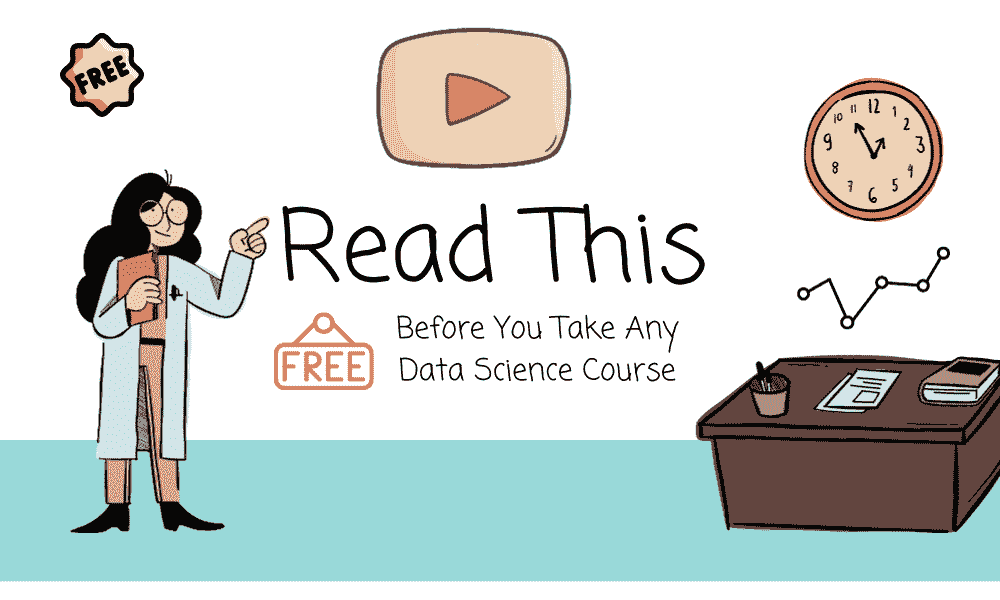

# 在参加任何免费的数据科学课程之前请阅读此信息

> 原文：[`www.kdnuggets.com/read-this-before-you-take-any-free-data-science-course`](https://www.kdnuggets.com/read-this-before-you-take-any-free-data-science-course)

图片来源：作者

在今天的数字时代，迈克尔·哈克沃特的名言“如果你没有为产品付费，那么你就是产品”从未如此相关。虽然我们通常将其与 Facebook 等社交媒体平台联系在一起，但它同样适用于看似无害的免费资源，例如 YouTube 课程。

* * *

## 我们的三大课程推荐

 1\. [Google 网络安全证书](https://www.kdnuggets.com/google-cybersecurity) - 快速进入网络安全职业生涯。

 2\. [Google 数据分析专业证书](https://www.kdnuggets.com/google-data-analytics) - 提升你的数据分析技能

 3\. [Google IT 支持专业证书](https://www.kdnuggets.com/google-itsupport) - 支持你所在的组织的 IT

* * *

当然，平台通过广告赚取收入，但你投入的时间、精力和动机呢？随着数据变得越来越有价值，仔细评估免费数据科学课程对你学习过程的潜在影响变得至关重要。

面对如此多的选择，确定哪些能真正提供价值可能令人不知所措。这就是为什么在投入任何免费资源之前，退一步考虑一些关键因素至关重要。这样，你将确保最大限度地利用你的学习体验，同时避免与免费课程相关的常见陷阱。

# 1\. 深度和定制化不足

免费课程通常提供一刀切的课程内容，这可能与您的特定学习需求或技能水平不匹配。它们可能涵盖基本概念，但缺乏全面理解或解决复杂实际问题所需的深度。有些免费课程可能具备解决实际数据问题所需的所有必要成分，但缺乏结构，导致你不知从何开始。

# 2\. 缺乏互动学习

单独学习编程语言可能是具有挑战性的，尤其是如果你来自非技术背景的话。数据科学是一个需要实践的方法的领域。免费课程通常提供有限的互动学习机会，例如实时编码会话、测验、项目或讲师反馈。这种被动学习体验可能会阻碍你有效应用概念，最终你可能会放弃学习。

# 3\. 质量和信誉问题

互联网充斥着免费的课程，这使得辨别内容的质量和可信度变得具有挑战性。有些课程可能已经过时或由专家有限的人教授（假大师）。将时间投入到不提供准确或最新信息的课程中可能会适得其反。

这里列出了一些我认为高质量的免费课程：

1.  [用 Python 编程入门](https://www.edx.org/learn/python/harvard-university-cs50-s-introduction-to-programming-with-python?irclickid=zzjUuezqoxyPUIQXCo0XOVbQUkH22K1TgU1hW40&utm_source=affiliate&utm_medium=admitad%20GmbH.&utm_campaign=edX%20Tracking%20Link_&utm_content=TEXT_LINK&irgwc=1) 由 HarvardX 提供

1.  [用 R 进行统计学习](https://www.edx.org/learn/statistics/stanford-university-statistical-learning?irclickid=zzjUuezqoxyPUIQXCo0XOVbQUkH22Ky6gU1hW40&utm_source=affiliate&utm_medium=admitad%20GmbH.&utm_campaign=edX%20Tracking%20Link_&utm_content=TEXT_LINK&irgwc=1) 由 StanfordOnline 提供

1.  [数据科学入门](https://github.com/microsoft/Data-Science-For-Beginners) 由 Microsoft 提供

1.  [数据库与 SQL](https://www.youtube.com/watch?v=HXV3zeQKqGY) 由 freeCodeCamp 提供

1.  [机器学习 Zoomcamp](https://github.com/DataTalksClub/machine-learning-zoomcamp) 由 DataTalks.Club 提供

# 4\. 动机与承诺

与付费课程不同，免费的资源没有外部的责任措施，如截止日期或成绩，这使得很容易失去动力而中途放弃课程。缺乏财务承诺意味着学生必须完全依赖内部驱动和自律来保持动力并坚持完成课程。大学就是一个很好的例子。学生在考虑退学时会经过反复思考，因为涉及到成本。大多数学生完成本科课程，因为他们已经申请了学生贷款，需要偿还。

# 5\. 错失网络机会

网络建设是数据科学职业发展的重要部分。免费的课程通常缺乏付费课程中常见的社区支持，如同行互动、导师指导或校友网络，这些对于职业成长和机会至关重要。虽然有 Slack 和 Discord 群组，但它们通常是由社区驱动的，可能会处于不活跃状态。然而，在付费课程中，有专门的版主和社区经理负责促进学生之间的网络建设。

# 6\. 缺乏职业服务

付费课程通常提供职业服务，如简历评审、认证、就业安置援助和面试准备。这些服务对于那些过渡到数据科学角色的人来说是必不可少的，但在免费课程中通常不可用。在整个招聘过程中获得指导并知道如何处理技术面试问题是至关重要的。

# 7\. 认证与认可

虽然认证证书并非总是必要，但它们可以提升你的简历和信誉。免费的课程可能提供证书，但这些证书通常不如来自认证机构（如哈佛/斯坦福）或认可平台的证书那样有分量。雇主可能不会高度重视这些证书，这可能会影响你的就业前景。此外，认证考试评估工作中处理数据所需的关键技能，包括编码、数据管理、数据分析、报告和展示能力。

# 结论

尽管免费的数据科学课程可以作为初学或巩固技能的宝贵资源，但它们存在一定的局限性。重要的是要将这些局限性与个人目标、学习风格、经济状况和职业抱负相对照。为了确保全面有效的学习体验，你应该考虑用其他学习方式或投资付费培训班来补充这些免费资源。

最终，帮助你成为专业数据科学家的最关键因素是你的奉献精神和专注于实现目标。无论你花多少钱在课程上，如果缺乏所需的驱动力，你将学不到任何东西。因此，在你深入数据领域之前，请三思是否这是适合你的道路。

****[Abid Ali Awan](https://www.polywork.com/kingabzpro)**** ([@1abidaliawan](https://www.linkedin.com/in/1abidaliawan)) 是一位认证的数据科学专业人士，他喜欢构建机器学习模型。目前，他专注于内容创作，并撰写关于机器学习和数据科学技术的技术博客。Abid 拥有技术管理硕士学位和电信工程学士学位。他的愿景是使用图神经网络为面临心理健康问题的学生开发一个 AI 产品。

### 相关主题

+   [NExT-GPT 介绍：任意到任意的多模态大语言模型](https://www.kdnuggets.com/introduction-to-nextgpt-anytoany-multimodal-large-language-model)

+   [谷歌推荐你在参加他们的机器学习课程之前做的事](https://www.kdnuggets.com/2021/10/google-recommends-before-machine-learning-data-science-course.html)

+   [在转行到数据科学之前请先阅读此文](https://www.kdnuggets.com/read-this-before-making-a-career-switch-to-data-science)

+   [9 个专业证书可以让你获得学位……如果……](https://www.kdnuggets.com/9-professional-certificates-that-can-take-you-onto-a-degree-if-you-really-want-to)

+   [5 门免费的 AI 和 ChatGPT 课程助你从 0 到 100](https://www.kdnuggets.com/5-free-courses-on-ai-and-chatgpt-to-take-you-from-0-100)

+   [你在学习 Transformers 之前应该了解的概念](https://www.kdnuggets.com/2023/01/concepts-know-getting-transformer.html)
