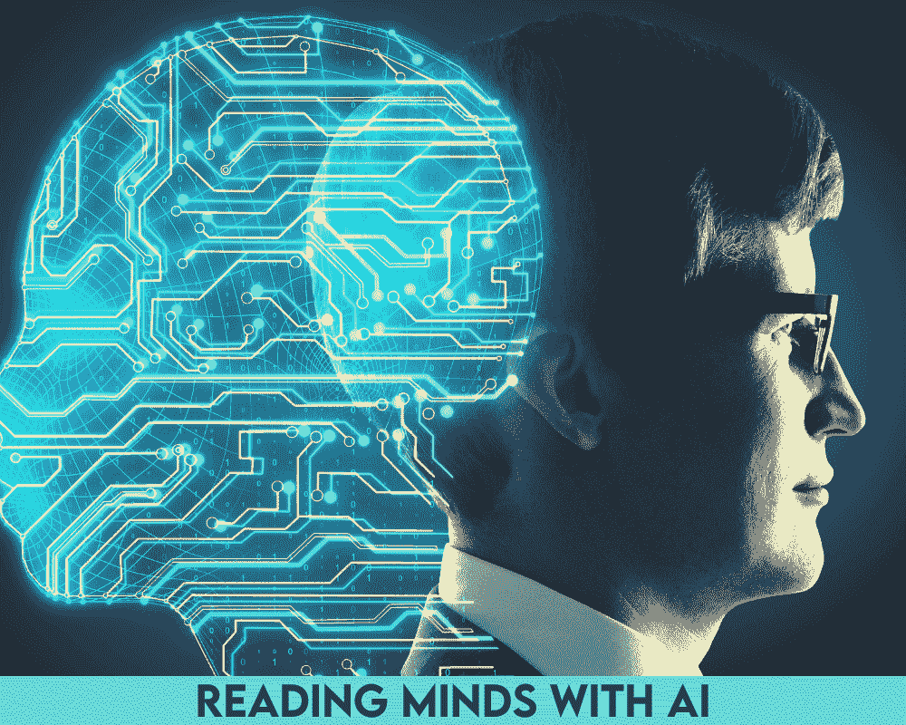
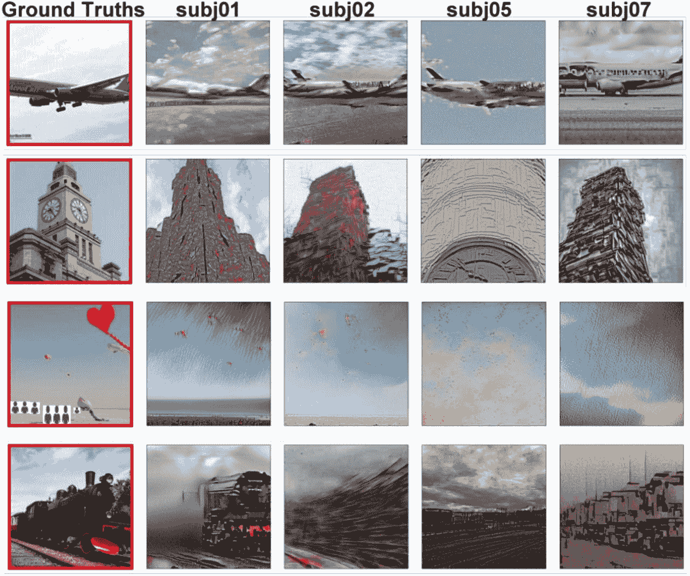

# 阅读思维与人工智能：研究人员将脑电波转换为图像

> 原文：[`www.kdnuggets.com/2023/03/reading-minds-ai-researchers-translate-brain-waves-images.html`](https://www.kdnuggets.com/2023/03/reading-minds-ai-researchers-translate-brain-waves-images.html)

图片由编辑提供

# 介绍

* * *

## 我们的前三大课程推荐

 1\. [谷歌网络安全证书](https://www.kdnuggets.com/google-cybersecurity) - 快速进入网络安全职业生涯。

 2\. [谷歌数据分析专业证书](https://www.kdnuggets.com/google-data-analytics) - 提升你的数据分析技能

 3\. [谷歌 IT 支持专业证书](https://www.kdnuggets.com/google-itsupport) - 支持你的组织的 IT 需求

* * *

想象一下重新体验你的记忆或构建某人正在思考的图像。这听起来像是科幻电影中的情节，但随着计算机视觉和深度学习的最新进展，它正变成现实。尽管神经科学家仍在努力真正揭示人脑如何将我们眼睛所见转化为心理图像，但人工智能似乎在这方面越来越有能力。来自大阪大学前沿生物科学研究生院的两位研究人员提出了一种新方法，使用名为稳定扩散的 LDM，准确地重建了通过功能磁共振成像（fMRI）获得的人脑活动图像。虽然由[Yu Takagi](https://yu-takagi.github.io/)和[Shinji Nishimotois](https://cinet.jp/english/people/20141086/)撰写的论文“[通过潜在扩散模型从人脑活动中高分辨率重建图像](https://www.biorxiv.org/content/10.1101/2022.11.18.517004v2.full)”尚未经过同行评审，但由于结果令人震惊的准确，它在互联网上引起了轰动。

这项技术有可能彻底改变心理学、神经科学，甚至刑事司法系统等领域。想象一下，一个嫌疑人被询问他在谋杀发生时在哪里，他回答说他在家。但重建的图像却显示他在犯罪现场。相当有趣，对吧？那么它到底是如何工作的呢？让我们深入研究这篇论文、其局限性以及未来的前景。

# 它是如何工作的？

研究人员使用了由明尼苏达大学提供的[自然场景数据集 (NSD)](http://naturalscenesdataset.org/)。该数据集包含了四名受试者查看的 10,000 张不同图像的 fMRI 扫描数据。所有四名受试者查看的 982 张图像的子集被用作测试数据集。在这个过程中训练了两个不同的 AI 模型。一个用于将大脑活动与 fMRI 图像关联，而另一个则用于将其与受试者查看的图像的文字描述关联。这些模型结合起来，使 Stable Diffusion 能够将 fMRI 数据转化为相对准确的图像模仿，其准确率达到近 80%。

[原始图像（左）和所有四名受试者生成的 AI 图像](https://www.biorxiv.org/content/10.1101/2022.11.18.517004v2.full)

第一个模型能够有效地再现图像的布局和视角。但该模型在处理特定物体如钟楼时遇到了困难，并且生成了抽象且模糊的图像。研究人员并没有使用大型数据集来预测更多细节，而是使用了第二个 AI 模型，将图像标题中的关键词与 fMRI 扫描关联起来。例如，如果训练数据中有一张钟楼的照片，那么系统就会将大脑活动的模式与该物体关联起来。在测试阶段，如果被试者表现出类似的大脑模式，那么系统会将物体的关键词输入到 Stable Diffusion 的正常文本到图像生成器中，从而产生对真实图像的逼真模仿。

（最左侧）研究参与者看到的照片，（第二）仅使用大脑活动模式的布局和视角，（第三）仅使用文字信息的图像，（最右侧）结合文字信息和大脑活动模式来重新创建[照片](https://www.biorxiv.org/content/10.1101/2022.11.18.517004v2.full)中的物体

在这篇论文中，研究人员还声称这是首次从神经科学的角度定量解释 LDM（Stable Diffusion）的每个组件。他们通过将特定组件映射到大脑的不同区域来实现这一点。尽管所提出的模型仍处于初期阶段，但人们对这篇论文的反应迅速，并将该模型称为下一个思维阅读器。

# 局限性和未来展望

尽管这个模型的准确性相当令人印象深刻，但它是在提供训练脑部扫描的人的脑部扫描上进行测试的。使用相同的数据进行训练和测试集可能会导致过拟合。然而，我们不应忽视这篇论文，因为这类出版物吸引了研究人员，我们开始看到相关论文的逐步改进。

考虑到计算机视觉领域的进步，这篇论文让我思考：**我们是否很快能够重温我们的梦想？** 这既令人兴奋又令人害怕。虽然相当引人入胜，但它引发了有关隐私侵犯的一些伦理问题。此外，要真正创造出梦境的主观体验还有很长的路要走。这个模型尚不适合日常使用，但我们离理解大脑的运作越来越近。这项技术还可能在医疗领域带来巨大的进展，特别是对于那些有沟通障碍的人。

# 结论

如果所提模型的改进成为现实，这可能是**下一个突破**的人工智能领域。但在广泛实施任何技术之前，必须权衡其利弊。希望你喜欢阅读这篇文章，我很想听听你对这篇惊人研究论文的看法。

**[Kanwal Mehreen](https://www.linkedin.com/in/kanwal-mehreen1)** 是一位有抱负的软件开发人员，对数据科学和人工智能在医学中的应用充满兴趣。Kanwal 被选为 2022 年 APAC 地区的 Google Generation Scholar。Kanwal 喜欢通过撰写关于趋势话题的文章分享技术知识，并热衷于改善女性在技术行业中的代表性。

### 更多相关话题

+   [快速指南：如何找到合适的人进行注释](https://www.kdnuggets.com/2022/04/quick-guide-find-right-minds-annotation.html)

+   [如何使用 MarianMT 和 Hugging Face Transformers 翻译语言](https://www.kdnuggets.com/how-to-translate-languages-with-marianmt-and-hugging-face-transformers)

+   [逐步指南：阅读和理解 SQL 查询](https://www.kdnuggets.com/a-step-by-step-guide-to-reading-and-understanding-sql-queries)

+   [2024 年阅读清单：5 本人工智能必读书籍](https://www.kdnuggets.com/2024-reading-list-5-essential-reads-on-artificial-intelligence)

+   [机器学习不像你的大脑 第一部分：神经元速度慢,…](https://www.kdnuggets.com/2022/04/machine-learning-like-brain-part-one-neurons-slow-slow-slow.html)

+   [如何获得机器学习工作：来自 Meta、Google Brain 和 SAP 工程师的建议](https://www.kdnuggets.com/2022/08/corise-land-ml-job-advice-engineers-meta-google-brain-sap.html)
