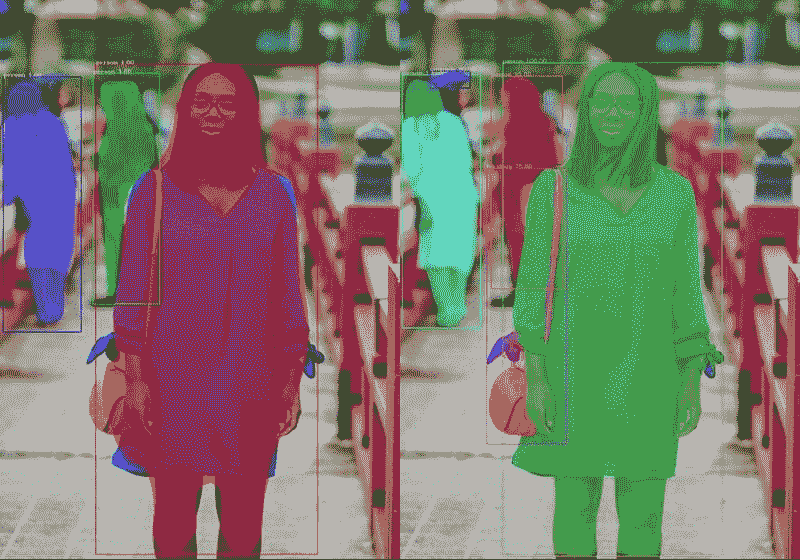

# 实时图像分割使用 5 行代码

> 原文：[`www.kdnuggets.com/2021/10/real-time-image-segmentation-5-lines-code.html`](https://www.kdnuggets.com/2021/10/real-time-image-segmentation-5-lines-code.html)

评论

**作者 [Ayoola Olafenwa](https://www.linkedin.com/in/ayoola-olafenwa-003b901a9/)，机器学习工程师**

### **对实时图像分割应用的需求**

* * *

## 我们的前 3 个课程推荐

 1\. [谷歌网络安全证书](https://www.kdnuggets.com/google-cybersecurity) - 快速进入网络安全职业生涯。

 2\. [谷歌数据分析专业证书](https://www.kdnuggets.com/google-data-analytics) - 提升你的数据分析技能

 3\. [谷歌 IT 支持专业证书](https://www.kdnuggets.com/google-itsupport) - 支持你的组织的 IT 需求

* * *

图像分割是计算机视觉的一个方面，涉及将计算机视觉化的对象内容分割成不同类别以便更好地分析。图像分割在解决许多计算机视觉问题中，例如医疗图像分析、背景编辑、自动驾驶汽车视觉和卫星图像分析方面做出了重要贡献，使其成为计算机视觉中的一个宝贵领域。计算机视觉领域的一大挑战是保持实时应用中准确性和速度性能之间的平衡。在计算机视觉领域，有这样一个困境，即计算机视觉解决方案要么更准确但较慢，要么不那么准确但较快。

PixelLib 库是一个旨在通过少量 Python 代码实现图像和视频中对象分割的库。PixelLib 的早期版本使用 Tensorflow 深度学习作为其后端，利用 Mask R-CNN 执行实例分割。Mask R-CNN 是一个优秀的对象分割架构，但在实时应用中无法平衡准确性和速度性能。PixelLib 提供对 PyTorch 后端的支持，利用 ***PointRend*** 分割架构实现更快、更准确的图像和视频中对象的分割和提取。

***PointRend*** 由 [Alexander Kirillov et al](https://arxiv.org/abs/1912.08193) 提供，用于替代 Mask R-CNN 执行对象实例分割。***PointRend*** 是一种优秀的最先进神经网络，用于实现对象分割。它生成准确的分割掩码，并以高推理速度运行，满足对准确和实时计算机视觉应用的日益增长的需求。我将 PixelLib 与 Detectron2 的 PointRend Python 实现集成，Detectron2 仅支持 Linux 操作系统。我对原始的 Detectron2 PointRend 实现进行了修改，以支持 Windows 操作系统。PixelLib 支持的 PointRend 实现支持 Linux 和 Windows 操作系统。

**注意：** 本文基于使用 PyTorch 和 ***PointRend*** 进行实例分割。如果你想学习如何使用 Tensorflow 和 Mask R-CNN 进行实例分割，请阅读这篇 [文章](https://towardsdatascience.com/image-segmentation-with-six-lines-0f-code-acb870a462e8)。


[原始图像来源](https://unsplash.com/photos/6UWqw25wfLI)（左：MASK R-CNN，右：PointRend）



[原始图像来源](https://unsplash.com/photos/rrI02QQ9GSQ)（左：MASK R-CNN，右：PointRend）

被标记为 **PointRend** 的图像显然比 **Mask R-CNN** 的分割结果更好。

### 下载与安装

**下载 Python**

PixelLib PyTorch 支持 Python 3.7 及以上版本。下载兼容的 [Python 版本](https://www.python.org/)。

**安装 PixelLib 及其依赖项**

**安装 PyTorch**

PixelLib PyTorch 版本支持以下 PyTorch 版本（***1.6.0,1.7.1,1.8.0*** 和 ***1.90***）。不支持 PyTorch ***1.7.0***，且不使用任何低于 1.6.0 的 PyTorch 版本。安装兼容的 [PyTorch 版本](https://PyTorch.org/)。

**安装 Pycocotools**

```py
pip3 install pycocotools
```

**安装 PixelLib**

```py
pip3 install pixellib
```

**如果已安装，请使用以下命令升级到最新版本：**

```py
pip3 install pixellib -upgrade
```

### **图像分割**

PixelLib 使用五行 Python 代码通过 PointRend 模型对图像和视频进行对象分割。下载 [PointRend 模型](https://github.com/ayoolaolafenwa/PixelLib/releases/download/0.2.0/pointrend_resnet50.pkl)。这是图像分割的代码。

```py
import pixellib
from pixellib.torchbackend.instance import instanceSegmentation

ins = instanceSegmentation()
ins.load_model("pointrend_resnet50.pkl")
ins.segmentImage("image.jpg", show_bboxes=True, output_image_name="output_image.jpg")
```

**第 1-4 行：** 引入了 PixelLib 包，同时也从模块 ***pixellib.torchbackend.instance*** 中引入了类 ***instanceSegmentation***（从 PyTorch 支持中引入实例分割类）。我们创建了这个类的实例，并最终加载了我们下载的 ***PointRend*** 模型。

**第 5 行：** 我们调用了函数 ***segmentImage*** 来对图像中的对象进行分割，并向函数添加了以下参数：

+   ***Image_path：*** 这是待分割图像的路径。

+   ***Show_bbox：*** 这是一个可选参数，用于显示带有边界框的分割结果。

+   ***Output_image_name:*** 这是保存的分割图像的名称。

**分割样本图像**


[原始图像来源](https://commons.wikimedia.org/wiki/File:Carspotters.jpg)

```py
ins.segmentImage("image.jpg", show_bboxes = True, output_image_name="output.jpg")
```

**分割后的图像**


```py
The checkpoint state_dict contains keys that are not used by the model:
proposal_generator.anchor_generator.cell_anchors.{0, 1, 2, 3, 4}

```

如果你正在运行分割代码，上述日志可能会出现。这不是错误，代码将正常运行。

```py
results, output = ins.segmentImage("image.jpg", show_bboxes=True, output_image_name="result.jpg")
print(results)
```

分割结果返回一个字典，字典中的值与图像中分割出的物体相关。打印的结果将如下格式：

```py
{'boxes':  array([[ 579,  462, 1105,  704],
       [   1,  486,  321,  734],
       [ 321,  371,  423,  742],
       [ 436,  369,  565,  788],
       [ 191,  397,  270,  532],
       [1138,  357, 1197,  482],
       [ 877,  382,  969,  477],),
'class_ids': array([ 2,  2,  0,  0,  0,  0,  0,  2,  0,  0,  0,  0,  2, 24, 24,2,  2,2,  0,  0,  0,  0,  0,  0], dtype=int64), 
'class_names': ['car', 'car', 'person', 'person', 'person', 'person', 'person', 'car', 'person', 'person', 'person', 'person', 'car', 'backpack', 'backpack', 'car', 'car', 'car', 'person', 'person', 'person', 'person', 'person', 'person'],
 'object_counts': Counter({'person': 15, 'car': 7, 'backpack': 2}), 
'scores': array([100., 100., 100., 100.,  99.,  99.,  98.,  98.,  97.,  96.,  95.,95.,  95.,  95.,  94.,  94.,  93.,  91.,  90.,  88.,  82.,  72.,69.,  66.], dtype=float32), 
'masks': array([[[False, False, False, ..., False, False, False],
[False, False, False, ..., False, False, False],
'extracted_objects': []
```

**检测阈值**

PixelLib 使得可以确定物体分割的检测阈值。

```py
ins.load_model("pointrend_resnet50.pkl", confidence = 0.3)
```

**confidence:** 这是在***load_model***函数中引入的新参数，设置为***0.3***，以***30%***为检测阈值。我设置的默认检测阈值为***0.5***，可以通过***confidence***参数进行调整。

**速度记录**

PixelLib 使得可以进行实时物体分割，并添加了调整推理速度以适应实时预测的功能。使用 4GB 容量的 Nvidia GPU 处理单张图像的默认推理速度约为***0.26 秒***。

**速度调整**

PixelLib 支持速度调整，有两种速度调整模式，分别是***fast***和***rapid***模式：

**1\. 快速模式**

```py
ins.load_model("pointrend_resnet50.pkl", detection_speed = "fast")
```

在***load_model***函数中，我们添加了参数***detection_speed***并将其值设置为***fast***。快速模式处理单张图像的时间为***0.20 秒***。

**快速模式检测的完整代码**

```py
import pixellib
from pixellib.torchbackend.instance import instanceSegmentation

ins = instanceSegmentation()
ins.load_model("pointrend_resnet50.pkl", detection_speed = "fast")
ins.segmentImage("image.jpg", show_bboxes=True, output_image_name="output_image.jpg")
```

**2\. 迅速模式**

```py
ins.load_model("pointrend_resnet50.pkl", detection_speed = "rapid")
```

在***load_model***函数中，我们添加了参数***detection_speed***并将其值设置为***rapid***。**迅速**模式处理单张图像的时间为***0.15 秒***。

**快速模式检测的完整代码**

```py
import pixellib
from pixellib.torchbackend.instance import instanceSegmentation

ins = instanceSegmentation()
ins.load_model("pointrend_resnet50.pkl", detection_speed = "rapid")
ins.segmentImage("image.jpg", show_bboxes=True, output_image_name="output_image.jpg")
```

### **PointRend 模型**

有两种类型的 PointRend 模型用于物体分割，它们分别是***resnet50 变体***和***resnet101 变体***。在本文中使用的是***resnet50 变体***，因为它速度较快且准确性良好。***resnet101 变体***更准确，但比***resnet50 变体***慢。根据 [官方报告](https://github.com/facebookresearch/detectron2/tree/main/projects/PointRend)上的信息，***resnet50 变体***在 COCO 上达到***38.3 mAP***，而***resnet101 变体***在 COCO 上达到***40.1 mAP***。

**Resnet101 的速度记录：** 分割的默认速度为***0.5 秒***，快速模式为***0.3 秒***，而迅速模式为***0.25 秒***。

**Resnet101 变体的代码**

```py
import pixellib
from pixellib.torchbackend.instance import instanceSegmentation

ins = instanceSegmentation()
ins.load_model("pointrend_resnet101.pkl", network_backbone="resnet101")
ins.segmentImage("sample.jpg",  show_bboxes = True, output_image_name="output.jpg")
```

使用 resnet101 模型进行推理的代码相同，只不过我们在***load_model***函数中加载了***PointRend resnet101 模型***。从[这里](https://github.com/ayoolaolafenwa/PixelLib/releases/download/0.2.0/pointrend_resnet101.pkl)下载 resnet101 模型。我们在***load_model***函数中添加了一个额外的参数***network_backbone***，并将其值设置为***resnet101***。

**注意：** 如果你想要实现高推理速度和良好的准确性，使用**PointRend** ***resnet50 变体***，但如果你更关注准确性，使用**PointRend** ***resnet101 变体***。所有这些推理报告均基于使用 4GB 容量的 Nvidia GPU。

**图像分割中的自定义对象检测**

使用的 PointRend 模型是一个预训练的 COCO 模型，支持 80 种对象类别。PixelLib 支持自定义对象检测，使得过滤检测结果和确保目标对象的分割成为可能。我们可以从支持的 80 个对象类别中选择，以匹配我们的目标。这是 80 个支持的对象类别：

```py
person, bicycle, car, motorcycle, airplane,
bus, train, truck, boat, traffic_light, fire_hydrant, stop_sign,
parking_meter, bench, bird, cat, dog, horse, sheep, cow, elephant, bear, zebra,
giraffe, backpack, umbrella, handbag, tie, suitcase, frisbee, skis, snowboard,
sports_ball, kite, baseball_bat, baseball_glove, skateboard, surfboard, tennis_racket,
bottle, wine_glass, cup, fork, knife, spoon, bowl, banana, apple, sandwich, orange,
broccoli, carrot, hot_dog, pizza, donut, cake, chair, couch, potted_plant, bed,
dining_table, toilet, tv, laptop, mouse, remote, keyboard, cell_phone, microwave,
oven, toaster, sink, refrigerator, book, clock, vase, scissors, teddy_bear, hair_dryer,
toothbrush.
```

**目标类别分割的代码**

```py
import pixellib
from pixellib.torchbackend.instance import instanceSegmentation

ins = instanceSegmentation()
ins.load_model("pointrend_resnet50.pkl")
target_classes = ins.select_target_classes(person = True)
ins.segmentImage("image.jpg", show_bboxes=True, segment_target_classes = target_classes, output_image_name="output_image.jpg")
```

调用了函数***select_target_classes***以选择需要分割的目标对象。函数***segmentImage***增加了一个新参数***segment_target_classes***，以从目标类别中选择并根据这些类别过滤检测结果。我们过滤检测结果，仅检测图像中的人。


### **图像中的对象提取**

PixelLib 使得提取和分析图像中分割出的对象成为可能。

**对象提取的代码**

```py
import pixellib
from pixellib.torchbackend.instance import instanceSegmentation

ins = instanceSegmentation()
ins.load_model("pointrend_resnet50.pkl")
ins.segmentImage("image.jpg", show_bboxes=True, extract_segmented_objects=True,
save_extracted_objects=True, output_image_name="output_image.jpg" )
```

图像分割的代码相同，只是我们增加了额外的参数***extract_segmented_objects***和***save_extracted_objects***，分别用于提取分割对象和保存提取出的对象。每个分割出的对象将保存为***segmented_object_index***，例如***segmented_object_1***。对象将按提取顺序保存。

```py
segmented_object_1.jpg
segmented_object_2.jpg
segmented_object_3.jpg
segmented_object_4.jpg
segmented_object_5.jpg
segmented_object_6.jpg
```


注意：图像中的所有对象都被提取了，我选择只显示其中的三个。

**从边界框坐标中提取对象**

```py
import pixellib
from pixellib.torchbackend.instance import instanceSegmentation

ins = instanceSegmentation()
ins.load_model("pointrend_resnet50.pkl")
ins.segmentImage("image.jpg", show_bboxes=True, extract_segmented_objects=True, extract_from_box = True,
save_extracted_objects=True, output_image_name="output_image.jpg" )
```

我们引入了一个新参数***extract_from_box***，用于从其边界框坐标中提取分割出的对象。每个提取出的对象将保存为***object_extract_index***，例如***object_extract_1***。对象将按提取顺序保存。


从边界框坐标提取

**图像分割输出可视化**

PixelLib 使得可以根据图像分辨率调节图像的可视化。

```py
ins.segmentImage("sample.jpg", show_bboxes=True, output_image_name= "output.jpg")
```


[原始图片来源](https://unsplash.com/photos/UiVe5QvOhao)

可视化效果未能显示，因为***文本大小***和***框厚度***太细。我们可以调整***文本大小***、***文本厚度***和***框厚度***来调整可视化效果。

**更好的可视化修改**。

```py
ins.segmentImage(“sample.jpg”, show_bboxes=True, text_size=5, text_thickness=4, box_thickness=10, output_image_name=”output.jpg”)
```

segmentImage 函数接受了新的参数，用于调整文本和边界框的厚度。

+   ***text_size:*** 默认文本大小为***0.6***，适用于分辨率适中的图像。对于高分辨率图像则显得过小。我将其增加到了 5。

+   ***text_thickness:*** 默认文本厚度为 1。我将其增加到 4，以匹配图像分辨率。

+   ***box_thickness:*** 默认框厚度为 2，我将其更改为 10，以匹配图像分辨率。

**改进可视化的输出图像**


**注意：** 根据图像的分辨率调整参数。我为分辨率为***5760 x 3840***的示例图像使用的值可能对分辨率较低的图像来说过大。如果您的图像分辨率非常高，可以将参数值增加到超过我在此示例代码中设置的值。***text_thickness*** 和 ***box_thickness*** 参数值必须为整数，不能用浮点数表示。***text_size*** 值可以用整数或浮点数表示。

我们在这篇文章中详细讨论了如何执行准确且快速的图像分割和对象提取。我们还描述了 PixelLib 的升级，通过 PointRend，使库能够满足计算机视觉中对精度和速度性能平衡的日益增长的需求。

**注意：** [阅读完整教程](https://towardsdatascience.com/real-time-image-segmentation-using-5-lines-of-code-7c480abdb835)，其中包括如何使用 PixelLib 对一批图像、视频和实时摄像头视频进行对象分割。

**简历：[Ayoola Olafenwa](https://www.linkedin.com/in/ayoola-olafenwa-003b901a9/)** 是一位自学编程的程序员、技术作家和深度学习从业者。Ayoola 开发了两个开源计算机视觉项目，被全球许多开发者使用，目前担任 DeepQuest AI 的机器学习工程师，负责在云端构建和部署机器学习应用。Ayoola 的专业领域是计算机视觉和机器学习。她有使用深度学习库如 PyTorch 和 Tensorflow 来构建和部署机器学习模型的经验，并在云计算平台如 Azure 上使用 Docker、Pulumi 和 Kubernetes 等 DevOp 工具进行生产部署。Ayoola 还在使用高效框架如 PyTorchMobile、TensorflowLite 和 ONNX Runtime 将机器学习模型部署到边缘设备如 Nvidia Jetson Nano 和 Raspberry PI 上。

**相关：**

+   使用 5 行代码提取图像和视频中的对象

+   使用 5 行代码更改任何图像的背景

+   使用 5 行代码更改任何视频的背景

### 更多相关话题

+   [少于 15 行代码实现多模态深度学习](https://www.kdnuggets.com/2023/01/predibase-multi-modal-deep-learning-less-15-lines-code.html)

+   [如何使用图数据库构建实时推荐引擎](https://www.kdnuggets.com/2023/08/build-realtime-recommendation-engine-graph-databases.html)

+   [Segment Anything Model：图像分割的基础模型](https://www.kdnuggets.com/2023/07/segment-anything-model-foundation-model-image-segmentation.html)

+   [实时 AI 和机器学习的特征存储](https://www.kdnuggets.com/2022/03/feature-stores-realtime-ai-machine-learning.html)

+   [使用 AI 实现实时翻译](https://www.kdnuggets.com/2022/07/realtime-translations-ai.html)

+   [大数据如何实时拯救生命：IoV 数据分析帮助…](https://www.kdnuggets.com/how-big-data-is-saving-lives-in-real-time-iov-data-analytics-helps-prevent-accidents)
