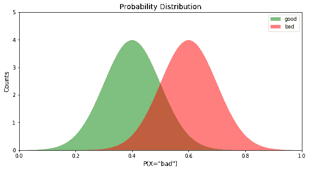
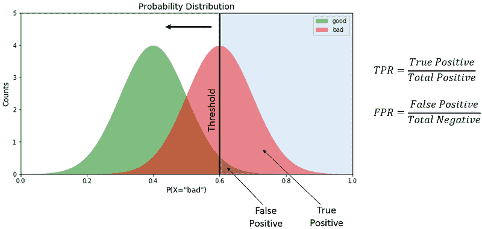
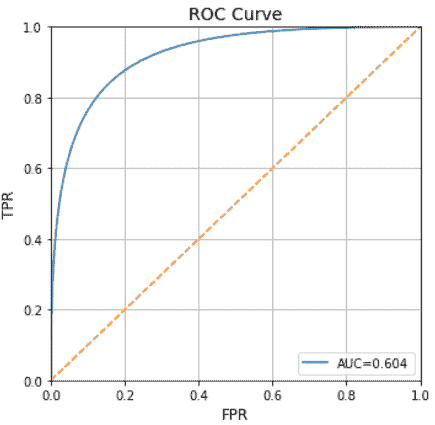
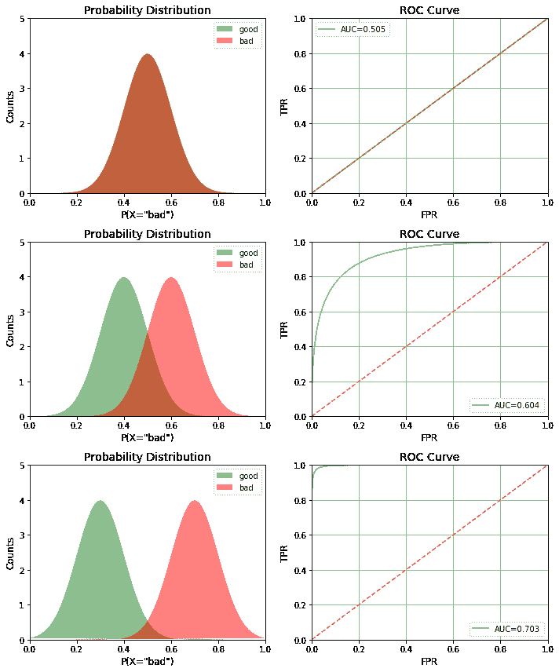

# 接收器操作特性曲线揭秘（使用 Python）

> 原文：[`www.kdnuggets.com/2018/07/receiver-operating-characteristic-curves-demystified-python.html`](https://www.kdnuggets.com/2018/07/receiver-operating-characteristic-curves-demystified-python.html)

 评论

**由 [Syed Sadat Nazrul](https://www.linkedin.com/in/snazrul1/) 统计科学家**


* * *

## 我们的前三个课程推荐

 1\. [谷歌网络安全证书](https://www.kdnuggets.com/google-cybersecurity) - 快速进入网络安全职业生涯。

 2\. [谷歌数据分析专业证书](https://www.kdnuggets.com/google-data-analytics) - 提升你的数据分析技能

 3\. [谷歌 IT 支持专业证书](https://www.kdnuggets.com/google-itsupport) - 支持你的组织的 IT 需求

* * *

在数据科学中，评估模型性能非常重要，而最常用的性能指标是分类得分。然而，当处理具有严重类别不平衡的欺诈数据集时，分类得分并没有太大意义。相反，接收器操作特性曲线（ROC 曲线）提供了一个更好的替代方案。ROC 是信号（真正率）与噪声（假正率）的图示。模型性能通过查看 ROC 曲线下的面积（或 AUC）来确定。最佳的 AUC 值是 1，而最差的是 0.5（45 度随机线）。任何低于 0.5 的值意味着我们可以简单地执行与模型推荐完全相反的操作，以将值恢复到 0.5 以上。

虽然 ROC 曲线很常见，但市面上并没有很多讲解如何计算或推导的教学资源。在这篇博客中，我将逐步揭示如何使用 Python 绘制 ROC 曲线。之后，我将解释基本 ROC 曲线的特点。

### 类别的概率分布

首先，假设我们的假设模型生成了一些用于预测每个记录类别的概率。与大多数二元欺诈模型一样，假设我们的类别是“好”和“坏”，模型生成了 P(X=‘坏’) 的概率。为了创建这个概率分布，我们绘制了一个高斯分布，每个类别具有不同的均值。有关高斯分布的更多信息，请阅读 [这篇博客](https://towardsdatascience.com/understanding-the-68-95-99-7-rule-for-a-normal-distribution-b7b7cbf760c2)。

```py

import numpy as np
import matplotlib.pyplot as plt
def pdf(x, std, mean):
    cons = 1.0 / np.sqrt(2*np.pi*(std**2))
    pdf_normal_dist = const*np.exp(-((x-mean)**2)/(2.0*(std**2)))
    return pdf_normal_dist
x = np.linspace(0, 1, num=100)
good_pdf = pdf(x,0.1,0.4)
bad_pdf = pdf(x,0.1,0.6)
```

现在我们有了分布，让我们创建一个函数来绘制这些分布。

```py
def plot_pdf(good_pdf, bad_pdf, ax):
    ax.fill(x, good_pdf, "g", alpha=0.5)
    ax.fill(x, bad_pdf,"r", alpha=0.5)
    ax.set_xlim([0,1])
    ax.set_ylim([0,5])
    ax.set_title("Probability Distribution", fontsize=14)
    ax.set_ylabel('Counts', fontsize=12)
    ax.set_xlabel('P(X="bad")', fontsize=12)
    ax.legend(["good","bad"])
```

现在让我们使用这个 **plot_pdf** 函数来生成图表：

```py
fig, ax = plt.subplots(1,1, figsize=(10,5))
plot_pdf(good, bad, ax)
```



现在我们有了二元类别的概率分布，我们可以使用这个分布来推导 ROC 曲线。

### 导出 ROC 曲线

为了从概率分布中导出 ROC 曲线，我们需要计算真正正例率 (TPR) 和假正例率 (FPR)。以一个简单的例子为例，假设阈值为 P(X=‘坏’)=0.6。



真正的正例是阈值右侧标记为“坏”的区域。假正例是阈值右侧标记为“好”的区域。总正例是“坏”曲线下方的总面积，而总负例是“好”曲线下方的总面积。我们按照图示的方法进行划分，以得出 TPR 和 FPR。我们通过不同的阈值得出 TPR 和 FPR 以获取 ROC 曲线。利用这些知识，我们创建了 ROC 绘图函数：

```py
def plot_roc(good_pdf, bad_pdf, ax):
    #Total
    total_bad = np.sum(bad_pdf)
    total_good = np.sum(good_pdf)
    #Cumulative sum
    cum_TP = 0
    cum_FP = 0
    #TPR and FPR list initialization
    TPR_list=[]
    FPR_list=[]
    #Iteratre through all values of x
    for i in range(len(x)):
        #We are only interested in non-zero values of bad
        if bad_pdf[i]>0:
            cum_TP+=bad_pdf[len(x)-1-i]
            cum_FP+=good_pdf[len(x)-1-i]
        FPR=cum_FP/total_good
        TPR=cum_TP/total_bad
        TPR_list.append(TPR)
        FPR_list.append(FPR)
    #Calculating AUC, taking the 100 timesteps into account
    auc=np.sum(TPR_list)/100
    #Plotting final ROC curve
    ax.plot(FPR_list, TPR_list)
    ax.plot(x,x, "--")
    ax.set_xlim([0,1])
    ax.set_ylim([0,1])
    ax.set_title("ROC Curve", fontsize=14)
    ax.set_ylabel('TPR', fontsize=12)
    ax.set_xlabel('FPR', fontsize=12)
    ax.grid()
    ax.legend(["AUC=%.3f"%auc])
```

现在让我们使用这个 **plot_roc** 函数来生成图表：

```py
fig, ax = plt.subplots(1,1, figsize=(10,5))
plot_roc(good_pdf, bad_pdf, ax)
```



现在将概率分布图和 ROC 曲线并排绘制以进行视觉比较：

```py
fig, ax = plt.subplots(1,2, figsize=(10,5))
plot_pdf(good_pdf, bad_pdf, ax[0])
plot_roc(good_pdf, bad_pdf, ax[1])
plt.tight_layout()
```


### 类别分离的影响

现在我们可以导出这两个图表了，让我们看看当类分离（即模型性能）改善时 ROC 曲线如何变化。我们通过改变概率分布中高斯分布的均值来实现这一点。

```py
x = np.linspace(0, 1, num=100)
fig, ax = plt.subplots(3,2, figsize=(10,12))
means_tuples = [(0.5,0.5),(0.4,0.6),(0.3,0.7)]
i=0
for good_mean, bad_mean in means_tuples:
    good_pdf = pdf(x,0.1,good_mean)
    bad_pdf = pdf(x,0.1,bad_mean)
    plot_pdf(good_pdf, bad_pdf, ax[i,0])
    plot_roc(good_pdf, bad_pdf, ax[i,1])
    i+=1
plt.tight_layout()
```



正如你所看到的，随着我们增加类之间的分离，AUC 也在增加。

### 超越 AUC 的视角

除了 AUC，ROC 曲线还可以帮助调试模型。通过查看 ROC 曲线的形状，我们可以评估模型的误分类情况。例如，如果曲线的左下角更接近随机线，这意味着模型在 X=0 时误分类。而如果曲线在右上角是随机的，这意味着错误发生在 X=1。另一个标志是如果曲线出现尖峰（而不是平滑的），这意味着模型不稳定。

**附加信息**

+   [**数据科学面试指南**](https://towardsdatascience.com/data-science-interview-guide-4ee9f5dc778) - 数据科学是一个非常广泛且多样化的领域。因此，很难做到全能...

+   [**极端类别不平衡下的欺诈检测**](https://towardsdatascience.com/fraud-detection-under-extreme-class-imbalance-c241854e60c) - 数据科学中的一个热门领域是欺诈分析。这可能包括信用卡/借记卡欺诈、反洗钱...

**个人简介：[Syed Sadat Nazrul](https://www.linkedin.com/in/snazrul1/)** 白天使用机器学习抓捕网络和金融犯罪分子... 晚上写有趣的博客。

[原文](https://towardsdatascience.com/receiver-operating-characteristic-curves-demystified-in-python-bd531a4364d0)。经许可转载。

**相关内容：**

+   机器学习的学习曲线

+   选择合适的机器学习模型评估指标——第一部分

+   选择评估机器学习模型的正确指标 — 第二部分

### 更多相关话题

+   [通过《快速 Python 数据科学》提升你的 Python 技能！](https://www.kdnuggets.com/2022/06/manning-step-python-game-fast-python-data-science.html)

+   [优化 Python 代码性能：深入分析 Python 性能分析器](https://www.kdnuggets.com/2023/02/optimizing-python-code-performance-deep-dive-python-profilers.html)

+   [Python 枚举：如何在 Python 中构建枚举](https://www.kdnuggets.com/python-enum-how-to-build-enumerations-in-python)

+   [使用 Python 和 Scikit-learn 简化决策树解释](https://www.kdnuggets.com/2017/05/simplifying-decision-tree-interpretation-decision-rules-python.html)

+   [Python 中的稀疏矩阵表示](https://www.kdnuggets.com/2020/05/sparse-matrix-representation-python.html)

+   [数据科学、数据可视化及更多领域的 38 个顶级 Python 库](https://www.kdnuggets.com/2020/11/top-python-libraries-data-science-data-visualization-machine-learning.html)
