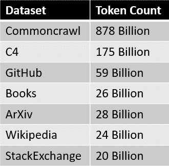
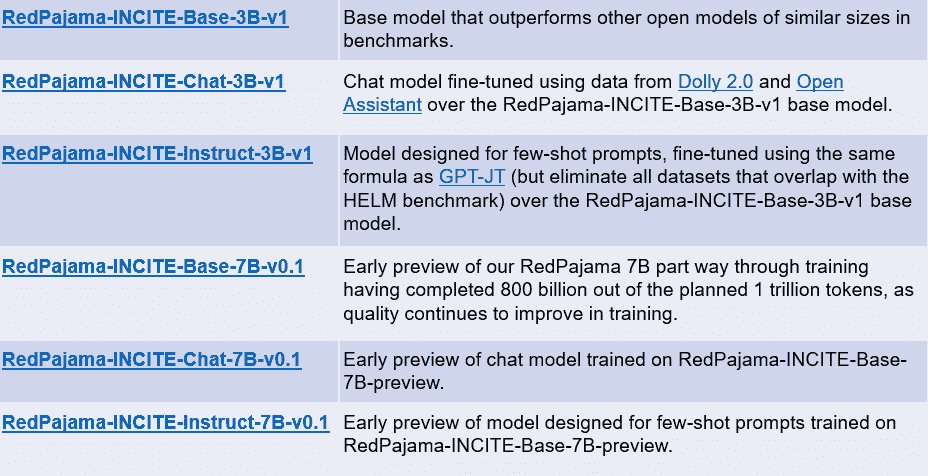

# RedPajama 项目：一个开源倡议，旨在普及 LLMs

> 原文：[`www.kdnuggets.com/2023/06/redpajama-project-opensource-initiative-democratizing-llms.html`](https://www.kdnuggets.com/2023/06/redpajama-project-opensource-initiative-democratizing-llms.html)


图片由作者提供（通过[Stable Diffusion 2.1](https://huggingface.co/stabilityai/stable-diffusion-2-1)生成）

近年来，大型语言模型或 LLM 主导了世界。随着 ChatGPT 的推出，每个人都可以受益于文本生成模型。但是，许多强大的模型仅在商业上提供，留下了许多优秀的研究和定制工作。

当然，现在有很多项目尝试完全开源许多 LLMs。[Pythia](https://github.com/EleutherAI/pythia)、[Dolly](https://github.com/databrickslabs/dolly)、[DLite](https://huggingface.co/aisquared/dlite-v2-1_5b)等项目就是一些例子。但为什么要尝试使 LLMs 开源？这是社区的共识，促使所有这些项目填补封闭模型带来的限制。然而，开源模型是否比封闭模型差？当然不是。许多模型可以与商业模型竞争，并在许多领域展现出有前景的结果。

为了跟进这一运动，RedPajama 是一个开源项目，旨在普及 LLM。这个项目是什么，它如何能够使社区受益？让我们进一步探讨一下。

# RedPajama

[RedPajama](https://github.com/togethercomputer/RedPajama-Data)是[Ontocord.ai](https://www.ontocord.ai/)、[ETH DS3Lab](https://ds3lab.inf.ethz.ch/)、[Stanford CRFM](https://crfm.stanford.edu/)和[Hazy Research](https://hazyresearch.stanford.edu/)之间的合作项目，旨在开发可重复的开源 LLMs。RedPajama 项目包含三个里程碑，包括：

1.  预训练数据

1.  基础模型

1.  指令调整数据和模型

在撰写本文时，RedPajama 项目已经开发了预训练数据和模型，包括基础版、指令版和聊天版。

## RedPajama 预训练数据

在第一步中，RedPajama 尝试复制半开源模型的[LLaMa](https://arxiv.org/abs/2302.13971)数据集。这意味着 RedPajama 尝试构建具有 1.2 万亿标记的预训练数据，并将其完全开源以供社区使用。目前，可以在[HuggingFace](https://huggingface.co/datasets/togethercomputer/RedPajama-Data-1T)下载完整数据和样本数据。

RedPajama 数据集的数据来源总结如下表所示。



在每个数据片段经过仔细预处理和过滤后，标记的数量大致与 LLaMa 论文中报告的数量相符。

数据集创建后的下一步是开发基础模型。

## RedPajama 模型

在 RedPajama 数据集创建后的几周内，第一个基于该数据集训练的模型发布了。基础模型有两个版本：一个是 30 亿参数，另一个是 70 亿参数。RedPajama 项目还发布了每个基础模型的两种变体：指令调优模型和对话模型。

每个模型的总结可以在下表中查看。



图片由作者提供（改编自 [together.xyz](https://www.together.xyz/blog/redpajama-models-v1)）

你可以通过以下链接访问上述模型：

+   [RedPajama-INCITE-Base-3B-v1](https://huggingface.co/togethercomputer/RedPajama-INCITE-Base-3B-v1)

+   [RedPajama-INCITE-Chat-3B-v1](https://huggingface.co/togethercomputer/RedPajama-INCITE-Chat-3B-v1)

+   [RedPajama-INCITE-Instruct-3B-v1](https://huggingface.co/togethercomputer/RedPajama-INCITE-Instruct-3B-v1)

+   [RedPajama-INCITE-Base-7B-v0.1](https://huggingface.co/togethercomputer/RedPajama-INCITE-Base-7B-v0.1)

+   [RedPajama-INCITE-Chat-7B-v0.1](https://huggingface.co/togethercomputer/RedPajama-INCITE-Chat-7B-v0.1)

+   [RedPajama-INCITE-Instruct-7B-v0.1](https://huggingface.co/togethercomputer/RedPajama-INCITE-Instruct-7B-v0.1)

让我们试试 RedPajama 基础模型。例如，我们将使用来自[HuggingFace](https://huggingface.co/togethercomputer/RedPajama-INCITE-Base-3B-v1)的代码尝试 RedPajama 3B 基础模型。

```py
import torch
import transformers
from transformers import AutoTokenizer, AutoModelForCausalLM

# init
tokenizer = AutoTokenizer.from_pretrained(
    "togethercomputer/RedPajama-INCITE-Base-3B-v1"
)
model = AutoModelForCausalLM.from_pretrained(
    "togethercomputer/RedPajama-INCITE-Base-3B-v1", torch_dtype=torch.bfloat16
)

# infer
prompt = "Mother Teresa is"

inputs = tokenizer(prompt, return_tensors="pt").to(model.device)
input_length = inputs.input_ids.shape[1]
outputs = model.generate(
    **inputs,
    max_new_tokens=128,
    do_sample=True,
    temperature=0.7,
    top_p=0.7,
    top_k=50,
    return_dict_in_generate=True
)

token = outputs.sequences[0, input_length:]
output_str = tokenizer.decode(token)
print(output_str)
```

```py
a Catholic saint and is known for her work with the poor and dying in Calcutta, India.
Born in Skopje, Macedonia, in 1910, she was the youngest of thirteen children. Her parents died when she was only eight years old, and she was raised by her older brother, who was a priest.
In 1928, she entered the Order of the Sisters of Loreto in Ireland. She became a teacher and then a nun, and she devoted herself to caring for the poor and sick.
She was known for her work with the poor and dying in Calcutta, India.
```

3B 基础模型的结果很有希望，如果使用 7B 基础模型可能会更好。由于开发仍在进行中，项目未来可能会有更好的模型。

# 结论

生成性 AI 正在兴起，但遗憾的是许多优秀模型仍被锁定在公司的档案中。RedPajama 是领先的项目之一，试图复制半开放的 LLaMA 模型以民主化 LLMs。通过开发类似于 LLaMA 的数据集，RedPajama 成功创建了一个开源的 1.2 万亿标记数据集，许多开源项目已经使用了该数据集。

RedPajama 还发布了两种类型的模型；3B 和 7B 参数基础模型，每个基础模型包括指令调优和对话模型。

**[Cornellius Yudha Wijaya](https://www.linkedin.com/in/cornellius-yudha-wijaya/)** 是一位数据科学助理经理和数据撰写者。在全职工作于 Allianz Indonesia 期间，他喜欢通过社交媒体和写作媒体分享 Python 和数据技巧。

* * *

## 我们的前三大课程推荐

 1\. [Google 网络安全证书](https://www.kdnuggets.com/google-cybersecurity) - 快速通道进入网络安全职业。

 2\. [Google 数据分析专业证书](https://www.kdnuggets.com/google-data-analytics) - 提升你的数据分析技能

 3\. [谷歌 IT 支持专业证书](https://www.kdnuggets.com/google-itsupport) - 支持你的组织在 IT 方面

* * *

### 更多相关话题

+   [水印如何帮助减轻 LLM 的潜在风险？](https://www.kdnuggets.com/2023/03/watermarking-help-mitigate-potential-risks-llms.html)

+   [通过 openplayground 轻松在你的笔记本电脑上探索 LLM](https://www.kdnuggets.com/2023/04/explore-llms-easily-laptop-openplayground.html)

+   [Falcon LLM：开源 LLM 的新王者](https://www.kdnuggets.com/2023/06/falcon-llm-new-king-llms.html)

+   [确保 LLM 的可靠少样本提示选择](https://www.kdnuggets.com/2023/07/ensuring-reliable-fewshot-prompt-selection-llms.html)

+   [介绍 OpenLLM：LLM 的开源库](https://www.kdnuggets.com/2023/07/introducing-openllm-open-source-library-llms.html)

+   [8 个免费的 AI 和 LLM 游乐场](https://www.kdnuggets.com/2023/05/8-free-ai-llms-playgrounds.html)
