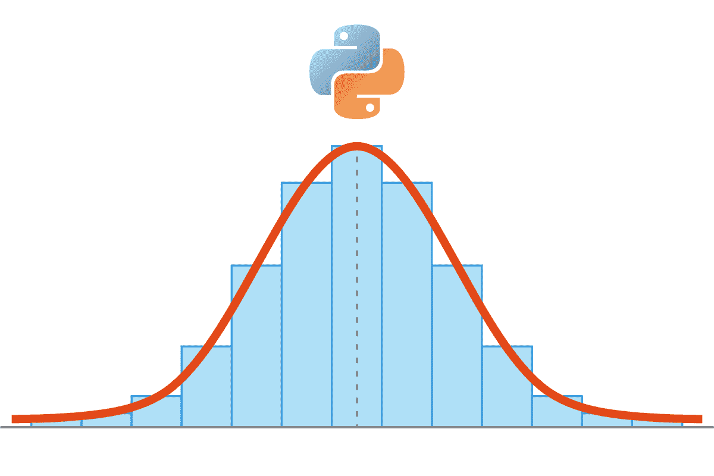

# 使用 Python 中的标准差移除离群值

> 原文：[`www.kdnuggets.com/2017/02/removing-outliers-standard-deviation-python.html`](https://www.kdnuggets.com/2017/02/removing-outliers-standard-deviation-python.html)



编辑器提供的图像

# 标准差：快速回顾

* * *

## 我们的前三个课程推荐

 1\. [谷歌网络安全证书](https://www.kdnuggets.com/google-cybersecurity) - 快速通道进入网络安全职业。

 2\. [谷歌数据分析专业证书](https://www.kdnuggets.com/google-data-analytics) - 提升你的数据分析技能

 3\. [谷歌 IT 支持专业证书](https://www.kdnuggets.com/google-itsupport) - 支持你所在组织的 IT

* * *

标准差是方差的度量，即单个数据点距离均值的程度。

例如，考虑这两个数据集：

```py
27 23 25 22 23 20 20 25 29 29
```

和

```py
12 31 31 16 28 47 9 5 40 47
```

两者的均值都是 25。然而，第一个数据集的值更接近均值，而第二个数据集的值则更分散。

更准确地说，第一个数据集的标准差为 3.13，而第二个数据集的标准差为 14.67。

然而，要理解像 3.13 或 14.67 这样的数字并不容易。现在，我们只知道第二组数据的“分散程度”比第一组更高。

让我们将其应用于更实际的使用。

# 什么是正态分布？

当我们进行分析时，我们经常遇到值围绕均值波动并且在均值上下几乎有相等结果的数据模式，例如。

+   人员身高，

+   血压值

+   测试分数

这样的值遵循正态分布。

根据 [维基百科关于正态分布的文章](https://en.wikipedia.org/wiki/Normal_distribution)，大约 68%的从正态分布中抽取的值在均值的一个标准差σ内；大约 95%的值在两个标准差内；大约 99.7%的值在三个标准差内。

这一事实被称为 68-95-99.7（经验）规则，或 3-sigma 规则。

# 使用正态分布和标准差移除离群值

当我需要清理来自数百万个生成取暖设备数据的 IoT 设备的数据时，我成功应用了这一规则。每个数据点包含某一时刻的电力使用情况。

然而，有时候设备的准确性不是 100%，可能会给出非常高或非常低的值。

我们需要移除这些离群值，因为它们使我们图表上的刻度不切实际。挑战在于这些离群值的数量从未固定。有时我们会获得所有有效的值，有时这些错误读数会占据多达 10%的数据点。

我们的方法是通过消除任何高于（均值 + 2*标准差）和低于（均值 - 2*标准差）的点来去除异常值，然后再绘制频率图。

你不必非得使用 2，你可以稍微调整一下，以获得更适合你数据的异常值检测公式。

这里是一个使用 [Python 编程](https://www.programiz.com/python-programming) 的示例。数据集是经典的正态分布，但正如你所见，有一些值如 10、20 会干扰我们的分析并破坏图表上的刻度。

如你所见，我们移除了异常值，如果我们绘制这个数据集，图表看起来会好很多。

```py
  [386, 479, 627, 523, 482, 483, 542, 699, 535, 617, 577, 471, 615, 583, 441, 562, 563,
   527, 453, 530, 433, 541, 585, 704, 443, 569, 430, 637, 331, 511, 552, 496, 484, 566,
   554, 472, 335, 440, 579, 341, 545, 615, 548, 604, 439, 556, 442, 461, 624, 611, 444,
   578, 405, 487, 490, 496, 398, 512, 422, 455, 449, 432, 607, 679, 434, 597, 639, 565,
   415, 486, 668, 414, 665, 557, 304, 404, 454, 689, 610, 483, 441, 657, 590, 492, 476,
   437, 483, 529, 363, 711, 543]
```

如你所见，我们能够去除异常值。不过，我不建议对所有统计分析使用这种方法，异常值在统计学中有重要作用，它们存在是有原因的！

但在我们的案例中，异常值显然是由于数据错误，而数据是正态分布的，因此标准差是合理的。

**[普尼特·贾约迪亚](https://www.linkedin.com/in/punitjajodia/)** 是一位来自尼泊尔加德满都的企业家和软件开发人员。多才多艺是他最大的优势，因为他曾参与过各种项目，从浏览器上的实时 3D 模拟和大数据分析到 Windows 应用程序开发。他还是 [Programiz.com](https://www.programiz.com/) 的联合创始人，该网站是最大的 Python 和 R 教程网站之一。

### 更多相关内容

+   [为分析跟踪开发开放标准](https://www.kdnuggets.com/2022/07/developing-open-standard-analytics-tracking.html)

+   [如何使用 Pandas 处理数据集中的异常值](https://www.kdnuggets.com/how-to-handle-outliers-in-dataset-with-pandas)

+   [使用 Python 自动化 Microsoft Excel 和 Word](https://www.kdnuggets.com/2021/08/automate-microsoft-excel-word-python.html)

+   [如何使用 Python 确定最佳拟合数据分布](https://www.kdnuggets.com/2021/09/determine-best-fitting-data-distribution-python.html)

+   [使用 Pipes 编写干净的 Python 代码](https://www.kdnuggets.com/2021/12/write-clean-python-code-pipes.html)

+   [为什么越来越多的开发人员使用 Python 进行机器学习项目？](https://www.kdnuggets.com/2022/01/developers-python-machine-learning-projects.html)
