# 深度学习视频帧插值研究指南

> 原文：[`www.kdnuggets.com/2019/10/research-guide-video-frame-interpolation-deep-learning.html`](https://www.kdnuggets.com/2019/10/research-guide-video-frame-interpolation-deep-learning.html)

评论

在本研究指南中，我们将深入探讨旨在合成现有视频中的视频帧的深度学习论文。这可能是在视频帧之间的*插值*，也可能是在视频帧之后的*外推*。

本指南的较大部分将涉及*插值技术*。插值在软件编辑工具以及生成视频动画中都很有用。它还可以用于生成清晰的视频帧，尤其是在视频模糊的部分。

* * *

## 我们的前三大课程推荐

 1\. [Google 网络安全证书](https://www.kdnuggets.com/google-cybersecurity) - 快速进入网络安全职业生涯。

 2\. [Google 数据分析专业证书](https://www.kdnuggets.com/google-data-analytics) - 提升您的数据分析技能

 3\. [Google IT 支持专业证书](https://www.kdnuggets.com/google-itsupport) - 支持您组织的 IT 需求

* * *

视频帧插值是一项非常常见的任务，特别是在电影和视频制作中。[光流](https://en.wikipedia.org/wiki/Optical_flow)是解决这个问题的常见方法之一。光流估计是估算每个像素在一系列帧中的运动的过程。在本文中，我们将深入探讨使用深度学习技术的视频帧插值的先进方法。

### 自适应可分离卷积的视频帧插值（ICCV, 2017）

在本文中，作者提出了一种深度全卷积神经网络，输入两个帧，并估计所有像素的一维卷积核对。这种方法能够一次性估计卷积核并合成整个视频帧。这使得可以引入感知损失来训练神经网络，从而生成视觉上令人愉悦的帧。

[**自适应可分离卷积的视频帧插值**](https://arxiv.org/abs/1708.01692v1?source=post_page-----519ab2eb3dda----------------------)

标准的视频帧插值方法首先估计输入帧之间的光流，然后合成一个…

论文介绍了一种空间自适应可分离卷积技术，旨在插值生成两个视频帧之间的新帧。卷积基础的插值方法然后估计一对 2D 卷积核。这些卷积核被用来对两个视频帧进行卷积，以计算输出像素的颜色。

像素依赖的内核捕捉了插值所需的运动和重采样信息。通过将信息流导入四个子网络，估计了四组 1D 内核。每个子网络估计一个内核。使用了 3x3 卷积层的**修正线性单元**。

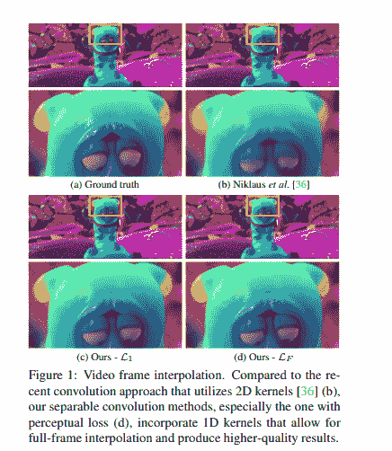

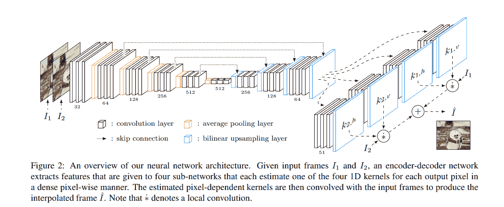

[来源](https://arxiv.org/abs/1708.01692v1)

网络使用[AdaMax](https://www.tensorflow.org/api_docs/python/tf/keras/optimizers/Adamax)优化器进行训练，学习率为 0.001，迷你批量大小为 16 个样本。训练视频来自于多个 YouTube 频道，如“Tom Scott”、“Casey Neistat”、“Linus Tech Tips”和“Austin Evans”。

通过随机裁剪进行数据增强，以确保网络不偏向某一类。卷积神经网络的实现使用了 Torch。以下是该模型与其他模型的比较。

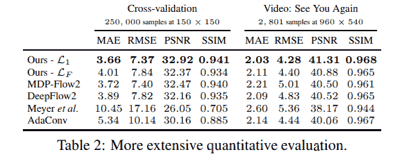

[来源](https://arxiv.org/abs/1708.01692v1)

### 自适应卷积的视频帧插值（CVPR 2017）

本文提出了一种将运动估计和像素合成结合成单一过程的视频帧插值方法。实现了一个深度全卷积神经网络，以为每个像素估计空间自适应卷积内核。

[**自适应卷积的视频帧插值**](https://arxiv.org/abs/1703.07514?source=post_page-----519ab2eb3dda----------------------)

视频帧插值通常包括两个步骤：运动估计和像素合成。这种两步法...

对于插值帧中的一个像素，深度神经网络以该像素为中心的两个接收场补丁作为输入，估计卷积内核。该卷积内核用于与输入补丁进行卷积，以合成输出像素。给定两个视频帧，该模型旨在创建它们之间的临时帧。

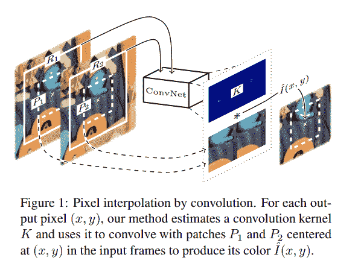

[来源](https://arxiv.org/abs/1703.07514)

该方法直接估计卷积内核，并使用该内核对两个帧进行卷积以插值像素颜色。像素合成通过卷积内核捕捉运动和重采样系数来实现。卷积作为像素插值使得像素合成可以在一步中完成，从而使这种方法更具鲁棒性。

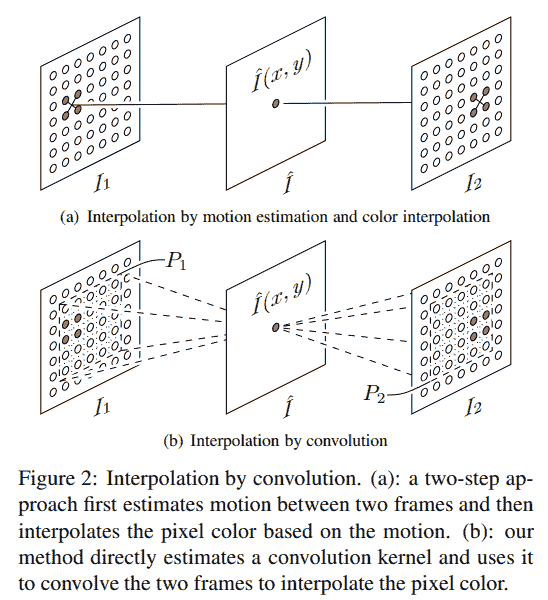

卷积神经网络由若干卷积层和下卷积组成，作为最大池化层的替代。为了正则化，作者使用**ReLUs**作为激活函数，并进行批量归一化。下表展示了该网络的架构。

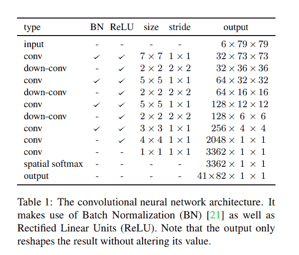

[源](https://arxiv.org/abs/1703.07514)

该模型使用 Torch 实现。以下是模型的性能：

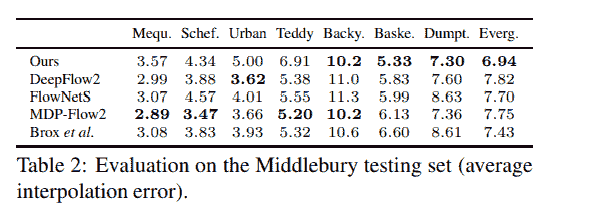

[源](https://arxiv.org/abs/1703.07514)

> 视频处理技术，如插值，使许多计算机视觉应用成为可能——不仅在服务器和云端，还在移动设备上。[了解更多关于 Fritz 如何教会你的移动设备“看”](https://www.fritz.ai/features/?utm_campaign=vidinterp&utm_source=heartbeat)。

### 深度体素流的视频帧合成（ICCV 2017）

本文的作者提出了一种深度神经网络，通过从现有帧流动像素值来合成视频帧。该论文结合了生成卷积神经网络和光流的优点来解决这个问题。

[**深度体素流的视频帧合成**](https://arxiv.org/abs/1702.02463?source=post_page-----519ab2eb3dda----------------------)

我们解决了在现有视频中合成新视频帧的问题，无论是在现有帧之间…

本模型中使用的网络以无监督的方式进行训练。像素通过插值来自相邻帧的像素值来生成。该网络包括一个跨空间和时间的体素流层。通过在输入视频体积上进行三线性插值生成最终像素。该网络在[UCF-101 数据集](https://www.crcv.ucf.edu/data/UCF101.php)上进行训练，并在各种视频上进行测试。

[源](https://arxiv.org/pdf/1702.02463.pdf)

他们提出的模型，深度体素流（DVF），是一个端到端的、完全可微的网络，用于视频帧合成。DVF 采用完全卷积的编码器-解码器架构，包含三个卷积层、三个反卷积层和一个瓶颈层。在该模型的训练过程中，提供两个帧作为输入，剩余的帧作为重建目标。该方法是自监督的，通过借用相邻帧的体素来学习重建帧。这使得结果更清晰、更真实。

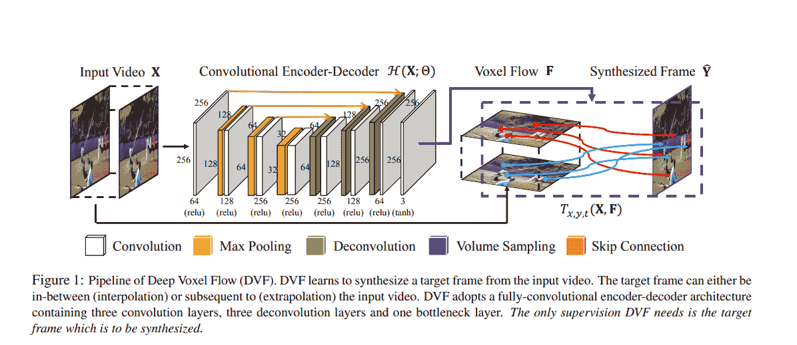

[源](https://arxiv.org/pdf/1702.02463.pdf)

作者使用峰值信噪比（PSN）和结构相似性指数（SSIM）来分析插值图像的质量。以下是他们取得的结果。

[源](https://arxiv.org/pdf/1702.02463.pdf)

### 长期视频插值与双向预测网络（2017）

本文解决了在视频中生成两个非连续帧之间多个帧的挑战。作者提出了一种深度双向预测网络（BiPN），该网络从两个相反的方向预测中间帧。

[**长时间视频插值与双向预测网络**](https://arxiv.org/abs/1706.03947?source=post_page-----519ab2eb3dda----------------------)

本文考虑了长时间视频插值的挑战性任务。与大多数现有方法仅…

作者训练了一个卷积编码器-解码器网络，给定两个不连续的帧。该网络被训练以从两个相反的方向回归缺失的中间帧。网络由一个双向编码器-解码器组成，同时从起始帧预测*未来-前向*，并从结束帧预测*过去-反向*。

该模型在合成数据集“移动 2D 形状”和自然视频数据集 UCF101 上进行了评估。

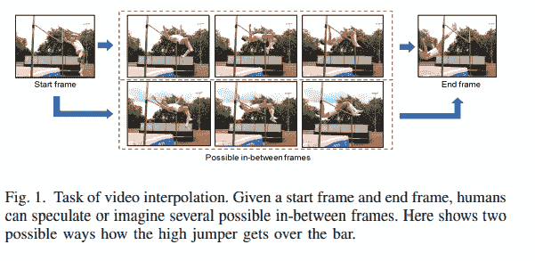

[来源](https://arxiv.org/abs/1706.03947)

BiPN 架构是一个编码器-解码器管道，具有双向编码器和单个解码器。双向编码器通过从起始帧和结束帧中编码信息来生成潜在帧表示。

解码器在接收特征表示作为输入后，预测了多个缺失的帧。前向和反向编码器由多个卷积层组成，每个卷积层都具有修正线性单元（ReLU）。

解码器由一系列上卷积层和 ReLU 组成。解码器输出一个特征图，其大小为 *l ×h×w ×c* 作为中间帧的目标预测，其中 l 是要预测的帧长度，h、w 和 c 分别是每帧的高度、宽度和通道数。

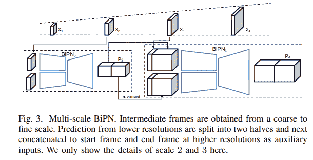

[来源](https://arxiv.org/abs/1706.03947)

该模型使用 [TensorFlow](https://www.tensorflow.org/) 实现，并部署在 [Tesla K80 GPU](https://www.nvidia.com/en-gb/data-center/tesla-k80/)上。该模型已经使用 UCF101 数据集进行了自然高分辨率视频的测试。

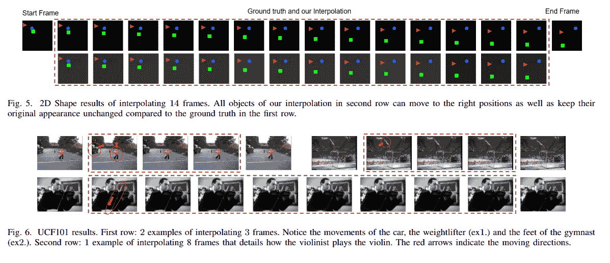

[关闭](https://arxiv.org/abs/1706.03947)

作者使用峰值信噪比（PSNR）和结构相似性指数（SSIM）来分析插值帧的质量。以下是他们取得的结果。

### PhaseNet 用于视频帧插值（CVPR 2018）

PhaseNet 由一个神经网络解码器组成，该解码器估计中间帧的相位分解。该架构是一个结合了基于相位的方法与学习框架的神经网络。本文提出的网络旨在给定两个相邻图像作为输入时合成一个中间图像。

[来源](https://arxiv.org/abs/1804.00884)

[**PhaseNet 用于视频帧插值**](https://arxiv.org/abs/1804.00884?source=post_page-----519ab2eb3dda----------------------)

大多数视频帧插值方法需要准确的密集对应关系来合成中间帧…

PhaseNet 被设计为仅解码器网络，从而逐级提高其分辨率。在每个级别，都会结合相应的分解信息。除了最低级别外，所有其他级别在结构上都是相同的。每个级别还包含来自前一个级别的信息。

网络的输入是来自两个输入帧的可调金字塔分解的响应，包括每个像素在每个级别的相位和幅度值。这些值在通过网络之前会进行归一化处理。

[来源](https://arxiv.org/abs/1804.00884)

每个分辨率级别都有一个 PhaseNet 块，该块以分解值作为输入。它还接受来自上一层的缩放特征图和缩放预测值。这些信息随后通过两个卷积层，每个卷积层后跟批归一化和 ReLU 非线性激活。

每个卷积生成 64 个特征图。每个 PhaseNet 块之后，预测中间帧分解值。这是通过将 PhaseNet 块的输出特征图通过一个 1 x 1 的卷积层来完成的。

这之后使用双曲正切函数来预测输出值。然后根据这些值计算中间图像的分解值。现在可以重建中间图像。

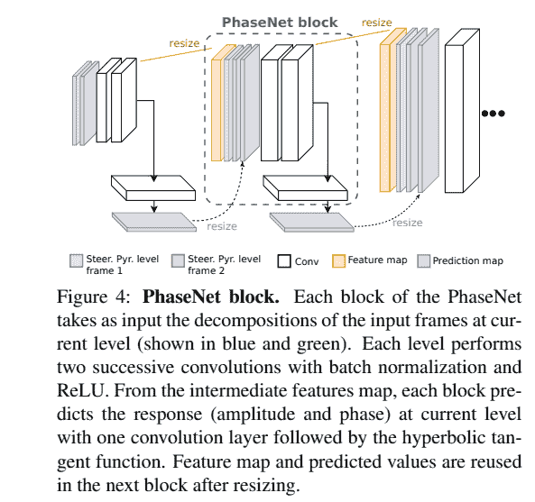

[来源](https://arxiv.org/abs/1804.00884)

该网络的训练使用了来自[DAVIS 视频数据集](https://davischallenge.org/)的帧三元组。

[来源](https://arxiv.org/abs/1804.00884)

这里是为此模型获得的一些误差测量结果。

[来源](https://arxiv.org/abs/1804.00884)

### Super SloMo：高质量估计视频插值的多个中间帧（CVPR 2018）

这篇论文的作者提出了一种端到端卷积神经网络，用于可变长度的多帧视频插值。在这个模型中，运动拦截和遮挡推理被联合建模。

输入图像之间的双向光流是使用[U-Net 架构](https://en.wikipedia.org/wiki/U-Net)计算的。然后在每个时间步长将这些光流线性组合，以逼近中间的双向光流。使用另一个 U-Net 对近似的光流进行精细化。

这个 U-Net 还预测了软可见性图。然后将两个输入图像进行扭曲和线性合成，形成每个中间帧。这种方法能够根据需要生成多个中间帧，因为学习到的网络参数是时间无关的。

[**超级慢动作：视频插值的多中间帧高质量估计**](https://arxiv.org/abs/1712.00080v2?source=post_page-----519ab2eb3dda----------------------)

给定两个连续帧，视频插值旨在生成中间帧，以形成空间上和…

在这个网络中，使用了流计算 CNN 来首先估计两个输入图像之间的双向光流。然后将其线性结合以近似所需的中间光流，以便对输入图像进行扭曲。

网络通过收集来自 YouTube 和手持摄像机的 240FPS 视频进行训练。训练后的模型在多个数据集上进行了评估，包括 [Middlebury](http://vision.middlebury.edu/flow/data/)、[UCF101](https://www.crcv.ucf.edu/data/UCF101.php/)、[慢速流数据集](http://www.cvlibs.net/projects/slow_flow/) 和 [高帧率 MPI Sintel](http://sintel.is.tue.mpg.de/)。无监督光流结果也在 [KITTI 2012 光流基准](http://www.cvlibs.net/) 上进行了评估。

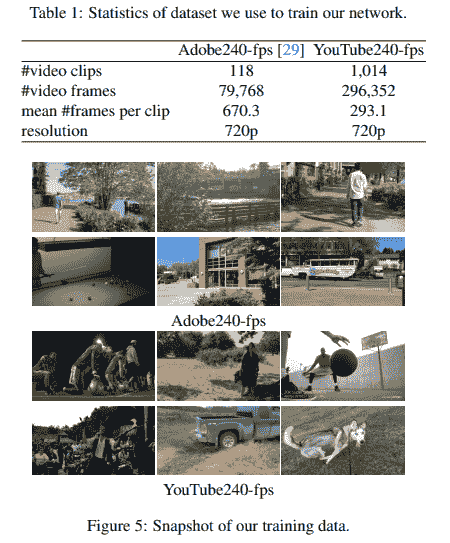

[来源](https://arxiv.org/pdf/1712.00080v2.pdf)

该架构中使用的 U-Net 是完全卷积的，由一个编码器和一个解码器组成。编码器和解码器在相同空间分辨率下有跳跃连接。编码器中有六个层次，由两个卷积层和 Leaky ReLU 层组成。

使用步幅为 2 的平均池化层在每个层次上减少空间维度，除了最后一个层次。解码器部分有五个层次。每个层次的开头是一个双线性上采样层，用于将空间维度增加 2 倍。接下来是两个卷积层和 Leaky ReLU 层。在前两个卷积层中使用 7 x 7 的卷积核，在第二个层次中使用 5 x 5 的卷积层。网络的其余部分使用 3 x 3 的卷积核。

[来源](https://arxiv.org/pdf/1712.00080v2.pdf)

以下是该模型在 UCF101 和 Adobe 数据集上的表现：

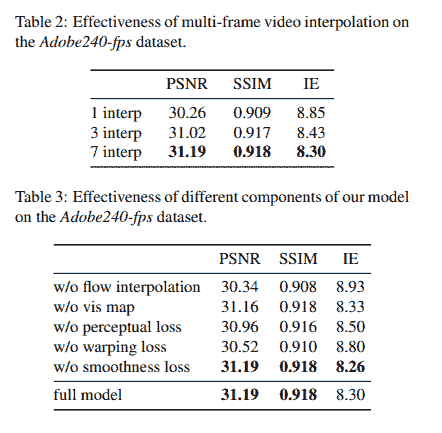

[来源](https://arxiv.org/pdf/1712.00080v2.pdf)

### 深度感知视频帧插值（CVPR 2019）

本文提出了一种视频帧插值方法，通过探索深度信息来检测遮挡。作者开发了一个深度感知流投影层，该层合成了比远处物体更靠近的即时流。

通过从邻近像素收集上下文信息来学习层次特征。然后通过基于光流和局部插值核扭曲输入帧、深度图和上下文特征来生成输出帧。

作者提出了一种深度感知视频帧插值（DAIN）模型，该模型有效利用光流、局部插值内核、深度图和上下文特征来生成高质量的视频帧。

[**深度感知视频帧插值**](https://arxiv.org/abs/1904.00830v1?source=post_page-----519ab2eb3dda----------------------)

视频帧插值旨在合成原始帧之间不存在的帧。虽然显著…

该模型使用 [PWC-Net](https://github.com/NVlabs/PWC-Net/tree/master/PyTorch) 作为流估计网络。流估计网络从预训练的 PWC-Net 初始化。对于深度估计网络，作者使用了 hourglass 架构。深度估计网络也从预训练版本初始化。上下文信息通过使用预训练的 [ResNet](https://arxiv.org/abs/1512.03385)来获取。

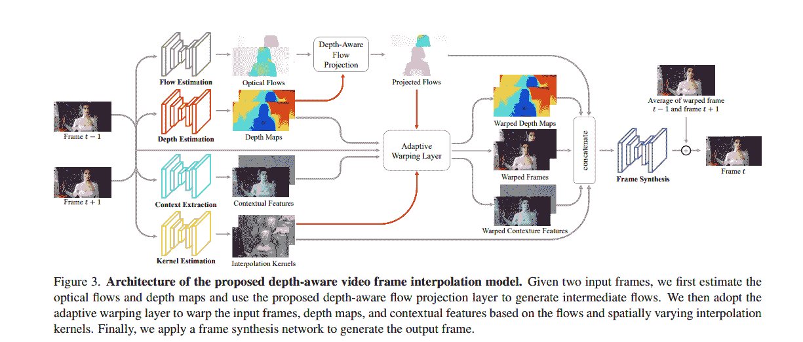

[来源](https://arxiv.org/pdf/1904.00830v1.pdf)

作者构建了一个上下文提取网络，该网络包含一个 7x7 卷积层和两个残差块，没有任何归一化层。然后通过将来自第一个卷积层和两个残差块的特征进行拼接，获得了分层特征。从头开始训练上下文提取网络确保其学习有效的上下文特征以进行视频帧插值。

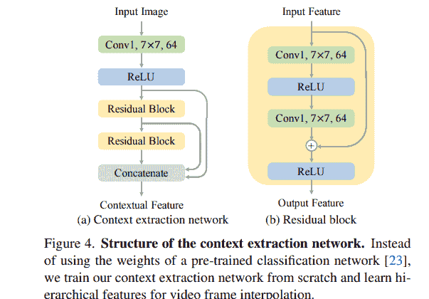

[来源](https://arxiv.org/pdf/1904.00830v1.pdf)

对于内核估计和自适应变形层，作者使用了 U-Net 架构来为每个像素估计 4 x 4 的局部内核。深度感知流投影层生成插值内核和中间流。自适应变形层被采用来变形输入帧、深度图和上下文特征。

最终帧输出是通过帧合成网络生成的。该网络以变形的输入帧、变形的深度图、上下文特征、投影流和插值内核作为输入。为了确保网络预测真实帧和混合帧之间的残差，两个变形帧被线性混合。

模型在 [Vimeo90K 数据集](http://toflow.csail.mit.edu/)上进行训练，优化策略采用 AdaMax。下方展示了获得的结果。

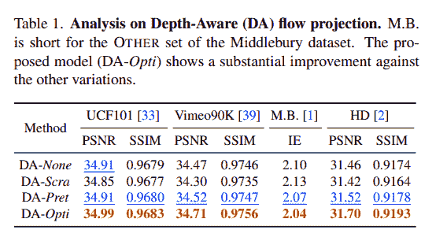

[来源](https://arxiv.org/pdf/1904.00830v1.pdf)

### 多尺度深度损失函数与生成对抗网络的帧插值（2019）

在这篇论文中，作者提出了一种用于帧插值的多尺度生成对抗网络（FIGAN）。通过多尺度残差估计模块最大化了该网络的效率，其中预测的流和合成的帧以粗到细的方式构建。

合成的中间视频帧的质量得到了提升，这是因为网络在不同级别上共同监督，并且使用了由对抗损失和两个内容损失组成的感知损失。该网络在 YouTube 上的 60fps 视频上进行了评估。

[源](https://arxiv.org/pdf/1711.06045.pdf)

[**多尺度深度损失函数和生成对抗网络的帧插值**](https://arxiv.org/abs/1711.06045?source=post_page-----519ab2eb3dda----------------------)

帧插值尝试从一个或多个连续的视频帧中合成帧。近年来，深度…

提议的模型由一个可训练的 CNN 架构组成，该架构直接从两个输入帧中估算一个插值帧。合成特征是通过构建一个金字塔结构并在不同尺度下估计两个帧之间的光流来获得的。合成精炼模块由一个 CNN 组成，它能够将合成图像与生成它的原始输入帧共同处理。

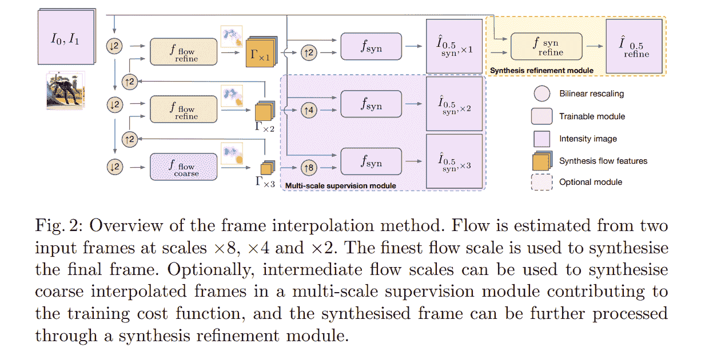

[源](https://arxiv.org/pdf/1711.06045.pdf)

从该网络中获得的一些结果如下所示。

[源](https://arxiv.org/pdf/1711.06045.pdf)

### 结论

我们现在应该了解了一些最常见的—以及几个非常新的—用于在各种背景下执行视频帧插值的技术。

上面提到并链接的论文/摘要还包含其代码实现的链接。我们很高兴看到你在测试它们后的结果。

**个人简介： [德里克·穆伊提](https://derrickmwiti.com/)** 是一名数据分析师、作家和导师。他致力于在每项任务中提供卓越的成果，并且是 Lapid Leaders Africa 的导师。

[原文](https://heartbeat.fritz.ai/research-guide-for-video-frame-interpolation-with-deep-learning-519ab2eb3dda). 经许可转载。

**相关：**

+   神经架构搜索研究指南

+   2019 年深度学习语音合成指南

+   2019 年自动语音识别指南

### 更多相关话题

+   [在 Python 中自定义数据框列名](https://www.kdnuggets.com/2022/08/customize-data-frame-column-names-python.html)

+   [如何使用 Pandas 中的插值技术处理缺失数据](https://www.kdnuggets.com/how-to-deal-with-missing-data-using-interpolation-techniques-in-pandas)

+   [边界框深度学习：视频标注的未来](https://www.kdnuggets.com/2022/07/bounding-box-deep-learning-future-video-annotation.html)

+   [文本到视频生成：逐步指南](https://www.kdnuggets.com/2023/08/text2video-generation-stepbystep-guide.html)

+   [人工智能、分析、机器学习、数据科学、深度学习……](https://www.kdnuggets.com/2021/12/developments-predictions-ai-machine-learning-data-science-research.html)

+   [学习数据科学、机器学习和深度学习的坚实计划](https://www.kdnuggets.com/2023/01/mwiti-solid-plan-learning-data-science-machine-learning-deep-learning.html)
