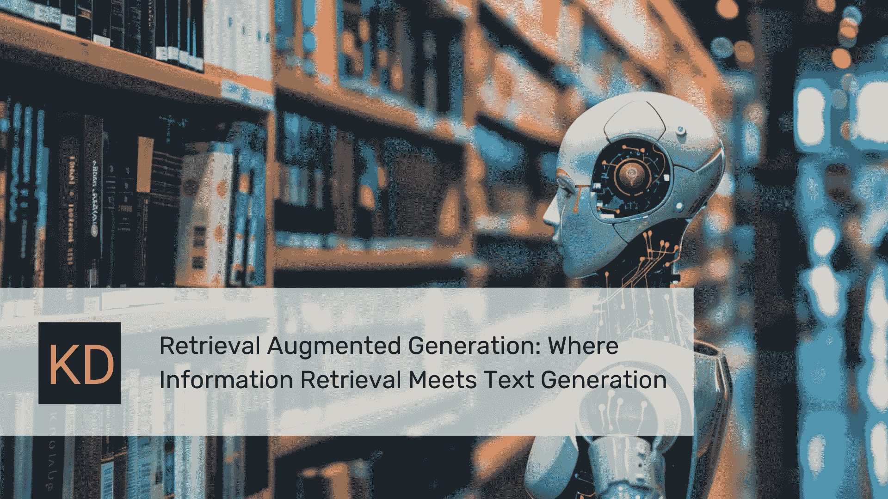
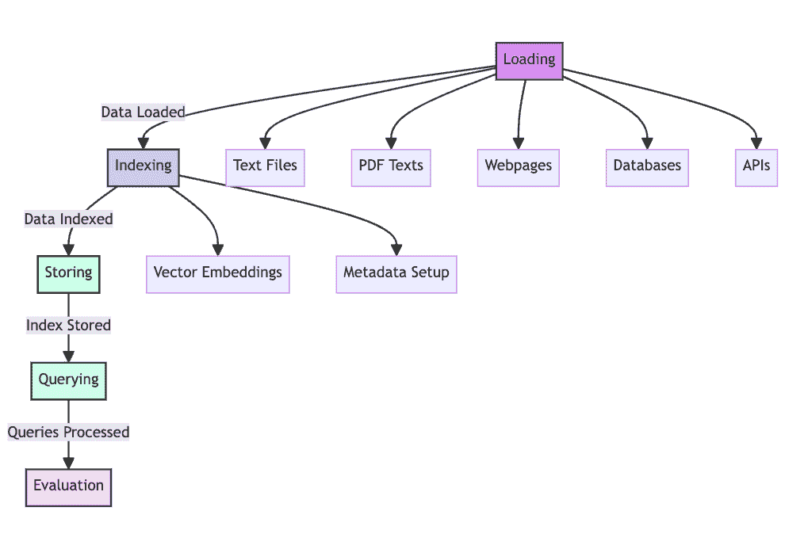

# 检索增强生成：信息检索与文本生成的结合

> 原文：[`www.kdnuggets.com/retrieval-augmented-generation-where-information-retrieval-meets-text-generation`](https://www.kdnuggets.com/retrieval-augmented-generation-where-information-retrieval-meets-text-generation)

图片由作者创建

## RAG 介绍

* * *

## 我们的前三个课程推荐

 1\. [Google 网络安全证书](https://www.kdnuggets.com/google-cybersecurity) - 快速进入网络安全职业生涯。

 2\. [Google 数据分析专业证书](https://www.kdnuggets.com/google-data-analytics) - 提升你的数据分析技能

 3\. [Google IT 支持专业证书](https://www.kdnuggets.com/google-itsupport) - 支持你的组织 IT

* * *

在不断发展的语言模型世界中，有一种特别值得注意的稳固方法是检索增强生成（RAG），这是一种将信息检索（IR）元素融入文本生成语言模型框架中的过程，以生成类似人类的文本，其目标是比仅由默认语言模型生成的文本更有用和准确。我们将在这篇文章中介绍 RAG 的基本概念，并计划在后续文章中构建一些 RAG 系统。

## RAG 概述

我们使用庞大而通用的数据集创建语言模型，这些数据集并没有针对你个人或定制的数据进行调整。为了应对这一现实，RAG 可以将你的特定数据与语言模型的现有“知识”结合起来。为了实现这一点，必须对你的数据进行索引，使其可搜索。当执行由你的数据组成的搜索时，从索引数据中提取相关和重要的信息，可以在查询语言模型时使用，以返回由模型生成的相关和有用的响应。任何对构建聊天机器人、现代信息检索系统或其他类型个人助理感兴趣的 AI 工程师、数据科学家或开发者，了解 RAG 和如何利用自己的数据至关重要。

简而言之，RAG 是一种新颖的技术，通过输入检索功能丰富语言模型，提升了语言模型，将 IR 机制融入生成过程，这些机制可以个性化（增强）模型用于生成目的的固有“知识”。

总结一下，RAG 包括以下高级步骤：

1.  从你的定制数据源中检索信息

1.  将这些数据作为额外背景添加到你的提示中

1.  让 LLM 基于增强的提示生成响应

RAG 相较于模型微调提供了这些优势：

1.  RAG 不进行训练，因此没有微调成本或时间

1.  定制数据的更新取决于你自己的维护，因此模型可以有效保持最新。

1.  在过程中（或之后）可以引用具体的定制数据文档，因此系统更加可验证和可信。

## 更深入的了解

经过更详细的检查，我们可以说 RAG 系统将经历 5 个操作阶段。

**1\. 加载**：收集原始文本数据——来自文本文件、PDF、网页、数据库等——是许多步骤中的第一步，将文本数据放入处理管道中，使其成为过程中的必要步骤。没有数据加载，RAG 就无法正常工作。

**2\. 索引**：现在你拥有的数据必须进行结构化和维护，以便于检索、搜索和查询。语言模型将利用从内容中创建的向量嵌入提供数据的数值表示，并使用特定的元数据以确保成功的搜索结果。

**3\. 存储**：在创建之后，索引必须与元数据一起保存，确保这一过程不需要定期重复，从而使 RAG 系统的扩展更为轻松。

**4\. 查询**：有了这个索引后，可以使用索引器和语言模型遍历内容，根据各种查询处理数据集。

**5\. 评估**：评估性能与其他可能的生成步骤相比是有用的，无论是在改变现有流程还是在测试这类系统的固有延迟和准确性时。

图片由作者创建

## 简短示例

参考以下简单的 RAG 实现。假设这是一个用于处理关于虚构在线商店的客户咨询的系统。

**1\. 加载**：内容将来自产品文档、用户评论和客户反馈，存储在多种格式中，如留言板、数据库和 API。

**2\. 索引**：你将为产品文档和用户评论等生成向量嵌入，同时索引分配给每个数据点的元数据，例如产品类别或客户评级。

**3\. 存储**：开发出的索引将保存在向量存储中，这是一个专门用于存储和优化检索向量的数据库，嵌入就是以这种形式存储的。

**4\. 查询**：当客户查询到达时，将根据问题文本在向量存储数据库中进行查找，然后使用语言模型生成响应，利用这些前体数据的来源作为上下文。

**5\. 评估**：系统性能将通过将其与其他选项（如传统语言模型检索）进行比较来评估，衡量指标包括回答正确性、响应延迟和整体用户满意度，以确保 RAG 系统可以进行调整和优化，以提供更优异的结果。

这个示例演练应该让你对 RAG 背后的方法论及其在传达信息检索能力方面的应用有一定了解。

## 结论

引入检索增强生成（RAG），即结合文本生成和信息检索以提高语言模型输出的准确性和上下文一致性，是本文的主题。该方法允许将存储在索引来源中的数据提取并增强，融入到语言模型生成的输出中。这种 RAG 系统可以比仅仅微调语言模型提供更好的价值。

我们 RAG 之旅的下一步将是学习行业工具，以便实现我们自己的 RAG 系统。我们将首先专注于利用来自 LlamaIndex 的工具，如数据连接器、引擎和应用连接器，以简化 RAG 的集成和扩展。但我们将把这留到下一篇文章。

在即将到来的项目中，我们将构建复杂的 RAG 系统，并考察 RAG 技术的潜在用途和改进。希望在人工智能领域揭示许多新的可能性，并利用这些多样的数据源构建更智能和具备上下文的系统。

****[马修·梅奥](https://www.kdnuggets.com/wp-content/uploads/./profile-pic.jpg)**** ([**@mattmayo13**](https://twitter.com/mattmayo13)) 拥有计算机科学硕士学位和数据挖掘研究生文凭。作为[KDnuggets](https://www.kdnuggets.com/)和[Statology](https://www.statology.org/)的执行编辑，以及[机器学习大师](https://machinelearningmastery.com/)的特约编辑，马修致力于让复杂的数据科学概念变得易于理解。他的专业兴趣包括自然语言处理、语言模型、机器学习算法和探索新兴的人工智能。他的使命是使数据科学社区的知识普及化。马修从 6 岁开始编程。

### 更多相关主题

+   [检索增强生成如何使 LLMs 更智能](https://www.kdnuggets.com/how-retrieval-augment-generation-makes-llms-smarter)

+   [认识 Gorilla：加州大学伯克利分校和微软的 API 增强 LLM…](https://www.kdnuggets.com/2023/06/meet-gorilla-uc-berkeley-microsoft-apiaugmented-llm-outperforms-gpt4-chatgpt-claude.html)

+   [特征选择：科学与艺术的交汇点](https://www.kdnuggets.com/2021/12/feature-selection-science-meets-art.html)

+   [文本到视频生成：逐步指南](https://www.kdnuggets.com/2023/08/text2video-generation-stepbystep-guide.html)

+   [如何优化 SQL 查询以加快数据检索速度](https://www.kdnuggets.com/2023/06/optimize-sql-queries-faster-data-retrieval.html)

+   [加入 UC 的信息会议，了解商业分析硕士课程…](https://www.kdnuggets.com/2022/10/ucincinnati-join-ucs-information-session-masters-business-analytics-program.html)
