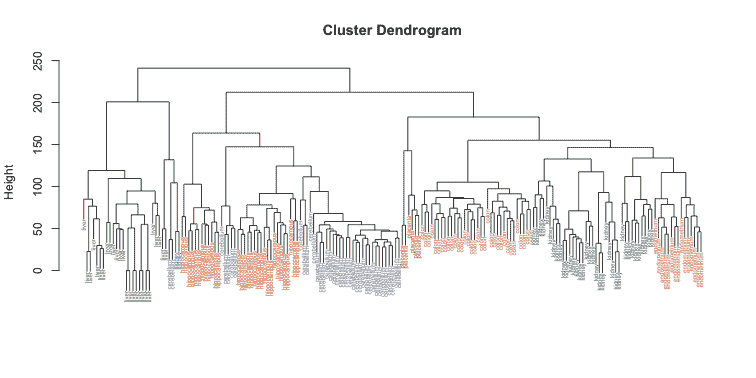
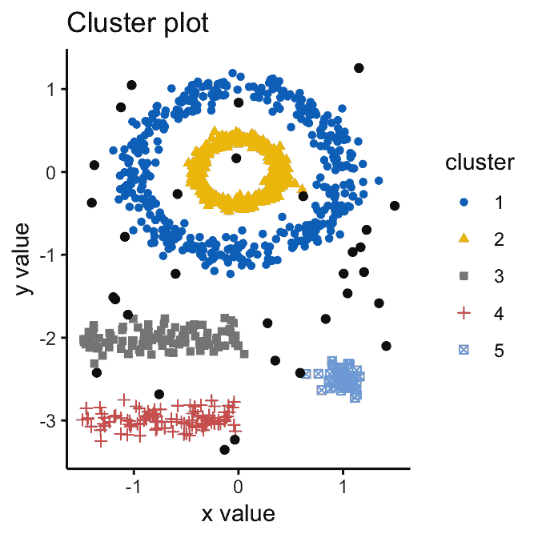

# 为你的数据集选择合适的聚类算法

> 原文：[`www.kdnuggets.com/2019/10/right-clustering-algorithm.html`](https://www.kdnuggets.com/2019/10/right-clustering-algorithm.html)

数据聚类是安排正确且全面数据模型的关键步骤。为了进行分析，信息的量应该根据共性进行分类。主要问题是，哪种共性参数提供了最佳结果——以及“最佳”的定义到底意味着什么。

这篇文章对于初学数据科学的人员或希望回顾相关主题的专家将非常有用。它包含了最广泛使用的聚类算法，以及对这些算法的深刻评析。根据每种方法的特点，提供了关于其应用的建议。

* * *

## 我们的前三大课程推荐

 1\. [Google 网络安全证书](https://www.kdnuggets.com/google-cybersecurity) - 快速通道进入网络安全职业。

 2\. [Google 数据分析专业证书](https://www.kdnuggets.com/google-data-analytics) - 提升你的数据分析技能

 3\. [Google IT 支持专业证书](https://www.kdnuggets.com/google-itsupport) - 支持你的组织的 IT 需求

* * *

# 四种基本算法及其选择方法

根据聚类模型的不同，区分出四类常见的算法。总共有不少于 100 种算法，但它们的受欢迎程度相对适中，以及它们的应用领域。

# 基于连接性的聚类

基于计算整个数据集对象之间距离的聚类称为**基于连接性**的聚类，或称为层次聚类。根据算法的“方向”，它可以联合或相反地分割信息数组——*凝聚型*和*分裂型*的名称正源于这种变化。最受欢迎且合理的类型是凝聚型，你从输入数据点的数量开始，然后将这些点逐渐联合成越来越大的聚类，直到达到限制。

基于连接性的聚类最显著的例子是植物的分类。数据集的“树”从特定物种开始，到达几个植物界，每个界由更小的聚类（门、纲、目等）组成。

应用基于连接性的算法后，你会得到一个数据树状图，它展示了信息的结构，而不是其在簇中的明确分离。这种特性可能既有利也有害：算法的复杂性可能过高，或者对几乎没有层次结构的数据集来说根本不适用。它还表现出较差的性能：由于迭代次数过多，完整处理将花费不合理的时间。此外，使用层次算法无法获得精确的结构。

[图像来源](https://genomicsclass.github.io/book/pages/figure/clustering_and_heatmaps-color_dendrogram-1.png)

与此同时，从计数器中获取的输入数据包括数据点的数量，这对最终结果影响不大，或预设的距离度量，该度量也是粗略和近似的。

# 基于质心的聚类

**基于质心**的聚类，凭我的经验，由于其相对简单性，是最常见的模型。该模型旨在将数据集中的每个对象分类到特定簇中。簇的数量（*k*）是随机选择的，这可能是该方法的最大“弱点”。这种 *k-means* 算法在机器学习中尤其受欢迎，因为它与 [k-最近邻](https://www.kaggle.com/chavesfm/tuning-parameters-for-k-nearest-neighbors-iris) (kNN) 方法类似。

[图像来源](https://www.mathworks.com/help/examples/stats/win64/AssignNewDataToExistingClustersAndGenerateCodeExample_01.png)

计算过程包含多个步骤。首先，选择输入数据，即数据集应被划分的粗略簇数。簇的中心应尽可能远离彼此，这将提高结果的准确性。

其次，算法计算数据集中每个对象与每个簇之间的距离。最小坐标（如果我们谈论的是图形表示）决定了对象被移动到哪个簇中。

之后，根据所有对象坐标的均值重新计算簇的中心。算法的第一步会重复，但使用重新计算的新簇中心。这样的迭代会继续，直到达到某些条件。例如，算法可能在簇中心没有移动或从上一次迭代中移动不大时结束。

尽管 *k-means* 在数学和编码上都很简单，但它仍有一些缺点，使我无法在所有可能的地方使用它。这些缺点包括：

+   每个簇的边缘不精确，因为优先级设置在簇的中心，而不是其边界；

+   无法创建一个可以被分类到多个聚类中且分类程度相同的数据集结构；

+   需要猜测最佳的*k*数量，或需要进行初步计算以指定该度量。

# 期望最大化聚类

**期望最大化**算法则允许避免这些复杂性，同时提供更高的准确度。简单来说，它计算每个数据点与我们指定的所有聚类的关系概率。用于这种聚类模型的主要“工具”是**高斯混合模型（GMM）**——即数据点一般遵循[高斯分布](https://www.encyclopedia.com/science-and-technology/mathematics/mathematics/normal-distribution#3)的假设。

k-means 算法基本上是 EM 原理的简化版本。它们都需要手动输入聚类数量，这也是这些方法的主要复杂之处。除此之外，计算原理（无论是 GMM 还是 k-means）都很简单：聚类的近似范围随着每次新的迭代逐渐确定。

与基于质心的模型不同，EM 算法允许点被分类到两个或多个聚类中——它只是为每个事件提供可能性，从而进行进一步分析。更重要的是，与 k-means 中聚类以圆形视觉呈现不同，EM 算法中每个聚类的边界组成不同尺寸的椭球。然而，该算法对于数据点不遵循高斯分布的数据集将无效。这是该方法的主要缺点：它更适用于理论问题，而不是实际测量或观察。

# 基于密度的聚类

最终，**基于密度的聚类**，也就是[数据科学家心中的非官方最爱](http://www.mastersindatascience.org/careers/data-scientist/)，登场了。这个名称包含了模型的主要点——将数据集划分为聚类，计数器输入ε参数，即“邻域”距离。如果对象位于ε半径的圆（球体）内，则它与该聚类相关。

[图片来源](https://www.datanovia.com/en/wp-content/uploads/dn-tutorials/005-advanced-clustering/figures/023-dbscan-density-based-clustering-density-based-clustering-1.png)

步步进行，DBSCAN（基于密度的空间聚类算法）算法检查每个对象，将其状态更改为“已查看”，将其分类为聚类或噪声，直到整个数据集处理完毕。DBSCAN 确定的聚类可以具有任意形状，因此非常准确。此外，该算法无需计算聚类的数量——它会自动确定。

尽管如此，即便是像 DBSCAN 这样的杰作也有一个缺点。如果数据集包含变密度的簇，该方法效果较差。如果对象的分布过于接近，而且 ε 参数难以估计，这也可能不是你的选择。

# 总结

总而言之，不存在所谓的错误选择的算法——有些算法只是更适合特定的数据集结构。为了总能选择最佳（即更合适）的算法，你需要深入了解它们的优缺点及其特点。

某些算法可能从一开始就会被排除，例如，如果它们与数据集规格不符。为了避免奇怪的工作，你可以花一点时间记住信息，而不是选择试错的路径并从自己的错误中学习。

我们希望你总是能够首先选择最佳算法。继续保持出色的工作！

**[乔什·汤普森](https://blog.powertofly.com/u/joshthompson)** 是 [数据科学硕士](https://www.mastersindatascience.org) 的首席编辑。他负责撰写案例研究、操作指南和关于 AI、ML、大数据以及数据专家辛勤工作的博客文章。在闲暇时间，他喜欢游泳和摩托车骑行。

### 更多相关内容

+   [解锁选择完美机器学习算法的秘诀！](https://www.kdnuggets.com/2023/07/ml-algorithm-choose.html)

+   [聚类解密：理解 K-均值聚类](https://www.kdnuggets.com/2023/07/clustering-unleashed-understanding-kmeans-clustering.html)

+   [机器学习中的 DBSCAN 聚类算法](https://www.kdnuggets.com/2020/04/dbscan-clustering-algorithm-machine-learning.html)

+   [什么是 K-均值聚类，其算法如何工作？](https://www.kdnuggets.com/2023/05/kmeans-clustering-algorithm-work.html)

+   [ChatGPT 驱动的数据探索：揭示数据集中的隐藏见解](https://www.kdnuggets.com/2023/07/chatgptpowered-data-exploration-unlock-hidden-insights-dataset.html)

+   [选择正确机器学习算法的简单指南](https://www.kdnuggets.com/2020/05/guide-choose-right-machine-learning-algorithm.html)
