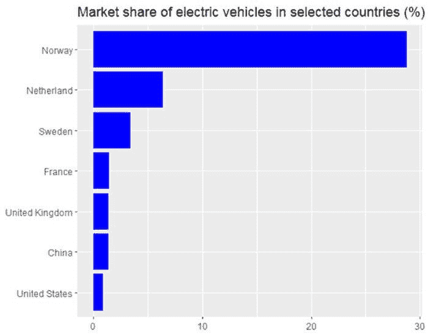
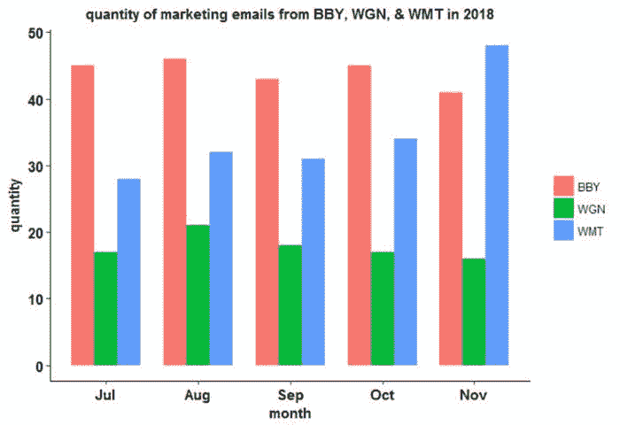
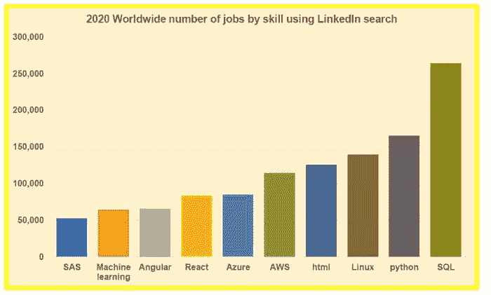
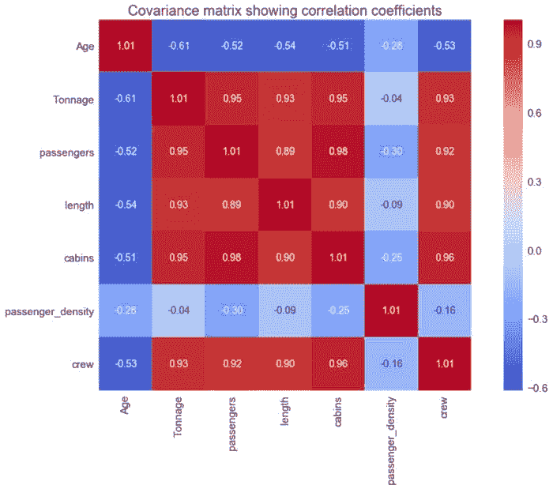
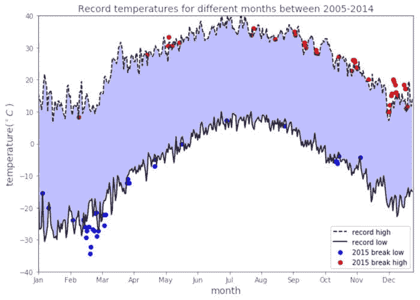

# 如何提出可以用数据回答的正确问题

> 原文：[`www.kdnuggets.com/2021/03/right-questions-answered-using-data.html`](https://www.kdnuggets.com/2021/03/right-questions-answered-using-data.html)

评论

*照片由 [You X Ventures](https://unsplash.com/@youxventures?utm_source=medium&utm_medium=referral) 提供，来自 [Unsplash](https://unsplash.com/?utm_source=medium&utm_medium=referral)。*

* * *

## 我们的前三大课程推荐

 1\. [谷歌网络安全证书](https://www.kdnuggets.com/google-cybersecurity) - 快速进入网络安全职业。

 2\. [谷歌数据分析专业证书](https://www.kdnuggets.com/google-data-analytics) - 提升你的数据分析技能

 3\. [谷歌 IT 支持专业证书](https://www.kdnuggets.com/google-itsupport) - 支持你的组织的 IT 需求

* * *

数据科学是一个跨学科领域，它使用科学方法、过程和算法从数据中提取知识和洞见。数据科学领域有几个子领域，如数据挖掘、数据转换、数据可视化、机器学习、深度学习等。在本文中，我们将重点讨论如何提出可以通过数据回答的有意义的问题。任何数据分析的质量都取决于你提出正确问题的能力。以下提示将帮助你提出可以用数据解决的正确问题。

1.  **探索你的数据**：在对数据进行任何分析之前，重要的是仔细探索可用的数据。这将帮助你了解数据的范围、质量、类型（有序或分类；静态或动态）、数据中的模式以及特征之间的关系。

1.  **确定使用数据解决的问题类型**：根据你的数据集，待解决的问题可能属于以下类别之一：描述性分析、预测性分析或规范性分析。这三类数据科学任务将在下面的案例研究部分详细讨论。

1.  **了解你作为数据科学家的局限性**：数据科学家可能对感兴趣的系统缺乏领域知识。例如，根据你工作的组织，你可能需要与工程师（工业数据集）、医生（医疗数据集）等团队合作，以确定在模型中使用的预测特征和目标特征。例如，一个工业仓库系统可能有传感器实时生成数据以跟踪仓库操作。在这种情况下，作为数据科学家，你可能对该系统没有技术知识。因此，你需要与工程师和技术人员合作，让他们指导你决定哪些特征是重要的，哪些是预测变量和目标变量。因此，团队合作对于整合项目的不同方面至关重要。根据我在一个工业数据科学项目中的个人经验，我们的团队必须与系统工程师、电气工程师、机械工程师、现场工程师和技术人员合作了 3 个月，仅仅是为了理解如何用可用数据框定正确的问题。这样的多学科问题解决方法在现实世界的数据科学项目中是至关重要的。

我们现在将探讨数据科学项目的不同案例研究以及从数据中需要解答的问题。

### 描述性数据分析

在描述性分析中，你会关注于研究数据集中特征之间的关系。数据可视化在这里发挥着至关重要的作用。你需要决定适合当前项目的数据可视化类型。可能是散点图、条形图、折线图、密度图、热图等。以下是一些数据可视化项目的示例。

**简单条形图**：这里的项目是展示 7 个工业化国家的电动车市场份额。

*图 1\. [2016 年选定国家的电动车市场份额](https://medium.com/towards-artificial-intelligence/tutorial-on-barplots-using-rs-ggplot-package-b7f86104a974)。图片由 Benjamin O. Tayo 提供。*

生成图 1 所用的数据集和代码可以在这里找到：[2016 年电动车全球市场份额](https://github.com/bot13956/2016_market_share_electric_cars_using_R)。

**带有分类变量的条形图**：这里的项目是展示来自 3 家公司（Best Buy（BBY）、Walgreens（WGN）和 Walmart（WMT））的营销邮件。

*图 2\. [2018 年来自 Best Buy（BBY）、Walgreens（WGN）和 Walmart（WMT）的广告邮件数量](https://medium.com/towards-artificial-intelligence/tutorial-on-barplots-using-rs-ggplot-package-b7f86104a974)。图片由 Benjamin O. Tayo 提供。*

用于生成图 2 的数据集和代码可以在这里找到：[个人营销电子邮件的条形图](https://github.com/bot13956/barplot_marketing_emails)

**比较条形图**：这里的项目是比较按技能划分的全球科技职位数量。

*图 3. [2020 年全球按技能划分的工作数量](https://medium.com/towards-artificial-intelligence/top-10-tech-skills-in-2020-worldwide-ecef27c8d8ad)。图片来源：Benjamin O. Tayo。*

**热图绘制**：这里的问题是研究和量化数据集中特征之间的相关性。

*图 4. [显示数据集中各特征之间相关系数的协方差矩阵图](https://medium.com/towards-artificial-intelligence/role-of-data-visualization-in-machine-learning-a6dd62ad1082)。图片来源：Benjamin O. Tayo。*

**天气数据图**：这里的问题是显示 2005 年至 2014 年的记录温度。

*图 5. 2005 年至 2014 年不同月份的记录温度。图片来源：Benjamin O. Tayo。*

### 预测数据分析

在预测分析中，目标是使用可用数据构建一个模型，然后用这个模型对未见数据进行预测。这里要构建的模型类型将取决于目标变量的类型。如果目标变量是连续的，可以使用线性回归；如果目标变量是离散的，可以使用分类。规范数据分析的框架在下面的图 6 中说明。

*图 6. 机器学习项目工作流程示意图。图片来源：Benjamin O. Tayo*

预测分析的工作流程通常包括 4 个主要阶段：问题定义、数据分析、模型构建和应用。

**A. 问题定义**

这是你决定要解决什么类型的问题，例如：将电子邮件分类为垃圾邮件或非垃圾邮件的模型、将肿瘤细胞分类为恶性或良性的模型、通过将电话路由到不同类别来改善客户体验的模型，以便由具有正确专业知识的人员接听电话、预测贷款是否会逾期（违约）的模型、基于不同特征或预测因子的房屋价格预测模型等。

**B. 数据分析**

这是你分析用于构建模型的数据的地方。它包括特征的数据可视化、处理缺失数据、处理分类数据、编码类标签、特征的标准化和规范化、特征工程、降维、数据划分为训练集、验证集和测试集等。

**C. 模型构建**

在这里，你需要选择你希望使用的模型，例如线性回归、逻辑回归、KNN、SVM、k-means、蒙特卡洛模拟、时间序列分析等。数据集必须被划分为训练集、验证集和测试集。使用超参数调优来微调模型，以防止过拟合。通过交叉验证来确保模型在验证集上的表现良好。经过微调后的模型会被应用于测试数据集。模型在测试数据集上的表现大致等于当模型用于对未见数据进行预测时的预期表现。

**D. 应用**

在这个阶段，最终的机器学习模型投入生产，以开始改善客户体验或提高生产力，或决定银行是否应批准借款人信用等。模型在生产环境中进行评估，以评估其性能。这可以通过将机器学习解决方案的性能与基线或对照解决方案进行比较，使用如 A/B 测试等方法来完成。在从实验模型到实际生产线表现的过程中遇到的任何错误都需要被分析。这些错误可以反馈到原始模型中，用于微调模型以提高其预测能力。

预测数据分析项目的一个例子可以在这里找到：[机器学习过程教程](https://medium.com/swlh/machine-learning-process-tutorial-222327f53efb)。

### 处方数据分析

有时，可用的数据可能仅作为样本数据，用于生成更多的数据。生成的数据可以用于处方分析，推荐行动方案。一个例子是贷款状态预测问题：[使用蒙特卡洛模拟预测贷款状态](https://pub.towardsai.net/machine-learning-model-for-stochastic-processes-c65a96f0b8c5)。

总之，我们讨论了一些使用可用数据提出正确问题的技巧。对数据进行的任何分析的质量都取决于你提出正确问题的能力。因此，在使用数据进行任何类型的分析之前，提出正确的问题是很重要的。

**相关：**

+   [一个问题让你的数据项目价值提高 10 倍](https://www.kdnuggets.com/2021/02/one-question-data-project-10x-valuable.html)

+   [仅用两行代码进行强大的探索性数据分析](https://www.kdnuggets.com/2021/02/powerful-exploratory-data-analysis-sweetviz.html)

+   [使用新的 Sweetviz Python 库更快了解你的数据](https://www.kdnuggets.com/2021/03/know-your-data-much-faster-sweetviz-python-library.html)

### 更多相关话题

+   [在 Python 中自定义数据框列名](https://www.kdnuggets.com/2022/08/customize-data-frame-column-names-python.html)

+   [KDnuggets 新闻，5 月 4 日：9 门免费哈佛课程学习数据…](https://www.kdnuggets.com/2022/n18.html)

+   [如何回答数据科学编码面试问题](https://www.kdnuggets.com/2022/01/answer-data-science-coding-interview-questions.html)

+   [15 个你必须知道的 Python 编码面试问题，以备数据科学面试](https://www.kdnuggets.com/2022/04/15-python-coding-interview-questions-must-know-data-science.html)

+   [12 个最具挑战性的数据科学面试问题](https://www.kdnuggets.com/2022/07/12-challenging-data-science-interview-questions.html)

+   [数据科学面试中的 24 个 A/B 测试面试问题及…](https://www.kdnuggets.com/2022/09/24-ab-testing-interview-questions-data-science-interviews-crack.html)
