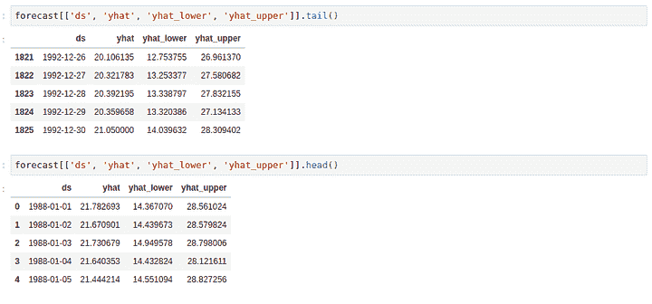
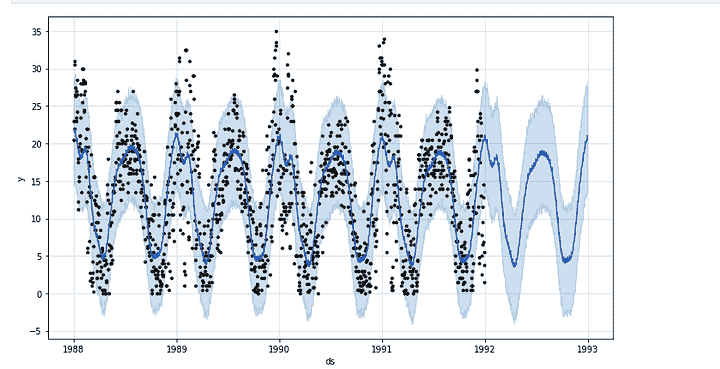
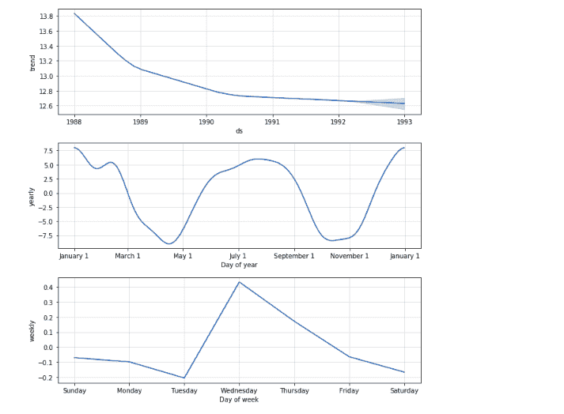
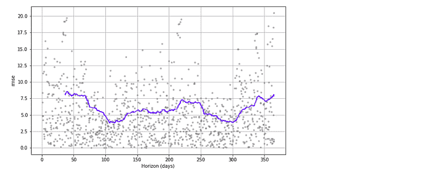

# 使用 Facebook 的 Prophet 进行销售预测

> 原文：[`www.kdnuggets.com/2018/11/sales-forecasting-using-prophet.html`](https://www.kdnuggets.com/2018/11/sales-forecasting-using-prophet.html)

 评论

销售预测是许多以销售为驱动的组织中最常见的任务之一。这项活动使组织能够以一定的信心充分规划未来。在本教程中，我们将使用 [Prophet](https://medium.com/r/?url=https%3A%2F%2Fresearch.fb.com%2Fprophet-forecasting-at-scale%2F)，这是 [Facebook](https://medium.com/r/?url=https%3A%2F%2Fresearch.fb.com%2Fprophet-forecasting-at-scale%2F) 开发的一个包，展示如何实现这一点。此包在 [Python](https://medium.com/r/?url=https%3A%2F%2Fpypi.org%2Fproject%2Ffbprophet%2F) 和 [R](https://medium.com/r/?url=https%3A%2F%2Fcran.r-project.org%2Fpackage%3Dprophet) 中均可用。我们假设读者对在 Python 中处理 [时间序列](https://medium.com/r/?url=https%3A%2F%2Ftowardsdatascience.com%2Fanalyzing-time-series-data-in-pandas-be3887fdd621) 数据有基本的理解。

### 攻击计划

1.  介绍与安装

1.  模型拟合

1.  未来预测

1.  获取预测

1.  绘制预测

1.  绘制预测组件

1.  交叉验证

1.  获取性能指标

1.  可视化性能指标

1.  结论

### 介绍与安装

有很多开源预测工具，但没有一种能够解决所有预测问题。[Prophet](https://medium.com/r/?url=https%3A%2F%2Fgithub.com%2Ffacebook%2Fprophet) 最适合处理几个月的每小时和每周数据。使用 Prophet 时，年度数据是最理想的。根据 Facebook 研究：

> 从根本上说，Prophet 程序是一个 [加性回归模型](https://medium.com/r/?url=https%3A%2F%2Fen.wikipedia.org%2Fwiki%2FAdditive_model)，具有四个主要组件：
> 
> 1\. 分段线性或逻辑增长曲线趋势。Prophet 通过从数据中选择变化点来自动检测趋势变化。
> 
> 2\. 使用 [傅里叶级数](https://medium.com/r/?url=https%3A%2F%2Fen.wikipedia.org%2Fwiki%2FFourier_series) 建模的年度季节性组件。
> 
> 3\. 使用虚拟变量的每周季节性组件。
> 
> 4\. 用户提供的重要节假日列表。

可以使用 pip 在 Python 中安装 Prophet，如下所示。Prophet 依赖于名为 `pystan.` 的 Python 模块。我们在安装 Prophet 时，此模块将自动安装。

我们在本教程中使用的数据集可以在[这里](https://medium.com/r/?url=https%3A%2F%2Fdatamarket.com%2Fdata%2Fset%2F235d%2Fmean-daily-temperature-fisher-river-near-dallas-jan-01-1988-to-dec-31-1991%23!ds%3D235d%26display%3Dline)下载。一旦下载数据集，请确保删除文件末尾的一些不必要的行，因为它们可能会干扰分析。对于这个[单变量分析](https://medium.com/r/?url=https%3A%2F%2Fen.wikipedia.org%2Fwiki%2FUnivariate)Prophet 期望数据集包含两列，分别命名为*ds*和*y*。*ds*是日期列，而*y*是我们进行预测的列。

让我们开始导入 Pandas 进行数据处理，以及 Prophet 进行预测。接下来，我们加载数据集并查看其头部。

### 模型拟合

由于我们之前使用过[Scikit-learn](https://medium.com/r/?url=https%3A%2F%2Fscikit-learn.org%2F)，因此使用 Prophet 对我们来说将是一件轻而易举的事。这是因为 Prophet 和 Scikit-learn 的 API 实现非常相似，如下所示。我们首先创建一个 Prophet 类的实例，然后将其拟合到我们的数据集上。

### 进行未来预测

下一步是准备我们的模型进行未来预测。这可以通过使用*Prophet.make_future_dataframe*方法并传入我们希望预测的天数来实现。我们使用*periods*属性来指定这个值。这还包括历史日期。我们将使用这些历史日期将预测值与*ds*列中的实际值进行比较。

### 获取预测结果

我们使用*predict*方法来进行未来的预测。这将生成一个包含*yhat*列的数据框，该列将包含预测结果。

如果我们查看预测数据框的*head*，会发现它有很多列。然而，我们主要关注***ds, yhat, yhat_lower***和**yhat_upper。yhat***是我们的预测值，***yhat_lower***是我们预测的下限，***yhat_upper***是我们预测的上限。

让我们继续查看预测数据框的尾部和头部。

### 绘制预测结果

Prophet 具有一个内置功能，允许我们绘制刚刚生成的预测结果。这可以通过使用*mode.plot()*方法并将我们的预测结果作为参数传递来实现。图中的蓝线表示预测值，而黑点表示我们数据集中的数据。

### 绘制预测组件

*plot_components* 方法绘制了时间序列数据的趋势、年度和每周季节性。

### 交叉验证

接下来，让我们使用历史数据测量预测误差。我们将通过将预测值与实际值进行比较来完成此操作。为了执行此操作，我们选择数据历史中的截止点，并用该截止点之前的数据拟合模型。然后，我们将实际值与预测值进行比较。*交叉验证*方法允许我们在 Prophet 中执行此操作。此方法使用以下参数，如下所述：

1.  *预测范围*预测范围

1.  *初始*初始训练期的大小

1.  *周期*截止日期之间的间隔

*交叉验证*方法的输出是一个数据框，其中包含*y*真实值和*yhat*预测值。我们将使用此数据框来计算预测误差。

### 获取性能指标

我们使用*performance_metrics*工具计算均方误差（MSE）、均方根误差（RMSE）、平均绝对误差（MAE）、平均绝对百分比误差（MAPE）以及`yhat_lower`和`yhat_upper`估计值的覆盖率。

### **可视化性能指标**

性能指标可以使用*plot_cross_validation_metric*工具进行可视化。让我们下面可视化 RMSE。

### 结论

正如我们所见，Prophet 在时间序列预测中非常强大和有效。然而，正如我们之前提到的，还有一些其他预测工具。工具的选择是基于数据集的性质逐案决定的。人们可以始终比较这些工具，并使用那些能提供最佳预测且误差最小的工具。这些方法包括[ARIMA](https://medium.com/r/?url=https%3A%2F%2Fwww.statsmodels.org%2Fdev%2Fgenerated%2Fstatsmodels.tsa.arima_model.ARIMA.html)、[Holt-Winters 方法](https://medium.com/r/?url=https%3A%2F%2Fotexts.org%2Ffpp2%2Fholt-winters.html)、[Holt 的线性趋势](https://medium.com/r/?url=https%3A%2F%2Fotexts.org%2Ffpp2%2Fholt.html)、[简单指数平滑](https://medium.com/r/?url=https%3A%2F%2Fotexts.org%2Ffpp2%2Fses.html)和[移动平均](https://medium.com/r/?url=https%3A%2F%2Fwww.babypips.com%2Flearn%2Fforex%2Fusing-moving-averages)等。您可以从[官方文档](https://medium.com/r/?url=https%3A%2F%2Ffacebook.github.io%2Fprophet%2F)或阅读[Prophet 论文](https://medium.com/r/?url=https%3A%2F%2Fpeerj.com%2Fpreprints%2F3190.pdf)了解更多关于 Prophet 的信息。

**简介：[Derrick Mwiti](https://derrickmwiti.com/)** 是一名数据分析师、作家和导师。他致力于在每个任务中取得优异成果，并且是 Lapid Leaders Africa 的导师。

**相关内容：**

+   使用 Keras 长短期记忆（LSTM）模型预测股票价格

+   Keras 深度学习入门

+   PyTorch 深度学习入门

* * *

## 我们的前三个课程推荐

 1\. [Google 网络安全证书](https://www.kdnuggets.com/google-cybersecurity) - 快速进入网络安全职业道路。

 2\. [Google 数据分析专业证书](https://www.kdnuggets.com/google-data-analytics) - 提升您的数据分析能力

 3\. [Google IT 支持专业证书](https://www.kdnuggets.com/google-itsupport) - 支持您组织的 IT 工作

* * *

### 相关主题

+   [使用 statsmodels 和 Prophet 进行时间序列预测](https://www.kdnuggets.com/2023/03/time-series-forecasting-statsmodels-prophet.html)

+   [最先进的深度学习技术进行可解释预测和即时预测…](https://www.kdnuggets.com/2021/12/sota-explainable-forecasting-and-nowcasting.html)

+   [使用 Ploomber、Arima、Python 和 Slurm 进行时间序列预测](https://www.kdnuggets.com/2022/03/time-series-forecasting-ploomber-arima-python-slurm.html)

+   [学习现代预测技术，帮助预测未来的商业成果…](https://www.kdnuggets.com/2022/12/sphere-learn-modern-forecasting-techniques-help-predict-future-business-outcomes.html)

+   [预测未来事件：AI 和 ML 的能力与局限性](https://www.kdnuggets.com/2023/06/forecasting-future-events-capabilities-limitations-ai-ml.html)

+   [利用 XGBoost 进行时间序列预测](https://www.kdnuggets.com/2023/08/leveraging-xgboost-timeseries-forecasting.html)
