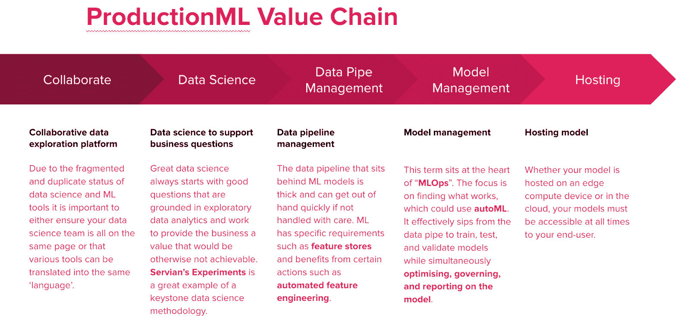
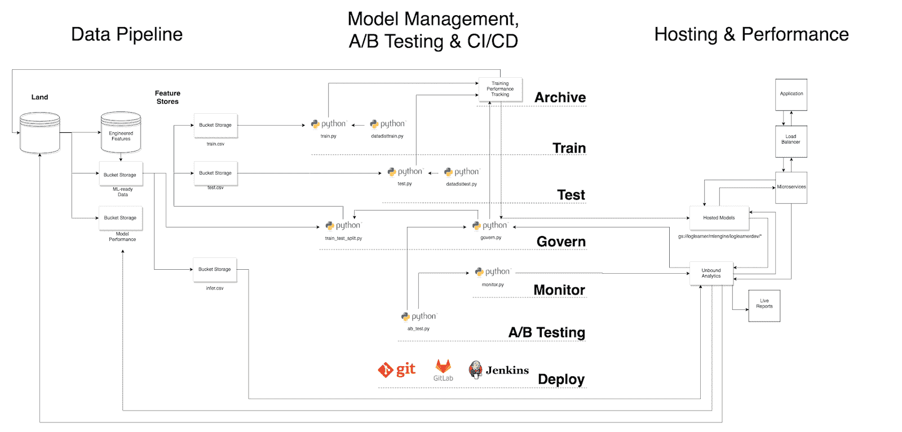

# 数据科学家与数据工程师之间的墙

> 原文：[`www.kdnuggets.com/2020/02/scaling-wall-data-scientist-data-engineer.html`](https://www.kdnuggets.com/2020/02/scaling-wall-data-scientist-data-engineer.html)

评论

**由 [Byron Allen](https://www.linkedin.com/in/byronaallen/)，Servian 的 ML 工程师**

* * *

## 我们的前三大课程推荐

 1\. [谷歌网络安全证书](https://www.kdnuggets.com/google-cybersecurity) - 快速进入网络安全职业轨道

 2\. [谷歌数据分析专业证书](https://www.kdnuggets.com/google-data-analytics) - 提升你的数据分析技能

 3\. [谷歌 IT 支持专业证书](https://www.kdnuggets.com/google-itsupport) - 支持你的组织 IT

* * *

*来源： [Chris Gonzalez](https://www.pexels.com/@hellochrisgonzalez)。*

对我来说，今天机器学习（ML）中最令人兴奋的事情，并不在于深度学习或强化学习的前沿，而是如何管理模型以及数据科学家和数据工程师如何有效地作为团队合作。掌握这些，将引导组织实现更有效和可持续的机器学习应用。

遗憾的是，“科学家”和“工程师”之间存在一堵墙。Databricks 的联合创始人兼产品副总裁 Andy Konwinski 和其他人，在最近的一篇关于 [MLFlow](https://databricks.com/blog/2019/03/06/managed-mlflow-on-databricks-now-in-public-preview.html) 的博客文章中指出了一些关键的障碍。Databricks 表示：“构建生产级机器学习应用程序具有挑战性，因为目前没有标准化的方法来记录实验、确保可重复的运行以及管理和部署模型。”

许多今天应用机器学习的主要挑战——无论是技术、商业还是社会方面——的起因在于数据随时间的失衡以及机器学习工件的管理和利用。一个模型可能表现得非常好，但如果底层数据发生漂移且工件未被用来评估性能，那么你的模型将无法很好地泛化或适当地更新。这个问题处于一个模糊地带，既涉及数据科学家，也涉及工程师。

*来源： [burak kostak](https://www.pexels.com/@burakkostak)。*

换句话说，问题的关键在于机器学习中缺少 CI/CD 的原则。如果你的环境发生变化，比如输入数据，而模型没有在其构建目标的背景下进行定期评估，导致其随时间失去相关性和价值，那么即使你可以创建一个非常好的“黑箱”模型也没有意义。这是一个难以解决的问题，因为提供数据的工程师和设计模型的科学家之间的关系并不和谐。

这个挑战有实际的例子。想想那些预测希拉里·克林顿会赢的预测，以及其他几种机器学习的失误。从自动驾驶汽车撞死无辜行人到[有偏见的人工智能](https://www.forbes.com/sites/intelai/2019/03/27/the-risks-of-dirty-data-and-ai/#7bee43d72dc7)，已经出现了一些大的[失误](https://medium.com/syncedreview/2018-in-review-10-ai-failures-c18faadf5983)，我认为这些问题通常起源于数据科学和工程之间的灰色地带。

*来源: [Kayla Velasquez](https://unsplash.com/@kaylawithav)。*

也就是说，机器学习对我们的社会产生了负面和积极的影响。更积极、商业性较少的例子包括[electricityMap](https://www.electricitymap.org/)，它使用机器学习来映射全球电力的环境影响；机器学习在癌症研究中目前帮助我们更早、更准确地检测几种癌症类型；由人工智能驱动的传感器推动[Agriculture](https://www.forbes.com/sites/danielnewman/2019/02/07/4-ways-artificial-intelligence-will-drive-digital-transformation-in-agriculture/#75ac0fbb1273)朝着满足全球日益增长的食品需求迈进。

### 墙

因此，正确处理生产机器学习（ML），尤其是模型管理，是至关重要的。然而，回到一点，数据科学家和数据工程师并不总是使用相同的语言。

数据科学家往往缺乏对其模型如何在一个不断摄取新数据、整合新代码、被最终用户调用并且偶尔出现多种失败情况的环境中运行的理解（即生产环境）。另一方面，许多数据工程师对机器学习了解不足，不理解他们投入生产的东西以及对组织的影响。

这两个角色往往在没有足够考虑彼此的情况下运作，尽管它们占据了相同的空间。“那不是我的工作”不是正确的态度。为了生产出可靠、可持续和适应性强的产品，这两个角色必须更加有效地协作。

### 爬墙

交流的第一步是建立共同的词汇——对语义进行某种程度的标准化，从而讨论挑战或相关挑战。自然，这充满了挑战——只要问几个不同的人数据湖是什么，你很可能会得到至少两个不同的答案，甚至更多。

我开发了被称为 ProductionML 价值链和 ProductionML 框架的通用参考点。

我们将生产化 ML 的过程分解为五个重叠的概念，这些概念通常被分开考虑。虽然引入这样一个整体框架可能会增加复杂性和相互依赖性——但实际上，这些复杂性和相互依赖性已经存在——忽视它们只是将问题推迟到未来。

通过在设计你的生产 ML 管道时考虑邻近概念——你开始引入那种难以捉摸的可靠性、可持续性和适应性。

### ProductionML 框架

ProductionML 价值链是对运营数据科学和工程团队以便将模型部署到最终用户所需内容的高层描述。自然还有更技术和详细的理解——我称之为 ProductionML 框架（有些人可能称之为持续智能）。

*ProductionML 框架。*

这个框架是在经过几轮对商业 MLOps 工具、开源选项和内部 PoC 的实验之后开发的。它旨在指导 ProductionML 项目的未来发展，特别是那些需要数据科学家和工程师共同参与的生产 ML 方面。

*橙色的数据科学和蓝色的数据工程/DevOps。*

如果你对这些方面不太熟悉，请参见橙色的“数据科学”和蓝色的“数据工程/DevOps”。

如你所见，“训练性能跟踪”机制（例如，MLFlow）和 Govern 机制在这个架构中处于核心位置。这是因为每个工件，包括指标、参数和图形，都必须在训练和测试阶段进行归档。此外，被称为模型管理的东西与模型如何被管理是根本相关的，这利用了那些模型工件。

Govern 机制将工件和业务规则结合起来，以推动适当的模型，或更具体地说，是估算器的生产，同时根据特定于用例的规则对其他模型进行标记。这也被称为模型版本控制，但使用“govern”一词是为了避免与*版本控制*混淆，并强调该机制在监督模型管理中的核心作用。

### 黄金枪？

我们都在这段旅程中。我们都在尝试攀登这面墙。市场上有许多优秀的工具，但迄今为止，没有人拥有一把金色的枪……

*来源：mrgarethm — 黄金枪 — 国际间谍博物馆。*

从我的角度来看，MLFlow 取得了巨大进展，它解答了关于模型管理和工件归档的某些问题。其他产品也类似地解决了相对具体的问题——尽管它们的优势可能体现在生产 ML 价值链的其他部分。这在 Google Cloud ML Engine 和 AWS Sagemaker 中可以看到。最近，GCP 发布了 AutoML Tables 的测试版，但即便如此，也无法完全满足所有需求，尽管接近了。

牢记这一持续存在的差异，科学家和工程师之间拥有共同的词汇和框架作为基础至关重要。

墙太高了吗？根据我的经验，答案是否定的，但这并不意味着生产 ML 不复杂。

### 必须的詹姆斯·邦德名言

M：所以如果我听得没错的话，斯卡拉曼加逃脱了——坐在一辆长出翅膀的车里！

问：哦，这完全可行，先生。事实上，我们现在正在研发一款。

或许这就是你应该如何越过那面墙……

[原文](https://medium.com/weareservian/scaling-the-wall-between-data-scientist-and-data-engineer-51b0a99da073)。经许可转载。

**相关：**

+   [部署机器学习模型是什么意思？](https://www.kdnuggets.com/2020/02/deploy-machine-learning-model.html)

+   [不同方法在生产中部署机器学习模型的概述](https://www.kdnuggets.com/2019/06/approaches-deploying-machine-learning-production.html)

+   [机器学习工程师的工作是什么样的](https://www.kdnuggets.com/2019/07/machine-learning-engineering-job.html)

### 更多相关话题

+   [通过 Apache Gobblin 扩展数据管理](https://www.kdnuggets.com/2023/01/scaling-data-management-apache-gobblin.html)

+   [使用 Python 进行数据扩展](https://www.kdnuggets.com/2023/07/data-scaling-python.html)

+   [扩展你的网络数据驱动产品时需要知道的事项](https://www.kdnuggets.com/2023/08/things-know-scaling-web-datadriven-product.html)

+   [梦想与现实之间：生成文本与幻觉](https://www.kdnuggets.com/between-dreams-and-reality-generative-text-and-hallucinations)

+   [数据分析师与数据科学家的区别是什么？](https://www.kdnuggets.com/2022/03/difference-data-analysts-data-scientists.html)

+   [机器学习中的训练数据和测试数据的区别](https://www.kdnuggets.com/2022/08/difference-training-testing-data-machine-learning.html)
