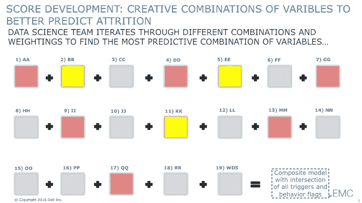

# 识别可能更好预测的变量

> 原文：[`www.kdnuggets.com/2017/02/schmarzo-variables-better-predictors.html`](https://www.kdnuggets.com/2017/02/schmarzo-variables-better-predictors.html)

我喜欢书籍《点球成金》中所传授的数据科学概念的简洁性。每个人都想直接跳入那些内容丰富、高度技术性的数据库书籍。但我建议我的学生先从《点球成金》开始。这本书很好地展现了数据科学的力量（而且电影不算，因为我妻子看了后只记得“布拉德·皮特真帅！”... 哎）。我最喜欢的课程之一就是对数据科学的定义：

### *数据科学就是识别那些 **可能** 是更好表现预测指标的变量和指标*

* * *

## 我们的前三个课程推荐

 1\. [Google Cybersecurity Certificate](https://www.kdnuggets.com/google-cybersecurity) - 快速进入网络安全职业生涯。

 2\. [Google Data Analytics Professional Certificate](https://www.kdnuggets.com/google-data-analytics) - 提升你的数据分析水平

 3\. [Google IT Support Professional Certificate](https://www.kdnuggets.com/google-itsupport) - 支持你的组织进行 IT 方面的工作

* * *

这个直接的定义为定义业务利益相关者和数据科学团队的角色和责任奠定了基础：

+   业务利益相关者负责识别（头脑风暴）那些 ***可能*** 是更好表现预测指标的变量和指标，并且

+   数据科学团队负责量化哪些变量和指标实际上 ***是*** 更好的表现预测指标

这种方法利用了业务利益相关者最了解的内容——即业务。同时，这种方法也利用了数据科学团队最了解的内容——即数据转换、数据丰富、数据探索和分析建模。完美的数据科学团队！

注意：词汇“***might”*** 可能是数据科学定义中最重要的词汇。业务利益相关者必须感到舒适，能够头脑风暴不同的变量和指标，这些变量和指标 *可能* 更好地预测表现，而不必担心他们的想法会被评判。我们的一些最佳想法来自那些声音通常不会被听到的人。我们的大数据愿景研讨会过程将所有想法视为值得考虑的。如果你不接受这一概念，你可能会限制业务利益相关者的创造性思维，或者更糟的是，错过可能有价值的数据洞察。

这篇博客旨在扩展数据科学团队用来识别（和量化）哪些变量和指标 **是** 更好预测表现的方式。让我通过一个例子来说明。

我们最近与一家金融服务机构合作，他们要求我们预测客户流失者，即识别哪些客户有可能结束与组织的关系。正如我们在大数据愿景研讨会中通常做的那样，我们与业务利益相关者举行了促进性头脑风暴会议，以识别可能是更好预测绩效的变量和指标（见图 1）。

**图 1：** 头脑风暴可能是更好预测变量和指标

**注意**：由于客户的竞争优势原因，我不得不模糊处理我们识别出的确切指标。是的，我喜欢这样！

从这些变量和指标的列表中，数据科学团队寻求创建一个“流失评分”，用于识别（或评分）有风险的客户。数据科学团队采纳了迭代的“快速失败/更快学习”过程，测试不同的变量和指标组合。数据科学团队测试了不同的数据增强和转化技术以及不同的分析算法，并尝试了不同变量和指标的组合，以查看哪些变量组合产生了最佳结果（见图 2）。

**图 2：** 探索不同的变量和指标组合

数据科学团队面临的挑战是不能满足于第一个“有效”的模型。数据科学团队需要不断突破极限，因此，需要在测试不同的变量组合时经历足够多的失败，才能对最终模型的结果充满信心。

经过大量的测试和失败——以及测试和失败——再测试和失败，数据科学团队提出了一个“流失评分”模型，该模型*经过足够的失败*，使他们对结果充满信心（见图 3）。

**图 3：** 识别出更好的预测变量和指标

我们需要一种方法，能够充分发挥项目中每个人的作用——业务利益相关者进行变量和指标的头脑风暴，以及数据科学团队创造性地测试不同的组合。此次参与的最终结果相当令人印象深刻（见图 4）：

+   Dell EMC 过程生成了一个模型，识别出了约 59% 的流失者

+   作为基准，American Express 宣布了一种成功的流失模型，识别出 24%的流失客户（来源：“[*预测分析如何应对 American Express 的客户流失*](http://www.cmo.com.au/article/458724/how_predictive_analytics_tackling_customer_attrition_american_express/)”）。

**图 4：** 最终流失模型结果

将不同变量和指标结合起来的创造性数据科学过程高度依赖于业务利益相关者头脑风暴练习的成功。如果业务利益相关者没有在这一过程中早期参与，并被允许创造性地思考哪些变量和指标***可能***是更好的绩效预测因素，那么数据科学团队将寻求测试的变量和指标的集合将受到限制。换句话说，数据科学过程的成功和可操作评分的创建高度依赖于业务利益相关者在过程开始时的创造性参与。

这就是我们[大数据愿景研讨会](http://www.emc.com/en-us/services/professional-services/big-data-vision-workshop.htm)过程的力量。

如果你有兴趣了解更多关于戴尔 EMC [大数据愿景研讨会](http://www.emc.com/en-us/services/professional-services/big-data-vision-workshop.htm)的信息，请查看下面的博客：

+   [如何举办研讨会：指南和检查清单](https://infocus.emc.com/william_schmarzo/how-to-run-a-workshop-guidelines-and-checklist/)

+   [像数据科学家一样思考 第一部分：理解从哪里开始](https://infocus.emc.com/william_schmarzo/thinking-like-a-data-scientist-part-i/)

+   [像数据科学家一样思考 第二部分：预测业务表现](https://infocus.emc.com/william_schmarzo/thinking-like-a-data-scientist-part-ii/)

[原文](https://infocus.emc.com/william_schmarzo/data-science-variables-better-predictors/)。已获许可转载。

**相关：**

+   公民数据科学家、巨型虾和其他无意义的描述

+   物联网（IoT）挑战：呼救的传感器

+   确定数据的经济价值

### 更多相关主题

+   [你可能在下次面试中遇到的 24 个 SQL 问题](https://www.kdnuggets.com/2022/06/24-sql-questions-might-see-next-interview.html)

+   [你可能不知道的 5 个 Pandas 绘图函数](https://www.kdnuggets.com/2023/02/5-pandas-plotting-functions-might-know.html)

+   [推动更好的业务决策](https://www.kdnuggets.com/2022/04/informs-driving-better-business-decisions.html)

+   [如何更好地利用数据科学推动业务增长](https://www.kdnuggets.com/2022/08/better-leverage-data-science-business-growth.html)

+   [超级巴德：能做一切且做得更好的 AI](https://www.kdnuggets.com/2023/05/super-bard-ai-better.html)

+   [IMPACT：数据可观测性峰会将于 11 月 8 日回归，更多内容请见……](https://www.kdnuggets.com/2023/10/monte-carlo-impact-the-data-observability-summit-is-back)
