# 如何使用 [ ]、.loc、iloc、.at 和 .iat 选择 Pandas 中的行和列

> 原文：[`www.kdnuggets.com/2019/06/select-rows-columns-pandas.html`](https://www.kdnuggets.com/2019/06/select-rows-columns-pandas.html)

![如何使用 [ ]、.loc、iloc、.at 和 .iat 选择 Pandas 中的行和列](../Images/702ba22e874a73b4bd1f47dd5e07b6a6.png)

图片来源：[catalyststuff](https://www.freepik.com/free-vector/cute-panda-lifting-barbell-gym-fitness-cartoon-vector-icon-illustration-animal-sports-icon-isolated_29456470.htm#query=panda&position=36&from_view=search) 在 Freepik

*你可以在 [这里](https://nbviewer.jupyter.org/github/manujeevanprakash/Selecting-rows-and-columns-pandas/blob/master/Selecting%20rows%20and%20columns%20-%20Pandas%20tutorial.ipynb) 下载本教程的 Jupyter notebook。*

在这篇博客中，我将展示如何使用 `[ ]`、`.loc`、`.iloc`、`.at` 和 `.iat` 在 Pandas 中选择数据子集。我将使用托管在 [UCI](http://archive.ics.uci.edu/ml/datasets/Wine) 网站上的葡萄酒质量数据集。该数据记录了北葡萄牙成千上万种红酒和白酒的 11 种化学性质（如糖、柠檬酸、酒精、pH 等）以及葡萄酒的质量，质量以 1 到 10 的等级记录。我们只查看红酒的数据。

首先，我导入了 Pandas 库，并将数据集读取到数据框中。


这里是数据框的前 5 行：

```py
wine_df.head()
```


我重命名了列，以便在未来操作中更容易调用列名。

```py
wine_df.columns = ['fixed_acidity', 'volatile_acidity', 'citric_acid', 
                   'residual_sugar', 'chlorides', 'free_sulfur_dioxide', 
                   'total_sulfur_dioxide','density','pH','sulphates', 
                   'alcohol', 'quality']
```

# 选择列的不同方法

## 选择单列

要选择第一列 'fixed_acidity'，你可以将列名作为字符串传递给索引操作符。

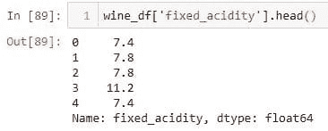

你也可以使用点操作符执行相同的任务。

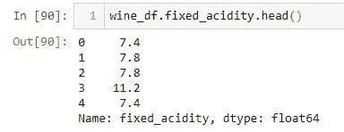

## 选择多个列

要选择多个列，你可以将列名列表传递给索引操作符。

```py
wine_four = wine_df[['fixed_acidity', 'volatile_acidity','citric_acid', 'residual_sugar']]
```

另外，你也可以将所有列分配给一个列表变量，并将该变量传递给索引操作符。

```py
cols = ['fixed_acidity', 'volatile_acidity','citric_acid', 'residual_sugar']
wine_list_four = wine_four[cols]
```

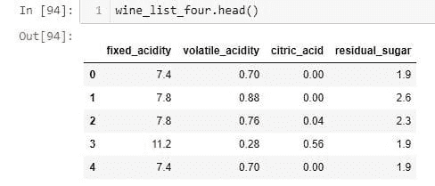

## 使用 "select_dtypes" 和 "filter" 方法选择列

要使用 `select_dtypes` 方法选择列，你首先应找出每种数据类型的列数。


在这个例子中，有 11 列是浮点型数据，一列是整数型数据。要仅选择浮点型列，使用 `wine_df.select_dtypes(include = ['float'])`。`select_dtypes` 方法的 include 参数接受一个数据类型列表。列表值可以是字符串或 Python 对象。

你还可以使用 `filter` 方法根据列名或索引标签选择列。


在上述示例中，`filter`方法返回包含确切字符串'acid'的列。`like`参数接受一个字符串作为输入，并返回包含该字符串的列。

你可以在`filter`方法中使用`regex`参数来进行正则表达式匹配。

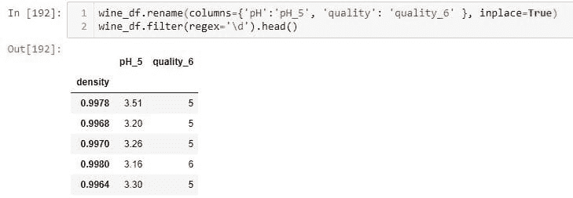

在这里，我首先重命名了*ph*和*quality*列。然后，我将正则表达式参数传递给`filter`方法，以查找所有包含数字的列。

# 改变列的顺序

我想要改变列的顺序。


`wine_df.columns` 显示了所有列名。我将列名组织成三个列表变量，并将这些变量连接起来以获得最终的列顺序。


我使用 Set 模块检查`new_cols`是否包含所有原始列。

然后，我将`new_cols`变量传递给索引操作符，并将结果 DataFrame 存储在变量`"wine_df_2"`中。现在，`wine_df_2` DataFrame 中的列按我想要的顺序排列。


# 选择行的不同方法

## 使用.iloc 和 loc 选择行

现在，让我们看看如何使用.iloc 和 loc 从我们的 DataFrame 中选择行。为了更好地说明这一概念，我从“density”列中删除了所有重复行，并将`wine_df` DataFrame 的索引更改为“density”。


要选择`wine_df` DataFrame 中的第三行，我将数字 2 传递给`.iloc`索引器。

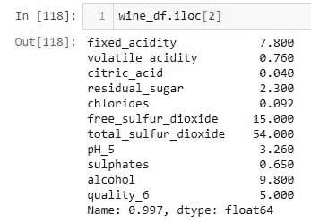

为了做同样的事情，我使用`.loc`索引器。

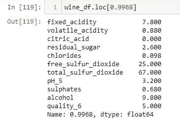

要选择具有不同索引位置的行，我将一个列表传递给`.iloc`索引器。


我将一系列密度值传递给`.iloc`索引器，以重现上述 DataFrame。


你可以使用切片来选择多行。这类似于在 Python 中切片列表。


上述操作选择了第 2、第 3 和第 4 行。

你可以使用`loc`来执行相同的操作。


在这里，我选择了索引之间的行 *0.9970* 和 *0.9959*。

# 同时选择行和列

你必须在`.iloc`和`loc`索引器中传递行和列的参数，以同时选择行和列。行和列的值可以是标量值、列表、切片对象或布尔值。

选择所有行，以及第 4、第 5 和第 7 列：

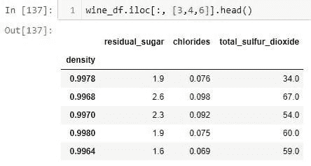

要复制上述 DataFrame，将列名作为列表传递给 `.loc` 索引器：

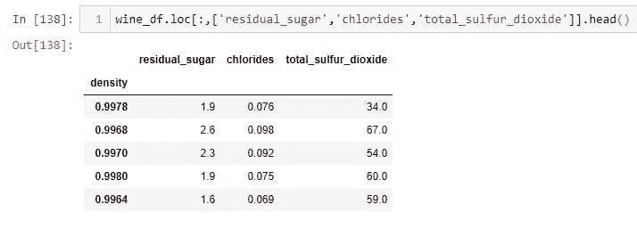

## 选择不连续的行和列

要选择特定数量的行和列，你可以使用 `.iloc` 进行如下操作。


要选择特定数量的行和列，你可以使用 `.loc` 进行如下操作。

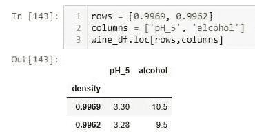

要从 DataFrame 中选择单一值，你可以执行以下操作。


你可以使用切片来选择特定的列。

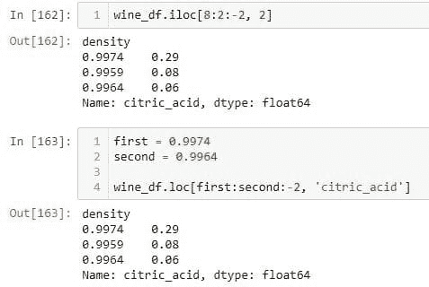

要同时选择行和列，你需要理解方括号中逗号的使用。逗号左侧的参数总是根据行索引选择行，而逗号右侧的参数总是根据列索引选择列。

如果你想选择一组行和所有列，你不需要在逗号后使用冒号。


## 使用 "get_loc" 和 "index" 方法选择行和列


在上述示例中，我使用 `get_loc` 方法查找列 'volatile_acidity' 的整数位置，并将其赋值给变量 `col_start`。然后，我再次使用 `get_loc` 方法查找比 'volatile_acidity' 列多 2 个整数值的列的位置，并将其赋值给变量 `col_end`。接着，我使用 `iloc` 方法选择前 4 行，以及 `col_start` 和 `col_end` 列。如果你将索引标签传递给 `get_loc` 方法，它将返回其整数位置。

你可以使用 `.loc` 执行类似的操作。以下显示了如何选择第 3 到第 7 行，以及从 "volatile_acidity" 到 "chlorides" 的列。

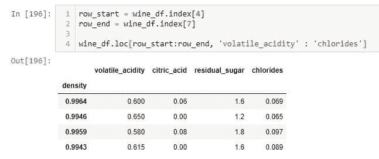

## 使用 `.iat` 和 `.at` 进行子选择

索引器 `.iat` 和 `.at` 比 `.iloc` 和 `.loc` 更快，用于从 DataFrame 中选择单个元素。


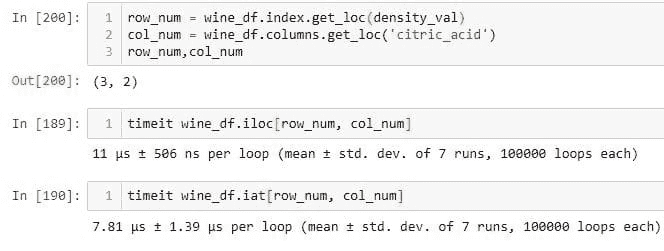

我将撰写更多关于使用 Pandas 操作数据的教程。敬请关注！

## 参考文献

+   [Pandas Cookbook](https://www.packtpub.com/big-data-and-business-intelligence/pandas-cookbook)

+   [Python 数据分析](https://www.amazon.com/Python-Data-Analysis-Wrangling-IPython-ebook/dp/B075X4LT6K)

* * *

## 我们的前三大课程推荐

 1\. [谷歌网络安全证书](https://www.kdnuggets.com/google-cybersecurity) - 快速进入网络安全职业的捷径。

 2\. [谷歌数据分析专业证书](https://www.kdnuggets.com/google-data-analytics) - 提升你的数据分析技能

 3\. [谷歌 IT 支持专业证书](https://www.kdnuggets.com/google-itsupport) - 为你的组织提供 IT 支持

* * *

### 更多相关主题

+   [重命名 Pandas 列的 4 种方法](https://www.kdnuggets.com/2022/11/4-ways-rename-pandas-columns.html)

+   [将行追加到 Pandas DataFrame 的 3 种方法](https://www.kdnuggets.com/2022/08/3-ways-append-rows-pandas-dataframes.html)

+   [如何在几秒钟内处理包含数百万行的 DataFrame](https://www.kdnuggets.com/2022/01/process-dataframe-millions-rows-seconds.html)

+   [如何从大型数据集中正确选择样本进行机器学习](https://www.kdnuggets.com/2019/05/sample-huge-dataset-machine-learning.html)

+   [将 SQL 与 Python 一起使用：SQLAlchemy 和 Pandas](https://www.kdnuggets.com/using-sql-with-python-sqlalchemy-and-pandas)

+   [使用 apply() 方法处理 Pandas DataFrame](https://www.kdnuggets.com/2022/07/apply-method-pandas-dataframes.html)
