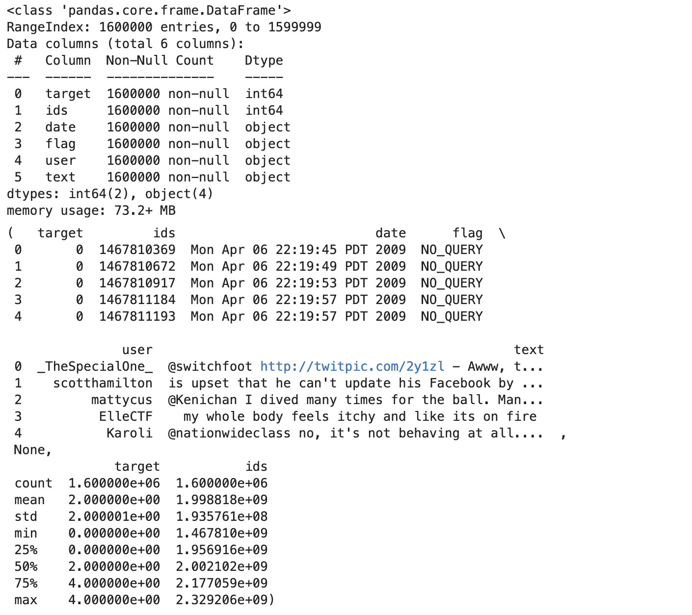
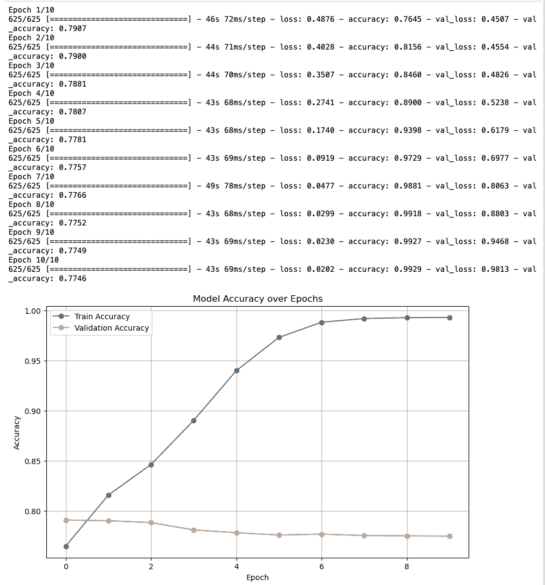

# Python 中的情感分析：超越词袋模型

> 原文：[`www.kdnuggets.com/sentiment-analysis-in-python-going-beyond-bag-of-words`](https://www.kdnuggets.com/sentiment-analysis-in-python-going-beyond-bag-of-words)


图片由 [DALL-E](https://openai.com/dall-e-2) 创建

你知道通过情感分析可以在一定程度上预测选举结果吗？数据科学在应用于现实生活情境时比处理模拟数据集更有趣且非常有用。

* * *

## 我们的前三大课程推荐

 1\. [谷歌网络安全证书](https://www.kdnuggets.com/google-cybersecurity) - 快速进入网络安全职业生涯。

 2\. [谷歌数据分析专业证书](https://www.kdnuggets.com/google-data-analytics) - 提升您的数据分析技能

 3\. [谷歌 IT 支持专业证书](https://www.kdnuggets.com/google-itsupport) - 支持您的组织的 IT 工作

* * *

在本文中，我们将使用 Twitter 数据进行一个简要的案例研究。最后，你将看到一个对现实生活有重大影响的案例研究，这肯定会引起你的兴趣。但首先，让我们从基础开始。

# 什么是情感分析？

情感分析是一种预测情感的方法，就像数字心理学家一样。借助这个你创建的心理学家，你将掌控你分析文本的命运。你可以像著名心理学家弗洛伊德一样进行分析，或者只是像一个心理学家一样存在，每次会话收费 10 美元。

就像你的心理学家倾听和理解你的情感一样，情感分析对文本（如评论、评价或推文）做了同样的事情，正如我们在下一节中将要做的那样。为了做到这一点，让我们开始对准备好的数据集进行案例研究。

# 案例研究：Twitter 数据的情感分析

为了进行情感分析，我们将使用来自 Kaggle 的数据集。这个数据集是通过使用 Twitter API 收集的。这里是这个数据集的链接：[`www.kaggle.com/datasets/kazanova/sentiment140`](https://www.kaggle.com/datasets/kazanova/sentiment140)

现在，让我们开始探索数据集。

## 探索数据集

现在，在进行情感分析之前，让我们探索一下数据集。要读取它，请使用编码。因为这个原因，我们将在之后添加列名。你可以增加数据探索的方法。Head、info 和 describe 方法会给你很好的提示；让我们看看代码。

```py
import pandas as pd

data = pd.read_csv('training.csv', encoding='ISO-8859-1', header=None)
column_names = ['target', 'ids', 'date', 'flag', 'user', 'text']
data.columns = column_names
head = data.head()
info = data.info()
describe = data.describe()
head, info, describe 
```

这是输出结果。



当然，如果您的项目没有图像限制，您可以逐一运行这些方法。让我们看看我们从这些探索方法中获得的见解。

### 见解

+   数据集包含 160 万条推文，任何列中都没有缺失值。

+   每条推文都有一个目标情感（0 表示负面，2 表示中性，4 表示正面）、一个 ID、一个时间戳、一个标志（查询或'NO_QUERY'）、用户名和文本。

+   情感目标是平衡的，正负标签数量相等。

## 可视化数据集

太棒了，我们对数据集有了统计和结构上的知识。现在，让我们创建一些可视化图表来描绘它。现在，我们都知道最尖锐的情感，正面和负面。为了查看哪些单词会被使用，我们将使用一个叫做[wordcloud](https://www.stratascratch.com/blog/top-18-python-libraries-a-data-scientist-should-know/?utm_source=blog&utm_medium=click&utm_campaign=kdn+sentiment+analysis)的 python 库。

该库将根据数据集中单词的频率可视化数据集。如果单词使用频繁，你可以通过查看其大小来理解它们，这与单词的使用量呈正相关，单词越大，使用频率越高。

但首先，我们需要选择正面和负面推文，并使用[python join 方法](https://www.stratascratch.com/blog/types-of-pandas-joins-and-how-to-use-them-in-python/?utm_source=blog&utm_medium=click&utm_campaign=kdn+sentiment+analysis)将它们合并。让我们看看代码。

```py
# Separate positive and negative tweets based on the 'target' column
positive_tweets = data[data['target'] == 4]['text']
negative_tweets = data[data['target'] == 0]['text']

# Sample some positive and negative tweets to create word clouds
sample_positive_text = " ".join(text for text in positive_tweets.sample(frac=0.1, random_state=23))
sample_negative_text = " ".join(text for text in negative_tweets.sample(frac=0.1, random_state=23))

# Generate word cloud images for both positive and negative sentiments
wordcloud_positive = WordCloud(width=800, height=400, max_words=200, background_color="white").generate(sample_positive_text)
wordcloud_negative = WordCloud(width=800, height=400, max_words=200, background_color="white").generate(sample_negative_text)

# Display the generated image using matplotlib
plt.figure(figsize=(15, 7.5))

# Positive word cloud
plt.subplot(1, 2, 1)
plt.imshow(wordcloud_positive, interpolation='bilinear')
plt.title('Positive Tweets Word Cloud')
plt.axis("off")

# Negative word cloud
plt.subplot(1, 2, 2)
plt.imshow(wordcloud_negative, interpolation='bilinear')
plt.title('Negative Tweets Word Cloud')
plt.axis("off")

plt.show() 
```

这是输出结果。


图中的“Thank”和“now”词语看起来更积极。然而，“work”和“now”则显得有趣，因为这些词似乎经常出现在负面推文中。

## 情感分析

执行情感分析，我们将遵循以下步骤；

1.  预处理文本数据

1.  拆分数据集

1.  向量化数据集

1.  数据转换

1.  标签编码

1.  训练神经网络

1.  训练模型

1.  评估模型（带绘图）

现在，处理 160 万条推文可能对你的计算机或平台来说是一个巨大的工作量；因此，我最初选择了 5 万条正面推文和 5 万条负面推文。

```py
# Since we need to use a smaller dataset due to resource constraints, let's sample 100k tweets
# Balanced sampling: 50k positive and 50k negative
sample_size_per_class = 50000

positive_sample = data[data['target'] == 4].sample(n=sample_size_per_class, random_state=23)
negative_sample = data[data['target'] == 0].sample(n=sample_size_per_class, random_state=23)

# Combine the samples into one dataset
balanced_sample = pd.concat([positive_sample, negative_sample])

# Check the balance of the sampled data
balanced_sample['target'].value_counts() 
```

接下来，让我们建立神经网络。

```py
import tensorflow as tf
import matplotlib.pyplot as plt
from sklearn.preprocessing import LabelEncoder
from tensorflow.keras.models import Sequential
from tensorflow.keras.layers import Dense
from tensorflow.keras.utils import to_categorical
from sklearn.model_selection import train_test_split
from sklearn.feature_extraction.text import TfidfVectorizer

vectorizer = TfidfVectorizer(max_features=10000, ngram_range=(1, 2))

# Train and test split
X_train, X_val, y_train, y_val = train_test_split(balanced_sample['text'], balanced_sample['target'], test_size=0.2, random_state=23)

# After vectorizing the text data using TF-IDF
X_train_vectorized = vectorizer.fit_transform(X_train)
X_val_vectorized = vectorizer.transform(X_val)

# Convert the sparse matrix to a dense matrix
X_train_vectorized = X_train_vectorized.todense()
X_val_vectorized = X_val_vectorized.todense()

# Convert labels to one-hot encoding
encoder = LabelEncoder()
y_train_encoded = to_categorical(encoder.fit_transform(y_train))
y_val_encoded = to_categorical(encoder.transform(y_val))

# Define a simple neural network model
model = Sequential()
model.add(Dense(512, input_shape=(X_train_vectorized.shape[1],), activation='relu'))
model.add(Dense(2, activation='softmax'))  # 2 because we have two classes

# Compile the model
model.compile(optimizer='adam', loss='categorical_crossentropy', metrics=['accuracy'])

# Train the model over epochs
history = model.fit(X_train_vectorized, y_train_encoded, epochs=10, batch_size=128, 
                    validation_data=(X_val_vectorized, y_val_encoded), verbose=1)

# Plotting the model accuracy over epochs
plt.figure(figsize=(10, 6))
plt.plot(history.history['accuracy'], label='Train Accuracy', marker='o')
plt.plot(history.history['val_accuracy'], label='Validation Accuracy', marker='o')
plt.title('Model Accuracy over Epochs')
plt.xlabel('Epoch')
plt.ylabel('Accuracy')
plt.legend()
plt.grid(True)
plt.show() 
```

这是输出结果。



## 情感分析的最终见解

+   **训练准确率**：准确率从接近 80%开始，并在第十个周期内不断增加到接近 100%。所以，模型看起来在有效学习。

+   **验证准确率**：验证准确率再次从 80%左右开始，并迅速稳定增长，这可能表明模型未能对未见数据进行泛化。

# 案例研究建议：总统选举情感分析

在本文开始时，你的兴趣被激发了。现在，让我们解释一下背后的真实故事。

论文《使用机器学习算法预测推特选举结果》，

发表在《计算机科学与通信的最新进展》中，介绍了一种基于机器学习的方法来预测选举结果。[这里](https://www.researchgate.net/publication/343310126_Predicting_Election_Results_from_Twitter_Using_Machine_Learning_Algorithms)可以阅读全文。

总之，他们进行了情感分析，并在 2019 年 AP 大会选举中达到了 94.2%的准确率。看起来他们确实非常接近。

如果你计划做一个作品集项目、类似的研究，或者打算在这个案例研究的基础上进一步深入，你可以使用 Twitter API 或 x API。以下是计划：[`developer.twitter.com/en/products/twitter-api`](https://developer.twitter.com/en/products/twitter-api)


在重大体育或政治事件后，你可以对 Twitter 上的话题标签进行情感分析。在 2024 年，许多国家（如美国）将举行选举，你可以查看[新闻](https://www.deccanherald.com/india/2024-year-of-elections-60-countries-to-head-for-polls-most-in-a-single-year-till-2048-2838106)。

# 最后的想法

数据科学的力量在这个例子中得到了真正的体现。今年，我们将见证全球范围内的众多选举，因此如果你希望吸引对你的项目的关注，这可能是一个好主意。如果你是一个初学者，正在寻找学习数据科学的方法，你可以在 StrataScratch 上找到许多现实生活中的项目、[数据科学面试问题](https://www.stratascratch.com/blog/40-data-science-interview-questions-from-top-companies/?utm_source=blog&utm_medium=click&utm_campaign=kdn+sentiment+analysis)和博客文章，如[数据科学项目](https://www.stratascratch.com/blog/19-data-science-project-ideas-for-beginners/?utm_source=blog&utm_medium=click&utm_campaign=kdn+sentiment+analysis)。

[](https://twitter.com/StrataScratch)****[Nate Rosidi](https://twitter.com/StrataScratch)**** 是一位数据科学家和产品策略专家。他还是一名兼职教授，教授分析课程，并且是 StrataScratch 的创始人，该平台帮助数据科学家准备面试，提供来自顶级公司的真实面试问题。Nate 撰写了关于职业市场最新趋势的文章，提供面试建议，分享数据科学项目，并覆盖所有 SQL 相关内容。

### 更多相关主题

+   [如何跟上人工智能领域的最新动态](https://www.kdnuggets.com/2022/03/stay-top-going-ai-world.html)

+   [如何为客户情感分析收集数据](https://www.kdnuggets.com/2022/12/collect-data-customer-sentiment-analysis.html)

+   [使用同态加密对加密数据进行情感分析](https://www.kdnuggets.com/2022/12/zama-sentiment-analysis-encrypted-data-homomorphic-encryption.html)

+   [如何使用 Hugging Face Transformers 微调 BERT 进行情感分析](https://www.kdnuggets.com/how-to-fine-tune-bert-sentiment-analysis-hugging-face-transformers)

+   [超越 Numpy 和 Pandas：发掘鲜为人知的 Python 库的潜力](https://www.kdnuggets.com/2023/08/beyond-numpy-pandas-unlocking-potential-lesserknown-python-libraries.html)

+   [数据科学的 Python 精通：超越基础](https://www.kdnuggets.com/mastering-python-for-data-science-beyond-the-basics)
