# ML 模型服务：常见模式

> 原文：[`www.kdnuggets.com/2021/10/serving-ml-models-production-common-patterns.html`](https://www.kdnuggets.com/2021/10/serving-ml-models-production-common-patterns.html)

评论

**由 [Simon Mo](https://www.anyscale.com/blog?author=simon-mo)、[Edward Oakes](https://www.anyscale.com/blog?author=edward-oakes) 和 [Michael Galarnyk](https://www.anyscale.com/blog?author=michael-galarnyk) 撰写**

* * *

## 我们的前三大课程推荐

 1\. [谷歌网络安全证书](https://www.kdnuggets.com/google-cybersecurity) - 快速进入网络安全职业的捷径。

 2\. [谷歌数据分析专业证书](https://www.kdnuggets.com/google-data-analytics) - 提升你的数据分析能力

 3\. [谷歌 IT 支持专业证书](https://www.kdnuggets.com/google-itsupport) - 支持你的组织进行 IT 管理

* * *

本文基于 Simon Mo 在 Ray Summit 2021 上的“生产中的机器学习模式”[讲座](https://www.youtube.com/watch?v=mM4hJLelzSw)。

在过去几年中，我们听取了来自多个不同行业的 ML 从业者的意见，以改进围绕 ML 生产用例的工具。通过这些反馈，我们发现了生产中机器学习的 4 种常见模式：管道、集成、业务逻辑和在线学习。在 ML 服务领域，实现这些模式通常涉及开发的便利性和生产准备性的权衡。[Ray Serve](https://docs.ray.io/en/latest/serve/index.html)旨在支持这些模式，既易于开发，又具备生产准备性。它是一个可扩展的可编程服务框架，建立在[Ray](https://www.ray.io/)之上，帮助你扩展微服务和生产中的 ML 模型。

本文涵盖：

+   什么是 Ray Serve

+   Ray Serve 在 ML 服务领域的位置

+   生产中 ML 的一些常见模式

+   如何使用 Ray Serve 实现这些模式

## 什么是 Ray Serve?

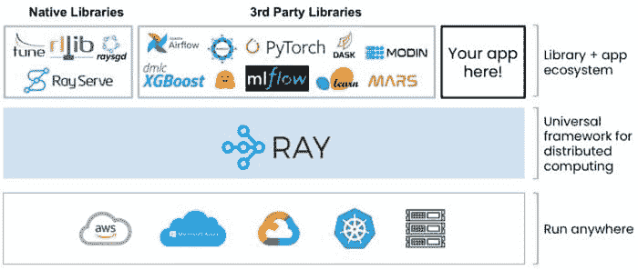

Ray Serve 建立在 Ray 分布式计算平台之上，使其能够轻松扩展到多个机器，无论是在数据中心还是云中。

Ray Serve 是一个易于使用的可扩展模型服务库，建立在 Ray 之上。该库的一些优势包括：

+   可扩展性：横向扩展到数百个进程或机器，同时保持开销在单数字毫秒内

+   多模型组合：轻松组合多个模型，将模型服务与业务逻辑混合，并独立扩展组件，无需复杂的微服务。

+   [批处理](https://docs.ray.io/en/latest/serve/tutorials/batch.html)：原生支持批处理请求，以更好地利用硬件并提高吞吐量。

+   [FastAPI 集成](https://docs.ray.io/en/latest/serve/http-servehandle.html#serve-fastapi-http): 轻松扩展现有的 FastAPI 服务器，或使用其简单优雅的 API 为你的模型定义 HTTP 接口。

+   框架无关：使用一个工具包服务从基于 [PyTorch](https://docs.ray.io/en/master/serve/tutorials/pytorch.html)、[Tensorflow 和 Keras](https://docs.ray.io/en/latest/serve/tutorials/tensorflow.html) 构建的深度学习模型，到 [Scikit-Learn 模型](https://docs.ray.io/en/latest/serve/tutorials/sklearn.html)，再到 [任意 Python 业务逻辑](https://www.anyscale.com/blog/how-ikigai-labs-serves-interactive-ai-workflows-at-scale-using-ray-serve)。

你可以通过查看 [Ray Serve 快速入门](https://docs.ray.io/en/latest/serve/index.html) 开始使用 Ray Serve。

## Ray Serve 在 ML 服务领域的适配


上图显示，在 ML 服务领域，通常存在开发简易性与生产就绪性之间的权衡。

**Web 框架**

部署 ML 服务时，人们通常从最简单的开箱即用系统开始，例如 Flask 或 FastAPI。然而，尽管它们可以很好地提供单次预测，并在概念验证中表现良好，但它们无法实现高性能，扩展通常成本高昂。

**自定义工具**

如果 web 框架失败，团队通常会转向某种自定义工具，通过将多个工具粘合在一起来使系统准备好投入生产。然而，这些自定义工具通常难以开发、部署和管理。

**专门化系统**

有一类专门的系统用于在生产环境中部署和管理 ML 模型。虽然这些系统在管理和服务 ML 模型方面表现出色，但它们通常不如 web 框架灵活，并且学习曲线往往较高。

**Ray Serve**

Ray Serve 是一个专注于 ML 模型服务的 web 框架。它旨在易于使用、易于部署，并且适合生产环境。

### Ray Serve 有什么不同？

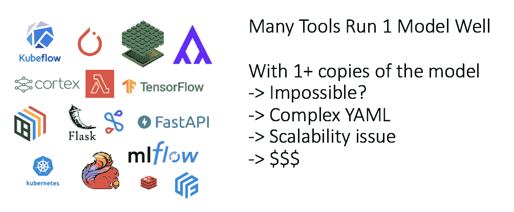

有这么多工具用于训练和服务一个模型。这些工具帮助你很好地运行和部署一个模型。问题在于，现实中的机器学习通常没有那么简单。在生产环境中，你可能会遇到以下问题：

+   处理基础设施以超越一个模型的拷贝进行扩展。

+   需要处理复杂的 YAML 配置文件、学习自定义工具，并开发 MLOps 专业知识。

+   遇到可扩展性或性能问题，无法实现业务 SLA 目标。

+   许多工具非常昂贵，且通常会导致资源的利用不足。

扩展单个模型已经足够困难。对于许多生产中的机器学习用例，我们观察到复杂的工作负载需要将多个不同的模型组合在一起。Ray Serve 天生适用于涉及多个节点的多个模型的这种用例。你可以查看[这部分讲座](https://youtu.be/mM4hJLelzSw?t=651)，我们深入探讨了 Ray Serve 的架构组件。

## 生产中的机器学习模型模式

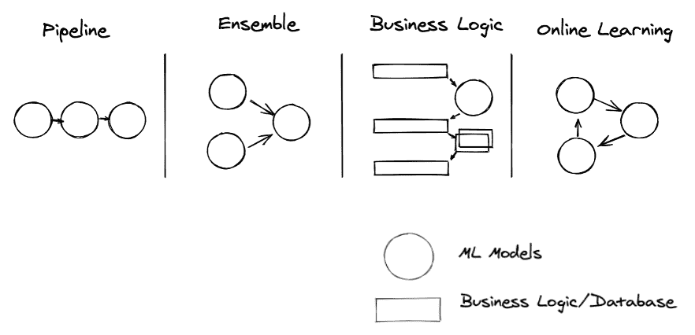

生产中的大部分机器学习应用遵循 4 种模型模式：

+   管道

+   集成

+   业务逻辑

+   在线学习

本节将描述这些模式中的每一种，展示它们的使用方式，讲解现有工具如何实现它们，并展示 Ray Serve 如何解决这些挑战。

### 管道模式


一个典型的计算机视觉管道

上面的图示展示了一个典型的计算机视觉管道，该管道使用多个深度学习模型为图像中的物体生成描述。该管道包括以下步骤：

1) 原始图像经过常见的预处理，如图像解码、增强和裁剪。

2) 检测分类器模型用于识别边界框和类别。它是一只猫。

3) 图像被传递到关键点检测模型中，以识别物体的姿势。对于猫的图像，模型可以识别像爪子、脖子和头部这样的关键点。

4) 最后，一个 NLP 合成模型生成图像所展示的类别。在这个例子中，是一只站立的猫。

典型的管道很少只包含一个模型。为了解决现实中的问题，机器学习应用通常使用多个不同的模型来执行即使是简单的任务。一般而言，管道将一个特定任务拆分为多个步骤，每个步骤由机器学习算法或某些过程解决。现在让我们来看看几个你可能已经熟悉的管道。

**Scikit-Learn 管道**

`Pipeline([(‘scaler’, StandardScaler()), (‘svc’, SVC())])`

[scikit-learn 的管道](https://scikit-learn.org/stable/modules/generated/sklearn.pipeline.Pipeline.html)可以用于将多个“模型”和“处理对象”结合在一起。

**推荐系统**

`[EmbeddingLookup(), FeatureInteraction(), NearestNeighbors(), Ranking()]`

推荐系统中有常见的管道模式。像在[亚马逊](https://www.amazon.science/publications/two-decades-of-recommender-systems-at-amazon-com)和[YouTube](https://research.google/pubs/pub45530/)中看到的物品和视频推荐，通常经过多个阶段，如嵌入查找、特征交互、最近邻模型和排名模型。

**常见预处理**

`[HeavyWeightMLMegaModel(), DecisionTree()/BoostingModel()]`

一些非常常见的用例中，使用了大量的机器学习模型来处理文本或图像的常见处理。例如，在 Facebook，FAIR 的机器学习研究人员团队创建了用于视觉和文本的最先进的重量级模型。然后，不同的产品团队创建下游模型来解决他们的业务用例（例如，[自杀预防](https://ai.facebook.com/blog/under-the-hood-suicide-prevention-tools-powered-by-ai/)），通过使用随机森林实现较小的模型。共享的常见预处理步骤通常会被具体化为[特征存储管道](https://www.tecton.ai/blog/what-is-a-feature-store/)。

### 一般管道实施选项


在 Ray Serve 之前，实现管道通常意味着你必须在将模型封装在网络服务器中或使用许多专门的微服务之间进行选择。

一般来说，实现管道有两种方法：将你的模型封装在一个网络服务器中，或者使用许多专门的微服务。

**将模型封装在网络服务器中**

上图的左侧显示了在网络处理路径中以循环方式运行的模型。每当请求到来时，模型会被加载（也可以被缓存）并通过管道运行。虽然这种方法简单易行，但主要缺陷是难以扩展，并且性能较差，因为每个请求都被顺序处理。

**许多专门的微服务**

上图的右侧显示了许多专门的微服务，你基本上为每个模型构建和部署一个微服务。这些微服务可以是本地机器学习平台，[Kubeflow](https://www.kubeflow.org/)，甚至是像 AWS [SageMaker](https://aws.amazon.com/sagemaker/)这样的托管服务。然而，随着模型数量的增加，复杂性和操作成本急剧上升。

### 在 Ray Serve 中实现管道

```py
@serve.deployment
class Featurizer: …

@serve.deployment
class Predictor: …

@serve.deployment
class Orchestrator
   def __init__(self):
      self.featurizer = Featurizer.get_handle()
      self.predictor = Predictor.get_handle()

   async def __call__(self, inp):
      feat = await self.featurizer.remote(inp)
      predicted = await self.predictor.remote(feat)
      return predicted

if __name__ == “__main__”:
    Featurizer.deploy()
    Predictor.deploy()
    Orchestrator.deploy()
```

伪代码展示了 Ray Serve 如何允许部署调用其他部署

在 Ray Serve 中，你可以在你的部署内直接调用其他部署。在上面的代码中，有三个部署。`Featurizer`和`Predictor`只是包含模型的常规部署。`Orchestrator`接收网络输入，通过 featurizer handle 将其传递给特征提取过程，然后将计算出的特征传递给预测过程。接口只是 Python，你无需学习任何新的框架或领域特定语言。

Ray Serve 通过一种名为 ServeHandle 的机制实现这一点，它赋予你将所有内容嵌入到网络服务器中的类似灵活性，而不会牺牲性能或可扩展性。它允许你直接调用存在于其他节点上其他进程中的其他部署。这使你能够单独扩展每个部署，并在副本之间进行负载均衡。

如果你想深入了解它是如何工作的，[查看 Simon Mo 演讲的这一部分](https://youtu.be/mM4hJLelzSw?t=650) 以了解 Ray Serve 的架构。如果你想了解生产中的计算机视觉管道的示例，[查看 Robovision 如何使用 5 个 ML 模型进行车辆检测](https://www.anyscale.com/blog/the-third-generation-of-production-ml-architectures#:~:text=A%20Tool%20for%20High%20Performance%20ML%20Systems)。

## 集成模式

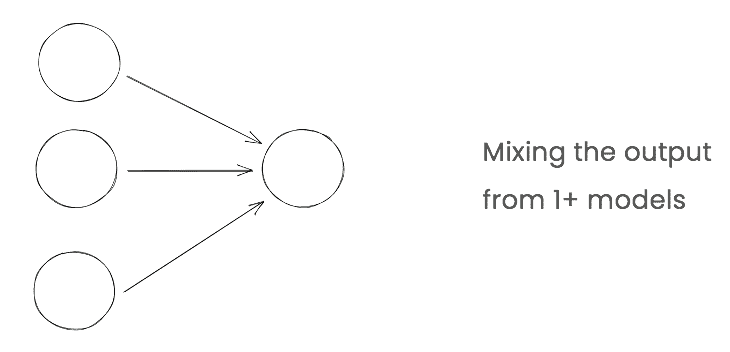

在许多生产使用案例中，管道是合适的。然而，管道的一个限制是，给定的下游模型往往有许多上游模型。这时，集成就显得很有用。


集成使用案例

集成模式涉及将一个或多个模型的输出混合。在某些情况下，它们也被称为模型堆叠。以下是三种集成模式的使用案例。

**模型更新**

新模型随着时间的推移不断开发和训练。这意味着在生产中总会有新版本的模型。问题在于，你如何确保新模型在实时在线流量场景中有效和性能良好？一种方法是将部分流量通过新模型。你仍然选择已知良好的模型的输出，但你也在收集新版本模型的实时输出以进行验证。

**聚合**

最广为人知的使用案例是聚合。对于回归模型，多模型的输出会被平均。对于分类模型，输出将是多个模型输出的投票结果。例如，如果两个模型投票选猫，一个模型投票选狗，则聚合后的输出将是猫。聚合有助于对抗单个模型的不准确性，并且通常使输出更准确和“安全”。

**动态选择**

集成模型的另一个使用案例是根据输入属性动态进行模型选择。例如，如果输入包含猫，则使用模型 A，因为它专门针对猫。如果输入包含狗，则使用模型 B，因为它专门针对狗。请注意，这种动态选择并不一定意味着管道本身必须是静态的。它也可以根据用户反馈选择模型。

### 通用集成实现选项

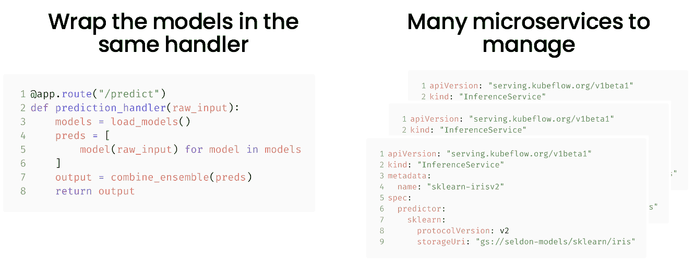

在 Ray Serve 之前，实现集成通常意味着你必须在将模型封装在网络服务器中或使用许多专门的微服务之间做出选择。

集成实现面临与管道相同的问题。虽然将模型封装在网络服务器中很简单，但性能却不足。当使用专门的微服务时，随着微服务数量的增加，你会面临大量的操作开销。

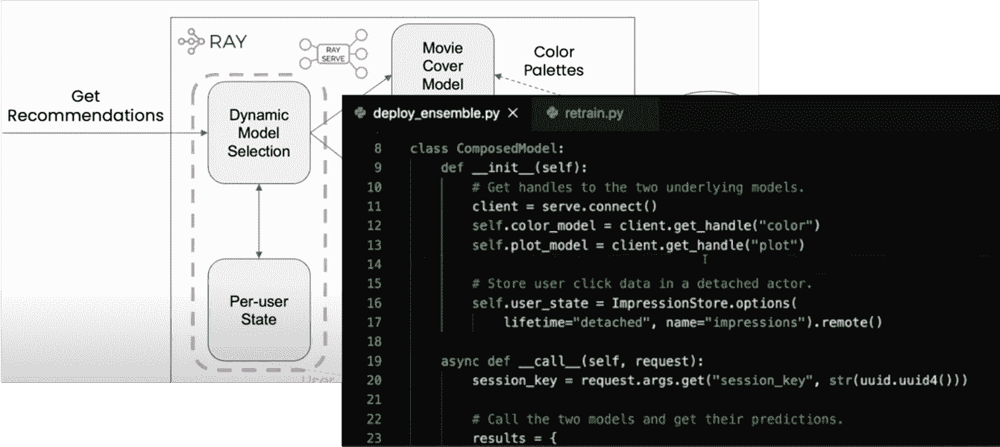

[2020 Anyscale 演示](https://youtu.be/8GTd8Y_JGTQ)中的集成示例

使用 Ray Serve，这种模式非常简单。你可以查看[2020 Anyscale 演示](https://youtu.be/8GTd8Y_JGTQ)，以了解如何利用 Ray Serve 的处理机制来执行动态模型选择。

另一个使用 Ray Serve 进行集成的例子是 Wildlife Studios 将多个分类器的输出结合起来进行单一预测。你可以查看他们如何[用 Ray Serve 提供游戏内优惠速度提高 3 倍](https://www.anyscale.com/blog/wildlife-studios-serves-in-game-offers-3x-faster-at-1-10th-the-cost-with-ray)。

## 业务逻辑模式

生产化机器学习将始终涉及业务逻辑。没有模型可以单独存在并自行处理请求。业务逻辑模式涉及到所有常见 ML 任务中与 ML 模型推理无关的内容。这包括：

+   关系记录的数据库查询

+   对外部服务的 Web API 调用

+   特征存储查找预计算特征向量

+   特征转换，如数据验证、编码和解码。

### 一般业务逻辑实施选项

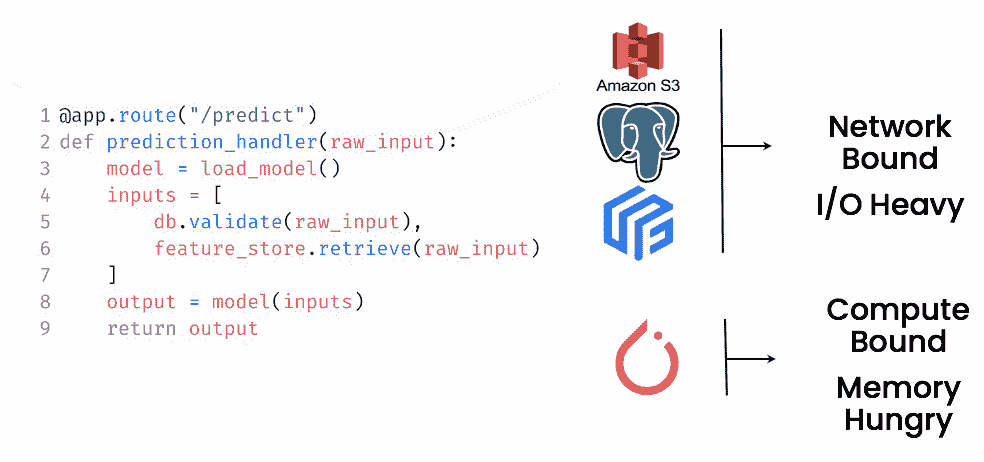

上述 web 处理程序的伪代码执行以下操作：

1.  它加载模型（假设从 S3）

1.  验证来自数据库的输入

1.  从特征存储中查找一些预计算的特征。

仅在 web 处理程序完成这些业务逻辑步骤后，输入才会传递给 ML 模型。问题在于模型推理和业务逻辑的要求导致服务器*既受网络限制又受计算限制*。这是因为模型加载步骤、数据库查询和特征存储查询是网络限制和 I/O 密集型的，而模型推理则受计算限制且内存需求大。这些因素的组合导致了资源利用效率低下。扩展将会很昂贵。

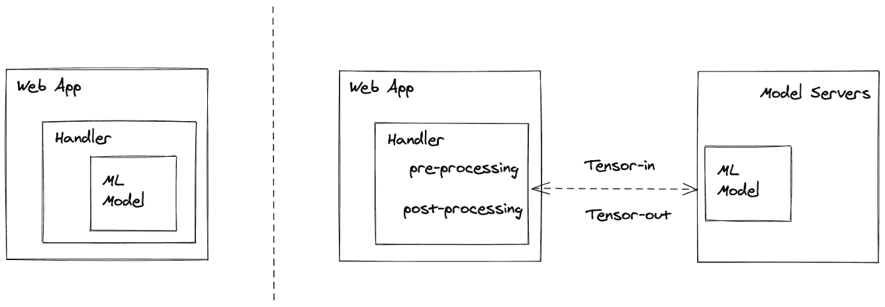

Web 处理程序方法（左）和微服务方法（右）

提高利用率的一种常见方法是将模型拆分到模型服务器或微服务中。

Web 应用程序纯粹受网络限制，而模型服务器则受计算限制。然而，一个常见的问题是二者之间的接口。如果你把过多的业务逻辑放入模型服务器，那么模型服务器将变成网络限制和计算限制调用的混合体。

如果你让模型服务器成为纯模型服务器，那么你就会遇到“**张量输入，张量输出**”接口问题。模型服务器的输入类型通常仅限于张量或其某种替代形式。这使得保持预处理、后处理和业务逻辑与模型本身的同步变得困难。

在训练过程中，由于处理逻辑和模型紧密耦合，因此很难推理处理逻辑与模型本身之间的交互，但在服务时，它们被拆分到两个服务器和两个实现中。

无论是 Web 处理程序方法还是微服务方法都不令人满意。

### 在 Ray Serve 中实现业务逻辑


Ray Serve 中的业务逻辑

使用 Ray Serve，你只需对旧的 Web 服务器进行一些简单的更改，就可以缓解上述问题。你可以检索一个包装了模型的 ServeHandle，而不是直接加载模型，将计算任务卸载到另一个部署中。所有数据类型都被保留，不需要编写“tensor-in, tensor-out” API 调用--你可以直接传入普通的 Python 类型。此外，模型部署类可以保留在同一个文件中，与预测处理程序一起部署。这使得理解和调试代码变得简单。`model.remote` 看起来只是一个函数，你可以轻松追踪到模型部署类。

通过这种方式，Ray Serve 帮助你将业务逻辑和推理拆分为两个独立的组件，一个 I/O 密集型，另一个计算密集型。这使你可以单独扩展每个组件，而不会失去部署的便利性。此外，因为 `model.remote` 只是一个函数调用，所以比单独的外部服务更容易测试和调试。

### Ray Serve FastAPI 集成

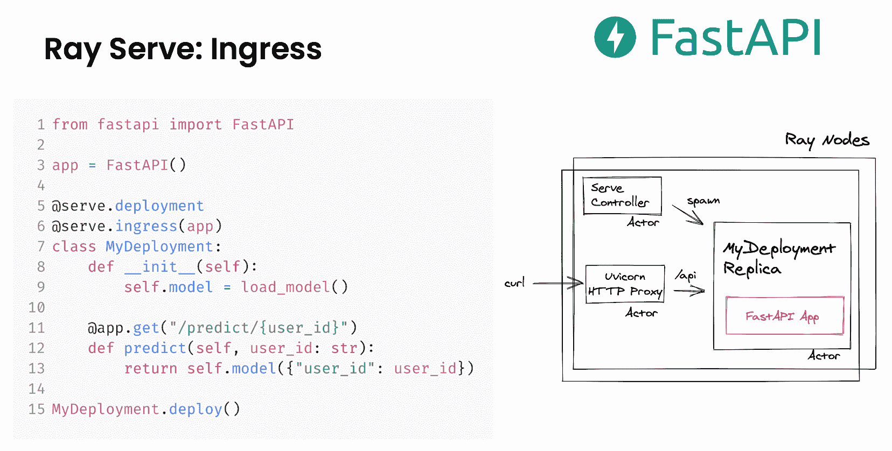

Ray Serve: 使用 FastAPI 的入口

实现业务逻辑和其他模式的一个重要部分是身份验证和输入验证。[Ray Serve 本地集成了 FastAPI](https://docs.ray.io/en/latest/serve/http-servehandle.html#serve-fastapi-http)，这是一个类型安全且符合人体工程学的 Web 框架。[FastAPI](https://fastapi.tiangolo.com/) 具有自动依赖注入、类型检查和验证以及 OpenAPI 文档生成等功能。

使用 Ray Serve，你可以直接将 FastAPI 应用对象传入，并使用 `@serve.ingress` 装饰器。这个装饰器确保所有现有的 FastAPI 路由仍然有效，并且你可以通过部署类附加新的路由，以便像加载的模型和网络数据库连接这样的状态可以轻松管理。在架构上，我们只是确保你的 FastAPI 应用正确地嵌入到副本演员中，并且 FastAPI 应用可以在多个 Ray 节点上扩展。

## 在线学习

在线学习是一种新兴模式，使用越来越广泛。它指的是在生产中运行的模型不断被更新、训练、验证和部署。以下是在线学习模式的三个用例。

**动态学习模型权重**

有动态学习模型权重的使用案例。当用户与你的服务互动时，这些更新的模型权重可以有助于为每个用户或群体提供个性化的模型。

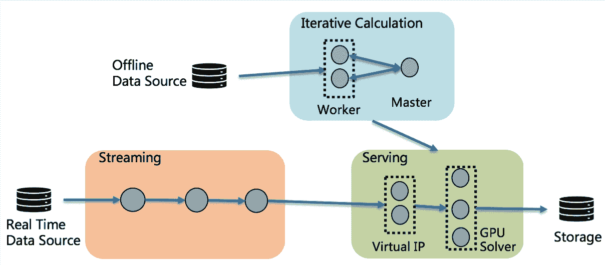

[Ant Group 的在线学习示例](https://www.anyscale.com/blog/online-resource-allocation-with-ray-at-ant-group)（图片由 Ant Group 提供）

一个在线学习的案例研究包括 Ant Group 的在线资源分配业务解决方案。该模型从离线数据中训练，然后与实时流数据源结合，最后提供实时流量。值得注意的是，在线学习系统比静态服务系统复杂得多。在这种情况下，将模型放在 Web 服务器中，甚至拆分成多个微服务，都无法帮助实现。

**动态学习参数以协调模型**

还有一些使用案例是学习参数以协调或组合模型，例如，[学习用户喜欢哪个模型](https://dl.acm.org/doi/fullHtml/10.1145/3383313.3411550)。这通常出现在模型选择场景或上下文赌博算法中。

**强化学习**

强化学习是机器学习的一个分支，训练智能体与环境进行互动。环境可以是物理世界或模拟环境。你可以在[这里](https://www.anyscale.com/blog/an-introduction-to-reinforcement-learning-with-openai-gym-rllib-and-google)了解强化学习，并查看如何使用 Ray Serve 部署 RL 模型[这里](https://docs.ray.io/en/latest/serve/tutorials/rllib.html#serve-rllib-tutorial)。

## 结论

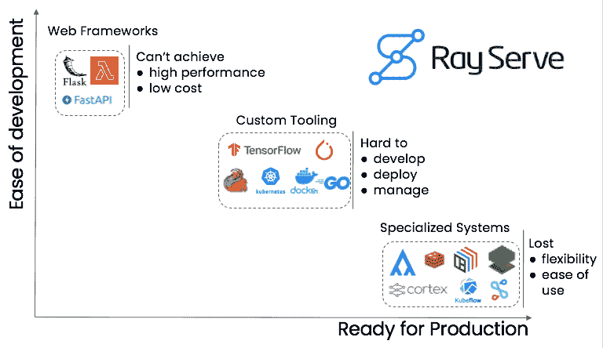

Ray Serve 易于开发并准备投入生产。

本文介绍了生产环境中机器学习的 4 种主要模式，Ray Serve 如何帮助你原生扩展和处理复杂架构，以及生产中的机器学习通常意味着许多模型在生产。Ray Serve 在分布式运行时 Ray 的基础上，考虑了所有这些因素。如果你对 Ray 感兴趣，可以查看[文档](https://ray.io/)，加入我们的[讨论区](https://discuss.ray.io/)，并查看[白皮书](https://tinyurl.com/ray-white-paper)！如果你有兴趣与我们合作，使 Ray 的使用变得更容易，我们正在[招聘](https://jobs.lever.co/anyscale)！

[原文](https://www.anyscale.com/blog/serving-ml-models-in-production-common-patterns)。转载授权。

**相关：**

+   使用 PyTorch 和 Ray 入门分布式机器学习

+   如何加速 Scikit-Learn 模型训练

+   如何构建数据科学投资组合

### 关于这个话题的更多内容

+   [前 7 名模型部署与服务工具](https://www.kdnuggets.com/top-7-model-deployment-and-serving-tools)

+   [为生产环境优先排序数据科学模型](https://www.kdnuggets.com/2022/04/prioritizing-data-science-models-production.html)

+   [Feature Store 峰会 2023：部署 ML 模型的实用策略](https://www.kdnuggets.com/2023/09/hopsworks-feature-store-summit-2023-practical-strategies-deploying-ml-models-production-environments)

+   [MLOps 中的机器学习设计模式](https://www.kdnuggets.com/2022/02/design-patterns-machine-learning-mlops.html)

+   [揭示隐藏模式：层次聚类介绍](https://www.kdnuggets.com/unveiling-hidden-patterns-an-introduction-to-hierarchical-clustering)

+   [机器学习算法的完整端到端部署](https://www.kdnuggets.com/2021/12/deployment-machine-learning-algorithm-live-production-environment.html)
