# 在 AWS EC2 上设置和使用 JupyterHub (TLJH)

> 原文：[`www.kdnuggets.com/2023/01/setup-jupyterhub-tljh-aws-ec2.html`](https://www.kdnuggets.com/2023/01/setup-jupyterhub-tljh-aws-ec2.html)

视频教程

Jupyter Notebook 是一个开源应用程序，广泛用于学术界和工业界。该交互式计算应用程序由渲染使用 Markdown 语法编写的说明性文本的单元和执行编程代码（包括 Python、R、Julia 和 Scala）的单元组成。这意味着笔记本可以在同一文档中包含文本、代码和可视化内容。Jupyter Notebook 可以在本地机器上使用，或者如我在以前的教程中提到的，[在云端](https://medium.com/p/61a9648db6c5) 使用。然而，问题是 Jupyter Notebook 仅设计为单用户使用。JupyterHub 旨在解决这个问题。JupyterHub 是一个多用户、容器友好的（例如 Docker、Kubernetes 等）Jupyter Notebook 版本，旨在为拥有许多[好处](https://jupyter.org/)的组织提供服务，包括：

+   管理用户和身份验证（例如 PAM、OAuth、[SSO](https://saturncloud.io/blog/setting-up-jupyterhub-with-single-sign-on-sso-aws/) 等）

+   在云中（例如 AWS、Azure、[Google Cloud](https://tljh.jupyter.org/en/latest/install/google.html) 等）或在您自己的硬件（本地）上创建可共享、可扩展且可自定义的计算资源和数据科学环境

+   减轻用户的安装和维护任务。

* * *

## 我们的三大课程推荐

 1\. [Google 网络安全证书](https://www.kdnuggets.com/google-cybersecurity) - 快速进入网络安全领域的职业生涯。

 2\. [Google 数据分析专业证书](https://www.kdnuggets.com/google-data-analytics) - 提升您的数据分析技能

 3\. [Google IT 支持专业证书](https://www.kdnuggets.com/google-itsupport) - 支持您的组织进行 IT 管理

* * *

JupyterHub 有两个版本：

+   Zero-to-JupyterHub (ZTJH)，一个基于 Kubernetes 的 JupyterHub 多节点版本

+   Littlest JupyterHub (TLJH) 是 JupyterHub 的单节点版本。

本教程在很大程度上超越了[官方 JupyterHub 设置教程中如何在 AWS 上设置 JupyterHub (TLJH)](https://tljh.jupyter.org/en/latest/install/amazon.html#step-3-install-conda-pip-packages-for-all-users)，希望图像和[YouTube 视频](https://youtu.be/h4E4ZvUhYZE)能使您在这个 15 步以上的过程中特别少遇到问题。

1). 访问 [Amazon Web Services 的网站](https://aws.amazon.com/) 并点击“登录”（如果没有 AWS 账户，请创建一个）。


在**登录**页面，选择**根用户**（A）或**IAM 用户**（B）。输入你的电子邮件。如果你是 IAM 用户，请确保拥有适当的权限，以便至少可以创建 AWS EC2 实例。

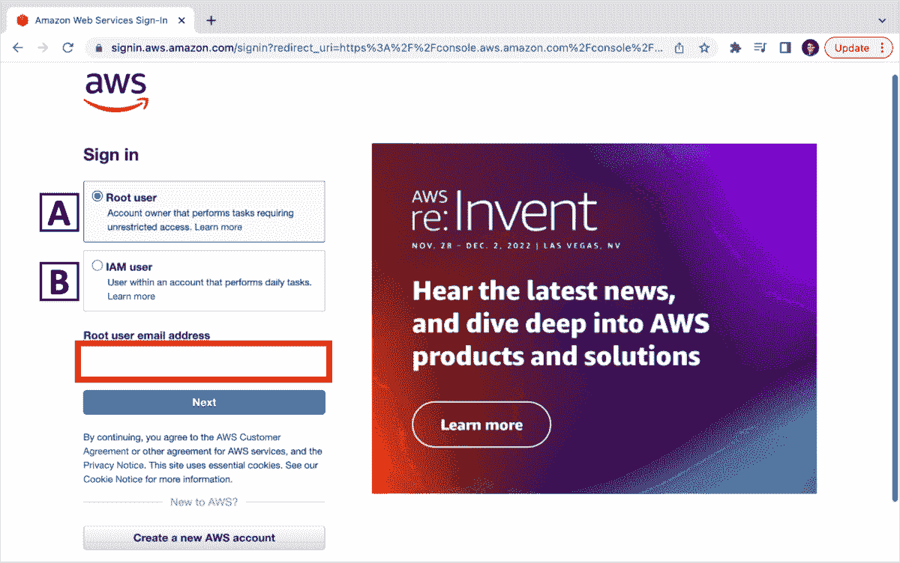

官方教程强调，你应该根据 JupyterHub 用户的位置选择 AWS 区域。

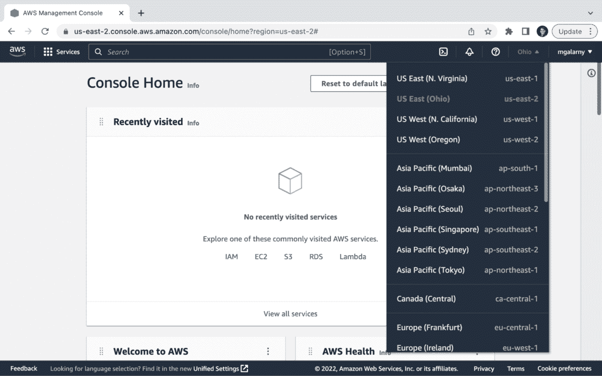

点击**EC2**。如果没有看到它，请使用屏幕顶部的搜索栏输入 EC2。


在仪表板 | EC2 管理控制台中，点击**实例**。如果这个屏幕看起来有些不同，请注意我已切换**到新 EC2 体验**。

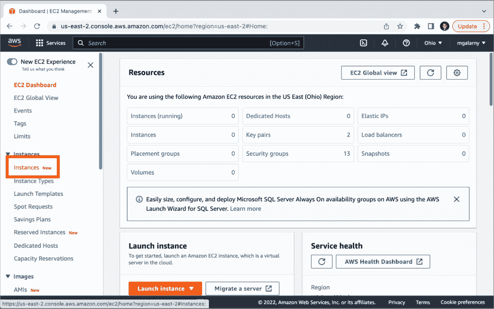

点击**启动实例**（按钮也可能标记为**启动实例**）。

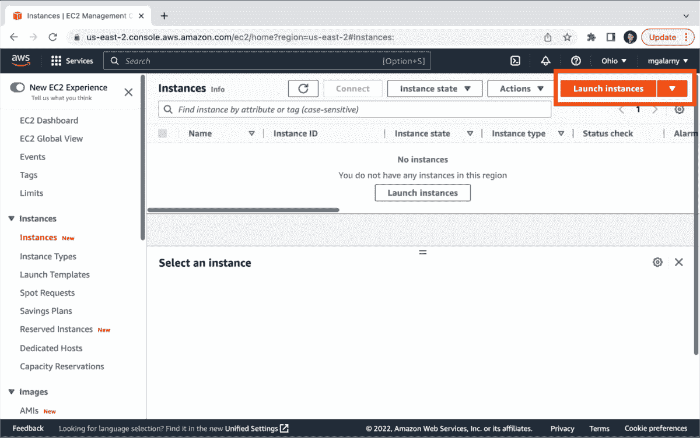

为你的实例命名并[可选]添加标签。AWS 表示“标签是你分配给 AWS 资源的标记。” 我建议你给实例一个名称和标签，以识别实例的用途（例如，MyJupyterHubTutorial）。


转到**应用程序和操作系统镜像（Amazon Machine Image）**并选择 Ubuntu 18.04 LTS 版本，**Ubuntu 20.04 LTS（本教程使用的版本）**，Ubuntu 22.04 LTS（如果选择此 AMI，请参见**潜在错误**部分），或 TLJH 支持的其他版本。

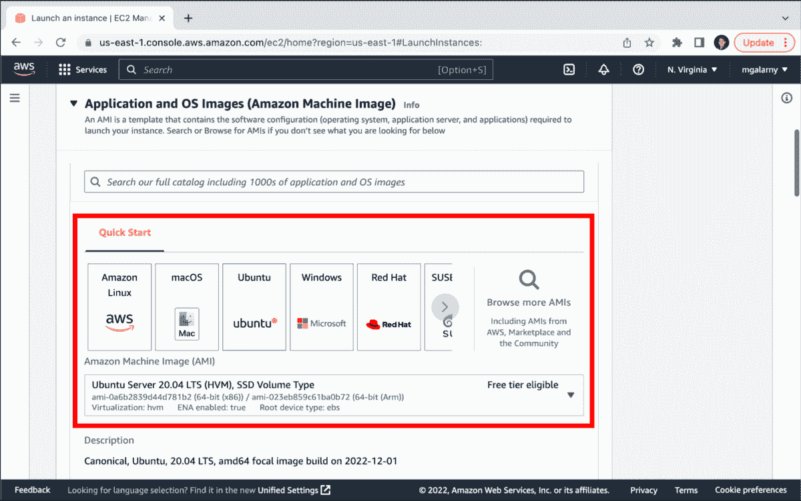

转到**实例类型**。在选择实例之前，我强烈推荐查看 [每个实例的费用](https://instances.vantage.sh/) 以及 JupyterHub 的指南，了解根据并发用户数量估算 [所需的内存 / GPU / 磁盘空间](https://tljh.jupyter.org/en/latest/howto/admin/resource-estimation.html#howto-admin-resource-estimation)。基本上，你至少需要使用具有 1GB+（基本上 t2.micro 或更高）的 RAM 的服务器，但我发现 8GB+（t2.large 或更高）更适合我的需求（教学和数据科学实践）。如果我知道使用 JupyterHub 的人会执行需要多个核心的任务（特别是使用 [Ray](https://www.anyscale.com/blog/writing-your-first-distributed-python-application-with-ray)/Dask/Spark），我会选择具有更多 vCPU 的实例（t2.micro: 1 vCPU, t2.large: 2vCPU, t2.2xlarge: 8vCPU）。

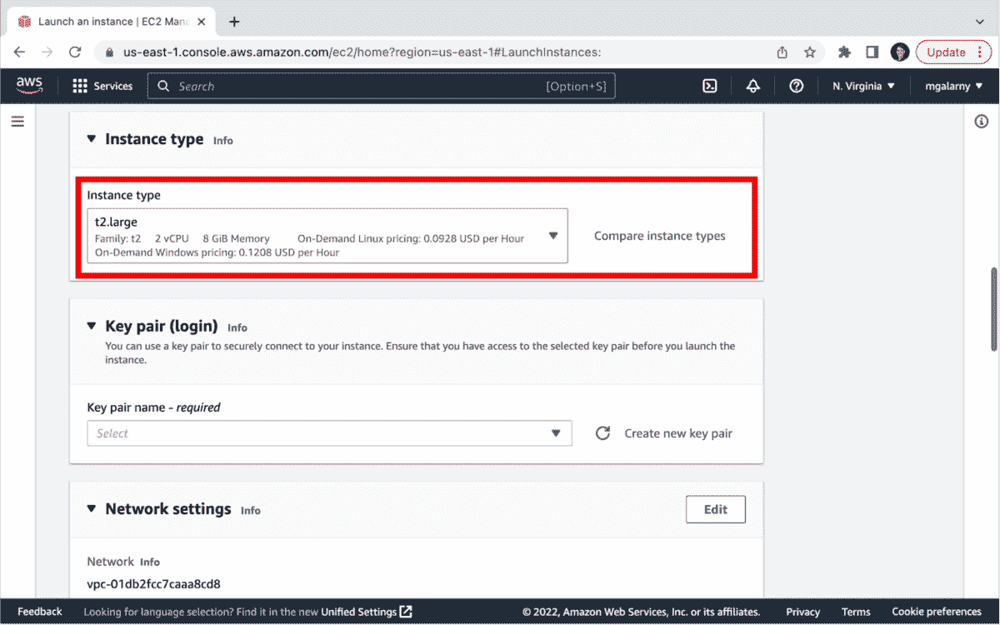

确保记住使用 AWS 会产生费用（除非你有免费积分）。

8). 转到**密钥对（登录）**。选择一个现有的密钥对或**创建新密钥对**（如下图所示）。如果创建密钥对，请务必下载并将其保存在安全的地方。您将无法替换它。选择密钥对是一个重要步骤，因为您需要密钥才能通过 SSH 访问您的实例或轻松下载文件。

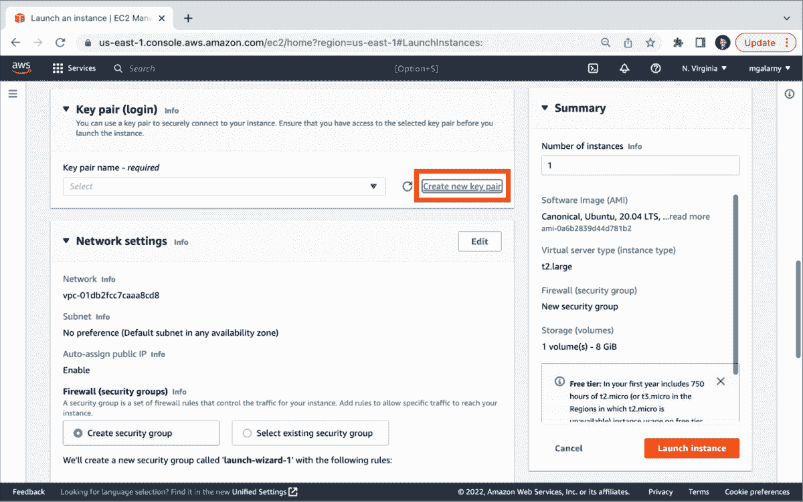

点击**创建新密钥对**后，输入您的密钥对名称（例如，MyJupyterHubTutorial_pem），然后点击**创建密钥对**（下图的右下角）。

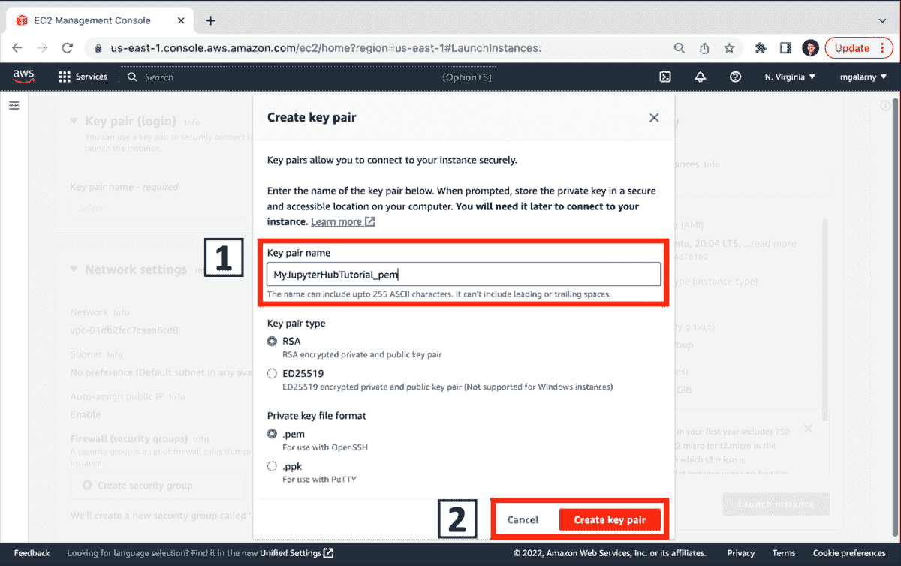

> **注意：** 如果您使用的是 Windows，可以选择 ppk 格式。然而，我更喜欢在 Windows 上使用 GOW（如我的[**通过 SSH 连接到 EC2 实例教程**](https://medium.com/@GalarnykMichael/aws-ec2-part-2-ssh-into-ec2-instance-c7879d47b6b2)所示），这样您可以在 Windows 上使用 pem 文件（而无需 PuTTY）。

9). 转到**网络设置**。这是教程的部分，您可以在其中创建安全组或选择现有的安全组。这将影响如何访问您的实例。在本教程中，您可能需要检查以下内容

+   允许 SSH 流量

+   允许来自互联网的 HTTPS 流量（[您可以在启动 EC2 实例后启用 HTTPS](https://tljh.jupyter.org/en/latest/howto/admin/https.html#howto-admin-https)）

+   允许来自互联网的 HTTP 流量

点击这些选项将创建 3 个安全组。

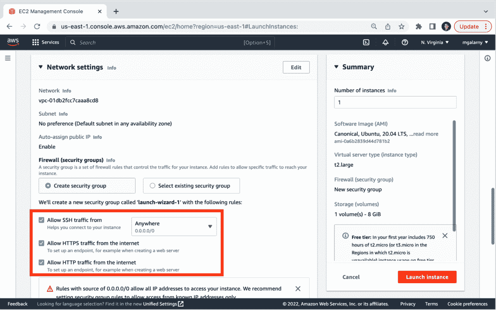

可选地，您还可以通过点击编辑来查看这些安全组。这也将允许您更改安全组名称。

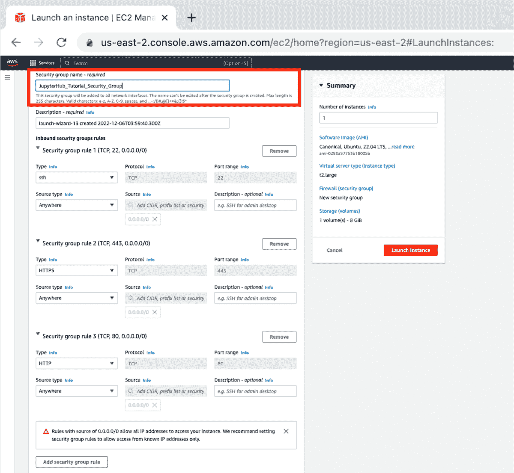

在此图像中，安全组 1 允许使用端口 22 进行 SSH 访问（图像来自我尝试使用 Ubuntu 22.04 而不是 Ubuntu 20.04 时的情况）。

10). 转到**配置存储**。这允许您选择所需的存储量（GiB 数量）以及[卷类型](https://docs.aws.amazon.com/AWSEC2/latest/UserGuide/ebs-volume-types.html)（例如，gp2、gp3、io1、io2、sc1、st1、标准）。对于本教程，我选择的是第 6 步中所选 AMI 的默认存储（gp2）。


在此图像中，安全组 1 允许使用端口 22 进行 SSH 访问（图像来自我尝试使用 Ubuntu 22.04 而不是 Ubuntu 20.04 时的情况）。如果您喜欢使用不同的存储类型，如 gp3，请告诉我。[gp3 似乎比 gp2 更具成本效益。](https://aws.amazon.com/blogs/storage/migrate-your-amazon-ebs-volumes-from-gp2-to-gp3-and-save-up-to-20-on-costs/)

11) 转到**高级详情**，然后向下滚动到用户数据。

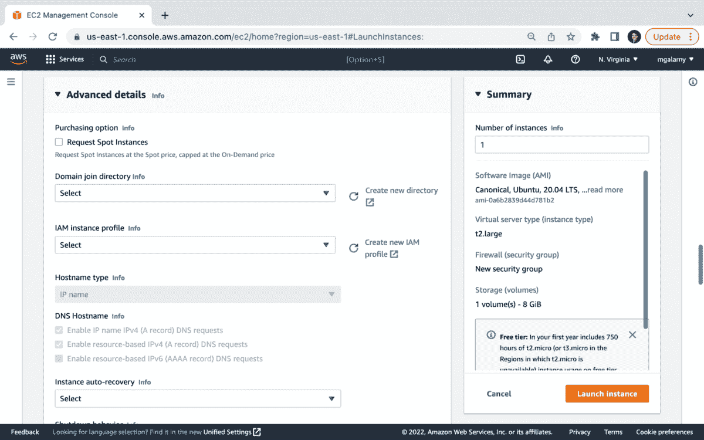

这个步骤涉及提供一个在启动实例时运行的命令脚本。下面的安装脚本将安装 JupyterHub（[安装程序做了什么](https://tljh.jupyter.org/en/latest/topic/installer-actions.html#topic-installer-actions)）。**在将文本粘贴到用户数据之前，至少需要将<admin-user-name>替换为管理员用户（例如 mgalarnyk）。** 脚本中没有设置密码，因为稍后将在本教程中进行设置。然而，安装脚本可以[修改以添加密码、添加额外的管理员用户、在用户环境中安装 python 包，以及安装插件](https://tljh.jupyter.org/en/latest/topic/customizing-installer.html#topic-customizing-installer)。

```py
#!/bin/bash
curl -L https://tljh.jupyter.org/bootstrap.py \
| sudo python3 - \
--admin <admin-user-name> \
--show-progress-page
```

**代码说明：** 代码`--show-progress-page`将在实例启动后不久创建一个临时的“TLJH 正在构建”进度页面，这样你可以很快看到安装是否顺利。

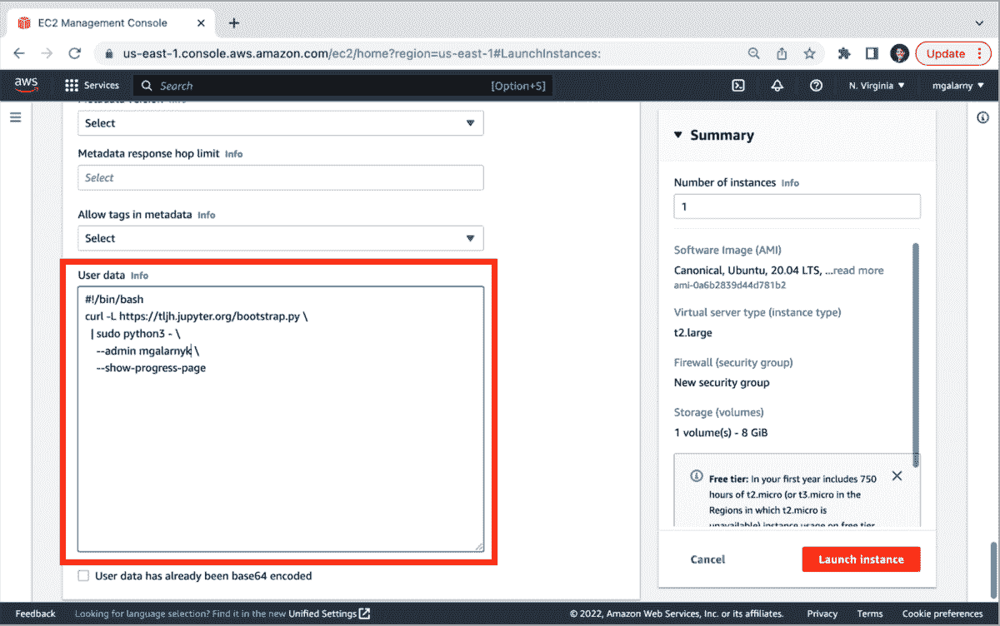

注意，如果你在启动 JupyterHub 后想要进行更改，你可以随时[安装额外的 conda、pip 或 apt 包](https://tljh.jupyter.org/en/latest/howto/env/user-environment.html#howto-env-user-environment)，以及[添加/移除管理员用户](https://tljh.jupyter.org/en/latest/howto/admin/admin-users.html)。

12). 转到**摘要**并点击启动实例。

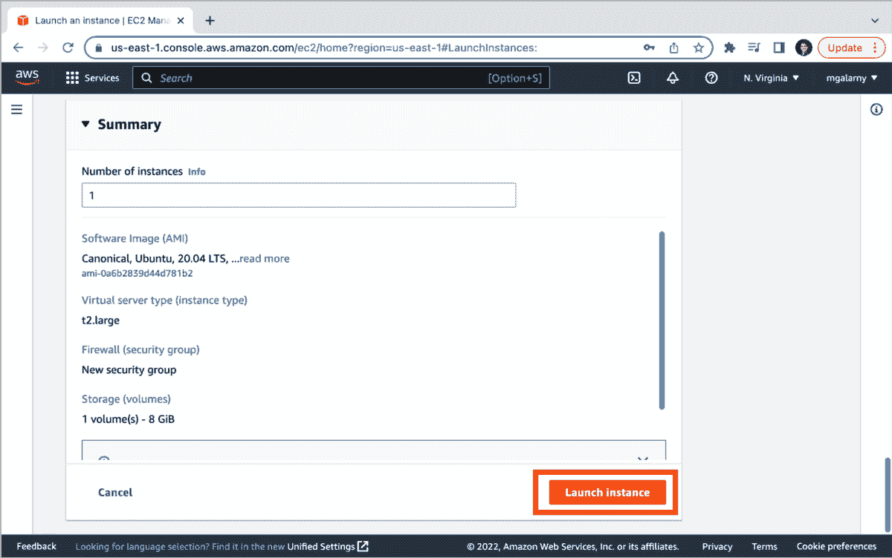

13). 在**启动状态**通知屏幕上，点击链接。它会带你到**EC2 管理控制台**。


14). 你现在应该在 EC2 管理控制台中。这个步骤需要一点耐心，因为你需要等待 JupyterHub 安装完成。官方文档说这可能需要 10 分钟以上（对我来说要快得多）。

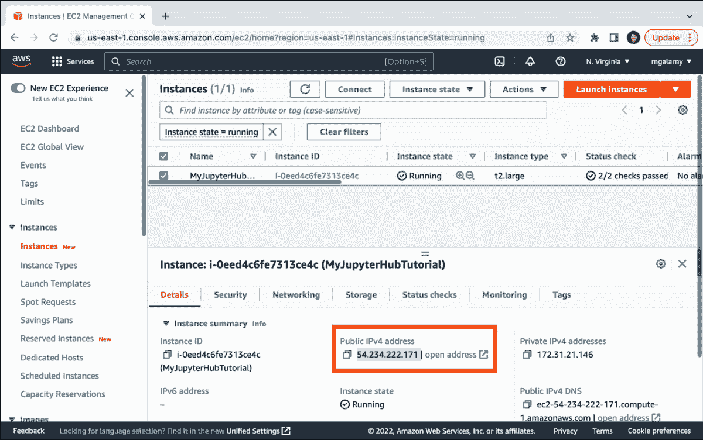

这是你可以找到公共地址的一个位置

你可以通过将**公共地址**复制到浏览器中查看服务器是否正在设置（我推荐使用 chrome）。

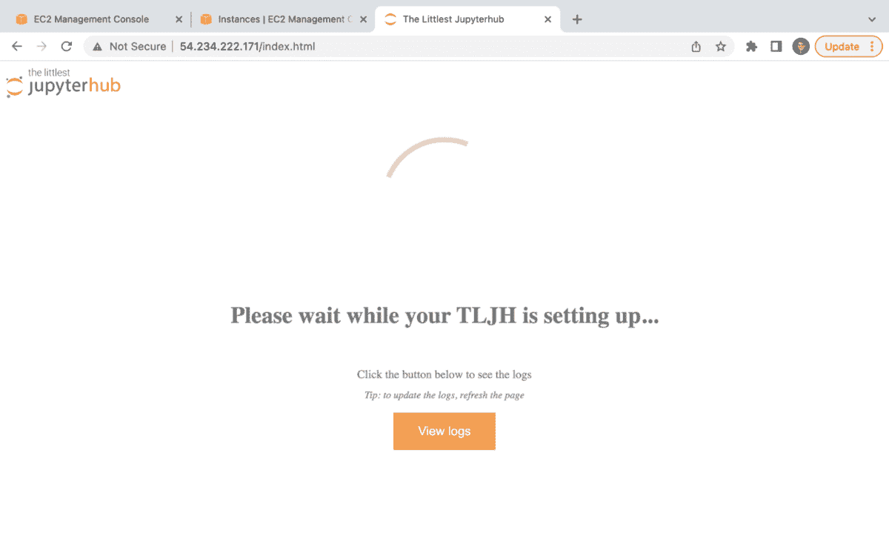

几分钟后，将**公共地址**复制到新的标签页中，系统会要求你登录。

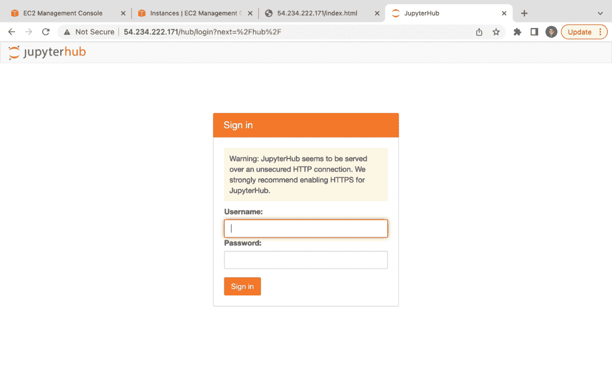

你可以[在这里](https://saturncloud.io/blog/securing-jupyterhub/)学习如何为 JupyterHub 设置 HTTPS 和 SSL。

15). 输入在第 11 步中指定的管理员用户名（例如 mgalarnyk）并输入一个可以是 7 个字符或更长的密码。

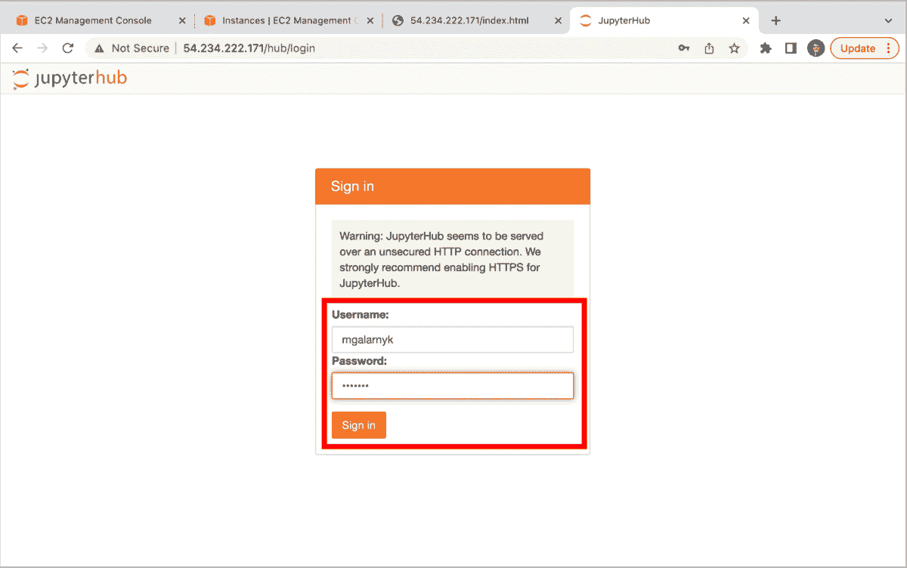

**注意**，第 11 步中的安装脚本可能已经被[修改以添加密码、添加额外的管理员用户、在用户环境中安装 python 包以及安装插件](https://tljh.jupyter.org/en/latest/topic/customizing-installer.html#topic-customizing-installer)。

**点击“登录”，欢迎使用 JupyterHub！**

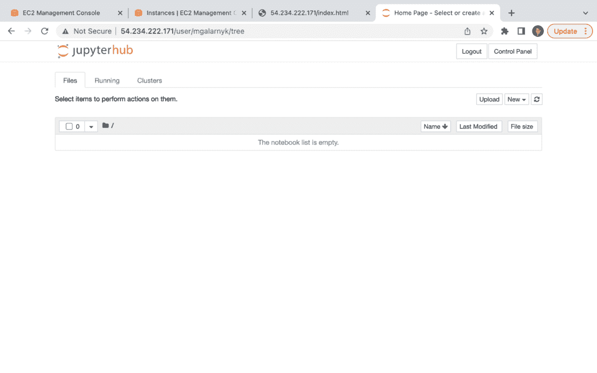

如果您想在启动 JupyterHub 后进行更改，可以随时[安装额外的 conda、pip 或 apt 包](https://tljh.jupyter.org/en/latest/howto/env/user-environment.html#howto-env-user-environment)，以及[添加/删除管理员用户](https://tljh.jupyter.org/en/latest/howto/admin/admin-users.html)。

## 潜在错误

**404 页面未找到**

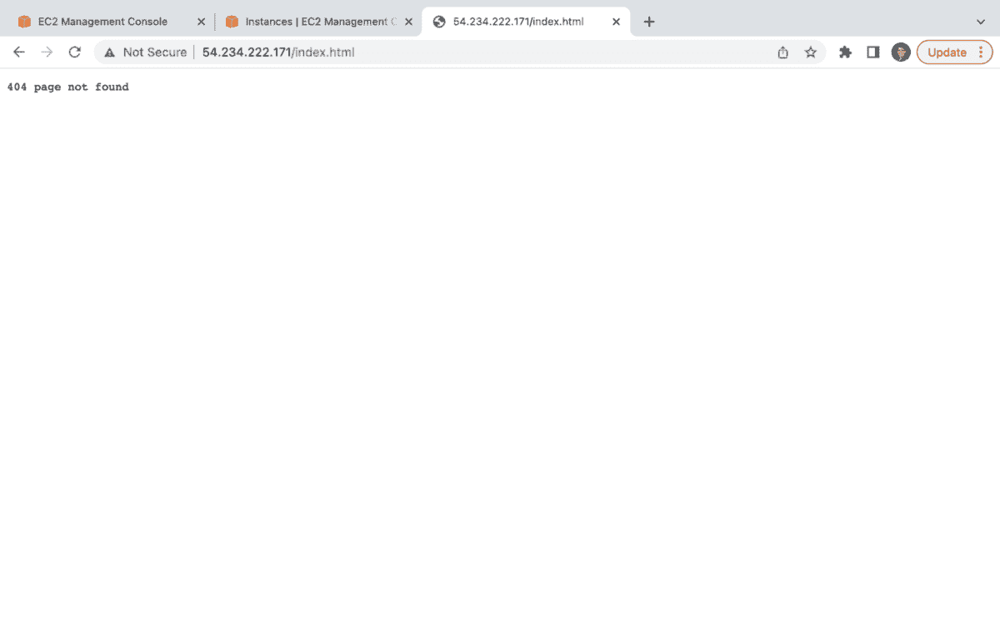

可能有多种原因导致此错误。如果在“请稍候，您的 TLJH 正在设置中”屏幕后出现此错误，[可能只是将地址复制到另一个标签页中](https://youtu.be/h4E4ZvUhYZE?t=379)。

**‘连接被拒绝’错误在重启服务器后**

查看[官方文档](https://tljh.jupyter.org/en/latest/troubleshooting/providers/amazon.html)以了解如何解决此问题。

**无法访问此网站**


我最初想使用 Ubuntu 22.04 创建此教程，但当我在浏览器中输入 IP 地址时遇到了此错误（当然，还有其他原因可能导致错误）。如果您想使用 Ubuntu 22.04，解决此问题的一个可能方法是检查 EC2 管理控制台中的系统日志，以确认是否为 curl 问题，并根据[此 askubuntu 帖子](https://askubuntu.com/questions/1387141/curl-23-failure-writing-output-to-destination)的建议修改安装脚本。

# 结论

本教程介绍了如何在 AWS 上设置 Jupyterhub (TLJH)。安装可能需要相当长的时间进行设置，并且管理起来可能会更久。如果您不想处理安装和维护服务器，您可以使用[Saturn Cloud](https://saturncloud.io/?utm_source=mgalarnyk)这样的产品。不管怎样，如果您对教程有疑问或意见，欢迎通过[YouTube](https://youtu.be/h4E4ZvUhYZE)或[Twitter](https://twitter.com/GalarnykMichael)与我联系。

**[迈克尔·加拉尼克](https://www.linkedin.com/in/michaelgalarnyk/)** 是一名数据科学专家，目前在 Parallel Domain 担任产品营销内容负责人。

### 更多相关话题

+   [如何在 Jupyter Notebook 上设置 Julia](https://www.kdnuggets.com/2022/11/setup-julia-jupyter-notebook.html)

+   [云和数据迁移到 AWS 云的 11 个最佳实践](https://www.kdnuggets.com/2023/04/11-best-practices-cloud-data-migration-aws-cloud.html)

+   [使用 Datawig，AWS 深度学习库进行缺失值插补](https://www.kdnuggets.com/2021/12/datawig-aws-deep-learning-library-missing-value-imputation.html)

+   [AWS AI & ML 奖学金计划概述](https://www.kdnuggets.com/2022/09/aws-ai-ml-scholarship-program-overview.html)

+   [现在 AWS 的前 8 门 GenAI 课程](https://www.kdnuggets.com/top-8-genai-courses-for-aws-to-take-now)

+   [忘记 PIP、Conda 和 requirements.txt！改用 Poetry 吧，之后你会感谢的…](https://www.kdnuggets.com/2023/07/forget-pip-conda-requirementstxt-poetry-instead-thank-later.html)
