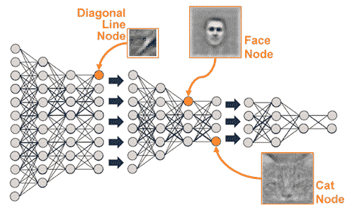

# 掌握 Python 机器学习的 7 个步骤

> 原文：[`www.kdnuggets.com/2015/11/seven-steps-machine-learning-python.html/2`](https://www.kdnuggets.com/2015/11/seven-steps-machine-learning-python.html/2)

### 第 4 步：开始使用 Python 进行机器学习

+   Python。*完成*。

+   机器学习基础知识。*完成*。

+   Numpy。*完成*。

+   Pandas。*完成*。

+   Matplotlib。*完成*。

时候到了。让我们开始使用 Python 的*事实上的*标准机器学习库 scikit-learn 来实现机器学习算法。

scikit-learn 流程图。

许多后续教程和练习将由 iPython（Jupyter）Notebook 驱动，这是一种执行 Python 的互动环境。这些 iPython notebooks 可以选择在线查看或下载到自己的计算机上进行本地互动。

+   [iPython Notebook 概述](http://cs231n.github.io/ipython-tutorial/)来自斯坦福大学

另外，请注意下面的教程来自多个在线来源。所有 Notebook 都已注明作者；如果出于某种原因，你发现某些人的工作没有得到适当的署名，[请告诉我](https://twitter.com/mattmayo13)，我们会尽快纠正情况。特别地，我想对 [Jake VanderPlas](http://www.astro.washington.edu/users/vanderplas/)、[Randal Olson](http://www.randalolson.com/)、[Donne Martin](http://donnemartin.com/)、[Kevin Markham](https://twitter.com/justmarkham) 和 [Colin Raffel](http://www.colinraffel.com/) 表示感谢，感谢他们提供的精彩免费资源。

我们首先介绍用于初步了解 scikit-learn 的教程。我建议在进入下一步之前按顺序完成这些教程。

scikit-learn 的一般介绍，涵盖了 k 最近邻算法，这是 Python 最常用的通用机器学习库：

+   [scikit-learn 入门](http://nbviewer.ipython.org/github/donnemartin/data-science-ipython-notebooks/blob/master/scikit-learn/scikit-learn-intro.ipynb)，作者：Jake VanderPlas

更深入和扩展的介绍，包括一个从头到尾使用著名数据集的入门项目：

+   [示例机器学习 Notebook](http://nbviewer.ipython.org/github/rhiever/Data-Analysis-and-Machine-Learning-Projects/blob/master/example-data-science-notebook/Example%20Machine%20Learning%20Notebook.ipynb)，作者：Randal Olson

重点关注在 scikit-learn 中评估不同模型的策略，涵盖训练/测试数据集的拆分：

+   [模型评估](https://github.com/justmarkham/scikit-learn-videos/blob/master/05_model_evaluation.ipynb)，作者：Kevin Markham

### 第 5 步：使用 Python 的机器学习主题

在 scikit-learn 打下基础后，我们可以继续深入探讨各种常见且有用的算法。我们从 k-means 聚类开始，它是最著名的机器学习算法之一。它是一种简单且常常有效的无监督学习问题解决方法：

+   [k-means 聚类](https://github.com/jakevdp/sklearn_pycon2015/blob/master/notebooks/04.2-Clustering-KMeans.ipynb)，作者：Jake VanderPlas

接下来，我们回到分类问题，看看一种历史上最受欢迎的分类方法：

+   [决策树](http://thegrimmscientist.com/2014/10/23/tutorial-decision-trees/) 通过 [The Grimm Scientist](http://thegrimmscientist.com/)

从分类问题，我们来看连续的数值预测：

+   [线性回归](http://nbviewer.ipython.org/github/donnemartin/data-science-ipython-notebooks/blob/master/scikit-learn/scikit-learn-linear-reg.ipynb)，作者：Jake VanderPlas

然后，我们可以通过逻辑回归利用回归来解决分类问题：

+   [逻辑回归](http://nbviewer.ipython.org/github/justmarkham/gadsdc1/blob/master/logistic_assignment/kevin_logistic_sklearn.ipynb)，作者：Kevin Markham

### 第 6 步：使用 Python 进行高级机器学习主题

我们已经初步了解了 scikit-learn，现在我们将注意力转向一些更高级的主题。首先是支持向量机，这是一种依赖于数据高维空间复杂变换的非线性分类器。

+   [支持向量机](https://github.com/jakevdp/sklearn_pycon2015/blob/master/notebooks/03.1-Classification-SVMs.ipynb)，作者：Jake VanderPlas

接下来，通过 [Kaggle Titanic 竞赛](https://www.kaggle.com/c/titanic) 实践，我们将研究一种集成分类器——随机森林：

+   [Kaggle Titanic 竞赛（带随机森林）](http://nbviewer.ipython.org/github/donnemartin/data-science-ipython-notebooks/blob/master/kaggle/titanic.ipynb)，作者：Donne Martin

降维是一种减少问题中考虑变量数量的方法。主成分分析是一种特定形式的无监督降维方法：

+   [降维](https://github.com/jakevdp/sklearn_pycon2015/blob/master/notebooks/04.1-Dimensionality-PCA.ipynb)，作者：Jake VanderPlas

在进入最后一步之前，我们可以花点时间考虑一下，我们在相对较短的时间内已经走了很长一段路。

使用 Python 及其机器学习库，我们已经涵盖了一些最常见且知名的机器学习算法（k-近邻、k-means 聚类、支持向量机），研究了一种强大的集成技术（随机森林），并检查了一些额外的机器学习支持任务（降维、模型验证技术）。随着基础机器学习技能的掌握，我们已经开始为自己建立一个有用的工具包。

在总结之前，我们将再添加一个受欢迎的工具。

### 第 7 步：Python 中的深度学习

学习是深刻的。

深度学习无处不在！深度学习建立在几几十年的神经网络研究基础上，但最近几年的进展显著提升了深度神经网络的感知能力和普遍兴趣。如果你对深度学习不熟悉，KDnuggets 有很多文章 详细介绍了这项技术的众多近期创新、成就和荣誉。

这最后一步并不声称是任何形式的深度学习诊所；我们将查看两个领先的现代 Python 深度学习库中的几个简单网络实现。对于那些有兴趣深入了解深度学习的人，我推荐从以下免费的在线书籍开始：

+   [神经网络与深度学习](http://neuralnetworksanddeeplearning.com/) 作者 [Michael Nielsen](http://michaelnielsen.org/)

[**Theano**](http://deeplearning.net/software/theano/)

Theano 是我们将要查看的第一个 Python 深度学习库。来自作者的介绍：

> Theano 是一个 Python 库，可以高效地定义、优化和评估涉及多维数组的数学表达式。

以下关于 Theano 的深度学习入门教程虽然较长，但非常好，描述详尽且评论丰富：

+   [Theano 深度学习教程](http://nbviewer.ipython.org/github/craffel/theano-tutorial/blob/master/Theano%20Tutorial.ipynb)，作者 [Colin Raffel](http://www.colinraffel.com/)

[**Caffe**](http://caffe.berkeleyvision.org/)

我们将要测试的另一个库是 Caffe。再一次，来自作者的介绍：

> Caffe 是一个深度学习框架，旨在注重表达、速度和模块化。它由伯克利视觉与学习中心（BVLC）和社区贡献者开发。

本教程是本文的**点睛之笔**。虽然我们上面已经介绍了一些有趣的示例，但没有一个能与以下示例相比，那就是使用 Caffe 实现[Google 的 #DeepDream](http://googleresearch.blogspot.ch/2015/06/inceptionism-going-deeper-into-neural.html)。好好享受吧！理解本教程后，可以尝试一下，让你的处理器自主“做梦”。

+   [使用 Caffe 深度梦境](https://github.com/google/deepdream/blob/master/dream.ipynb) 通过 [Google 的 GitHub](https://github.com/google)

我没有承诺这会很快或容易，但如果你花时间并遵循上述 7 个步骤，你完全可以在多种机器学习算法及其在 Python 中的实现方面取得合理的熟练程度和理解，包括一些处于当前深度学习研究前沿的库。

**个人简介：[Matthew Mayo](https://twitter.com/mattmayo13)** 是一名计算机科学研究生，目前正在撰写关于并行化机器学习算法的论文。他还是数据挖掘的学生、数据爱好者，并且是一位有抱负的机器学习科学家。

**相关内容：**

+   前 20 名数据科学 MOOC

+   60+ 本关于大数据、数据科学、数据挖掘、机器学习、Python、R 等的免费书籍

+   15 门数据科学数学 MOOC

### 更多相关内容

+   [2022 年掌握 Python 机器学习的 7 步](https://www.kdnuggets.com/2022/02/7-steps-mastering-machine-learning-python.html)

+   [KDnuggets™ 新闻 22:n05, 2 月 2 日: 掌握机器学习的 7 步…](https://www.kdnuggets.com/2022/n05.html)

+   [掌握数据科学的 Python 7 步](https://www.kdnuggets.com/2022/06/7-steps-mastering-python-data-science.html)

+   [掌握 Pandas 和 Python 数据整理的 7 步](https://www.kdnuggets.com/7-steps-to-mastering-data-wrangling-with-pandas-and-python)

+   [掌握 Python 和 Pandas 数据清理的 7 步](https://www.kdnuggets.com/7-steps-to-mastering-data-cleaning-with-python-and-pandas)

+   [掌握数据科学的 SQL 7 步](https://www.kdnuggets.com/2022/04/7-steps-mastering-sql-data-science.html)
