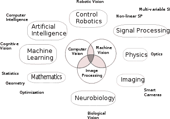
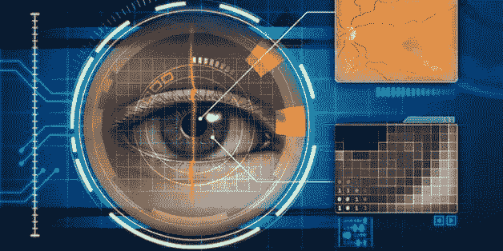

# 理解计算机视觉的 7 个步骤

> 原文：[`www.kdnuggets.com/2016/08/seven-steps-understanding-computer-vision.html`](https://www.kdnuggets.com/2016/08/seven-steps-understanding-computer-vision.html)

**作者：Pulkit Khandelwal，VIT 大学。**

> 如果我们希望机器能够思考，我们需要教会它们看。
> 
> * * *
> 
> ## 我们的前三个课程推荐
> ## 
>  1\. [谷歌网络安全证书](https://www.kdnuggets.com/google-cybersecurity) - 快速开启网络安全职业生涯。
> 
>  2\. [谷歌数据分析专业证书](https://www.kdnuggets.com/google-data-analytics) - 提升你的数据分析能力
> 
>  3\. [谷歌 IT 支持专业证书](https://www.kdnuggets.com/google-itsupport) - 支持你的组织 IT 事务
> 
> * * *
> 
> -[Fei Fei Li](http://vision.stanford.edu/feifeili/)，[斯坦福人工智能实验室](http://ai.stanford.edu/) 和 [斯坦福视觉实验室](http://vision.stanford.edu/)的主任

学习和计算使机器能够更好地理解图像的上下文，并构建真正理解智能的视觉系统。大量的图像和视频内容促使科学界理解和识别其中的模式，以揭示我们未曾察觉的细节。计算机视觉从图像中生成数学模型；计算机图形学从模型中绘制图像，最后图像处理将图像作为输入，输出另一张图像。

计算机视觉是一个交叉领域，借鉴了人工智能、数字图像处理、机器学习、深度学习、模式识别、概率图模型、科学计算及大量数学等领域的概念。因此，将此文章作为进入该领域的起点。我会尽可能在这篇文章中覆盖尽可能多的内容，但仍会有许多高级主题和一些有趣的内容可能会被遗漏（也许会在后续文章中提及？）。

**步骤 1 - 背景调查**

一如既往，通过[概率](http://ocw.mit.edu/courses/electrical-engineering-and-computer-science/6-041-probabilistic-systems-analysis-and-applied-probability-fall-2010/)、[统计学](https://www.coursera.org/specializations/statistics)、[线性代数](http://ocw.mit.edu/courses/mathematics/18-06sc-linear-algebra-fall-2011/)、微积分（包括[微分](https://www.khanacademy.org/math/differential-calculus)和[积分](https://www.khanacademy.org/math/integral-calculus)）的本科课程奠定基础。简要了解一下[矩阵微积分](https://en.wikipedia.org/wiki/Matrix_calculus)也会有所帮助。此外，我的经验表明，如果你对[数字信号处理](https://www.youtube.com/watch?v=hVOA8VtKLgk&list=PLuh62Q4Sv7BUSzx5Jr8Wrxxn-U10qG1et&index=1)有一些了解，会更容易掌握概念。

在实现方面，我建议具备[MATLAB](https://www.amazon.in/Basics-MATLAB-Beyond-Andrew-Knight/dp/0849320399)和 Python 的背景。查看[Sentdex](https://www.youtube.com/user/sentdex)（一个 YouTube 频道），获取你所需的所有 Python 科学编程知识。请记住，计算机视觉完全依赖于计算编程。

你可能还想看看[概率图模型](https://www.coursera.org/learn/probabilistic-graphical-models)（尽管这是一个非常高级的主题）。你可以稍后再回到这方面的内容。

**步骤 2 - 数字图像处理**

观看[杜克大学的 Guillermo Sapiro 教授](https://www.coursera.org/learn/image-processing)的视频。课程内容非常全面，包含大量练习。你可以在 YouTube 上找到这些视频，或者等到 2016 年 9 月 Coursera 的下一个课程开始。

参考书籍[《数字图像处理》](http://www.imageprocessingplace.com/)（作者：Gonzalez 和 Woods）。根据课程在 MATLAB 上的示例进行学习。

**步骤 3 - 计算机视觉**

完成数字图像处理后，下一步是理解各种图像和视频内容应用中公式背后的数学模型。[佛罗里达大学的 Mubarak Shah 教授](http://crcv.ucf.edu/videos/lectures/2014.php)的计算机视觉课程是一个很好的入门课程，涵盖了所有构建高级材料所需的基本概念。

观看这些视频，并通过跟随[Georgia Tech 教授 James Hays](http://www.cc.gatech.edu/~hays/compvision/)的计算机视觉课程项目来实现学到的概念和算法。这些作业也在 MATLAB 上进行。不要跳过这些。只有从头实现这些算法和方程，你才能深入理解它们。

**步骤 4 - 高级计算机视觉**

按照前三个步骤，你将为学习高级材料做好准备。

Coursera 提供的[人工视觉中的离散推理](https://www.youtube.com/watch?v=sEdS0xSTb6U)为你提供了计算机视觉的概率图模型和数学超负荷。虽然 Coursera 已从网站上移除了这些内容，但你应该能在互联网上找到。事情现在看起来很有趣，并且肯定会让你感受到如何为机器视觉系统构建复杂却简单的模型。这个课程也应该成为你开始阅读学术论文的一个踏脚石。

**步骤 5 - 引入 Python 和开源**

让我们进入 Python。

有许多包，如[OpenCV](http://opencv.org/)、[PIL](http://www.pythonware.com/products/pil/)、[vlfeat](http://www.vlfeat.org/)等。现在是将其他人构建的包应用到你的项目中的最佳时机。无需从头实现所有功能。

你可以找到许多很好的博客和视频来入门[用 Python 编程计算机视觉](http://programmingcomputervision.com/)。我推荐这本书，它应该足够了。去试试吧！看看 MATLAB 和 Python 如何帮助你实现算法。

**步骤 6 - 机器学习和卷积神经网络**

关于机器学习入门的帖子实在太多了。

查看这里、这里和这里。

从现在开始，你最好坚持使用 Python。快速浏览一下[用 Python 构建机器学习系统](https://www.amazon.in/Building-Machine-Learning-Systems-Python-ebook/dp/B00E7NC9D2?ie=UTF8&btkr=1&redirect=true&ref_=dp-kindle-redirect)和[Python 机器学习](http://sebastianraschka.com/books.html)。

在深度学习热潮下，你现在进入了计算机视觉的当前研究工作：卷积神经网络（ConvNets）的使用。[斯坦福大学的 CS231n: 视觉识别中的卷积神经网络](http://cs231n.stanford.edu/)是一个全面的课程。虽然官方网页上的视频已被删除，但你可以很容易地在 Youtube 上找到重新上传的内容。

**步骤 7 - 我应该如何进一步探索？**

你可能觉得我已经给了你太多信息。但还有很多东西需要探索。

一个好的方法是查看一些[多伦多大学的 Sanja Fidler](http://www.cs.utoronto.ca/~fidler/teaching/2015/CSC2523.html)和[James Hays](http://www.cc.gatech.edu/~hays/7476/)的研究生研讨课程，从中了解计算机视觉的当前研究方向，通过丰富的学术论文。

另一种可能的方法是关注顶级会议的顶级论文，如 [CVPR](http://cvpr2016.thecvf.com/)，[ICCV](http://pamitc.org/iccv15/)，[ECCV](http://www.eccv2016.org/)，[BMVC](http://bmvc2016.cs.york.ac.uk/)。或者，你可以关注 [pyimagesearch.com](http://www.pyimagesearch.com/) 或 [computervisionblog.com](http://www.computervisionblog.com/) 或 [aishack.in](http://aishack.in/)。在 [videolectures.net](http://videolectures.net/) 上观看计算机视觉及相关领域的无尽讲座和演讲！

总之，你已经涵盖了计算机视觉的历史，从滤波器、特征检测器和描述符、相机模型、跟踪器到识别、分割以及最新的神经网络和深度学习进展。在下一篇文章中，我将列出值得关注的顶级博客，在随后的文章中，我将介绍与计算机视觉相关的所有时间最重要的论文。

**简介： [Pulkit Khandelwal](https://twitter.com/pulkittweet)** 是麦吉尔大学计算机科学硕士的新生。他的兴趣在于计算机视觉和机器学习。

**相关内容：**

+   理解深度学习的 7 个步骤

+   理解 NoSQL 数据库的 7 个步骤

+   掌握数据科学 SQL 的 7 个步骤

### 更多相关内容

+   [TensorFlow 在计算机视觉中的应用 - 轻松掌握迁移学习](https://www.kdnuggets.com/2022/01/tensorflow-computer-vision-transfer-learning-made-easy.html)

+   [发现计算机视觉的世界：介绍 MLM 的最新…](https://www.kdnuggets.com/2024/01/mlm-discover-the-world-of-computer-vision-ebook)

+   [计算机视觉的 5 个应用](https://www.kdnuggets.com/2022/03/5-applications-computer-vision.html)

+   [你需要知道的 6 件关于数据管理的事及其重要性…](https://www.kdnuggets.com/2022/05/6-things-need-know-data-management-matters-computer-vision.html)

+   [KDnuggets 新闻 2022 年 3 月 9 日：5 分钟内构建机器学习网页应用](https://www.kdnuggets.com/2022/n10.html)

+   [DINOv2：Meta AI 的自监督计算机视觉模型](https://www.kdnuggets.com/2023/05/dinov2-selfsupervised-computer-vision-models-meta-ai.html)
