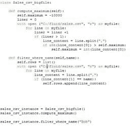
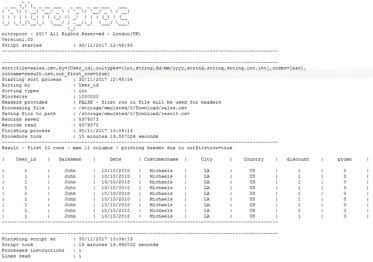

# 在本地处理中到大型数据的简单方法

> 原文：[`www.kdnuggets.com/2017/12/simple-medium-big-data-locally.html`](https://www.kdnuggets.com/2017/12/simple-medium-big-data-locally.html)

 评论

**由 Francisco Juretig 创作，[nitroproc](https://www.nitroproc.com) 的作者**

作为数据科学家，我们通常会接触到从几十万到几亿条记录的数据集，可能还有几十列或几百列。这些数据通常以 csv 文件的形式接收，并通过多种方式处理，最终目的是在 Python 或 R 中运行复杂的机器学习算法。然而，这些数据通常无法完全载入到内存中，因此需要设计替代工具。当然，所有这些数据可以分配到集群中并在那里处理，但这需要繁琐的上传文件过程、支付服务器时间费用、处理敏感数据时的安全问题、相当复杂的编程技巧，并花费时间下载结果。当然，本地 Spark 会话总是可以创建，但学习曲线很陡峭，对初学者来说，安装可能具有挑战性（尤其是当目标是偶尔处理几个大文件时）。在本文中，我们关注于处理这类数据集的简单技术（包括安装和运行）。

**第一个选项：循环遍历文件**

Python 或 R 总是可以用来快速遍历文件。在这种情况下，我们将用它来遍历一个非常大的文件。数据集如下：5,379,074 个观测值和 8 列，包括整数、日期和字符串，文件大小为 212 兆字节。


我们将为处理这个文件生成一个类。在这个类中，我们将定义两个简单的操作，第一个将计算最大值，第二个将筛选出特定名称的记录。在最后三行中，我们实例化这个类并调用它的方法。请注意，我们没有使用 pandas.read_csv，因为这个数据集通常无法适应内存（具体取决于你的计算机）。另外，请注意我们排除了第一条记录，因为它包含文件头。



问题在于，在大多数实际场景中，只要我们从简单的子集操作偏离，代码的复杂性就会惊人地增加。例如，即使是编写一个简单的文件排序程序也是极其复杂的，更不用说处理缺失值、多个变量类型、日期格式等了。更糟糕的是，大多数数据处理操作都需要良好的排序实现：合并、转置和汇总不仅本身困难，而且总是需要对数据进行排序，以便在合理的时间内运行。

**第二种选择：SAS**

SAS 多年来一直是统计分析的最佳软件。除了其卓越的统计方法实现外，SAS 还允许我们轻松处理数亿个观察值。它通过使用硬盘存储数据，而不是 RAM 内存（如大多数软件所做的），来实现这一点。此外，这些文件可以有数千列。SAS 编程语言非常简单且灵活。例如，读取一个文件并对其排序可以用很少的代码实现：

```py
Data customer_data;
    infile “./sales.csv” lrecl=32767 missover;
    input User_id: 8\. Salesman: $10\. Date: mmddyy8\. Customername: $10\. City:$3\. Country: $6\. 
    Discount: $9\. Promo: 8.;
run;

proc sort data = customer_data;
    by User_id;
run;

```

SAS 的一个常被忽视但非常强大的功能是其日志文件。它们是识别异常观察值、缺失值和不正常结果的极其强大的工具。例如，在合并两个包含数百万个观察值的文件时，你可以通过查看两个文件中读取的观察值数量与输出中写入的数量，立即识别出问题。

你通常不会发现任何限制或约束。然而，对于极大的文件，使用集群上运行的 Spark 的分布式环境会更方便（但这超出了本文的范围）。不幸的是，SAS 许可证通常非常昂贵，并且仅能在计算机上运行。

**第三种选择：nitroproc**

*nitroproc* 是一款免费的跨平台软件（目前支持 Windows/MacOS/Android/iOS），专为数据处理设计（特别适合数据科学家）。它可以通过 Python 或 R 以批处理模式调用。类似于 SAS，它被设计为使用硬盘进行操作，因此对数据大小几乎没有限制。它的脚本可以部署到任何设备上，语法不需修改（除非显然需要处理正确的输入文件路径）。在本文中，我们将展示如何使用 Windows 和 Android 版本（iOS 版本也可以从 App Store 下载）。它处理不同的变量类型、文件格式和缺失值。当前版本允许你进行排序、合并、筛选、子集、计算虚拟变量、聚合以及其他许多传统数据科学家使用的数据处理操作。类似于 SAS，*nitroproc* 生成非常强大的日志，用于识别异常数据、错误合并等。此外，它还生成另一个日志文件，称为 logtracer，用于逻辑分析脚本中不同指令的关系。

*按一个关键字段排序 540 万个观察值*

在这个示例中，我们将在 PC 和一部（旧版）Android 手机上对一个非常大的文件进行排序，仅为展示 *nitroproc* 的强大功能。我们将使用图 1 中相同的数据集——540 万条记录的数据集。请记住，这个数据集有 5,379,074 个观察值和 8 列，包含整数、日期和字符串，文件大小为 212 兆字节。在这种情况下，我们将按其第一列（User_id）进行排序。

你可以从[`www.nitroproc.com/download.html`](https://www.nitroproc.com/download.html)下载 csv 文件，以复制我们在此处展示的结果。在这种情况下，我建议你在手机连接到 PC/Mac 且后台没有其他进程运行的情况下运行测试。

语法非常简单，我们只需写：

```py
sort(file=sales.csv,by=[User_id],coltypes=[int,string,dd/mm/yyyy,string,string,string,int,int], order=[asc], outname = result.csv, out_first_row = true)

```

所有参数都非常自解释。Order 指定我们是需要升序还是降序，out_first_row 用于指定是否要输出文件头。你可能会注意到我们没有指定任何头部，因为 csv 已经包含它们。如果它们没有包含，我们需要输入 headers=[colum_name1,…,column_namek]。对于 PC，我们需要指定正确的文件路径，但对于 Android 和 iOS 版本，只需文件名即可，因为文件路径会自动恢复（对于 Android 使用/Downloads 文件夹，对于 iPhone/iPad 使用 App 文件夹 – 可通过 iTunes 访问）。

排序在 nitroproc 中尤其重要，因为它用于合并文件、总结文件和其他操作。

*PC 版本*

在一台标准的（2012 年）Intel i5-4430 @3.00 GHz 桌面电脑和一块标准的 Seagate 500GB ST500DM002 硬盘上，完成需要 1 分 25 秒（参见图 3：nitroproc 生成的日志文件 - PC 版本）。在最新的 Intel 设备上，例如 i7-4970k，并且使用固态硬盘，脚本将至少快 3 倍（通过超频可以达到更高的速度）。


*Android 版本*

在 Android 7.0 Nougat 的 Nexus 5x 上运行相同的脚本要慢得多（图 4 nitroproc 生成的日志文件 - Android 版本，但它仍然运行良好）。这款手机发布于 2015 年，配备了 1.8GHz 的处理器（请注意，这**不是**一款高端手机）。如图 1 所示，完成需要 15 分钟。在最新的（2017 年）高端 Android 手机上，你应该期望在一半的时间内运行这个脚本（7 分钟）。由于几乎不使用 RAM，nitroproc 可以在内存不足的系统中很好地运行。



*iOS 版本*

最后，看看 iOS 版本在 iPhone 8 Plus（A11 Bionic 芯片）上的输出。这些结果让我惊讶，如同之前的基准测试没有给我这样的惊喜（我曾经是个热衷的超频爱好者）。苹果声称 iPhone 8 和 X 是最快的手机，但这可能是低估了。你可以看到它在 2 分钟 42 秒内排序文件，比我们的桌面 Intel CPU 所需的时间少不到两倍（考虑到 PC 消耗超过 250 瓦，而 iPhone 8 约为 6.96 瓦），并且比普通的 Android 手机快了将近 5.5 倍。对于 iPhone 8 Plus（以及 iPhone X，因为它们共享相同的芯片），一个更准确的说法是，它是工程上的奇迹，提供了与桌面游戏 CPU 类似的性能，而后者消耗了 35 倍的电力。考虑到 nitroproc 在 I/O 操作方面非常密集，而在这种情况下，有数亿次读写操作，因为有很多中间操作。A11 及其操作系统能够如此快速地从硬盘移动如此多的数据，几乎是超现实的。


**相关**

+   [**大数据和新技术如何改变老龄化**](https://www.kdnuggets.com/2017/12/big-data-changing-aging.html)

+   [**如何建立一个伟大的分析文化？**](https://www.kdnuggets.com/2017/12/jmp-build-great-analytic-culture.html)

+   [**数据科学家和数据工程师为何应共享平台**](https://www.kdnuggets.com/2017/11/cazena-data-scientists-data-engineers-should-share-platform.html)

* * *

## 我们的前三大课程推荐

 1\. [谷歌网络安全证书](https://www.kdnuggets.com/google-cybersecurity) - 快速进入网络安全职业生涯。

 2\. [谷歌数据分析专业证书](https://www.kdnuggets.com/google-data-analytics) - 提升您的数据分析能力

 3\. [谷歌 IT 支持专业证书](https://www.kdnuggets.com/google-itsupport) - 支持您组织的 IT 工作

* * *

### 更多相关话题

+   [本地运行 LlaMA 2 的简单指南](https://www.kdnuggets.com/a-simple-guide-to-running-llama-2-locally)

+   [Ollama 教程：轻松本地运行 LLMs](https://www.kdnuggets.com/ollama-tutorial-running-llms-locally-made-super-simple)

+   [加速你的 Python 代码的 3 种简单方法](https://www.kdnuggets.com/2022/10/3-simple-ways-speed-python-code.html)

+   [处理大数据：工具与技术](https://www.kdnuggets.com/working-with-big-data-tools-and-techniques)

+   [在实际环境中实现深度学习：数据驱动课程](https://www.kdnuggets.com/2022/04/corise-deep-learning-wild-data-centric-course.html)

+   [数据科学家远程工作的 6 种软技能](https://www.kdnuggets.com/2022/05/6-soft-skills-data-scientists-working-remotely.html)
