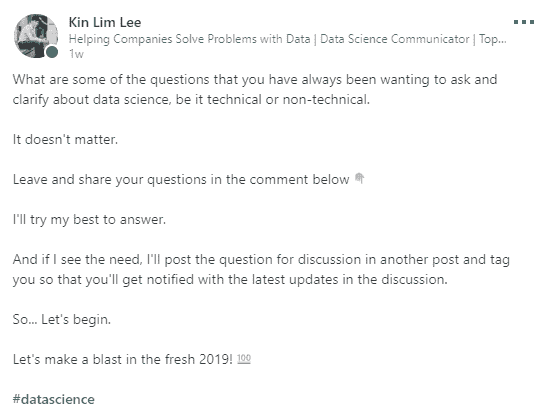
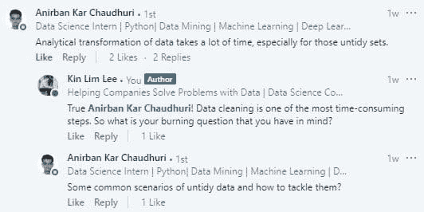

# 简单而实用的数据清洗代码

> 原文：[`www.kdnuggets.com/2019/02/simple-yet-practical-data-cleaning-codes.html`](https://www.kdnuggets.com/2019/02/simple-yet-practical-data-cleaning-codes.html)

 评论

**由 [Admond Lee](https://www.linkedin.com/in/admond1994/)，美光科技 / AI Time Journal / Tech in Asia**


在我的一篇文章—[我的第一次数据科学家实习](https://towardsdatascience.com/my-first-data-scientist-internship-7f7aa2ee4040)中，我谈到了数据清洗（数据预处理、数据清理……无论它是什么）是多么重要，以及它如何轻易占据整个数据科学工作流程的 40%-70%。世界是不完美的，数据也是如此。

***垃圾进，垃圾出***

现实世界的数据是肮脏的，作为数据科学家——也就是数据清理者，我们应该在进行任何数据分析或模型构建之前进行数据清洗，以确保数据的最大质量。

长话短说，在数据科学领域待了相当长一段时间后，我确实感受到了在进行数据分析、可视化和模型构建之前进行数据清洗的痛苦。

无论你是否承认，数据清洗并不是一项简单的任务，大多数时候它耗时且枯燥，但这个过程却重要得不可忽视。

如果你经历过这个过程，你会理解我的意思。这也是我写这篇文章的原因，以帮助你更好地进行数据清洗。

更顺畅的数据清洗方法。

### 为什么这篇文章对你很重要？

[我最近在 LinkedIn 上的帖子](https://www.linkedin.com/feed/update/urn:li:activity:6486373885376851968)

一周前，我在 LinkedIn 上发布了帖子，询问和回答了一些有抱负的数据科学家和数据科学专业人士面临的关于数据科学的热门问题。

*如果你一直关注我的工作，[我正在致力于在 LinkedIn 上民主化分享学习环境](https://www.linkedin.com/pulse/2018-year-turning-point-my-life-kin-lim-lee/)，特别关注数据科学，通过在 LinkedIn 上发起讨论，汇聚有抱负的数据科学家、数据科学家及其他不同专业和背景的数据专业人士。如果你想参与这些关于数据科学的有趣话题讨论，可以随时关注我在[LinkedIn](https://www.linkedin.com/in/admond1994/)。你会惊讶于数据科学社区的参与性和支持性。]* *????*



我在评论中收到了一些有趣的问题。然而，有一个特别的问题是由[Anirban](https://www.linkedin.com/in/anirban-kar-chaudhuri-7913737b/)提出的，这让我最终决定写一篇文章来回答这个问题，因为我一直不时收到类似的问题。

实际上，不久前我意识到某些数据在数据清洗时有类似的模式。这时我开始整理和编写一些我认为适用于其他常见场景的数据清洗代码——**我的数据清洗小工具箱**。

由于常见场景涉及不同类型的数据集，本文更多地着重于展示和解释代码的用途，以便你可以轻松地进行插拔使用。

在本文的最后，我希望你会发现这些代码有用，并且能使你的数据清洗过程更快速、高效。

开始吧！

### 我的数据清洗小工具箱

在以下代码片段中，代码被写成函数以便于自我解释。你可以直接使用这些代码，而无需将其放入函数中，只需稍微修改参数即可。

**1\. 删除多个列**

```py
def drop_multiple_col(col_names_list, df): 
    '''
    AIM    -> Drop multiple columns based on their column names 

    INPUT  -> List of column names, df

    OUTPUT -> updated df with dropped columns 
    ------
    '''
    df.drop(col_names_list, axis=1, inplace=True)
    return df
```

有时，并非所有列在我们的分析中都是有用的。因此，`df.drop` 可以派上用场，用于删除你指定的选定列。

**2\. 更改数据类型**

```py
def change_dtypes(col_int, col_float, df): 
    '''
    AIM    -> Changing dtypes to save memory

    INPUT  -> List of column names (int, float), df

    OUTPUT -> updated df with smaller memory  
    ------
    '''
    df[col_int] = df[col_int].astype('int32')
    df[col_float] = df[col_float].astype('float32')

```

当数据集变得更大时，我们需要转换`dtypes`以节省内存。如果你有兴趣了解如何使用 Pandas 处理大数据，我强烈建议你查看这篇文章——[为什么及如何使用 Pandas 处理大数据](https://towardsdatascience.com/why-and-how-to-use-pandas-with-large-data-9594dda2ea4c)。

**3\. 将分类变量转换为数值变量**

```py
def convert_cat2num(df):
    # Convert categorical variable to numerical variable
    num_encode = {'col_1' : {'YES':1, 'NO':0},
                  'col_2'  : {'WON':1, 'LOSE':0, 'DRAW':0}}  
    df.replace(num_encode, inplace=True) 
```

一些机器学习模型要求变量为数值格式。这时我们需要将分类变量转换为数值变量，然后再将其输入模型。就数据可视化而言，我建议保留分类变量，以便更明确地解释和理解。

**4\. 检查缺失数据**

```py
def check_missing_data(df):
    # check for any missing data in the df (display in descending order)
    return df.isnull().sum().sort_values(ascending=False)
```

如果你想检查每列缺失数据的数量，这是最快的方法。这能让你更好地了解哪些列缺失数据较多，从而决定下一步的数据清洗和分析行动。

**5\. 删除列中的字符串**

```py
def remove_col_str(df):
    # remove a portion of string in a dataframe column - col_1
    df['col_1'].replace('\n', '', regex=True, inplace=True)

    # remove all the characters after &# (including &#) for column - col_1
    df['col_1'].replace(' &#.*', '', regex=True, inplace=True)
```

可能会遇到新行字符或其他奇怪的符号出现在字符串列中。可以通过使用`df['col_1'].replace`来轻松处理，其中`col_1`是数据框`df`中的一列。

**6\. 删除列中的空格**

```py
def remove_col_white_space(df,col):
    # remove white space at the beginning of string 
    df[col] = df[col].str.lstrip()
```

当数据很混乱时，一切皆有可能。看到字符串开头有一些空格并不罕见。因此，当你想要删除列中字符串开头的空格时，这种方法非常有用。

**7\. 按条件连接两个字符串列**

```py
def concat_col_str_condition(df):
    # concat 2 columns with strings if the last 3 letters of the first column are 'pil'
    mask = df['col_1'].str.endswith('pil', na=False)
    col_new = df[mask]['col_1'] + df[mask]['col_2']
    col_new.replace('pil', ' ', regex=True, inplace=True) # replace the 'pil' with emtpy space
```

这在你想要有条件地合并两个包含字符串的列时非常有用。例如，你希望将第一列与第二列连接起来，如果第一列中的字符串以某些字母结尾。根据你的需要，连接后还可以去掉这些结尾字母。

**8\. 将时间戳（从字符串到日期时间格式）转换**

```py
def convert_str_datetime(df): 
    '''
    AIM    -> Convert datetime(String) to datetime(format we want)

    INPUT  -> df

    OUTPUT -> updated df with new datetime format 
    ------
    '''
    df.insert(loc=2, column='timestamp', value=pd.to_datetime(df.transdate, format='%Y-%m-%d %H:%M:%S.%f')) 
```

在处理时间序列数据时，我们可能会遇到字符串格式的时间戳列。这意味着我们可能需要将字符串格式转换为日期时间格式——具体格式根据需求指定——以便用数据进行有意义的分析和展示。

### 最后的想法

[（来源）](https://unsplash.com/photos/oTvU7Zmtei)

感谢阅读。

代码本质上实现起来相对简单。希望这个小工具箱的清理数据方法能让你更有信心进行数据清理，并提供更广泛的视角，了解数据集通常的样子。

一如既往，如果你有任何问题或评论，请随时在下面留下反馈，或者通过 [LinkedIn](https://www.linkedin.com/in/admond1994/) 联系我。到那时，再见于下一篇文章！ 🤗

**简历： [Admond Lee](https://www.linkedin.com/in/admond1994/)** 是一名大数据工程师，实际操作中的数据科学家。他目前在美光科技、AI Time Journal 和 Tech in Asia 工作。他一直在帮助初创公司创始人和各种公司利用深度数据科学和行业专业知识解决问题。你可以通过 [LinkedIn](https://www.linkedin.com/in/admond1994/)、[Medium](https://medium.com/@admond1994)、[Twitter](https://twitter.com/admond1994) 和 [Facebook](https://www.facebook.com/lee.admond.355) 联系他。

[原文](https://towardsdatascience.com/the-simple-yet-practical-data-cleaning-codes-ad27c4ce0a38)。已获授权重新发布。

**相关:**

+   特征预处理笔记：什么、为什么和怎么做

+   财务数据分析 – 数据处理 1：贷款资格预测

+   用 Python 整理数据

    * * *

    ## 我们的前三大课程推荐

     1\. [Google 网络安全证书](https://www.kdnuggets.com/google-cybersecurity) - 快速进入网络安全职业

     2\. [Google 数据分析专业证书](https://www.kdnuggets.com/google-data-analytics) - 提升你的数据分析技能

     3\. [Google IT 支持专业证书](https://www.kdnuggets.com/google-itsupport) - 支持你的组织在 IT 领域

    * * *

    ### 更多相关话题

    +   [用 Python 自动化数据清理的 5 个简单步骤](https://www.kdnuggets.com/5-simple-steps-to-automate-data-cleaning-with-python)

    +   [LLaMA 3：Meta 迄今为止最强大的开源模型](https://www.kdnuggets.com/llama-3-metas-most-powerful-open-source-model-yet)

    +   [数据科学家的实用统计学](https://www.kdnuggets.com/2023/05/practical-statistics-data-scientists.html)

    +   [每个数据科学家都应该知道的工具：实用指南](https://www.kdnuggets.com/tools-every-data-scientist-should-know-a-practical-guide)

    +   [实用深度学习课程来自 fast.ai 重新上线了！](https://www.kdnuggets.com/2022/07/practical-deep-learning-fastai-2022.html)

    +   [使用 PyTorch 进行迁移学习的实用指南](https://www.kdnuggets.com/2023/06/practical-guide-transfer-learning-pytorch.html)
