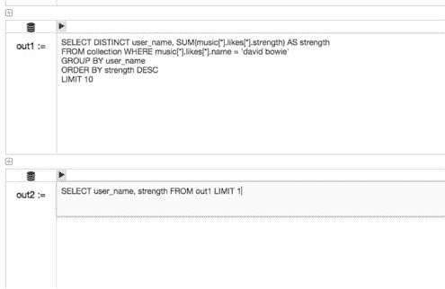

# SlamData 开源分析工具用于 MongoDB

> 原文：[`www.kdnuggets.com/2014/12/slamdata-open-source-analytics-tool-mongodb.html`](https://www.kdnuggets.com/2014/12/slamdata-open-source-analytics-tool-mongodb.html)

作者：John A. De Goes (SlamData)，2014 年 12 月。

SlamData 是一个开源工具，使 MongoDB 上的分析变得简单易用，无论是对开发者还是非开发者。我们刚刚推出了 v1.1，大大增强了工具的功能，并修复了 1.0 版本中识别的一些问题。

**为什么选择 SlamData？**

MongoDB 目前是增长最快、最成功的 NoSQL 数据库。公司主要利用该数据库构建 web 和移动应用程序。

成功的 MongoDB 应用程序通常会捕获或生成大量数据。我称之为*应用智能*的数据理解过程，对业务中的多个利益相关者至关重要：

+   **产品**。我们如何利用这些数据来改进产品或更好地了解用户？我们如何让用户自己从数据中获得见解？

+   **市场营销**。这些数据告诉我们用户如何使用应用程序？这些应用程序数据能否帮助我们更好地了解市场营销 ROI？

+   **支持**。如何利用这些数据来帮助识别和解决用户遇到的问题？

+   **管理者**。这些数据告诉我们关于资源分配什么？我们如何将这些数据与销售和其他数据集关联起来？

+   **IT**。应用程序生成了什么类型的数据，我们如何为这种数据调整数据库？

MongoDB 没有严格的模式（每一“行”可能与其他“行”有不同的结构），并允许数据的任意嵌套（“行”可以包含其他“表”）。

尽管这种灵活性带来了更快的应用程序开发和更好的性能与扩展性，但代价是：*现有分析工具无法与 MongoDB 配合使用*。

在关系型数据库的世界中，为了回答这些问题，你只需使用数据发现和临时分析工具。但在 MongoDB 的世界中，如果你需要应用智能，你只有**两个**选择：

1.  **编码**。让开发者编写低级别的临时代码，与 MongoDB API 交互以发现存储的数据并回答相关问题。

1.  **ETL**。开发一个工作流程，将数据迁移、同质化和标准化到 RDBMS 中，在那里你可以使用现有的分析工具（尽管是在一个*不*准确表示底层数据的数据模型上）。

最终，任何方法都无法扩展，这就是我们启动 [SlamData](http://slamdata.com) 的原因，它是一个基于 NoSQL 数据将*持续存在*这一前提的开源项目，分析工具需要*赶上*现代数据。

**介绍 SlamData**

SlamData 提供了一个标准 SQL 接口，用于访问存储在 MongoDB 中的 NoSQL 数据。

每个 SQL 查询都在数据库（或副本集）中 100% 执行，并操作数据的实际结构。

这种方法与其他解决复杂查询问题的方案有很大不同，这些方案从数据库中流式传输数据来处理复杂查询，并在底层数据上叠加一个虚假的关系视图（即使它不是关系型的）。

SlamData 的 SQL 方言（称为*SlamSQL*）扩展了 ANSI SQL 以支持嵌套数据、异构数据以及在嵌套维度上的聚合（例如，对存储在行中的数组元素求和）。

一个示例 SlamSQL 查询如下所示：

```py

SELECT DISTINCT user_name, SUM(music[*].likes[*].strength)
    AS strength
FROM collection WHERE music[*].likes[*].name = 'david bowie'
GROUP BY user_name
ORDER BY strength DESC
LIMIT 10
```

在这个查询中，双重嵌套在数组中的文档被用来过滤和汇总总体结果中的值。这种查询在 RDBMS 中是不可能的，MongoDB API 的等效代码也很难编写、调试和理解。


通过利用行业标准 SQL，SlamData 使广泛的用户和工具能够与 MongoDB 进行接口，并帮助团队快速轻松地理解由他们的 MongoDB 应用生成或收集的数据。

在当前的 1.1 版本中，支持所有标准 SQL 子句，包括 SELECT、AS、FROM、JOIN、WHERE、GROUP BY、HAVING、OUTER JOIN、CROSS 等。



**开启盒子**

SlamData 项目在几个关键方面进行了创新：

1.  **结构类型推断**。SlamData 不会扫描数据库以了解数据的结构。相反，SlamData 使用结构类型系统，配备双向类型推断，这使得 SlamData 能够解析查询的意图并生成与该意图一致的执行计划。例如，如果你的查询将一个字段用作字符串，SlamData 将查找该字段为字符串的文档。SlamData 还会在你尝试做无意义的事情时发出警告，比如将 4 加到字符串上，因为即使 SlamData 不知道数据库中有什么，它也知道在什么数据类型上进行什么操作是合理的。

1.  **多维关系代数**。SlamSQL 建立在一个称为*多维关系代数*（MRA）的关系代数形式扩展上。这一更强大的（但向后兼容的）基础允许对嵌套的、非均匀数据进行切片、切块和聚合。作为一个愉快的副作用，它也为许多 ANSI SQL 不允许的 SQL 查询提供了合理的语义（例如，*SELECT price / SUM(price) AS percent FROM ORDERS*）。

1.  **高级多阶段编译**。MongoDB 有三种不同的机制来执行查询（其中之一是完整的 map/reduce），每种机制都有不同的优缺点。通常，高效地执行复杂查询可能需要结合这三种机制。SlamData 拥有一个先进的多阶段优化规划器，试图找到所有三种机制的最佳组合。

1.  **数据库内执行**。SlamData 在将查询执行推送到数据库方面极为积极。实际上，100% 的每个查询都将直接在数据库中执行，完全不会流回客户端进行后处理。其他尝试解决此问题的方法大多数依赖客户端处理，因为在数据库中以高效的方式执行*每个查询的每一部分*是极其困难的（因此需要先进的多阶段编译）。

这些功能的结合使 SlamData 成为“指向并查询”：将 SlamData 指向你的 MongoDB 数据库，并在*任何类型*的数据上做*任何*你想做的事。SlamData 会生成最优查询计划并在数据库中 100% 执行。

**了解更多**

如果你正在使用 MongoDB 并且想尝试 SlamData，你可以在 [官方网站](http://slamdata.com) 上找到[安装程序]，或者可以在 Github 上 [从源代码编译项目](https://github.com/slamdata/)。

SlamData 是一个 100% 开源项目，所以如果你喜欢你所看到的内容，请考虑以各种方式支持该项目：

+   [观看、fork 和收藏](https://github.com/slamdata/slamengine) 这些仓库。

+   提交 [拉取请求](https://github.com/slamdata/slamengine/pulls)、[错误报告](https://github.com/slamdata/slamengine/issues) 和 [功能请求](https://github.com/slamdata/slamengine/issues)。

+   传播 SlamData 的信息（[Twitter](https://twitter.com/slamdata)、Reddit 等）。

我们还有一个你可以在 [官方网站](http://slamdata.com) 上注册的新闻通讯。请享用！

[John A. De Goes，@jdegoes](https://twitter.com/jdegoes)，是 SlamData 的创始人兼首席技术官，同时也是开源 SlamData 项目的贡献者。此前，他曾担任 DataMesh 总经理、RichRelevance 的首席架构师，以及 Precog 的首席执行官/首席技术官。

**相关：**

+   MongoHQ 更名为 Compose，合并 ElasticSearch 和 MongoDB

+   采访：Prateek Jain，eHarmony 工程总监谈快速搜索与分片

+   Top KDnuggets 推文，8 月 8-10 日：忘记 SQL 与 NoSQL。新趋势是 HTAP：混合事务/分析处理

### 相关话题

+   [封闭源 VS 开源图像标注](https://www.kdnuggets.com/closed-source-vs-open-source-image-annotation)

+   [介绍 Objectiv：开源产品分析基础设施](https://www.kdnuggets.com/2022/06/objectiv-introducing-objectiv-opensource-product-analytics-infrastructure.html)

+   [你不知道的 7 件使用低代码工具的事情](https://www.kdnuggets.com/2022/09/7-things-didnt-know-could-low-code-tool.html)

+   [RAG vs Finetuning：哪个是提升你的 LLM 应用程序的最佳工具？](https://www.kdnuggets.com/rag-vs-finetuning-which-is-the-best-tool-to-boost-your-llm-application)

+   [Nota AI 发布 NetPresso 模型搜索的 beta 版本，他们的…](https://www.kdnuggets.com/2022/04/nota-ai-releases-beta-version-netpresso-model-search-hardwareaware-automl-tool.html)

+   [宣布 PyCaret 3.0：开源、低代码的 Python 机器学习](https://www.kdnuggets.com/2023/03/announcing-pycaret-30-opensource-lowcode-machine-learning-python.html)
