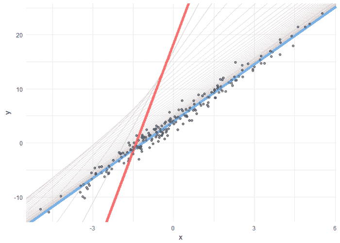
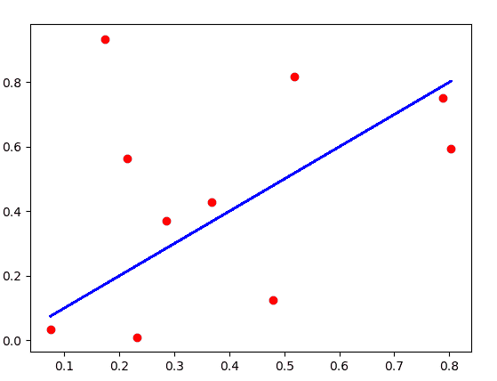
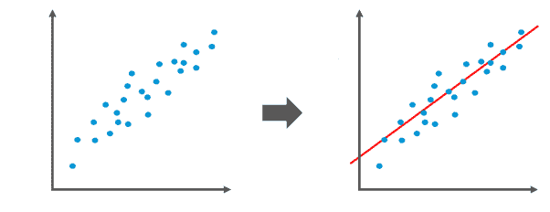
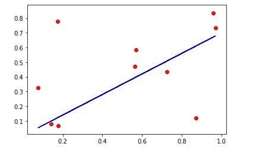
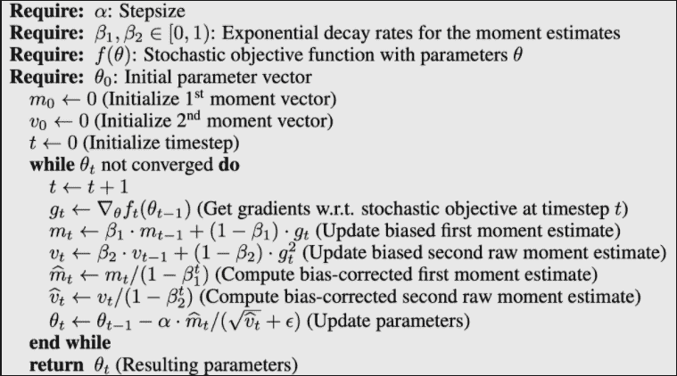
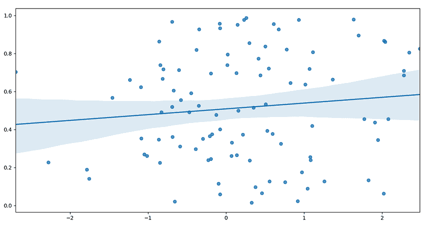
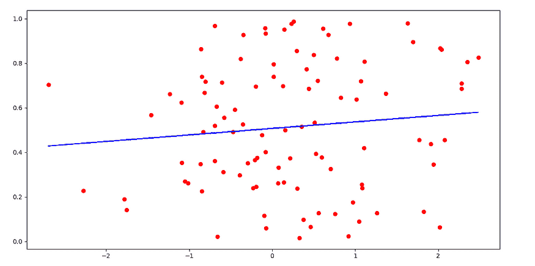
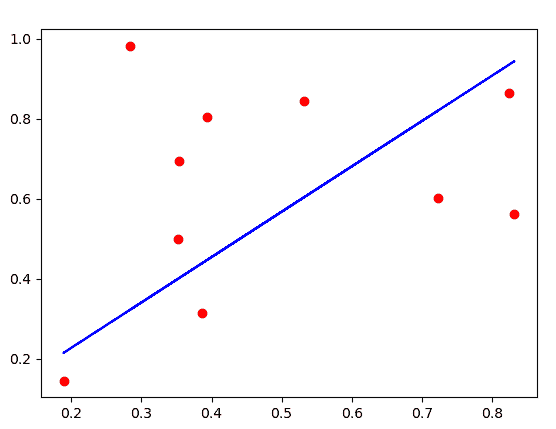

# 解决线性回归应该使用哪些方法？

> 原文：[`www.kdnuggets.com/2020/09/solving-linear-regression.html`](https://www.kdnuggets.com/2020/09/solving-linear-regression.html)

评论

**由 [Ahmad Bin Shafiq](https://medium.com/@ahmadbinshafiq)，机器学习学生**。

线性回归是一种监督式机器学习算法。它预测一个独立变量（y）与给定的依赖变量（x）之间的线性关系，以使得独立变量（y）具有**最低成本**。

* * *

## 我们的前三个课程推荐

 1\. [谷歌网络安全证书](https://www.kdnuggets.com/google-cybersecurity) - 快速进入网络安全职业生涯。

 2\. [谷歌数据分析专业证书](https://www.kdnuggets.com/google-data-analytics) - 提升你的数据分析能力

 3\. [谷歌 IT 支持专业证书](https://www.kdnuggets.com/google-itsupport) - 支持你组织的 IT 需求

* * *

### 解决线性回归模型的不同方法

我们可以对线性回归模型应用许多不同的方法以提高其效率。但在这里，我们将讨论其中最常见的一些。

1.  梯度下降

1.  最小二乘法 / 正规方程法

1.  亚当方法

1.  奇异值分解（SVD）

好的，我们开始吧……

### 梯度下降

对于初学者而言，解决线性回归问题最常见且最简单的方法之一就是梯度下降。

**梯度下降的工作原理**

现在，假设我们的数据以散点图的形式绘制出来，当我们对其应用一个成本函数时，我们的模型会做出预测。这个预测可能非常好，也可能与我们的理想预测相距甚远（即成本很高）。因此，为了最小化这个成本（错误），我们应用梯度下降。

现在，梯度下降会逐渐使我们的假设收敛到全局最小值，在那里**成本**最低。在此过程中，我们必须手动设置**alpha**的值，且假设的斜率会根据 alpha 的值而变化。如果 alpha 的值很大，那么梯度下降将会采取大的步伐。否则，在小的 alpha 情况下，我们的假设将会慢慢收敛，通过小的步骤。



*假设收敛到全局最小值。图片来源于 [Medium](https://medium.com/@ahmadbinshafiq/linear-regression-simplified-for-beginners-dcd3afe0b23f)。*

梯度下降的方程是


*来源：[Ruder.io](https://ruder.io/optimizing-gradient-descent/index.html#batchgradientdescent)。*

**在 Python 中实现梯度下降**

```py
import numpy as np
from matplotlib import pyplot

#creating our data
X = np.random.rand(10,1)
y = np.random.rand(10,1)
m = len(y)
theta = np.ones(1)

#applying gradient descent
a = 0.0005
cost_list = []
for i in range(len(y)):

    theta = theta - a*(1/m)*np.transpose(X)@(X@theta - y)

    cost_val = (1/m)*np.transpose(X)@(X@theta - y)
    cost_list.append(cost_val)

#Predicting our Hypothesis
b = theta
yhat = X.dot(b)

#Plotting our results
pyplot.scatter(X, y, color='red')
pyplot.plot(X, yhat, color='blue')
pyplot.show()

```



*梯度下降后的模型。*

首先，我们创建了我们的数据集，然后遍历所有训练样本，以最小化假设的成本。

**优点：**

梯度下降法的重要优点包括

+   相比于 SVD 或 ADAM，计算成本较低

+   运行时间为 O(kn²)

+   在特征数量较多的情况下效果很好

**缺点：**

梯度下降法的重要缺点是

+   需要选择一些学习率**α**

+   需要多次迭代才能收敛

+   可能会陷入局部最小值

+   如果学习率**α**不合适，可能无法收敛。

### 最小二乘法

最小二乘法，也称为**正规方程**，是解决线性回归模型的最常见方法之一。但这个方法需要对线性代数有一些基本了解。

**最小二乘法的工作原理**

在普通 LSM 中，我们直接求解系数的值。简而言之，通过一步，我们达到光学最小点，或者我们可以说仅一步我们将假设拟合到数据中，成本最低。



*在应用 LSM 之前和之后的数据集。图片来自 [Medium](https://towardsdatascience.com/complete-guide-to-linear-regression-in-python-d95175447255)。*

LSM 的方程是


**在 Python 中实现 LSM**

```py
import numpy as np
from matplotlib import pyplot

#creating our data
X = np.random.rand(10,1)
y = np.random.rand(10,1)

#Computing coefficient
b = np.linalg.inv(X.T.dot(X)).dot(X.T).dot(y)

#Predicting our Hypothesis
yhat = X.dot(b)
#Plotting our results
pyplot.scatter(X, y, color='red')
pyplot.plot(X, yhat, color='blue')
pyplot.show()

```



首先我们创建了我们的数据集，然后使用最小二乘法最小化我们的假设成本。

*b = np.linalg.inv(X.T.dot(X)).dot(X.T).dot(y)*

代码，与我们的方程式等效。

**优点：**

LSM 的重要优点包括：

+   无需学习率

+   无需迭代

+   特征缩放不是必需的

+   在特征数量较少时效果非常好。

**缺点：**

重要的缺点有：

+   当数据集很大时计算成本较高。

+   当特征数量较多时较慢

+   运行时间为 O(n³)

+   有时你的 X 转置 X 是不可逆的，即没有逆的奇异矩阵。你可以使用*np.linalg.pinv*代替*np.linalg.inv*来克服这个问题。

### Adam 方法

ADAM，即自适应矩估计，是一种在深度学习中广泛使用的优化算法。

这是一个迭代算法，对噪声数据效果很好。

这是 RMSProp 和小批量梯度下降算法的结合。

除了像 Adadelta 和 RMSprop 一样存储过去平方梯度的指数衰减平均值外，Adam 还保留了过去梯度的指数衰减平均值，类似于动量。

我们计算过去和过去平方梯度的衰减平均值如下：


*致谢： [Ruder.io](https://ruder.io/optimizing-gradient-descent/index.html#adam)。*

由于*mt*和*vt*初始化为 0 向量，Adam 的作者观察到它们在初始时间步骤特别偏向于零，尤其是当衰减率较小（即β1β1 和β2β2 接近 1）时。

他们通过计算经过偏差校正的第一和第二矩估计来抵消这些偏差：


*致谢: [Ruder.io](https://ruder.io/optimizing-gradient-descent/#adam)。*

然后他们用以下方法更新参数：


*致谢: [Ruder.io](https://ruder.io/optimizing-gradient-descent/#adam)。*

你可以在 [这里](https://towardsdatascience.com/adam-latest-trends-in-deep-learning-optimization-6be9a291375c) 或 [这里](https://ruder.io/optimizing-gradient-descent/#adam) 学习 Adam 背后的理论。

**Adam 的伪代码** 是



*来源: [Arxiv Adam](https://arxiv.org/pdf/1412.6980v9.pdf)。*

让我们查看它在纯 Python 中的代码。

```py
#Creating the Dummy Data set and importing libraries
import math
import seaborn as sns
import numpy as np 
from scipy import stats
from matplotlib import pyplot
x = np.random.normal(0,1,size=(100,1))
y = np.random.random(size=(100,1))

```

现在让我们找出线性回归的实际图形以及我们数据集的斜率和截距值。

```py
print("Intercept is " ,stats.mstats.linregress(x,y).intercept)
print("Slope is ", stats.mstats.linregress(x,y).slope)

```


现在让我们使用 Seaborn 的 *regplot* 函数查看线性回归线。

```py
pyplot.figure(figsize=(15,8))
sns.regplot(x,y)
pyplot.show()

```



现在让我们用纯 Python 编写 Adam 优化器。

```py
h = lambda theta_0, theta_1, x: theta_0 + np.dot(x,theta_1) #equation of straight lines

# the cost function (for the whole batch. for comparison later)
def J(x, y, theta_0, theta_1):
    m = len(x)
    returnValue = 0
    for i in range(m):
        returnValue += (h(theta_0, theta_1, x[i]) - y[i])**2
    returnValue = returnValue/(2*m)
    return returnValue

# finding the gradient per each training example
def grad_J(x, y, theta_0, theta_1):
    returnValue = np.array([0., 0.])
    returnValue[0] += (h(theta_0, theta_1, x) - y)
    returnValue[1] += (h(theta_0, theta_1, x) - y)*x
    return returnValue

class AdamOptimizer:
    def __init__(self, weights, alpha=0.001, beta1=0.9, beta2=0.999, epsilon=1e-8):
        self.alpha = alpha
        self.beta1 = beta1
        self.beta2 = beta2
        self.epsilon = epsilon
        self.m = 0
        self.v = 0
        self.t = 0
        self.theta = weights

    def backward_pass(self, gradient):
        self.t = self.t + 1
        self.m = self.beta1*self.m + (1 - self.beta1)*gradient
        self.v = self.beta2*self.v + (1 - self.beta2)*(gradient**2)
        m_hat = self.m/(1 - self.beta1**self.t)
        v_hat = self.v/(1 - self.beta2**self.t)
        self.theta = self.theta - self.alpha*(m_hat/(np.sqrt(v_hat) - self.epsilon))
        return self.theta

```

在这里，我们使用面向对象的方法和一些辅助函数实现了上述伪代码中提到的所有方程。

现在让我们为我们的模型设置超参数。

```py
epochs = 1500
print_interval = 100
m = len(x)
initial_theta = np.array([0., 0.]) # initial value of theta, before gradient descent
initial_cost = J(x, y, initial_theta[0], initial_theta[1])

theta = initial_theta
adam_optimizer = AdamOptimizer(theta, alpha=0.001)
adam_history = [] # to plot out path of descent
adam_history.append(dict({'theta': theta, 'cost': initial_cost})#to check theta and cost function

```

最后是训练过程。

```py
for j in range(epochs):
    for i in range(m):
        gradients = grad_J(x[i], y[i], theta[0], theta[1])
        theta = adam_optimizer.backward_pass(gradients)

    if ((j+1)%print_interval == 0 or j==0):
        cost = J(x, y, theta[0], theta[1])
        print ('After {} epochs, Cost = {}, theta = {}'.format(j+1, cost, theta))
        adam_history.append(dict({'theta': theta, 'cost': cost}))

print ('\nFinal theta = {}'.format(theta))

```


现在，如果我们将 *Final theta* 值与之前使用 *scipy.stats.mstat.linregress* 计算的斜率和截距值进行比较，它们几乎相等，经过调整超参数后可以完全相等。

最后，让我们绘制它。

```py
b = theta
yhat = b[0] + x.dot(b[1])
pyplot.figure(figsize=(15,8))
pyplot.scatter(x, y, color='red')
pyplot.plot(x, yhat, color='blue')
pyplot.show()

```



我们可以看到我们的图与使用 *sns.regplot* 获得的图类似。

**优点：**

+   实现简单明了。

+   计算效率高。

+   低内存需求。

+   对梯度的对角线重新缩放不变。

+   非常适合数据和/或参数较大的问题。

+   适用于非平稳目标。

+   适用于非常噪声大或稀疏的梯度问题。

+   超参数具有直观的解释，通常需要很少的调整。

**缺点：**

+   Adam 和 RMSProp 对学习率（有时是其他超参数，如批量大小）的某些值非常敏感，如果例如，学习率过高，它们可能会灾难性地无法收敛。（来源: [stackexchange](https://ai.stackexchange.com/questions/11455/when-should-we-use-algorithms-like-adam-as-opposed-to-sgd)）

### 奇异值分解

奇异值分解（SVD）是线性回归中一种著名且广泛使用的降维方法。

SVD 用于（其中之一）作为预处理步骤，以减少学习算法的维度。SVD 将矩阵分解为三个其他矩阵（U, S, V）的乘积。


一旦我们的矩阵被分解，假设的系数可以通过计算输入矩阵 **X** 的伪逆并将其乘以输出向量 **y** 来找到。之后，我们将假设拟合到数据中，这将给我们最低的成本。

**在 Python 中实现奇异值分解**

```py
import numpy as np
from matplotlib import pyplot

#Creating our data
X = np.random.rand(10,1)
y = np.random.rand(10,1)

#Computing coefficient
b = np.linalg.pinv(X).dot(y)

#Predicting our Hypothesis
yhat = X.dot(b)

#Plotting our results
pyplot.scatter(X, y, color='red')
pyplot.plot(X, yhat, color='blue')
pyplot.show()

```



尽管它没有很好地收敛，但仍然相当不错。

首先，我们创建了数据集，然后使用 `b = np.linalg.pinv(X).dot(y)` 这个 SVD 方程来最小化假设的成本。

**优点：**

+   在高维数据上效果更好

+   适用于高斯类型分布的数据

+   对于小数据集非常稳定和高效

+   解决线性回归的线性方程时，这种方法更稳定，也是首选方法。

**缺点：**

+   运行时间为 O(n³)

+   多重风险因素

+   对异常值非常敏感

+   可能在非常大的数据集上变得不稳定

### 学习成果

到目前为止，我们已经学习并实现了梯度下降、最小二乘法、ADAM 和奇异值分解。现在，我们对这些算法有了很好的理解，也知道了它们的优缺点。

我们注意到，ADAM 优化算法是最准确的，根据实际的 ADAM 研究论文，ADAM 的表现优于几乎所有其他优化算法。

**相关：**

+   [线性到逻辑回归，逐步解释](https://www.kdnuggets.com/2020/03/linear-logistic-regression-explained.html)

+   [使用 Scikit-Learn 进行线性回归的初学者指南](https://www.kdnuggets.com/2019/03/beginners-guide-linear-regression-python-scikit-learn.html)

+   [线性回归在现实生活中](https://www.kdnuggets.com/2018/08/linear-regression-real-life.html)

### 更多相关话题

+   [你应该使用线性回归模型而不是……的 3 个理由](https://www.kdnuggets.com/2021/08/3-reasons-linear-regression-instead-neural-networks.html)

+   [我应该使用哪个指标？准确率与 AUC](https://www.kdnuggets.com/2022/10/metric-accuracy-auc.html)

+   [比较线性回归与逻辑回归](https://www.kdnuggets.com/2022/11/comparing-linear-logistic-regression.html)

+   [线性回归与逻辑回归：简洁的解释](https://www.kdnuggets.com/2022/03/linear-logistic-regression-succinct-explanation.html)

+   [KDnuggets 新闻 22:n12, 3 月 23 日：最佳数据科学书籍](https://www.kdnuggets.com/2022/n12.html)

+   [数据科学中的线性回归](https://www.kdnuggets.com/2022/07/linear-regression-data-science.html)
