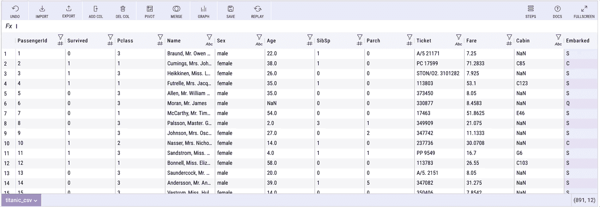
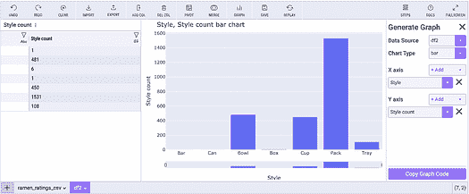

# 生成 Python 的电子表格：Mito JupyterLab 扩展

> 原文：[`www.kdnuggets.com/2021/11/spreadsheet-generates-python-mito-jupyterlab-extension.html`](https://www.kdnuggets.com/2021/11/spreadsheet-generates-python-mito-jupyterlab-extension.html)

评论

**作者 [Roman Orac](https://www.linkedin.com/in/romanorac/?originalSubdomain=si)，高级数据科学家**


图片由 [Joshua Sortino](https://unsplash.com/@sortino?utm_source=unsplash&utm_medium=referral&utm_content=creditCopyText) 提供，来源于 [Unsplash](https://unsplash.com/@sortino?utm_source=unsplash&utm_medium=referral&utm_content=creditCopyText)

## Mito 是一个用于 Python 的电子表格界面

Mito 允许你将数据框或 CSV 文件传入电子表格界面。它具有 Excel 的感觉，但每次编辑都会在下面的代码单元中生成等效的 Python 代码。最理想的情况下，这可以成为快速完成数据分析的绝佳方法。


使用 Mito 进行探索性数据分析（作者制作的可视化）

**如果你错过了我关于 Mito 的其他文章：**

+   [Mito — 一个生成 Python 的电子表格](https://romanorac.medium.com/list/mito-a-spreadsheet-that-generates-python-1df29fc67dff)

## 开始使用 Mito

这里是[完整的安装说明](https://docs.trymito.io/getting-started/installing-mito)。

要安装 Mito 包，请在终端中运行以下命令：

```py
python -m pip install mitoinstaller
python -m mitoinstaller install
```

然后在 Jupyter Lab 中打开一个笔记本并调用 mitosheet：

```py
import mitosheet
mitosheet.sheet()
```

Mitosheet 可以在分析的任何阶段调用。你可以在表单调用中将数据框传递给 Mitosheet 作为参数。

```py
mitosheet.sheet(df)
```

你可以使用导入按钮从本地文件中安装数据。

## Mito 数据分析功能

Mito 提供了一系列功能，允许用户清理、处理和探索数据。这些功能中的每一个都会在下面的代码单元中生成等效的 Python 代码。

在 Mito 中，你可以：

+   过滤

+   数据透视

+   合并

+   图表

+   查看汇总统计数据

+   使用电子表格公式

+   还有更多…

对于这些编辑中的每一个，Mito 都会在下面的代码单元中生成 Pandas 代码，用户可以将其用于分析或发送给同事。

下面是使用 Mito 创建数据透视表的样子：



Mito 的数据透视表（作者制作的可视化）

生成的示例数据透视表代码如下（代码是自动文档化的）：

```py
# Pivoted ramen_ratings_csv into df3
unused_columns = ramen_ratings_csv.columns.difference(set(['Style']).union(set(['Brand'])).union(set({'Style'})))
tmp_df = ramen_ratings_csv.drop(unused_columns, axis=1)
pivot_table = tmp_df.pivot_table(
    index=['Style'],
    columns=['Brand'],
    values=['Style'],
    aggfunc={'Style': ['count']}
)# Flatten the column headers
pivot_table.columns = [flatten_column_header(col) for col in pivot_table.columns.values]
```

下面是查看列的汇总统计数据的过程：


使用 Mito 的汇总统计（作者制作的可视化）

## 生成可视化代码

正确获取 Python 数据可视化的语法可能是一个耗时的过程。Mito 允许你在点击环境中生成图表，然后给出这些图表的等效代码。

创建图表后，点击“复制图表代码”按钮：



使用 Mito 制作图表（图像由作者制作）

然后将代码粘贴到任何代码单元格中。Mito 允许进行可重复的可视化过程。


Mito 生成代码（图像由作者制作）

## 结论

Mito 是生成 Python 代码的快速方法，特别适合那些熟悉 Excel 的人。它节省了很多去 Stack Overflow 或 Google 查找正确语法的时间。

Mito 绝对值得尝试，尽管它会在引入更多图表类型和更好的批量编辑能力（批量删除列、重命名等）时变得更加有价值。

## 离开之前

*如果你喜欢阅读这些故事，何不成为一个*[***Medium 付费会员***](https://romanorac.medium.com/membership)*呢？每月 $5，你将获得无限访问数万篇故事和作者的权限。*[***如果你使用我的链接注册***](https://romanorac.medium.com/membership)***，**** 我将获得一小笔佣金。*


由 [Courtney Hedger](https://unsplash.com/@cmhedger?utm_source=medium&utm_medium=referral) 拍摄，来源于 [Unsplash](https://unsplash.com/?utm_source=medium&utm_medium=referral)

**个人简介：[Roman Orac](https://www.linkedin.com/in/romanorac/?originalSubdomain=si)** 是一位机器学习工程师，在改进文档分类和项目推荐系统方面取得了显著成功。Roman 具有管理团队、指导初学者和向非工程师解释复杂概念的经验。

[原文](https://towardsdatascience.com/the-mito-jupyterlab-extension-a-spreadsheet-that-generates-python-b25d2c447d48)。经授权转载。

**相关：**

+   在 Jupyter Notebook 中分析 Python 代码

+   Python 序列的 5 个高级技巧

+   用 Faker 生成 Python 合成数据

* * *

## 我们的前三大课程推荐

 1\. [Google 网络安全证书](https://www.kdnuggets.com/google-cybersecurity) - 快速进入网络安全职业轨道。

 2\. [Google 数据分析专业证书](https://www.kdnuggets.com/google-data-analytics) - 提升你的数据分析技能

 3\. [Google IT 支持专业证书](https://www.kdnuggets.com/google-itsupport) - 支持你的组织的 IT

* * *

### 更多相关主题

+   [通过《快速 Python 数据科学》提升你的 Python 技能！](https://www.kdnuggets.com/2022/06/manning-step-python-game-fast-python-data-science.html)

+   [优化 Python 代码性能：深入探讨 Python 性能分析器](https://www.kdnuggets.com/2023/02/optimizing-python-code-performance-deep-dive-python-profilers.html)

+   [Python Enum：如何在 Python 中构建枚举](https://www.kdnuggets.com/python-enum-how-to-build-enumerations-in-python)

+   [使用 Python 和 Scikit-learn 简化决策树解释](https://www.kdnuggets.com/2017/05/simplifying-decision-tree-interpretation-decision-rules-python.html)

+   [Python 中的稀疏矩阵表示](https://www.kdnuggets.com/2020/05/sparse-matrix-representation-python.html)

+   [数据科学、数据可视化及…的前 38 个 Python 库](https://www.kdnuggets.com/2020/11/top-python-libraries-data-science-data-visualization-machine-learning.html)
