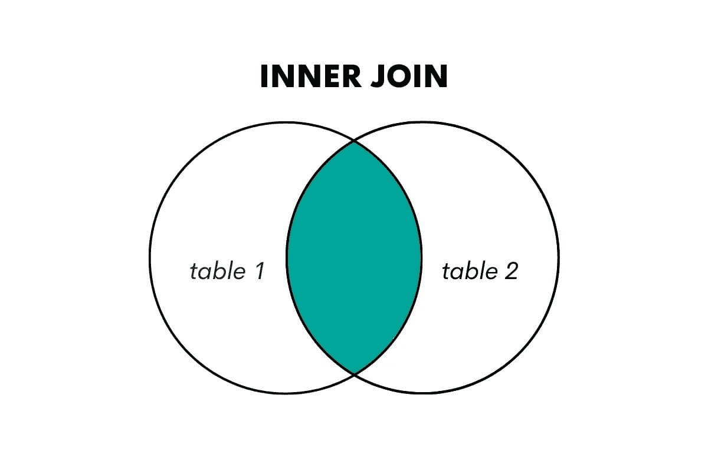
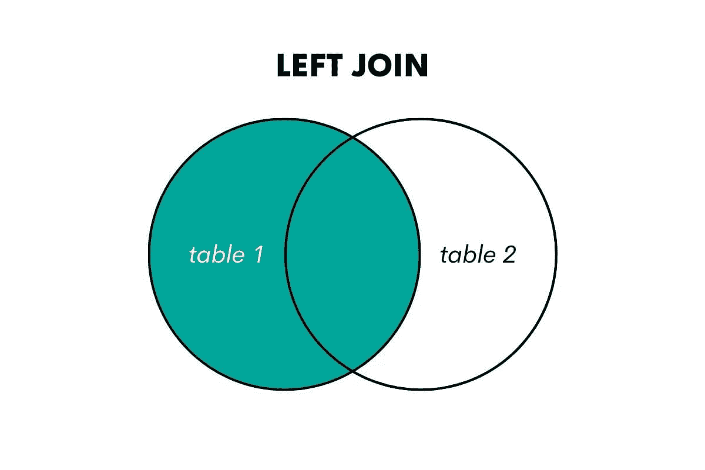
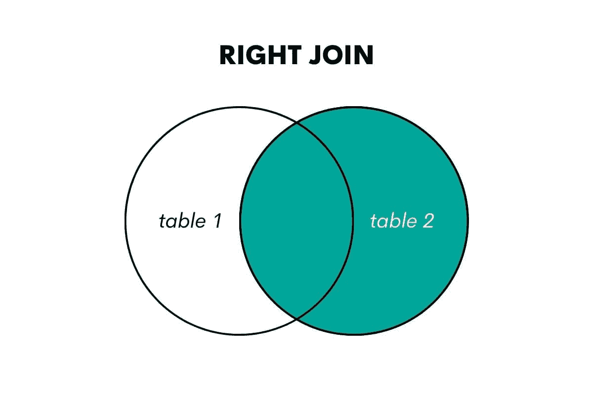
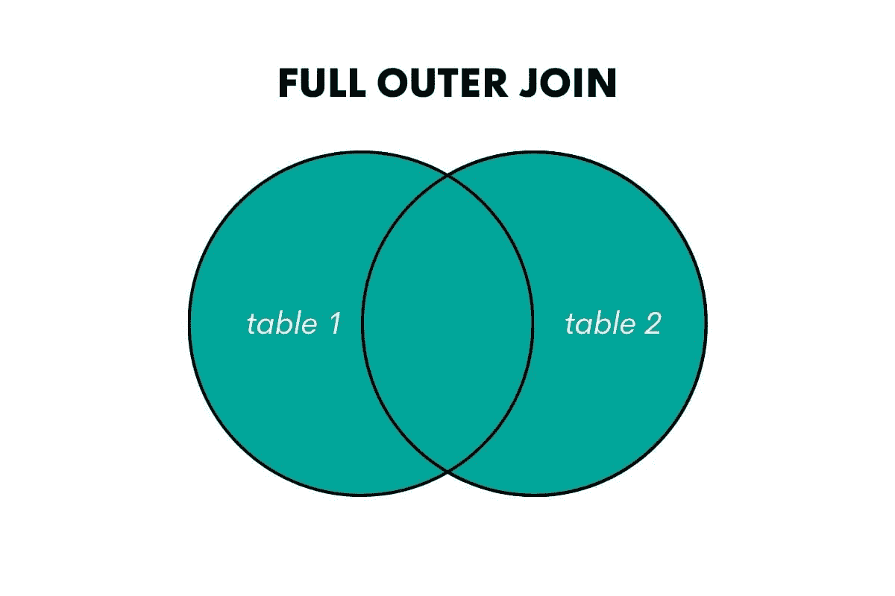
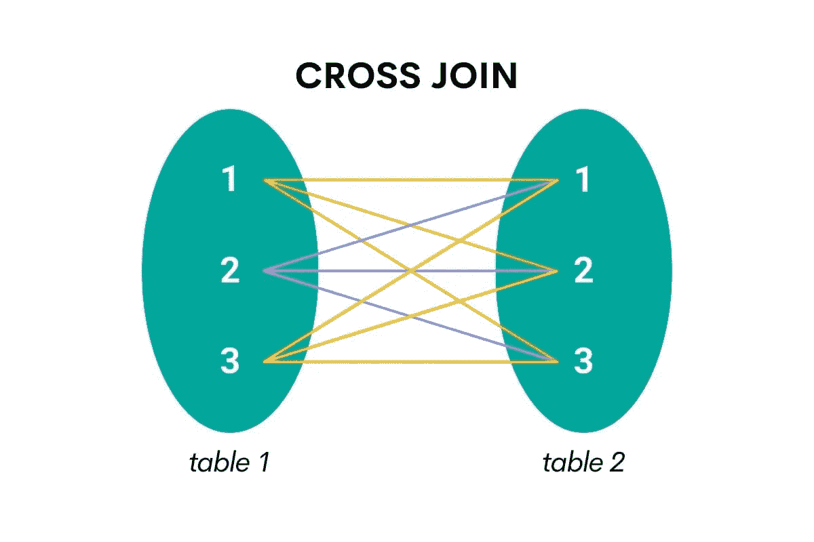
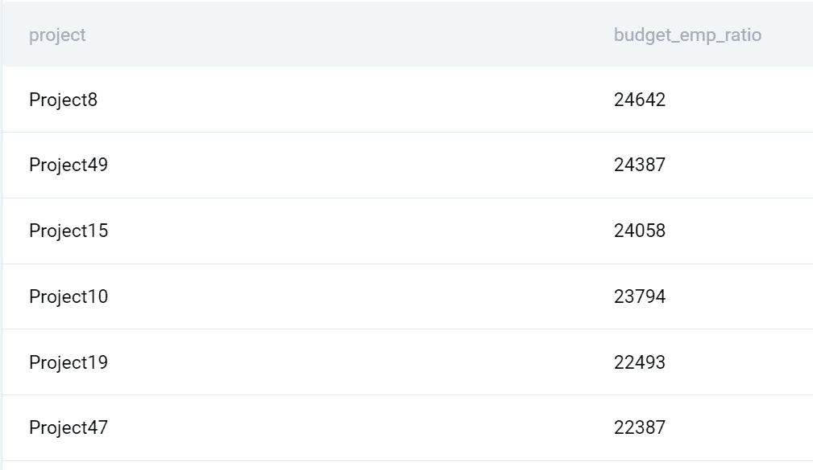
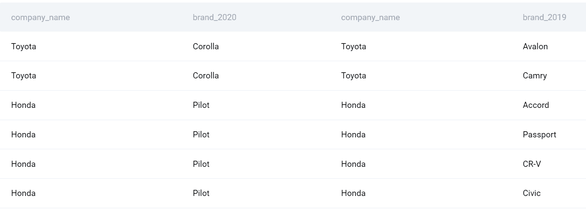
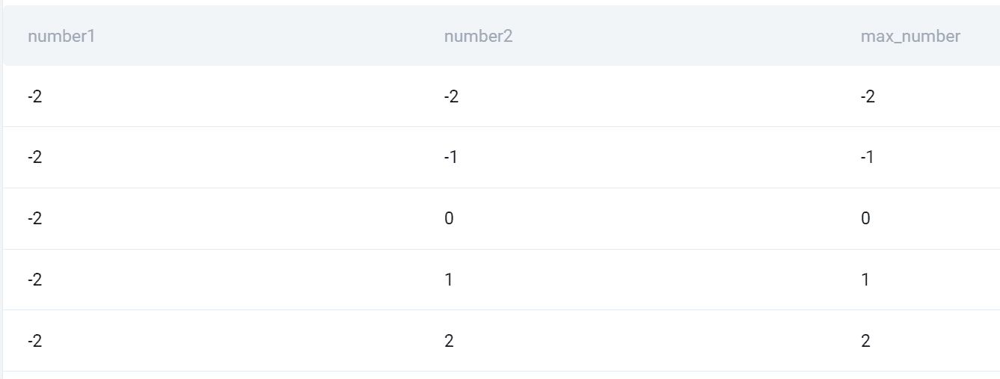

# SQL 数据科学：理解和利用连接

> 原文：[`www.kdnuggets.com/2023/08/sql-data-science-understanding-leveraging-joins.html`](https://www.kdnuggets.com/2023/08/sql-data-science-understanding-leveraging-joins.html)


作者提供的图片

数据科学是一个跨学科领域，极大依赖从大量数据中提取见解和做出明智决策。数据科学家工具箱中的基本工具之一是 SQL（结构化查询语言），这是一种用于管理和操作关系型数据库的编程语言。

* * *

## 我们的前三大课程推荐

 1\. [Google 网络安全证书](https://www.kdnuggets.com/google-cybersecurity) - 快速进入网络安全职业。

 2\. [Google 数据分析专业证书](https://www.kdnuggets.com/google-data-analytics) - 提升你的数据分析技能

 3\. [Google IT 支持专业证书](https://www.kdnuggets.com/google-itsupport) - 支持你的组织的 IT

* * *

在这篇文章中，我将重点讲解 SQL 的一个强大功能：连接。

# 什么是 SQL 连接？

SQL 连接允许你基于公共列合并多个数据库表中的数据。这样，你可以将信息汇集在一起，并在相关数据集之间创建有意义的联系。

# SQL 中的连接类型

有几种 [SQL 连接类型](https://www.stratascratch.com/blog/different-types-of-sql-joins-that-you-must-know/?utm_source=blog&utm_medium=click&utm_campaign=kdn+sql+joins)：

+   内连接

+   左外连接

+   右外连接

+   全外连接

+   交叉连接

让我们逐一解释每种类型。

# SQL 内连接

内连接仅返回两个连接表中都有匹配的行。它根据共享的键或列组合来自两个表的行，丢弃不匹配的行。

我们以以下方式可视化它。



作者提供的图片

在 SQL 中，这种类型的连接使用关键字 JOIN 或 INNER JOIN 执行。

# SQL 左外连接

左外连接返回来自左（或第一个）表的所有行以及来自右（或第二个）表的匹配行。如果没有匹配，则返回右表中列的 NULL 值。

我们可以像这样可视化它。



作者提供的图片

当你想在 SQL 中使用这种连接时，你可以使用 LEFT OUTER JOIN 或 LEFT JOIN 关键字。这里有一篇文章讨论了 [左连接与左外连接](https://www.stratascratch.com/blog/similarities-and-differences-left-join-vs-left-outer-join/?utm_source=blog&utm_medium=click&utm_campaign=kdn+sql+joins)。

# SQL 右外连接

右连接是左连接的反向操作。它返回右表中的所有行和左表中匹配的行。如果没有匹配，它会返回左表中列的 NULL 值。



图片由作者提供

在 SQL 中，这种连接类型是通过 RIGHT OUTER JOIN 或 RIGHT JOIN 关键字实现的。

# SQL 全外连接

全外连接返回两个表中的所有行，尽可能匹配行，并为不匹配的行填充 NULL 值。



图片由作者提供

在 SQL 中，此连接的关键字是 FULL OUTER JOIN 或 FULL JOIN。

# SQL 交叉连接

这种连接类型将一个表中的所有行与第二个表中的所有行组合在一起。换句话说，它返回笛卡尔积，即两个表的所有可能组合。

这是一个将帮助你更容易理解的可视化图。



图片由作者提供

在 SQL 中进行交叉连接时，关键字是 CROSS JOIN。

# 理解 SQL 连接语法

要在 SQL 中执行连接，你需要指定我们要连接的表、用于匹配的列以及我们要执行的连接类型。SQL 中连接表的基本语法如下：

```py
SELECT columns
FROM table1
JOIN table2
ON table1.column = table2.column;
```

这个示例展示了如何使用 JOIN。

你在 FROM 子句中引用第一个（或左边）表。然后使用 JOIN 并引用第二个（或右边）表。

然后是 ON 子句中的连接条件。在这里你指定将用哪些列来连接两个表。通常，这是一列共享的列，在一个表中是主键，在第二个表中是外键。

**注意：主键是表中每条记录的唯一标识符。外键在两个表之间建立了联系，即它是第二个表中引用第一个表的列。** 我们将在示例中展示这意味着什么。

如果你想使用 LEFT JOIN、RIGHT JOIN 或 FULL JOIN，你只需使用这些关键字代替 JOIN——代码中的其他部分完全相同！

CROSS JOIN 的情况稍有不同。它的本质是将两个表中的所有行组合在一起。因此，ON 子句是不需要的，语法如下所示。

```py
SELECT columns
FROM table1
CROSS JOIN table2;
```

换句话说，你只需在 FROM 中引用一个表，在 CROSS JOIN 中引用第二个表。

另外，你可以在 FROM 中引用两个表，并用逗号分隔它们——这是一种 CROSS JOIN 的简写方式。

```py
SELECT columns
FROM table1, table2;
```

# 自连接：SQL 中的一种特殊连接类型

还有一种特定的连接方式——将表与自身连接。这也被称为自连接表。

这不完全是一个独特的连接类型，因为之前提到的任何连接类型也可以用于自连接。

自连接的语法类似于我之前展示的。主要区别在于 FROM 和 JOIN 中引用的是相同的表。

```py
SELECT columns
FROM table1 t1
JOIN table1 t2
ON t1.column = t2.column;
```

此外，你需要给表两个别名以区分它们。你所做的是将表与自身连接，并将其视为两个表。

我在这里提一下，但不会详细说明。如果你对自连接感兴趣，请查看 [SQL 中的自连接插图指南](https://www.stratascratch.com/blog/illustrated-guide-about-self-join-in-sql/?utm_source=blog&utm_medium=click&utm_campaign=kdn+sql+joins)。

# SQL 连接示例

现在是展示我提到的内容如何在实际中运作的时候了。我将使用 [StrataScratch 的 SQL JOIN 面试题](https://www.stratascratch.com/blog/sql-join-interview-questions/?utm_source=blog&utm_medium=click&utm_campaign=kdn+sql+joins) 来展示 SQL 中每种不同类型的连接。

## 1\. 连接示例

[微软的这个问题](https://platform.stratascratch.com/coding/10301-expensive-projects?code_type=1&utm_source=blog&utm_medium=click&utm_campaign=kdn+sql+joins) 希望你列出每个项目并按员工计算项目预算。

***昂贵的项目***

**“给定一个项目和员工列表，并映射到每个项目，根据分配给每个员工的项目预算来计算。输出应包括项目标题和预算，预算应四舍五入到最接近的整数。按每个员工的预算从高到低排序项目列表。”**

### 数据

问题给出了两个表。

**ms_projects**

| id: | int |
| --- | --- |
| title: | varchar |
| budget: | int |

**ms_emp_projects**

| emp_id: | int |
| --- | --- |
| project_id: | int |

现在，表 **ms_projects** 中的列 id 是表的主键。相同的列可以在表 **ms_emp_projects** 中找到，尽管名字不同：project_id。这是表的外键，引用了第一个表。

我将在我的解决方案中使用这两列来连接表。

### 代码

```py
SELECT title AS project,
       ROUND((budget/COUNT(emp_id)::FLOAT)::NUMERIC, 0) AS budget_emp_ratio
FROM ms_projects a
JOIN ms_emp_projects b 
ON a.id = b.project_id
GROUP BY title, budget
ORDER BY budget_emp_ratio DESC;
```

我使用 JOIN 连接了这两个表。表 **ms_projects** 在 FROM 中被引用，而 **ms_emp_projects** 在 JOIN 后被引用。我给两个表都起了别名，这样我以后就不需要使用表的长名称。

现在，我需要指定要在其上连接表的列。我已经提到哪些列是一个表中的主键，另一个表中的外键，所以我将在这里使用它们。

我将这两列设置为相等，因为我想获取所有项目 ID 相同的数据。我还在每列前面使用了表的别名。

现在我可以访问两个表的数据，因此可以在 SELECT 中列出列。第一列是项目名称，第二列是计算得出的结果。

这个计算使用 COUNT()函数按每个项目计算员工数量。然后我将每个项目的预算除以员工数量。我还将结果转换为十进制值并四舍五入到零位小数。

### 输出

这是查询返回的结果。



## 2\. LEFT JOIN 示例

我们来在[Airbnb 面试题](https://platform.stratascratch.com/coding/9908-customer-orders-and-details?code_type=1&utm_source=blog&utm_medium=click&utm_campaign=kdn+sql+joins)上练习这个连接。题目要求找出每个城市的订单数量、顾客数量和订单总成本。

***顾客订单和详情***

**“找出每个城市的订单数量、顾客数量和订单总成本。仅包括至少有 5 个订单的城市，并计算每个城市中的所有顾客，即使他们没有下订单。”**

**“输出每个计算结果及其对应的城市名称。”**

### 数据

给定的表是**customers**和**orders**。

**customers**

| id: | int |
| --- | --- |
| first_name: | varchar |
| last_name: | varchar |
| city: | varchar |
| address: | varchar |
| phone_number: | varchar |

**orders**

| id: | int |
| --- | --- |
| cust_id: | int |
| order_date: | datetime |
| order_details: | varchar |
| total_order_cost: | int |

共享的列是**customers**表中的 id 和**orders**表中的 cust_id。我将使用这些列来连接表。

### 代码

下面是如何使用 LEFT JOIN 解决这个问题的方法。

```py
SELECT c.city,
       COUNT(DISTINCT o.id) AS orders_per_city,
       COUNT(DISTINCT c.id) AS customers_per_city,
       SUM(o.total_order_cost) AS orders_cost_per_city
FROM customers c
LEFT JOIN orders o ON c.id = o.cust_id
GROUP BY c.city
HAVING COUNT(o.id) >=5;
```

我在 FROM 中引用表**customers**（这是我们的左表），并通过客户 ID 列将其与**orders**表进行 LEFT JOIN。

现在我可以选择城市，使用 COUNT()按城市获取订单和顾客数量，并使用 SUM()按城市计算订单总成本。

为了按城市获取所有这些计算结果，我按城市对输出进行分组。

问题中还有一个额外的要求：“仅包括至少有 5 个订单的城市…” 我使用 HAVING 来仅显示订单数量为五个或更多的城市。

**问题是，我为什么使用了** **LEFT JOIN** **而不是** **JOIN** **呢？** 提示在问题中：“…并计算每个城市中的所有顾客，即使他们没有下订单。” 这意味着可能不是所有顾客都有下订单。因此，我想展示来自**customers**表中的所有顾客，这正好符合 LEFT JOIN 的定义。

如果我使用 JOIN，结果会出错，因为我会遗漏那些没有下订单的顾客。

**注意：SQL 中连接的复杂性并不体现在它们的语法上，而是在于它们的语义！** 如你所见，每个连接的写法都是一样的，只有关键字不同。然而，每个连接的工作方式不同，因此可能会根据数据输出不同的结果。因此，你必须完全理解每个连接的作用，并选择能返回你所需结果的连接！

### 输出

现在，让我们看看输出结果。


## 3\. RIGHT JOIN 示例

RIGHT JOIN 是 LEFT JOIN 的镜像。这就是为什么我可以很容易地用 RIGHT JOIN 解决之前的问题。让我给你演示一下怎么做。

### 数据

表格保持不变；我将使用不同类型的连接。

### 代码

```py
SELECT c.city,
       COUNT(DISTINCT o.id) AS orders_per_city,
       COUNT(DISTINCT c.id) AS customers_per_city,
       SUM(o.total_order_cost) AS orders_cost_per_city
FROM orders o
RIGHT JOIN customers c ON o.cust_id = c.id 
GROUP BY c.city
HAVING COUNT(o.id) >=5;
```

这是变化的地方。由于我使用了 RIGHT JOIN，所以我调换了表的顺序。现在表 **orders** 成为左表，表 **customers** 成为右表。连接条件保持不变。我只是调换了列的顺序以反映表的顺序，但这不是必须的。

通过调换表的顺序并使用 RIGHT JOIN，我将再次输出所有客户，即使他们没有下任何订单。

剩下的查询与之前的示例相同。输出也是如此。

**注意：实际上，** **RIGHT JOIN** **相对较少使用。** LEFT JOIN 对 SQL 用户来说似乎更自然，因此使用得更多。任何可以用 RIGHT JOIN 做的事情，也可以用 LEFT JOIN 做。因此，没有特定的情况需要偏好 RIGHT JOIN。

### 输出


## 4\. FULL JOIN 示例

[Salesforce 和 Tesla 的问题](https://platform.stratascratch.com/coding/10318-new-products?code_type=1&utm_source=blog&utm_medium=click&utm_campaign=kdn+sql+joins)要求你计算 2020 年公司发布的产品数量与前一年公司发布的产品数量之间的净差异。

***新产品***

*“你将获得一个按公司和年份划分的产品发布表。编写一个查询，计算 2020 年公司发布的产品数量与前一年公司发布的产品数量之间的净差异。输出公司的名称以及 2020 年与前一年发布的产品净差异。”*

### 数据

问题提供了一个具有以下列的表格。

**car_launches**

| year: | int |
| --- | --- |
| company_name: | varchar |
| product_name: | varchar |

当只有一个表时，我该如何连接表？嗯，让我们看看！

### 代码

这个查询有点复杂，所以我会逐步展示。

```py
SELECT company_name,
       product_name AS brand_2020
FROM car_launches
WHERE YEAR = 2020;
```

第一个 SELECT 语句找出 2020 年的公司和产品名称。这个查询稍后将转化为子查询。

问题要求你找出 2020 年和 2019 年之间的差异。所以我们来写一个相同的查询，但针对 2019 年。

```py
SELECT company_name,
       product_name AS brand_2019
FROM car_launches
WHERE YEAR = 2019;
```

我将现在将这些查询变成子查询，并使用 FULL OUTER JOIN 连接它们。

```py
SELECT *
FROM
  (SELECT company_name,
          product_name AS brand_2020
   FROM car_launches
   WHERE YEAR = 2020) a
FULL OUTER JOIN
  (SELECT company_name,
          product_name AS brand_2019
   FROM car_launches
   WHERE YEAR = 2019) b 
ON a.company_name = b.company_name;
```

子查询可以视作表，因此可以连接。我给第一个子查询一个别名，并将其放在 FROM 子句中。然后，我使用 FULL OUTER JOIN 将其与第二个子查询通过公司名称列连接。

通过使用这种类型的 SQL 连接，我将获得 2020 年所有公司和产品与 2019 年所有公司和产品的合并。



现在我可以完成我的查询了。我们选择公司名称。同时，我将使用 COUNT()函数来查找每年发布的产品数量，然后计算差异。最后，我将按公司对输出进行分组，并按公司字母顺序排序。

这是完整的查询。

```py
SELECT a.company_name,
       (COUNT(DISTINCT a.brand_2020)-COUNT(DISTINCT b.brand_2019)) AS net_products
FROM
  (SELECT company_name,
          product_name AS brand_2020
   FROM car_launches
   WHERE YEAR = 2020) a
FULL OUTER JOIN
  (SELECT company_name,
          product_name AS brand_2019
   FROM car_launches
   WHERE YEAR = 2019) b 
ON a.company_name = b.company_name
GROUP BY a.company_name
ORDER BY company_name;
```

### 输出

这是 2020 年和 2019 年之间公司及发布产品差异的列表。


## 5\. CROSS JOIN 示例

[这道 Deloitte 的问题](https://platform.stratascratch.com/coding/2101-maximum-of-two-numbers?code_type=1&utm_source=blog&utm_medium=click&utm_campaign=kdn+sql+joins)非常适合展示 CROSS JOIN 的工作原理。

***两个数字的最大值***

**“给定一个单列数字，考虑所有可能的两个数字的排列，假设数字对(x,y)和(y,x)是两个不同的排列。然后，对于每个排列，找出两个数字中的最大值。”**

**输出三列：第一个数字、第二个数字和两个数字中的最大值。”**

问题要求你找出两个数字的所有可能排列，假设数字对(x,y)和(y,x)是两个不同的排列。然后，我们需要找到每个排列中的最大值。

### 数据

问题给了我们一个具有一列的表。

**deloitte_numbers**

| number: | int |
| --- | --- |

### 代码

这段代码是 CROSS JOIN 的一个示例，同时也是自连接的示例。

```py
SELECT dn1.number AS number1,
       dn2.number AS number2,
       CASE
           WHEN dn1.number > dn2.number THEN dn1.number
           ELSE dn2.number
       END AS max_number
FROM deloitte_numbers AS dn1
CROSS JOIN deloitte_numbers AS dn2;
```

我在 FROM 中引用了表，并给它一个别名。然后，我通过在 CROSS JOIN 后引用它并给表另一个别名，将其与自身进行 CROSS JOIN。

现在可以将一个表视作两个表来使用。我从每个表中选择列 number。然后，我使用 CASE 语句设置一个条件来显示两个数字中的最大值。

为什么这里使用 CROSS JOIN？请记住，这是一种 SQL 连接类型，将显示所有表中所有行的所有组合。这正是问题所要求的！

### 输出

这是所有组合及两个数字中较大者的快照。



# 利用 SQL 连接进行数据科学

现在你知道如何使用 SQL 连接，问题是如何在数据科学中利用这些知识。

SQL 连接在数据科学任务中扮演着至关重要的角色，如数据探索、数据清理和特征工程。

以下是一些如何利用 SQL 连接的示例：

1.  **数据结合：** 连接表格允许你汇聚不同的数据源，使你能够分析多个数据集之间的关系和相关性。例如，将客户表与交易表连接可以提供有关客户行为和购买模式的洞察。

1.  **数据验证：** 连接操作可用于验证数据质量和完整性。通过比较来自不同表格的数据，你可以识别不一致、缺失值或异常值。这有助于数据清理，并确保用于分析的数据是准确和可靠的。

1.  **特征工程：** 连接操作在创建机器学习模型的新特征时非常有用。通过合并相关的表格，你可以提取有意义的信息并生成捕捉数据中重要关系的特征。这可以增强模型的预测能力。

1.  **聚合与分析：** 连接操作使你能够在多个表格之间执行复杂的聚合和分析。通过结合来自不同来源的数据，你可以获得数据的全面视图并得出有价值的洞察。例如，将销售表与产品表连接可以帮助你按产品类别或地区分析销售表现。

# SQL 连接的最佳实践

如我之前提到的，连接的复杂性并不体现在其语法上。你会发现语法相对简单明了。

连接的最佳实践也反映了这一点，因为它们并不关注代码本身，而是连接操作的作用及其表现。

为了最大化利用 SQL 中的连接操作，请考虑以下最佳实践。

1.  **了解你的数据：** 熟悉数据的结构和关系。这将帮助你选择合适的连接类型，并选择匹配的正确列。

1.  **使用索引：** 如果你的表格很大或经常被连接，考虑在用于连接的列上添加索引。索引可以显著提高查询性能。

1.  **注意性能：** 连接大型表格或多个表格可能会消耗大量计算资源。通过过滤数据、使用适当的连接类型以及考虑使用临时表或子查询来优化查询。

1.  **测试和验证：** 始终验证你的连接结果以确保正确性。执行合理性检查，并验证连接的数据是否符合你的期望和业务逻辑。

# 结论

SQL 连接是一个基本概念，使你作为数据科学家能够合并和分析来自多个来源的数据。通过理解不同类型的 SQL 连接，掌握其语法并有效利用它们，数据科学家可以发现有价值的洞察，验证数据质量，并推动数据驱动的决策。

我通过五个示例向你展示了如何操作。现在，利用 SQL 和连接来提升你的数据科学项目，并实现更好的结果，就全靠你了。

**[内特·罗西迪](https://www.stratascratch.com)** 是一名数据科学家和产品战略专家。他还是一名兼职教授，教授分析学，并且是 [StrataScratch](https://www.stratascratch.com/) 的创始人，该平台帮助数据科学家准备面试，提供来自顶级公司的真实面试问题。通过 [Twitter: StrataScratch](https://twitter.com/StrataScratch) 或 [LinkedIn](https://www.linkedin.com/in/nathanrosidi/) 与他联系。

### 更多相关内容

+   [数据库内分析：利用 SQL 的分析功能](https://www.kdnuggets.com/2023/07/indatabase-analytics-leveraging-sql-analytic-functions.html)

+   [利用 GPT 模型将自然语言转换为 SQL 查询](https://www.kdnuggets.com/leveraging-gpt-models-to-transform-natural-language-to-sql-queries)

+   [利用人工智能设计公平和公正的电动汽车充电网络](https://www.kdnuggets.com/leveraging-ai-to-design-fair-and-equitable-ev-charging-grids)

+   [利用 GeoPandas 在 Python 中处理地理空间数据](https://www.kdnuggets.com/leveraging-geospatial-data-in-python-with-geopandas)

+   [利用 XGBoost 进行时间序列预测](https://www.kdnuggets.com/2023/08/leveraging-xgboost-timeseries-forecasting.html)

+   [利用 CuPy 在 Python 中发挥 GPU 的强大功能](https://www.kdnuggets.com/leveraging-the-power-of-gpus-with-cupy-in-python)*****
