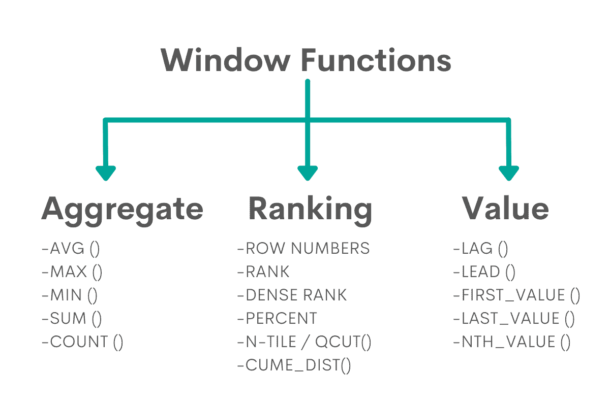
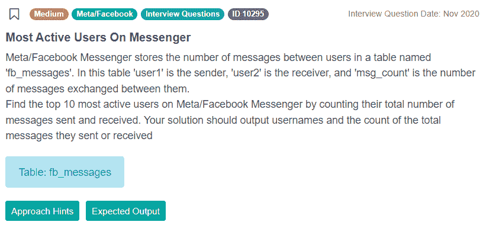
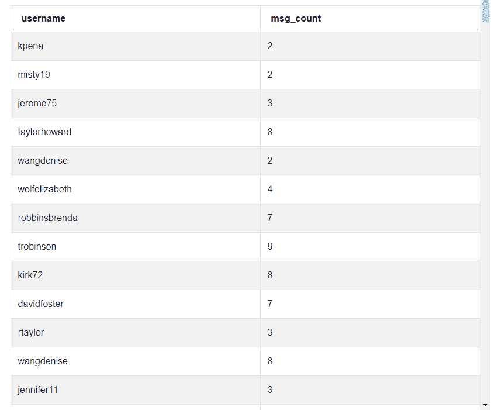
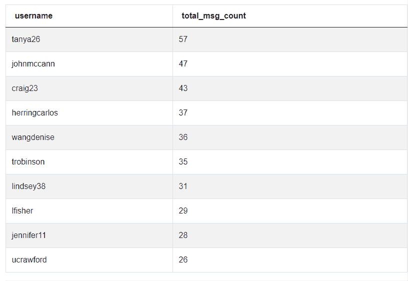
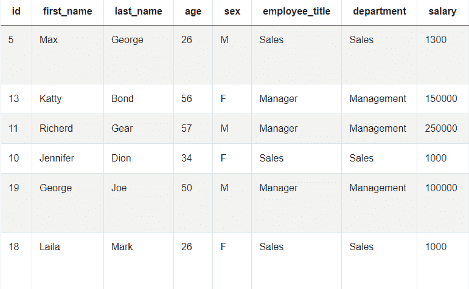
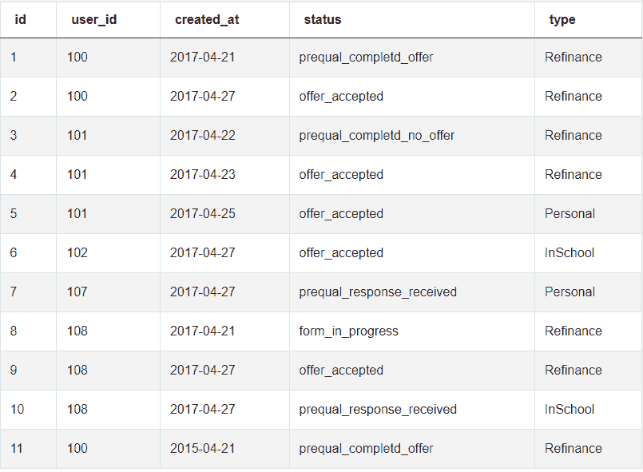
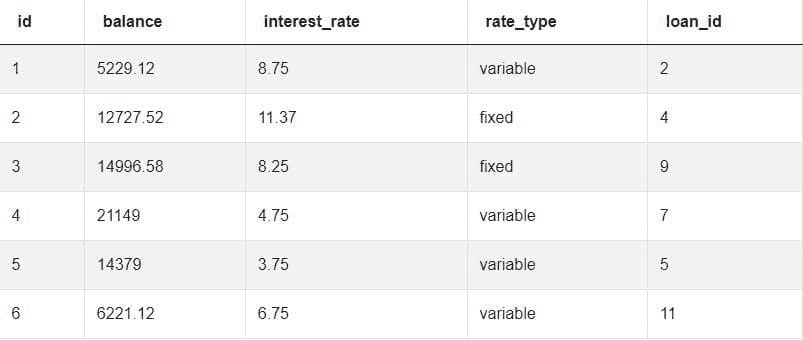

# SQL 窗口函数

> 原文：[`www.kdnuggets.com/2022/04/sql-window-functions.html`](https://www.kdnuggets.com/2022/04/sql-window-functions.html)


# 介绍

编写结构良好、有效的 SQL 查询并非易事。它需要对所有 SQL 函数和语句有深入的了解，以便你能在日常工作中高效地应用它们来解决问题。在这篇文章中，我们将讨论 SQL 窗口函数，它们提供了很多实用的功能来解决常见问题，但常常被忽视。

* * *

## 我们的三大课程推荐

 1\. [Google 网络安全证书](https://www.kdnuggets.com/google-cybersecurity) - 快速进入网络安全职业。

 2\. [Google 数据分析专业证书](https://www.kdnuggets.com/google-data-analytics) - 提升你的数据分析技能

 3\. [Google IT 支持专业证书](https://www.kdnuggets.com/google-itsupport) - 支持你的组织的 IT

* * *

SQL 窗口函数非常多功能，可以用于解决 SQL 中的许多不同问题。

几乎所有公司在面试中都会提问一些需要了解窗口函数的知识的问题。因此，如果你正在[准备数据科学面试](https://www.stratascratch.com/blog/5-tips-to-prepare-for-a-data-science-interview/?utm_source=blog&utm_medium=click&utm_campaign=kdnuggets)，重新复习一下 SQL 中的窗口函数是个不错的主意。在这篇文章中，我们将重点介绍基础知识。如果你想深入了解，可以阅读[这篇 SQL 窗口函数终极指南](https://www.stratascratch.com/blog/the-ultimate-guide-to-sql-window-functions/?utm_source=blog&utm_medium=click&utm_campaign=kdnuggets)。

对窗口函数有一个良好的掌握也有助于你[编写高效和优化的 SQL 查询](https://www.stratascratch.com/blog/best-practices-to-write-sql-queries-how-to-structure-your-code/?utm_source=blog&utm_medium=click&utm_campaign=kdnuggets)来解决你在日常工作中遇到的问题。

# 什么是 SQL 中的窗口函数？

简而言之，SQL 中的窗口函数用于访问表中的所有其他行，以生成当前行的值。

SQL 窗口函数之所以得名，是因为其语法允许你定义特定的部分或数据窗口来进行操作。首先，我们定义一个函数，这个函数会在所有行上运行，然后使用 OVER 子句来指定数据窗口。


窗口函数被认为是 SQL 的“高级”功能。乍一看，初级数据科学家可能会对其语法感到畏惧，但经过一些练习，SQL 窗口函数会变得不那么令人害怕。

## SQL 窗口函数类型



**聚合窗口函数**是进行计算或找到数据窗口内最低或最高极值所必需的。它们与常规聚合函数相同，但它们应用于特定的数据窗口，因此行为有所不同。

**排名窗口函数**使我们能够为数据窗口分配排名号码。六种主要函数中的每一种对行的排名方式不同。排名还取决于 ORDER BY 语句的使用。

**值窗口函数**允许我们根据其相对于当前行的位置找到值。它们对于获取前一行或后一行的值，以及分析时间序列数据非常有用。

这只是对三种 SQL 窗口函数的简要概述。我们将在文章的后续部分详细讨论它们。

## 如何以及何时使用它们？

一旦你理解了所有窗口函数及其使用案例，它们将成为你手中的强大工具。它们可以避免你编写许多不必要的代码行来解决可以通过一个窗口函数解决的问题。

### SQL 窗口函数与 Group By 语句

初学者在阅读窗口函数的描述时，常常会对其作用和与 Group By 语句的区别感到困惑，因为后者似乎以完全相同的方式工作。然而，如果你编写窗口函数并查看其实际输出，困惑会消失。

窗口函数与 Group By 语句之间最显著的区别在于，前者允许我们在保留所有原始数据的同时总结值。GROUP BY 语句也允许我们生成聚合值，但行被压缩成几个数据组。

### 使用案例

[成为数据科学家的职业路径](https://www.stratascratch.com/blog/how-to-get-a-data-science-job-the-ultimate-guide/?utm_source=blog&utm_medium=click&utm_campaign=kdnuggets)仅仅是开始。在你日常工作中，你会遇到需要高效解决的问题。窗口函数非常多才多艺，只要你知道如何使用它们，它们将是无价的。

比如，如果你在像苹果公司这样的公司工作，你可能需要分析内部销售数据，以找到其产品组合中最受欢迎或最不受欢迎的产品。窗口函数最常见的用例之一是跟踪时间序列数据。例如，你可能需要计算特定苹果产品的月度增长或下降，或 Airbnb 平台上的预订情况。

在 SaaS 公司工作的数据科学家经常被要求计算用户流失率，并跟踪其随时间的变化。只要你有用户数据，就可以使用窗口函数来跟踪流失率。

聚合窗口函数，如 **SUM()**，对于计算累计总数非常有用。假设我们有一整年的 12 个月销售数据，使用窗口函数，我们可以编写查询来计算销售数据的累计总数（当前月份+之前月份的总数）。

窗口函数有许多其他用途。例如，如果你正在处理用户数据，你可以按用户注册时间、发送的消息数量或其他类似指标来排序用户。

窗口函数还允许我们跟踪健康统计数据，例如病毒传播的变化、病例的严重程度或其他类似的见解。

### 与其他 SQL 关键字

为了有效使用窗口函数，必须首先理解 SQL 中的操作顺序。你只能在窗口函数之后使用窗口函数，而不能在之前使用。根据这一规则，可以在 SELECT 和 ORDER BY 语句中使用窗口函数，但不能在 WHERE 和 GROUP BY 等其他语句中使用。

通常，SQL 开发者使用窗口函数与 SELECT 语句，主查询可以包括 ORDER BY 语句。

## SQL 中的排名窗口函数

这些函数允许 SQL 开发者为行分配数字排名。

共有六种此类函数：

**ROW_NUMBER()** 只是简单地从 1 开始对行进行编号。行的顺序取决于 ORDER BY 语句。如果没有 ORDER BY，**ROW_NUMBER()** 函数将按行的初始状态进行编号。

**RANK()** 是 **ROW_NUMBER()** 函数的一个更细致的版本。**RANK()** 会考虑值是否相等并分配相同的排名。例如，如果第三行和第四行的值相等，它们都将被分配为第三名，从第五行开始，将从 5 继续计数。

**DENSE_RANK()** 的工作方式与 **RANK()** 函数类似，唯一的区别是：在同一个例子中，如果第三列和第四列的值相同，它们都会被分配为三的排名。然而，第五行不会从 5 开始计数，而是从 4 开始，考虑到之前的行排名为三。要了解更多差异，请查看这篇文章 [SQL 排名函数简介](https://www.stratascratch.com/blog/an-introduction-to-the-sql-rank-functions/?utm_source=blog&utm_medium=click&utm_campaign=kdnuggets)。

**PERCENT_RANK()** 采用不同的排名方法。它创建一个新列，以百分比（从 0 到 1）显示排名值。

**NTILE()** 是一个函数，它接受一个数值参数，用于创建批次以划分数据。例如，**NTILE(20)** 将创建 20 个数据桶，并相应地分配排名。

**CUME_DIST()** 函数计算当前行的累积分布。换句话说，它会遍历窗口中的每一条记录，并返回当前行值小于或等于的行所占的比例。这些行的相对大小介于 0（无）和 1（全部）之间。

### 使用 RANK() 排名数据

排名窗口函数在大型科技公司面试中经常出现。例如，Facebook/Meta 的面试官常常会要求候选人 [找到 Messenger 上最活跃的用户](https://platform.stratascratch.com/coding/10295-most-active-users-on-messenger?python=&utm_source=blog&utm_medium=click&utm_campaign=kdnuggets)。



要回答这个问题，我们必须首先查看可用的数据。我们有一个包含多个不同列的表格。**user1** 和 **user2** 列的值是用户名，**msg_count** 列代表它们之间交换的消息数量。根据问题的名称，我们必须找出记录活动次数最多的用户。为了做到这一点，我们必须首先考虑什么是活动：在这个上下文中，发送和接收消息都算作活动。

在查看数据后，我们发现**msg_count**并不代表每个用户在记录中的总消息数量。可能还有其他用户他们正在聊天。为了获取每个用户的总活动数量，我们必须获取**msg_count**列中用户至少是发送或接收消息的一方的值。

让我们查看一下这项任务的数据样本：


如你所见，用户**sgoodman**参与了两个对话 - 一个是与用户名**wangdenise**的对话，另一个是与**wolfelizabeth**的对话。在现实生活中，人们可能与数十人进行在线对话。我们的查询应该捕获他们之间交换的消息数量。

### 解决方案

**步骤 1：将用户合并到一列中**

首先，我们选择**user1** 列中的用户名及其相应的**msg_count** 值。然后对**user2** 列中的用户做相同的操作，并将它们合并到一个列中。我们使用 UNION ALL 操作符来完成这个操作。这将确保所有用户及其相应的发送或接收的**msg_count** 值都被保留。

```py
SELECT user1 AS username,
       msg_count
FROM fb_messages
UNION ALL
SELECT user2 AS username,
       msg_count
FROM fb_messages
```

我们必须记住，为了使**UNION ALL**语句能够合并值，两个 SELECT 语句中的列数及其相应的值类型必须相同。因此，我们使用**AS**语句将它们重命名为**username**。

如果我们运行这段代码，我们会得到以下结果：



**步骤 2：按降序排列用户**

一旦我们有了所有用户的列表，我们必须从上述表中选择**username**列，并将每个用户的**msg_count**值相加。

然后我们将使用**RANK()**窗口函数对每条记录进行编号。在这种情况下，我们想使用这个特定的函数，而不是**DENSE_RANK()**，因为在前 10 名中的消息数量可能存在并列情况。

排名窗口函数的准确性依赖于**ORDER BY**语句，它用于在输入数据窗口内排列值，而不是函数的输出。在这种情况下，我们必须使用**DESC**关键字，以确保消息数量按降序排列。这样，**RANK()** 函数会首先应用于最高的输入值。

OVER 关键字是窗口函数语法中的一个重要部分。它用于将排名函数连接到数据窗口。

到目前为止，我们的 SQL 查询应该类似于这样：

```py
WITH sq AS
  (SELECT username,
          sum(msg_count) AS total_msg_count,
          rank() OVER (
                       ORDER BY sum(msg_count) DESC)
   FROM
     (SELECT user1 AS username,
             msg_count
      FROM fb_messages
      UNION ALL SELECT user2 AS username,
                       msg_count
      FROM fb_messages) a
   GROUP BY username)
```

为了解决我们的问题，我们必须找到 10 个最活跃的用户。使用**RANK()**窗口函数是必要的，以处理在这 10 个用户组中可能出现的任何并列情况。

**步骤 3：** **显示前 10 名**

在最后一步，我们应该从**sq**子查询中获取**username**和**total_msg_count**值，并显示排名值为 10 或更小的记录。然后按降序排列它们。

```py
(SELECT username,
          sum(msg_count) AS total_msg_count,
          rank() OVER (
                       ORDER BY sum(msg_count) DESC)
   FROM
     (SELECT user1 AS username,
             msg_count
      FROM fb_messages
      UNION ALL SELECT user2 AS username,
                       msg_count
      FROM fb_messages) a
   GROUP BY username)
SELECT username,
       total_msg_count
FROM sq
WHERE rank <= 10
ORDER BY total_msg_count DESC
```

如果我们运行这段代码，我们会看到它按预期工作。同时，我们可以避免在某些用户的**total_msg_count**值相同的情况下出现任何错误。



### 找到前 5 百分位数值

这是另一个 Netflix 面试中问到的 [问题](https://platform.stratascratch.com/coding/10303-top-percentile-fraud?python=&utm_source=blog&utm_medium=click&utm_campaign=kdnuggets) 的例子。一个虚构的保险公司开发了一个算法来确定保险索赔的欺诈可能性。候选人必须找到前 5 百分位中最有可能欺诈的索赔。


正如你可能注意到的，这个问题涉及到寻找百分位数值。最简单的方法是使用 SQL 中的**NTILE()**排名窗口函数。在这种情况下，我们正在寻找百分位数值，所以**NTILE()**的参数将是 100。

指令说我们需要确定每个州前 5 百分位的欺诈性索赔。为此，我们的窗口定义应该包括**PARTITION BY**语句。分区是一种指定如何在窗口内分组值的方法。例如，如果你有一个用户的电子表格，你可以根据他们注册的月份进行分区。

在这种情况下，我们必须对**state**列中的值进行分区。这意味着计算每个州每个索赔的百分位数。我们使用**ORDER BY**语句将**fraud_score**列中的值按降序排列。

请注意，因为 **ORDER BY** 和 **PARTITION BY** 语句用于窗口定义中，它们仅适用于每个记录的“组”，每个组代表一个状态。例如，加州的记录根据其 **fraud_score 列** 的值进行排列，值最高的行排在最前面。当加州的记录用尽时，顺序会重置，从另一个州佛罗里达州的最高分记录开始。


### 查找第 N 高的值

还有另一个[问题](https://platform.stratascratch.com/coding/9892-second-highest-salary?utm_source=blog&utm_medium=click&utm_campaign=kdnuggets)，经常在亚马逊用来评估候选人对排名窗口函数的熟练程度。任务很简单：你会得到一个包含许多不同列的单一表格。问题要求我们找出所有员工记录中的第二高薪水。分析可用数据后，最重要的列显然是 **salary** 列。



在这种情况下，问题的措辞告诉我们要找出公司中第二高的薪水。因此，如果五名员工的年薪都是 100,000 美元，并且这是最高薪水，我们需要查找第六名员工，他在薪水降序中排在后面。

如果你查看当前在 StrataScratch 上的[解决方案](https://platform.stratascratch.com/coding/9892-second-highest-salary?utm_source=blog&utm_medium=click&utm_campaign=kdnuggets)，我们使用 **DENSE_RANK()** 窗口函数来获取第二高的值。此外，我们使用 DISTINCT 关键字来排除重复项，以防多个员工拥有相同的薪水。我们希望对每个剩余记录进行单独排名，因此不需要使用 PARTITION BY 语句来分隔员工组。

## SQL 中的聚合窗口函数

在 SQL 中，聚合函数的默认行为是将所有记录的数据聚合到几个组中。然而，当作为窗口函数使用时，所有行都会保持不变。相反，聚合窗口函数会创建一个单独的列来存储聚合结果。

有五种聚合窗口函数：

**AVG()** - 返回特定列或数据子集中的值的平均值

**MAX()** - 返回特定列或数据子集中的最高值

**MIN()** - 返回特定列或数据子集中的最低值

**SUM()** - 返回特定列或数据子集中的所有值的总和

**COUNT()** - 返回列或数据子集中的行数

面试问题经常围绕聚合窗口函数。例如，计算运行总和并创建一个新列来显示每条记录的运行总和是一项常见任务。有关面试中常用的 SQL 窗口函数的更多信息，请参阅这个 [SQL 聚合函数终极指南](https://www.stratascratch.com/blog/the-ultimate-guide-to-sql-aggregate-functions/?utm_source=blog&utm_medium=click&utm_campaign=kdnuggets)。

**查找最新日期**

为了更好地理解聚合窗口函数，让我们看看一个来自 Credit Karma 的 [面试问题](https://platform.stratascratch.com/coding/2003-recent-refinance-submissions?utm_source=blog&utm_medium=click&utm_campaign=kdnuggets)。


在这个问题中，我们需要找到并输出每个用户‘Refinance’提交的最新余额。为了更好地理解问题，我们必须分析可用的数据，这些数据由两个表组成：**loans** 和 **submissions**。

让我们看看 **loans** 表：



接下来是 **submissions** 表：



为了成功回答这个问题，分析这两个表及其数据是必不可少的。然后我们可以使用聚合窗口函数解决关键问题：为每个用户找到最近的提交。

为此，候选人必须了解 **MAX()** 聚合函数将返回‘最高’日期，这在 SQL 中等同于最新日期。**MAX()** 窗口函数必须应用于 **loans** 表中的 **created_at** 列，其中每条记录代表一个单独的提交。

另一个关键点是行应该按 **user_id** 值进行分区，以确保我们为每个唯一用户生成最新日期，以防他们进行了多次提交。问题指定我们应该找到‘Refinance’类型的最新提交，因此我们的 SQL 查询应包括该条件。

## SQL 中的值窗口函数

SQL 开发者可以使用这些函数从表中的其他行中获取值。像其他两种类型的窗口函数一样，这些函数有五种不同的类型。这些函数专用于窗口函数：

**LAG()** 函数允许我们访问前一行的值。

**LEAD()** 是 **LAG()** 的对立面，允许我们访问当前行之后的记录中的值。

**FIRST_VALUE()** 函数从数据集中返回第一个值，并允许我们设置数据排序条件，以便开发者可以控制哪个值将首先出现。

**LAST_VALUE()** 函数的工作方式与之前的函数相同，但它返回的是最后一个值而不是第一个。

**NTH_VALUE()** 函数允许开发者指定在排序中应返回哪个值。

### 时间序列分析

像**LAG()**和**LEAD()**这样的函数允许你从每行的后续或前面的行中提取值。因此，SQL 开发人员经常使用它们来处理时间序列数据，跟踪每日或每月的增长及其他应用场景。让我们看看在 Amazon 面试中提出的一个[问题](https://platform.stratascratch.com/coding/10319-monthly-percentage-difference?utm_source=blog&utm_medium=click&utm_campaign=kdnuggets)，它可以通过**LAG()**函数解决。


在这个问题中，候选人的任务相当简单：根据提供的数据计算每月的收入增长。**最终**，输出表应包括一个表示月度增长的百分比值。

**LAG()**窗口函数允许我们仅用几行代码解决这个难题。让我们看看实际推荐的解决方案：

```py
SELECT to_char(created_at::date, 'YYYY-MM') AS year_month,
       round(((sum(value) - lag(sum(value), 1) OVER w) / (lag(sum(value), 1) OVER w)) * 100, 2) AS revenue_diff_pct
FROM sf_transactions
GROUP BY year_month WINDOW w AS (
                                 ORDER BY to_char(created_at::date, 'YYYY-MM'))
ORDER BY year_month ASC
```

表中的日期值按时间顺序排列。因此，我们只需计算每个月的总收入，使用**LAG()**函数访问前一个月的收入值，并将其与当前月的收入一起使用，以计算以百分比表示的月度差异。

在上述解决方案中，我们使用**round()**函数对方程的结果进行四舍五入。首先，我们定义数据窗口，其中我们排列日期值并以特定格式组织它们。我们可以直接在窗口函数中做到这一点，但我们将不得不在多个地方使用它。一次定义窗口并简单地引用它为**w**会更高效。

首先，通过从 sum(value)中减去 lag(sum(value), 1)，我们找到了每个月与其前一个月之间的数值差（第一个月除外，因为它没有前一个月）。我们将这个数字除以前一个月的收入，该收入由**lag()**函数找出。最后，我们将结果乘以 100，以获得百分比值，并指定该值需要四舍五入到小数点后两位。

# 结束语

许多面试问题测试候选人对 SQL 窗口函数的知识，这并不奇怪。雇主知道，要在最高水平上表现，数据科学家必须非常了解 SQL 的这一部分。

如果你渴望承担编写高级 SQL 查询的角色，对 SQL 窗口函数的透彻理解可以帮助你找到复杂问题的简单解决方案。

**[Nate Rosidi](https://www.stratascratch.com)** 是一位数据科学家和产品策略专家。他还是一位兼职教授，教授分析课程，并且是[StrataScratch](https://www.stratascratch.com/)的创始人，该平台帮助数据科学家通过来自顶级公司的真实面试问题为面试做准备。在[Twitter: StrataScratch](https://twitter.com/StrataScratch)或[LinkedIn](https://www.linkedin.com/in/nathanrosidi/)上与他联系。

### 了解更多主题

+   [你应该知道的五大 SQL 窗口函数用于数据科学面试](https://www.kdnuggets.com/2022/01/top-five-sql-window-functions-know-data-science-interviews.html)

+   [KDnuggets™ 新闻 22:n03, 1 月 19 日：深入了解 13 个数据…](https://www.kdnuggets.com/2022/n03.html)

+   [数据库内分析：利用 SQL 的分析函数](https://www.kdnuggets.com/2023/07/indatabase-analytics-leveraging-sql-analytic-functions.html)

+   [损失函数：解释](https://www.kdnuggets.com/2022/03/loss-functions-explainer.html)

+   [深度学习中的激活函数如何工作](https://www.kdnuggets.com/2022/06/activation-functions-work-deep-learning.html)

+   [数据科学中的函数理解](https://www.kdnuggets.com/2022/06/understanding-functions-data-science.html)
