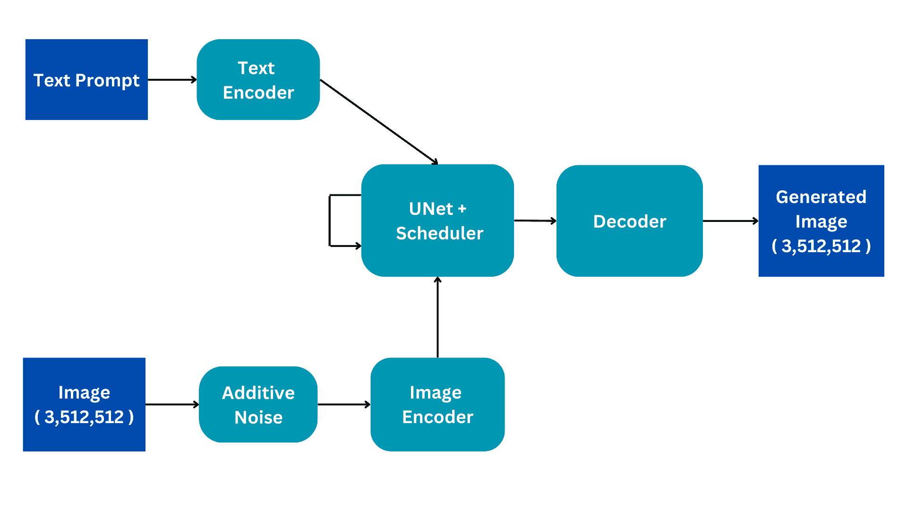

# 稳定扩散：生成 AI 的基本直觉

> 原文：[`www.kdnuggets.com/2023/06/stable-diffusion-basic-intuition-behind-generative-ai.html`](https://www.kdnuggets.com/2023/06/stable-diffusion-basic-intuition-behind-generative-ai.html)

使用 [稳定扩散](https://huggingface.co/spaces/stabilityai/stable-diffusion) 生成的图像

# 介绍

* * *

## 我们的前三课程推荐

 1\. [谷歌网络安全证书](https://www.kdnuggets.com/google-cybersecurity) - 快速进入网络安全职业。

 2\. [谷歌数据分析专业证书](https://www.kdnuggets.com/google-data-analytics) - 提升您的数据分析技能

 3\. [谷歌 IT 支持专业证书](https://www.kdnuggets.com/google-itsupport) - 支持您的组织 IT

* * *

近年来，AI 的世界在计算机视觉和自然语言处理方面急剧向生成建模转变。Dalle-2 和 Midjourney 引起了人们的注意，使他们认识到生成 AI 领域所取得的卓越成果。

目前，大多数 AI 生成的图像都依赖于扩散模型作为基础。本文的目标是澄清一些围绕稳定扩散的概念，并提供对所用方法的基本理解。

# 简化架构

该流程图展示了稳定扩散架构的简化版本。我们将逐步分析，以建立对内部工作原理的更好理解。我们将详细说明训练过程，以便更好地理解，而推理过程则只有一些微妙的变化。

图像由作者提供

## 输入

稳定扩散模型在图像字幕数据集上进行训练，每个图像都有一个描述图像的字幕或提示。因此，模型有两个输入：自然语言的文本提示和一个大小为 (3,512,512) 的图像，具有 3 个颜色通道和 512 的尺寸。

## 加性噪声

通过向原始图像添加高斯噪声，将图像转换为完全的噪声。这是通过连续步骤完成的，例如，在 50 个连续步骤中向图像添加少量噪声，直到图像完全噪声化。扩散过程将旨在去除这些噪声并重建原始图像。如何完成这一过程将进一步解释。

## 图像编码器

图像编码器作为变分自编码器的一部分，将图像转换为“潜在空间”，并将其调整为更小的尺寸，如(4, 64, 64)，同时还包括额外的批次维度。这个过程减少了计算要求并提高了性能。与原始扩散模型不同，Stable Diffusion 将编码步骤集成到潜在维度中，从而减少了计算量，以及缩短了训练和推理时间。

## 文本编码器

自然语言提示由文本编码器转换为向量化的嵌入。这个过程使用了 Transformer 语言模型，如 BERT 或基于 GPT 的 CLIP 文本模型。增强的文本编码器模型显著提高了生成图像的质量。文本编码器的输出结果是每个单词的 768 维嵌入向量数组。为了控制提示长度，设定了最大限制为 77。因此，文本编码器生成了一个尺寸为(77, 768)的张量。

## UNet

这是架构中计算开销最大的部分，主要的扩散处理在这里进行。它接收文本编码和嘈杂的潜在图像作为输入。该模块的目标是从接收到的嘈杂图像中重现原始图像。它通过多个推理步骤来实现这一点，这些步骤可以设置为超参数。通常 50 个推理步骤就足够了。

设想一个简单的场景，其中输入图像通过在 50 个连续步骤中逐渐引入少量噪声而转化为噪声。这种噪声的累积最终将原始图像转变为完全的噪声。UNet 的目标是通过预测在前一个时间步添加的噪声来逆转这个过程。在去噪过程中，UNet 从第 50 个时间步开始预测初始时间步添加的噪声。然后，它从输入图像中减去预测的噪声，并重复这一过程。在每个随后的时间步中，UNet 预测前一个时间步添加的噪声，逐渐从完全的噪声中恢复原始输入图像。在整个过程中，UNet 内部依赖于文本嵌入向量作为条件因素。

UNet 输出一个大小为(4, 64, 64)的张量，传递给变分自编码器的解码器部分。

## 解码器

解码器逆转编码器所做的潜在表示转换。它接收一个潜在表示，并将其转换回图像空间。因此，它输出一个(3,512,512)的图像，与原始输入空间的大小相同。在训练过程中，我们的目标是最小化原始图像与生成图像之间的损失。基于此，给定一个文本提示，我们可以从完全嘈杂的图像中生成与提示相关的图像。

# 整合一切

在推理过程中，我们没有输入图像。我们仅在文本到图像模式下工作。我们去掉了加性噪声部分，而是使用了随机生成的所需尺寸的张量。其余的架构保持不变。

UNet 经过训练，可以从完全的噪声中生成图像，利用了文本提示嵌入。这种特定的输入在推理阶段使用，使我们能够成功地从噪声中生成合成图像。这一基本概念是所有生成计算机视觉模型的根本直观。

**[穆罕默德·阿赫曼](https://www.linkedin.com/in/muhammad-arham-a5b1b1237/)** 是一位深度学习工程师，专注于计算机视觉和自然语言处理。他曾参与多项生成 AI 应用的部署和优化，这些应用在 Vyro.AI 全球排行榜上取得了佳绩。他对构建和优化智能系统的机器学习模型感兴趣，并相信持续改进。

### 相关主题更多内容

+   [生成 AI 游乐场：文本到图像的 Stable Diffusion](https://www.kdnuggets.com/2024/02/intel-generative-ai-playground-text-to-image-stable-diffusion)

+   [使用 Phraser 和 Stable Diffusion 成为 AI 艺术家](https://www.kdnuggets.com/2022/09/become-ai-artist-phraser-stable-diffusion.html)

+   [使用 Stable Diffusion 生成超真实面孔的 3 种方法](https://www.kdnuggets.com/3-ways-to-generate-hyper-realistic-faces-using-stable-diffusion)

+   [扩散与去噪：解释文本到图像生成 AI](https://www.kdnuggets.com/diffusion-and-denoising-explaining-text-to-image-generative-ai)

+   [前 7 个基于扩散的应用程序及演示](https://www.kdnuggets.com/2022/10/top-7-diffusionbased-applications-demos.html)

+   [ChatGPT 如何运作：聊天机器人的模型](https://www.kdnuggets.com/2023/04/chatgpt-works-model-behind-bot.html)
