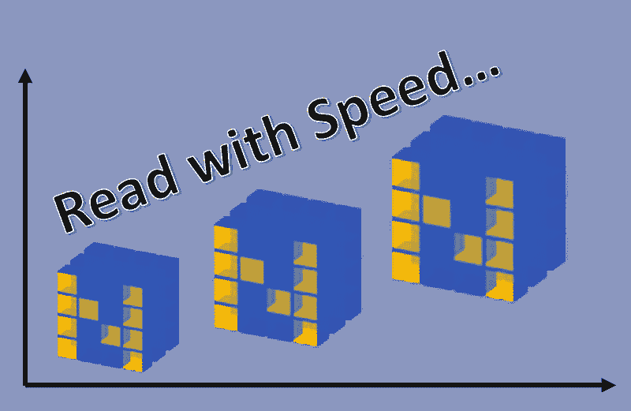

# 为什么你应该更频繁地使用 .npy 文件

> 原文：[`www.kdnuggets.com/2018/04/start-using-npy-files-more-often.html`](https://www.kdnuggets.com/2018/04/start-using-npy-files-more-often.html)

 评论



**介绍**

* * *

## 我们的三大课程推荐

 1\. [Google 网络安全证书](https://www.kdnuggets.com/google-cybersecurity) - 快速进入网络安全职业轨道。

 2\. [Google 数据分析专业证书](https://www.kdnuggets.com/google-data-analytics) - 提升你的数据分析技能

 3\. [Google IT 支持专业证书](https://www.kdnuggets.com/google-itsupport) - 支持你的组织的 IT 需求

* * *

Numpy，简称为[数值 Python](http://numpy.org/)，是 Python 生态系统中进行高性能科学计算和数据分析所需的基础包。几乎所有的高级工具如[Pandas](https://pandas.pydata.org/)和[scikit-learn](http://scikit-learn.org/)都是建立在它的基础上的。[TensorFlow](https://www.tensorflow.org/)使用 Numpy 数组作为基本构建块，在其基础上构建了 Tensor 对象和用于深度学习任务的 graphflow（这对长列表/向量/矩阵的线性代数运算的使用非常频繁）。

许多文章已经展示了 Numpy 数组相比于普通 Python 列表的优势。你经常会在数据科学、机器学习和 Python 社区中看到这样的说法：由于 Numpy 的矢量化实现以及许多核心例程是用 C 编写的（基于[CPython 框架](https://en.wikipedia.org/wiki/CPython)），Numpy 的速度要快得多。这确实是事实（[这篇文章美丽地展示了](http://notes-on-cython.readthedocs.io/en/latest/std_dev.html)使用 Numpy 的各种选项，甚至可以使用 Numpy APIs 编写基础的 C 例程）。Numpy 数组是密集打包的同质类型数组。相比之下，Python 列表是指向对象的指针数组，即使所有元素都属于同一类型。你可以享受到[引用局部性](https://en.wikipedia.org/wiki/Locality_of_reference)的好处。

[***在我在 Towards Data Science 平台上高度引用的文章之一***](https://towardsdatascience.com/why-you-should-forget-for-loop-for-data-science-code-and-embrace-vectorization-696632622d5f)，我展示了使用 Numpy 矢量化操作相对于传统编程构造如*for-loop*的优势。

> 然而，较少被认可的是，涉及从本地（或网络）磁盘存储中重复读取相同数据时，**Numpy 提供了另一个称为 .npy 文件格式的宝藏**。这种文件格式**大幅提高了读取速度**，相较于从纯文本或 CSV 文件读取。

问题是——当然，你第一次必须以传统方式读取数据并创建一个内存中的 NumPy `ndarray` 对象。但是，如果你使用相同的 CSV 文件重复读取相同的数值数据集，那么将 `ndarray` 存储在 `npy` 文件中而不是从原始 CSV 文件中重复读取将是很有意义的。

**什么是 .NPY 文件？**

这是一个标准的二进制文件格式，用于在磁盘上持久化单个任意 NumPy 数组。该格式存储了所有形状和数据类型信息，即使在具有不同架构的另一台机器上也能正确重建数组。该格式设计尽可能简单，同时实现其有限的目标。实现意图是纯 Python，并作为主 numpy 包的一部分进行分发。

格式必须能够：

+   表示所有 NumPy 数组，包括嵌套的记录数组和对象数组。

+   以原生二进制形式表示数据。

+   被包含在一个文件中。

+   存储所有必要的信息以重建数组，包括形状和数据类型，以便在不同架构的机器上使用。必须支持小端和大端数组，文件中的小端数字在任何读取该文件的机器上都会生成小端数组。类型必须以其实际大小来描述。例如，如果一台具有 64 位 C “long int”的机器写出一个包含“long int”的数组，则读取该数组的 32 位 C “long int”机器将生成一个 64 位整数的数组。

+   可逆向工程。数据集通常比创建它们的程序存活得更久。一个有能力的开发者应该能够在其首选编程语言中创建一个解决方案，以读取他获得的大多数 NPY 文件，而无需过多的文档。

+   允许内存映射数据。

**使用简单代码的演示**

一如既往，你可以从我的 [boiler plate code Notebook](https://github.com/tirthajyoti/PythonMachineLearning/blob/master/Pandas%20and%20Numpy/Numpy_Reading.ipynb) 下载，链接在我的 [Github repository](https://github.com/tirthajyoti/PythonMachineLearning)。这里我展示了基本的代码片段。

首先，通常的方法是将 CSV 文件读取为列表，并将其转换为 ndarray。

```py
import numpy as np
import time

# 1 million samples
n_samples=1000000

# Write random floating point numbers as string on a local CSV file
with open('fdata.txt', 'w') as fdata:
    for _ in range(n_samples):
        fdata.write(str(10*np.random.random())+',')

# Read the CSV in a list, convert to ndarray (reshape just for fun) and time it
t1=time.time()
with open('fdata.txt','r') as fdata:
    datastr=fdata.read()
lst = datastr.split(',')
lst.pop()
array_lst=np.array(lst,dtype=float).reshape(1000,1000)
t2=time.time()

print(array_lst)
print('\nShape: ',array_lst.shape)
print(f"Time took to read: {t2-t1} seconds.")

>> [[0.32614787 6.84798256 2.59321025 ... 5.02387324 1.04806225 2.80646522]
 [0.42535168 3.77882315 0.91426996 ... 8.43664343 5.50435042 1.17847223]
 [1.79458482 5.82172793 5.29433626 ... 3.10556071 2.90960252 7.8021901 ]
 ...
 [3.04453929 1.0270109  8.04185826 ... 2.21814825 3.56490017 3.72934854]
 [7.11767505 7.59239626 5.60733328 ... 8.33572855 3.29231441 8.67716649]
 [4.2606672  0.08492747 1.40436949 ... 5.6204355  4.47407948 9.50940101]]

>> Shape:  (1000, 1000)
>> Time took to read: 1.018733024597168 seconds.
```

所以这是第一次读取，你无论如何都必须这样做。*但如果你可能会多次使用相同的数据集*，那么，在你的数据科学过程完成后，别忘了将 ndarray 对象保存为**.npy** **格式**。

`**np.save('fnumpy.npy', array_lst)**`

因为这样做的话，下次从磁盘读取将会非常迅速！

```py
t1=time.time()
array_reloaded = np.load('fnumpy.npy')
t2=time.time()

print(array_reloaded)
print('\nShape: ',array_reloaded.shape)
print(f"Time took to load: {t2-t1} seconds.")

>> [[0.32614787 6.84798256 2.59321025 ... 5.02387324 1.04806225 2.80646522]
 [0.42535168 3.77882315 0.91426996 ... 8.43664343 5.50435042 1.17847223]
 [1.79458482 5.82172793 5.29433626 ... 3.10556071 2.90960252 7.8021901 ]
 ...
 [3.04453929 1.0270109  8.04185826 ... 2.21814825 3.56490017 3.72934854]
 [7.11767505 7.59239626 5.60733328 ... 8.33572855 3.29231441 8.67716649]
 [4.2606672  0.08492747 1.40436949 ... 5.6204355  4.47407948 9.50940101]]

>> Shape:  (1000, 1000)
>> Time took to load: 0.009010076522827148 seconds.
```

如果你想以其他形状加载数据，这无关紧要。

```py
t1=time.time()
array_reloaded = np.load('fnumpy.npy').reshape(10000,100)
t2=time.time()

print(array_reloaded)
print('\nShape: ',array_reloaded.shape)
print(f"Time took to load: {t2-t1} seconds.")

>> [[0.32614787 6.84798256 2.59321025 ... 3.01180325 2.39479796 0.72345778]
 [3.69505384 4.53401889 8.36879084 ... 9.9009631  7.33501957 2.50186053]
 [4.35664074 4.07578682 1.71320519 ... 8.33236349 7.2902005  5.27535724]
 ...
 [1.11051629 5.43382324 3.86440843 ... 4.38217095 0.23810232 1.27995629]
 [2.56255361 7.8052843  6.67015391 ... 3.02916997 4.76569949 0.95855667]
 [6.06043577 5.8964256  4.57181929 ... 5.6204355  4.47407948 9.50940101]]

>> Shape:  (10000, 100)
>> Time took to load: 0.010006189346313477 seconds.
```

结果发现，至少在这个特定的情况下，磁盘上的文件大小对于.npy 格式也更小。


**摘要**

在这篇文章中，我们展示了使用原生 NumPy 文件格式.npy 而非 CSV 读取大型数值数据集的实用性。如果相同的 CSV 数据文件需要多次读取，这可能是一个有用的技巧。

阅读更多关于该文件格式的[详细信息](https://docs.scipy.org/doc/numpy/neps/npy-format.html)。

如果你有任何问题或想法分享，请通过[**tirthajyoti[AT]gmail.com**](mailto:tirthajyoti@gmail.com)联系作者。你还可以查看作者的[**GitHub 库**](https://github.com/tirthajyoti?tab=repositories)以获取其他有趣的 Python、R 或 MATLAB 代码片段及机器学习资源。如果你和我一样，对机器学习/数据科学充满热情，请随时[在 LinkedIn 上添加我](https://www.linkedin.com/in/tirthajyoti-sarkar-2127aa7/)或[在 Twitter 上关注我。](https://twitter.com/tirthajyotiS)

**简介： [Tirthajyoti Sarkar](https://www.linkedin.com/in/tirthajyoti-sarkar-2127aa7/)** 是一名半导体技术专家、机器学习/数据科学爱好者、电子工程博士、博主和作家。

[原文](https://towardsdatascience.com/why-you-should-start-using-npy-file-more-often-df2a13cc0161)。经许可转载。

**相关：**

+   为什么你应该忘记‘for-loop’的数据科学代码并拥抱向量化

+   与 Numpy 矩阵合作：一个实用的入门参考

+   开始使用 Python 进行数据分析

### 更多相关话题

+   [在 Kaggle 上竞争的 4 个技巧及为何你应该开始](https://www.kdnuggets.com/2022/05/packt-top-4-tricks-competing-kaggle-start.html)

+   [为什么你需要学习不止一种编程语言！](https://www.kdnuggets.com/2022/06/need-learn-one-programming-language.html)

+   [更多关于分类问题的性能评估指标…](https://www.kdnuggets.com/2020/04/performance-evaluation-metrics-classification.html)

+   [为什么越来越多的开发者使用 Python 进行机器学习项目？](https://www.kdnuggets.com/2022/01/developers-python-machine-learning-projects.html)

+   [数据科学基础：你需要知道的 10 项必备技能…](https://www.kdnuggets.com/2020/10/data-science-minimum-10-essential-skills.html)

+   [如何开始使用 PyTorch 进行自然语言处理](https://www.kdnuggets.com/2022/04/start-natural-language-processing-pytorch.html)
