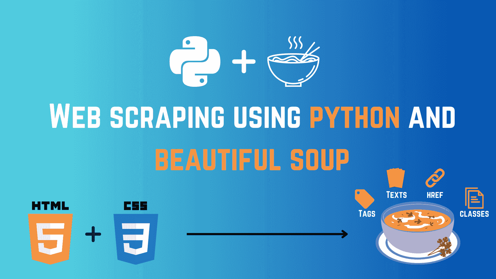
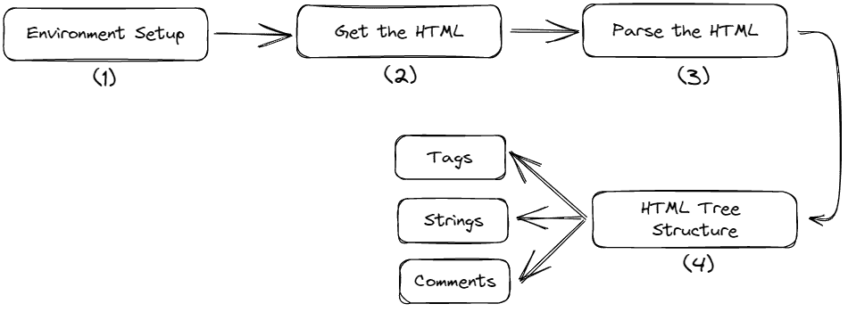
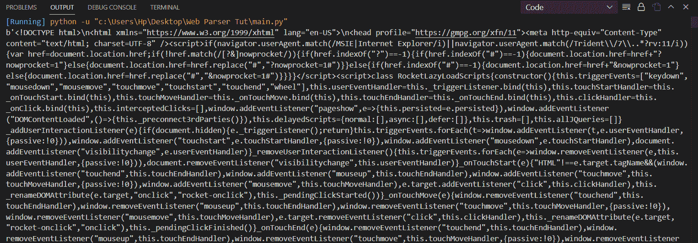
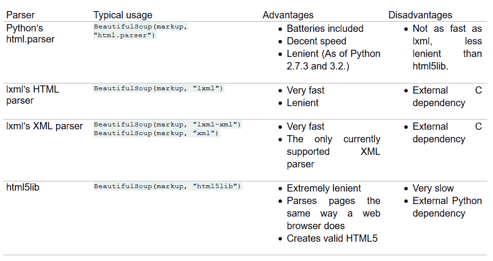
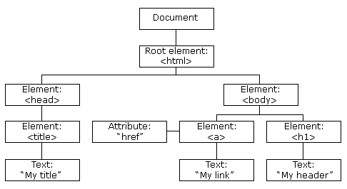

# Python 和 Beautiful Soup 的网页抓取逐步指南

> 原文：[`www.kdnuggets.com/2023/04/stepbystep-guide-web-scraping-python-beautiful-soup.html`](https://www.kdnuggets.com/2023/04/stepbystep-guide-web-scraping-python-beautiful-soup.html)



作者提供的图片

网页抓取是一种用于从不同网站提取 HTML 内容的技术。这些网页抓取器主要是计算机机器人，可以通过 HTTP 协议直接访问万维网，并在各种应用程序中使用这些信息。数据以非结构化格式获得，然后经过多次预处理步骤后转换为结构化格式。用户可以将这些数据保存在电子表格中或通过 API 导出。

* * *

## 我们的前 3 名课程推荐

 1\. [谷歌网络安全证书](https://www.kdnuggets.com/google-cybersecurity) - 快速开启网络安全职业生涯。

 2\. [谷歌数据分析专业证书](https://www.kdnuggets.com/google-data-analytics) - 提升你的数据分析技能

 3\. [谷歌 IT 支持专业证书](https://www.kdnuggets.com/google-itsupport) - 支持你在 IT 领域的组织

* * *

网页抓取也可以通过手动方式进行，针对小型网页，只需从网页上复制和粘贴数据即可。但如果我们需要大规模的数据并且来自多个网页，这种复制和粘贴的方法就不适用了。此时，自动化网页抓取器就发挥作用了。它们使用智能算法，可以在更短的时间内从大量网页中提取大量数据。

# 网页抓取的用途

网页抓取是企业收集和分析在线信息的强大工具。它在各个行业有多个应用。以下是一些你可以了解的应用。

1.  **市场营销：**许多公司使用网页抓取从各种社交媒体网站收集关于其产品或服务的信息，以获取公众的普遍情感。此外，他们从各种网站提取电子邮件地址，然后向这些电子邮件地址的拥有者发送批量促销邮件。

1.  **内容创建：**网页抓取可以从新闻文章、研究报告和博客文章等多个来源收集信息。它帮助创作者创建高质量和趋势内容。

1.  **价格比较：**网页抓取可以用来提取特定产品在多个电子商务网站上的价格，以为用户提供公平的价格比较。它还帮助公司确定其产品的最佳定价，以与竞争对手竞争。

1.  **职位发布：** 网页抓取还可以用来收集多个招聘门户网站上的各种职位信息，这些信息可以帮助许多求职者和招聘者。

现在，我们将使用 Python 和 Beautiful Soup 库创建一个简单的网页爬虫。我们将解析一个 HTML 页面并从中提取有用的信息。本教程只要求具备基本的 Python 知识。

# 代码实现

我们的实现分为以下四个步骤。



图 1 教程步骤 | 图片来源：作者

## 设置环境

为项目创建一个独立的目录，并使用命令提示符安装以下库。首先创建一个虚拟环境是优选的，但你也可以全局安装它们。

```py
$ pip install requests
$ pip install bs4
```

`requests` 模块从 URL 中提取 HTML 内容。它将所有数据以原始字符串格式提取出来，需要进一步处理。

`bs4` 是 Beautiful Soup 模块。它将以结构化的格式解析从 `request` 模块获得的原始 HTML 内容。

## 获取 HTML

在该目录中创建一个 Python 文件，并粘贴以下代码。

```py
import requests

url = "https://www.kdnuggets.com/"
res = requests.get(url)
htmlData = res.content
print(htmlData)
```

输出：



图片来源：作者

此脚本将从 URL `/` 提取所有原始 HTML 内容。这些原始数据包含所有文本、段落、锚标签、div 等。我们的下一个任务是解析这些数据，分别提取所有文本和标签。

# 解析 HTML

这里 Beautiful Soup 的作用就体现出来了。它用于解析和美化上述获得的原始数据。它创建了一个类似树的 DOM 结构，可以沿着树枝遍历，找到目标标签和对象。

```py
import requests
from bs4 import BeautifulSoup

url = "https://www.kdnuggets.com/"
res = requests.get(url)
htmlData = res.content
parsedData = BeautifulSoup(htmlData, "html.parser")
print(parsedData.prettify())
```

输出：


图片来源：作者

你可以看到在上述输出中，Beautiful Soup 将内容以更结构化的格式呈现，并进行了适当的缩进。`BeautifulSoup()` 函数接受两个参数，一个是输入 HTML，另一个是解析器。我们当前使用的是 `html.parser`，但还有其他解析器，如 `lxml` 或 `html5lib`。它们各有优缺点，有些更宽容，有些则非常快速。解析器的选择完全取决于用户的选择。下面是解析器的列表及其优缺点，你可以查看。



图 2 解析器列表 | 图片来源：[crummy](https://www.crummy.com/software/BeautifulSoup/bs4/doc/#installing-a-parser)

# HTML 树遍历

在本节中，我们将了解 HTML 的树结构，然后使用 Beautiful Soup 从解析后的内容中提取标题、不同标签、类、列表等。



图 3 HTML 树结构 | 图片来源 [w3schools](https://www.w3schools.com/js/js_htmldom_navigation.asp)

HTML 树表示了层级信息视图。根节点是<html>标签，它可以有父节点、子节点和兄弟节点。head 标签和 body 标签紧随 HTML 标签。head 标签包含元数据和标题，而 body 标签包含 div、段落、标题等。

当 HTML 文档通过 Beautiful Soup 传递时，它将复杂的 HTML 内容转换为四种主要的 Python 对象；这些对象是

1.  **BeautifulSoup:**

它代表整个解析文档。这是我们尝试抓取的完整文档。

```py
soup = BeautifulSoup("<h1> Welcome to KDnuggets! </h1>", "html.parser")
print(type(soup))
```

输出：

```py
<class 'bs4.BeautifulSoup'>
```

你可以看到整个 html 内容是一个 Beautiful Soup 类型的对象。

1.  **标签:**

标签对象对应于 HTML 文档中的特定标签。它可以从整个文档中提取一个标签，并在 DOM 中存在多个相同名称的标签时返回找到的第一个标签。

```py
soup = BeautifulSoup("<h1> Welcome to KDnuggets! </h1>", 'html.parser')
print(type(soup.h1))
```

输出：

```py
<class 'bs4.element.Tag'>
```

1.  **NavigableString:**

它包含标签内的文本，以字符串格式存储。Beautiful Soup 使用 NavigableString 对象来存储标签的文本。

```py
soup = BeautifulSoup("<h1> Welcome to KDnuggets! </h1>", "html.parser")
print(soup.h1.string)
print(type(soup.h1.string))
```

输出：

```py
Welcome to KDnuggets! 
<class 'bs4.element.NavigableString'>
```

1.  **评论:**

它读取标签内存在的 HTML 评论。这是一种特殊类型的 NavigableString。

```py
soup = BeautifulSoup("<h1><!-- This is a comment --></h1>", "html.parser")
print(soup.h1.string)
print(type(soup.h1.string))
```

输出：

```py
 This is a comment 
<class 'bs4.element.Comment'>
```

现在，我们将从解析后的 HTML 内容中提取标题、不同标签、类、列表等。

## 1\. 标题

获取 HTML 页面的标题。

```py
print(parsedData.title)
```

输出：

```py
<title>Data Science, Machine Learning, AI &amp; Analytics - KDnuggets</title>
```

或者，你也可以只打印标题字符串。

```py
print(parsedData.title.string)
```

输出：

```py
Data Science, Machine Learning, AI & Analytics - KDnuggets
```

## 2\. 查找和查找所有

这些函数在你想要在 HTML 内容中搜索特定标签时很有用。find()将只返回该标签的第一次出现，而 find_all()将返回所有出现的该标签。你也可以遍历它们。让我们看看下面的示例。

find():

```py
h2 = parsedData.find('h2')
print(h2)
```

输出：

```py
<h2>Latest Posts</h2>
```

find_all():

```py
H2s = parsedData.find_all("h2")
for h2 in H2s:
    print(h2)
```

输出：

```py
<h2>Latest Posts</h2>
<h2>From Our Partners</h2>
<h2>Top Posts Past 30 Days</h2>
<h2>More Recent Posts</h2>
<h2 size="+1">Top Posts Last Week</h2>
```

这将返回完整的标签，但如果你只想打印字符串，可以这样写。

```py
h2 = parsedData.find('h2').text
print(h2)
```

我们还可以获取特定标签的类、id、类型、href 等。例如，获取所有锚标签的链接。

```py
anchors = parsedData.find_all("a")
for a in anchors:
    print(a["href"])
```

输出：


图片来源：作者

你还可以获取每个 div 的类。

```py
divs = parsedData.find_all("div")
for div in divs:
    print(div["class"])
```

## 3\. 使用 Id 和类名查找元素

我们还可以通过给定特定的 id 或类名来查找特定元素。

```py
tags = parsedData.find_all("li", class_="li-has-thumb")
for tag in tags:
    print(tag.text)
```

这将打印所有属于`li-has-thumb`类的`li`的文本。但如果你不确定标签名称，编写标签名称并非总是必要的。你也可以这样写。

```py
tags = parsedData.find_all(class_="li-has-thumb")
print(tags) 
```

它将获取所有具有此类名的标签。

现在，我们将讨论 Beautiful Soup 的一些更有趣的方法

# Beautiful Soup 的更多方法

在本节中，我们将讨论更多 Beautiful Soup 的功能，这些功能将使你的工作更轻松、更快捷。

1.  `select()`

select() 函数允许我们根据 CSS 选择器查找特定标签。CSS 选择器是根据标签的类、ID、属性等模式来选择某些 HTML 标签的。

以下是一个示例，展示如何查找 `alt` 属性以 `KDnuggets` 开头的图像。

```py
data = parsedData.select("img[alt*=KDnuggets]")
print(data)
```

输出：


1.  `parent`

这个属性返回给定标签的父标签。

```py
tag = parsedData.find('p')
print(tag.parent)
```

1.  `contents`

这个属性返回所选标签的内容。

```py
tag = parsedData.find('p')
print(tag.contents)
```

1.  `attrs`

这个属性用于以字典的形式获取标签的属性。

```py
tag = parsedData.find('a')
print(tag.attrs)
```

1.  `has_attr()`

这个方法检查标签是否具有特定属性。

```py
tag = parsedData.find('a')
print(tag.has_attr('href'))
```

如果属性存在，它将返回 True，否则返回 False。

1.  `find_next()`

这个方法找到给定标签之后的下一个标签。它需要输入标签的名称来查找下一个标签。

```py
first_anchor = parsedData.find("a")
second_anchor = first_anchor.find_next("a")
print(second_anchor)
```

1.  `find_previous()`

这个方法用于查找给定标签之后的上一个标签。它需要输入标签的名称来查找下一个标签。

```py
second_anchor = parsedData.find_all('a')[1]
first_anchor = second_anchor.find_previous('a')
print(first_anchor)
```

它将再次打印第一个锚点标签。

你可以尝试许多其他方法。这些方法在 [Beautiful Soup](https://www.crummy.com/software/BeautifulSoup/bs4/doc/) 的文档中可以找到。

## 结论

我们已经讨论了网页抓取、它的用途以及它在 Python 和 Beautiful Soup 中的实现。今天就到这里。如果您有任何评论或建议，请随时在下方留言。

**[Aryan Garg](https://www.linkedin.com/in/aryan-garg-1bbb791a3/)** 是一名 B.Tech. 电气工程专业的学生，目前正在攻读本科最后一年。他对网页开发和机器学习领域充满兴趣。他已经追求了这一兴趣，并渴望在这些方向上继续工作。

### 更多相关主题

+   [使用 Python 进行网页抓取的初学者指南](https://www.kdnuggets.com/2022/10/beginner-guide-web-scraping-python.html)

+   [掌握使用 BeautifulSoup 进行网页抓取](https://www.kdnuggets.com/mastering-web-scraping-with-beautifulsoup)

+   [用 Pandas 制作美丽互动可视化的最简单方法](https://www.kdnuggets.com/2021/12/easiest-way-make-beautiful-interactive-visualizations-pandas.html)

+   [使用 Seaborn 创建美丽的直方图](https://www.kdnuggets.com/2023/01/creating-beautiful-histograms-seaborn.html)

+   [像专家一样测试：Python Mock 库的逐步指南](https://www.kdnuggets.com/testing-like-a-pro-a-step-by-step-guide-to-pythons-mock-library)

+   [逐步阅读和理解 SQL 查询指南](https://www.kdnuggets.com/a-step-by-step-guide-to-reading-and-understanding-sql-queries)
