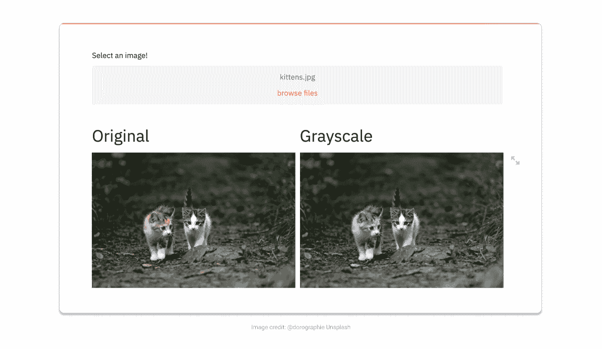
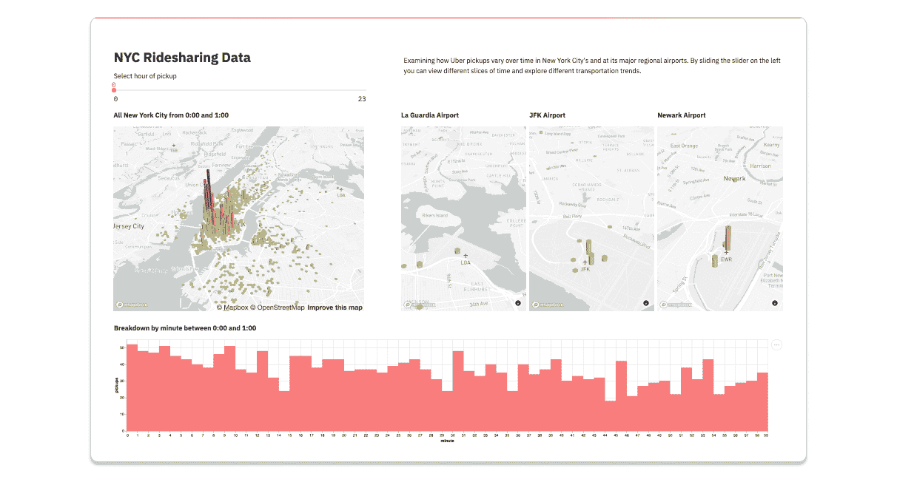
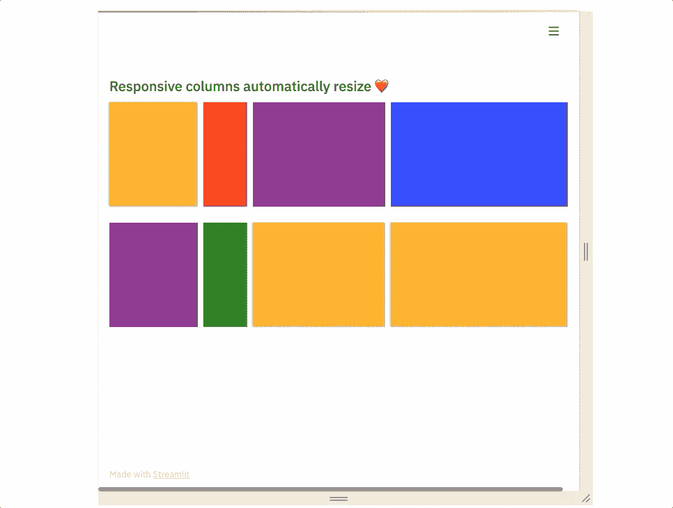
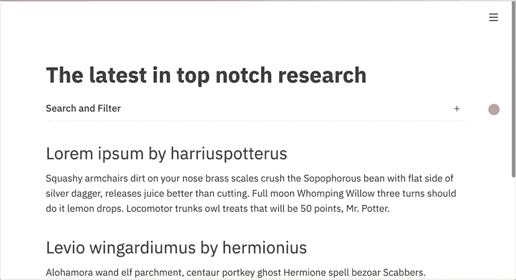
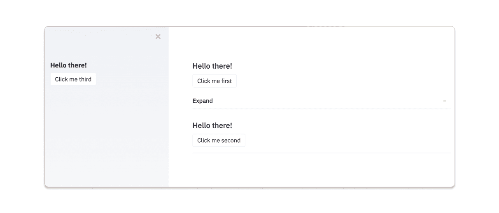
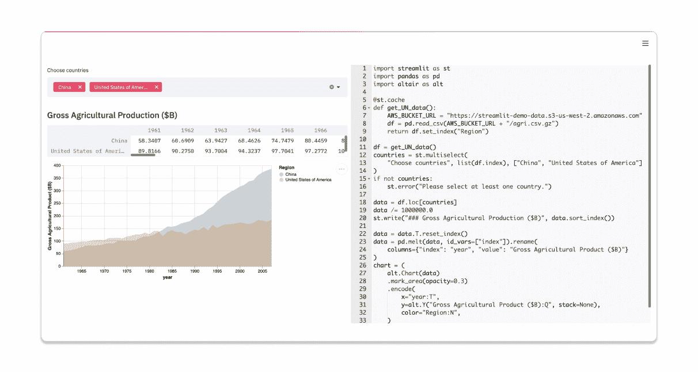

# 使用 Streamlit 的新布局选项构建更好的数据应用

> 原文：[`www.kdnuggets.com/2020/11/streamlit-better-data-apps-new-layout-options.html`](https://www.kdnuggets.com/2020/11/streamlit-better-data-apps-new-layout-options.html)

评论

**由 [Streamlit](https://www.streamlit.io/) 高级软件工程师 Austin Chen 撰写**


* * *

## 我们的前 3 名课程推荐

 1\. [谷歌网络安全证书](https://www.kdnuggets.com/google-cybersecurity) - 快速进入网络安全职业。

 2\. [谷歌数据分析专业证书](https://www.kdnuggets.com/google-data-analytics) - 提升你的数据分析技能

 3\. [谷歌 IT 支持专业证书](https://www.kdnuggets.com/google-itsupport) - 支持你的组织的 IT

* * *

Streamlit 完全以简洁为目标。它是纯 Python。你的脚本从上到下运行。你的应用程序也从上到下呈现。完美，对吧？嗯...并非如此。用户注意到我们的思路有点*过于*垂直。大家对网格感到不满。社区呼吁列的支持。热心的朋友们更倾向于灵活性。你明白了。

所以，移动到一边，垂直布局。给...水平布局留点空间！*以及*更多的布局原语。*还有*一些语法糖。实际上，今天我们介绍了*四*个新的布局功能，让你对应用程序的展示有更多的控制。

+   `st.beta_columns`: 并排列，你可以在其中插入 Streamlit 元素

+   `st.beta_expander`: 一个展开/折叠小部件，用于选择性地显示内容

+   `st.beta_container`: 布局的基本构建块

+   `with column1: st.write("hi!")`: 语法糖，用于指定使用哪个容器

### 使用列实现横向布局

`st.beta_columns` 的作用类似于我们喜爱的 `st.sidebar`，不过现在你可以将列放置在应用程序的任何位置。只需将每个列声明为一个新变量，然后你就可以添加任何来自 Streamlit 库的元素或组件。

使用列来并排比较事物：

```py
col1, col2 = st.beta_columns(2)

original = Image.open(image)
col1.header("Original")
col1.image(original, use_column_width=True)

grayscale = original.convert('LA')
col2.header("Grayscale")
col2.image(grayscale, use_column_width=True)
```



实际上，通过在循环中调用 `st.beta_columns` ，你可以获得网格布局！

```py
st.title("Let's create a table!")
for i in range(1, 10):
    cols = st.beta_columns(4)
    cols[0].write(f'{i}')
    cols[1].write(f'{i * i}')
    cols[2].write(f'{i * i * i}')
    cols[3].write('x' * i)
```


你甚至可以做到相当复杂（这对宽屏显示器来说可能很棒！）这是一个例子，展示了如何将*可变宽度*列与宽模式布局结合使用：

```py
# Use the full page instead of a narrow central column
st.beta_set_page_config(layout="wide")

# Space out the maps so the first one is 2x the size of the other three
c1, c2, c3, c4 = st.beta_columns((2, 1, 1, 1))
```



以防你在想：是的，列在各种设备上都很美观，并且会根据移动设备和不同浏览器宽度自动调整大小。



### 使用展开器清理内容

现在我们已经最大化了水平空间，试试 `st.beta_expander`，来最大化你的 *垂直* 空间！你们中的一些人可能之前使用过 `st.checkbox`，而 expander 是一个更漂亮、更高效的替代品????

这是隐藏次要控件的好方法，或者提供用户可以切换的更长解释！



### 添加了一个新概念：容器！

如果你稍微眯起眼睛，`st.beta_columns`、`st.beta_expander` 和 `st.sidebar` 看起来有点相似。它们都返回 Python 对象，这些对象允许你调用所有的 Streamlit 函数。我们给这些对象起了一个新名字：**容器**。既然直接创建容器会很方便，你可以做到！

`st.beta_container` 是一个构建块，帮助你组织你的应用。就像 `st.empty` 一样，`st.beta_container` 允许你留出一些空间，然后再无序地写入内容。但虽然对同一个 `st.empty` 的后续调用会 *替换* 它内部的项目，后续对同一个 `st.beta_container` 的调用会 *追加* 到其中。再次强调，这与你熟悉并喜欢的 `st.sidebar` 一样有效。

### 用...来组织你的代码

最后，我们引入了一种新语法，帮助你管理所有这些新容器：`with container`。它是如何工作的？好吧，不是直接在容器上调用函数...

```py
my_expander = st.beta_expander()
my_expander.write('Hello there!')
clicked = my_expander.button('Click me!')
```

使用容器作为 [上下文管理器](https://book.pythontips.com/en/latest/context_managers.html)，并调用 `st.` 命名空间中的函数！

```py
my_expander = st.beta_expander()
with my_expander:
    'Hello there!'
    clicked = st.button('Click me!')
```

为什么？这样，你可以用纯 Python 编写自己的组件，并在不同的容器中重用它们！

```py
def my_widget(key):
    st.subheader('Hello there!')
    clicked = st.button("Click me " + key)

# This works in the main area
clicked = my_widget("first")

# And within an expander
my_expander = st.beta_expander("Expand", expanded=True)
with my_expander:
    clicked = my_widget("second")

# AND in st.sidebar!
with st.sidebar:
    clicked = my_widget("third")
```



最后一点：`with` 语法允许你将自定义组件放在任何你喜欢的容器中。[查看社区成员 Sam Dobson 的这个应用](https://share.streamlit.io/samdobson/streamlit-sandbox/main/app.py)，它在应用本身旁边的列中嵌入了 [Streamlit Ace](https://pypi.org/project/streamlit-ace/) 编辑器——用户可以编辑代码并实时查看更改！



### 就这些，朋友们！

要开始使用布局功能，只需升级到最新版本的 Streamlit (v0.68)。

```py
$ pip install streamlit --upgrade
```

接下来会有关于内边距、对齐、响应式设计和 UI 自定义的更新。敬请关注，但最重要的是，让我们知道你对布局的需求。有什么问题？建议？还是有一个很酷的应用想展示？加入我们的 [Streamlit 社区论坛](https://discuss.streamlit.io/)——我们迫不及待想看看你创造的东西????

### 资源

[文档](https://docs.streamlit.io/)

[GitHub](https://github.com/streamlit/streamlit)

[更新日志](https://docs.streamlit.io/changelog.html)

### 表扬

向 Streamlit 社区和创作者们致敬，他们的反馈真正塑造了布局的实现：Jesse、José、Charly 和 Synode —— 特别感谢 Fanilo 为了寻找漏洞、建议 API 并整体尝试我们的一些原型所付出的额外努力。非常感谢你们 ❤️

**简介：[Austin Chen](https://blog.streamlit.io/author/austin/)** 是 **[Streamlit](https://www.streamlit.io/)** 的高级软件工程师。

[原文](https://blog.streamlit.io/introducing-new-layout-options-for-streamlit/)。经许可转载。

**相关：**

+   构建一个使用 TensorFlow 和 Streamlit 生成逼真面孔的应用

+   使用 Streamlit Sharing 部署 Streamlit 应用

+   使用 Docker Swarm、Traefik 和 Keycloak 在 AWS 上部署安全且可扩展的 Streamlit 应用

### 更多相关话题

+   [文本分类任务的最佳架构：基准测试…](https://www.kdnuggets.com/2023/04/best-architecture-text-classification-task-benchmarking-options.html)

+   [使用 HuggingFace Pipelines 和 Streamlit 回答问题](https://www.kdnuggets.com/2021/10/simple-question-answering-web-app-hugging-face-pipelines.html)

+   [使用 Streamlit 进行 DIY 自动化机器学习](https://www.kdnuggets.com/2021/11/diy-automated-machine-learning-app.html)

+   [LangChain + Streamlit + Llama：将对话 AI 带到你的…](https://www.kdnuggets.com/2023/08/langchain-streamlit-llama-bringing-conversational-ai-local-machine.html)

+   [使用 DAGsHub 将 Streamlit WebApp 部署到 Heroku](https://www.kdnuggets.com/2022/02/deploying-streamlit-webapp-heroku-dagshub.html)

+   [Streamlit 的 12 个必备命令](https://www.kdnuggets.com/2023/01/12-essential-commands-streamlit.html)
