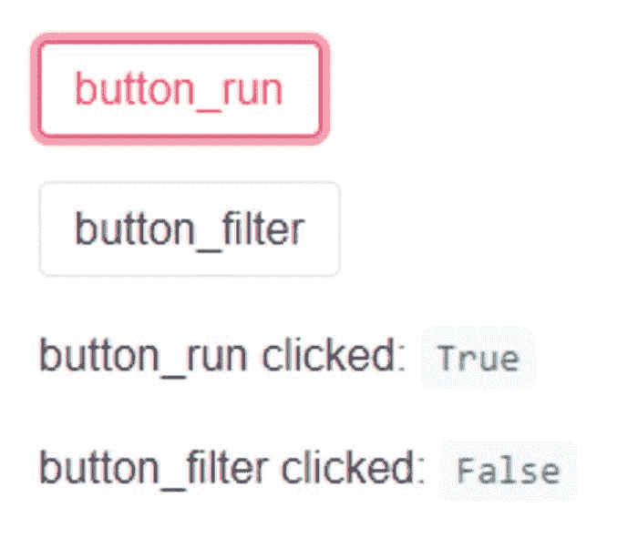
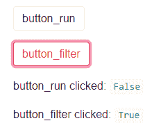
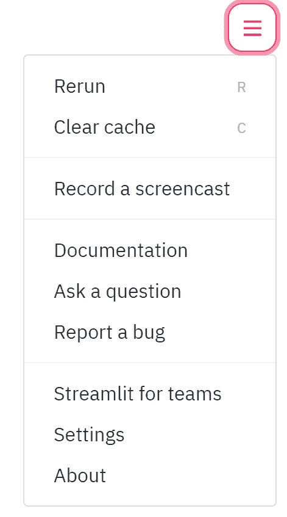
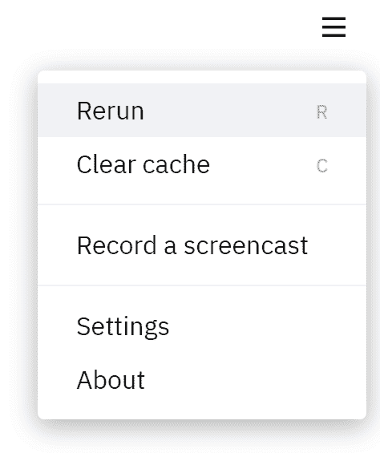
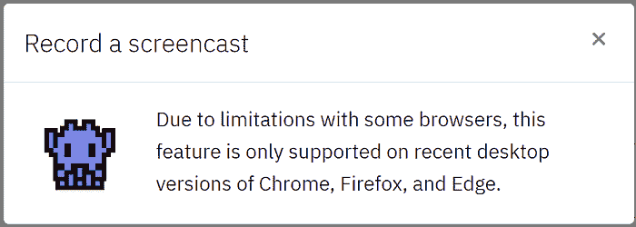
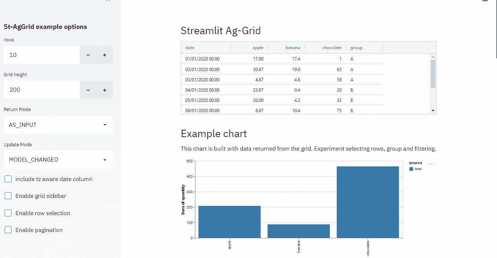

# Streamlit 提示、技巧和黑客技巧，适合数据科学家

> 原文：[`www.kdnuggets.com/2021/07/streamlit-tips-tricks-hacks-data-scientists.html`](https://www.kdnuggets.com/2021/07/streamlit-tips-tricks-hacks-data-scientists.html)

评论

**由 [Kaveh Bakhtiyari](https://kaveh.bakhtiyari.com/)，人工智能博士候选人，SSENSE 数据科学家**

SSENSE 的数据科学团队通常构建非常复杂的工具和仪表板。另一方面，它们的维护对团队来说是一个挑战。自从 SSENSE 数据科学团队积极使用 [Streamlit](https://www.streamlit.io/) 已经超过一年了。在使用 Streamlit 之前，我们使用 Dash、Flask、R Shiny 等来构建我们的工具并使其对公司内的利益相关者可用。2019 年 10 月，我们开始评估 Streamlit 在我们项目中的潜在能力，通过了解其优点以及如何将其整合到我们的数据科学基础设施中。到 2019 年底，我们开始了一些基于 Streamlit 的试点项目，取代了 Flask 和 Dash。

* * *

## 我们的前三大课程推荐

 1\. [Google 网络安全证书](https://www.kdnuggets.com/google-cybersecurity) - 快速进入网络安全职业生涯

 2\. [Google 数据分析专业证书](https://www.kdnuggets.com/google-data-analytics) - 提升你的数据分析技能

 3\. [Google IT 支持专业证书](https://www.kdnuggets.com/google-itsupport) - 支持你在 IT 领域的组织

* * *

在评估了 Streamlit 之后，我们很快意识到它具有很大的潜力，可以加快开发速度，并显著减少维护工作。除了所有酷炫的功能和易于使用外，Streamlit 不提供你可以从其他网络开发库（如 Flask）中获得的定制行为、事件和 UI 设计。最终，由于这些限制，开发干净的应用程序并在长期内轻松维护变得更容易。从我的角度来看，其统一的 UI 也是一个积极点。首先，它清晰、简洁且响应迅速。其次，所有团队成员都可以创建具有统一设计的工具。但仍然，我们如何提供我们在 Flask 应用程序中拥有的自定义元素呢？简而言之，这并不完全可能，但我们可以使用一些技巧和窍门，帮助你在设计中进行更多自定义。

今天，我将讨论一些我在使用 Streamlit 超过一年的过程中学到的技巧，你也可以利用这些技巧来释放你强大的 DS/AI/ML（无论它们是什么）应用程序的潜力。

> Streamlit 是一个活跃的开源项目，社区经常提供新更新。我个人已经将他们的[更新日志页面](https://docs.streamlit.io/en/stable/changelog.html)添加到书签中，以便跟踪新更新和功能。我们今天讨论的一些内容在`Streamlit (0.82.0)`中并未本地支持，但未来可能会有所变化。

### 页面配置

这个功能最初是在测试版中引入的，后来在`version 0.70.0`中移到了 Streamlit 命名空间。这个很酷的功能允许你设置页面标题、网站图标、页面布局模式和侧边栏状态。

默认情况下，Streamlit 将页面标题设置为原始 Python 文件名，并使用 Streamlit 网站图标。使用这行代码，你可以自定义页面标题，这对于用户书签你的应用非常有利。然后，网站图标可以帮助他们区分如果他们在多个浏览器标签中打开了许多应用。设置布局和侧边栏的初始状态也可以让你的应用按照你希望的方式运行。

在引入这一功能之前，有些功能只能通过将 CSS 注入页面来实现。例如，如果你想制作一个宽屏，可以做如下操作：

> 这行代码必须是页面上的第一个 Streamlit 命令，并且只能设置一次。无论你为布局设置了什么（居中或宽屏），用户都可以在设置中控制它们。

### 空组件

在多种情况下，你可能需要在页面上生成新元素，或者用另一个元素替换现有的文本或元素。这可以通过`st.empty()`实现。这个方法在页面上创建一个空的占位符，之后你可以用任何对象或文本替换它。

上述代码最初在页面上创建一个占位符，然后在相同的位置写上*“这是一个示例文本。”*，之后将其替换为一个输入数字对象。

这在页面上动态显示对象或显示某些计算进度（例如进度百分比）时非常有用。

### 查询字符串

在你的 Streamlit 应用中设置和检索查询字符串目前是一个实验性功能。我希望它将来能够移入主命名空间，因为我个人非常喜欢这个功能。如果你曾经想知道为什么我们在 Streamlit 中需要查询字符串，你并不孤单。

当你在查询字符串中设置自定义输入时，用户可以分享带有完全相同参数的链接。否则，他们还需要输入自己的参数。

我个人使用的另一个用例是共享不同 Streamlit 应用之间的信息。在我们的团队中，每个数据科学家可能在不同的项目上工作，我们可能需要将用户从一个应用程序重定向到另一个。当我们提供链接让用户导航到其他 Streamlit 应用时，我们希望确保用户的体验尽可能无缝。因此，我们将所需的参数传递给新应用，以便它加载用户所寻找的数据和分析。

例如，我们的一些工具与我们网站上的产品有关（真是惊喜）。当他们在应用 1 中查看产品 1 的分析时，我们希望确保一旦他们转到应用 2 获取更多细节或不同分析时，它会自动显示产品 1，用户不需要重新输入信息。

### 在子文件夹中运行 Streamlit

在数据科学项目中，我们可能需要将 Streamlit 应用放在子文件夹中。在这种情况下，由于 Streamlit 从子文件夹运行应用程序，该应用无法访问父文件夹中的库。为了解决这个问题，我们可能需要将 Streamlit 主应用程序文件放在项目根目录中，或者在 Streamlit 应用程序的开头将根文件夹添加到系统路径中。

### 会话

Streamlit 是基于会话的应用程序。这意味着一旦用户访问应用程序，Streamlit 会为其分配一个会话 ID，其他连续的操作和数据传输都与该会话相关联。因此，当你有一个过程时，它不会影响其他同时的用户，除非你使用缓存。我们稍后会讨论**缓存**。

默认情况下，你没有对 Streamlit 中的会话控制的标准访问权限，这还没有正式记录，而且仅用于内部目的。然而，你仍然可以访问这些控制并从中获益。

Streamlit 应用程序以类似脚本的格式开发。这意味着对应用程序的每次交互都会触发从头到尾重新运行整个代码。这使得 Streamlit 非常易于使用，但同时也很难控制连续事件，因为开发者没有事件处理功能。

假设你有一个按钮（`st.button`）用于启动一个过程，在结果屏幕中，你希望给用户一些交互选项，比如另一个复选框、单选按钮或简单的另一个按钮。在这种情况下，当你点击第一个按钮（我们称之为`button_run`）时，它在重新运行整个代码时会变为`True`。这没有问题，应用运行流畅。

现在，在生成的页面上，有另一个按钮（我们称之为 `button_filter`）用于过滤结果。如果你现在点击第二个按钮（`button_filter`），它的值变为 `True`，Streamlit 会再次运行整个代码。但问题是现在第一个按钮（`button_run`）变成了 `False`，因为我们没有点击它。在这种情况下，当 Streamlit 重新运行整个代码时，它假设 `button_run` 没有被点击，而 `button_filter` 被点击了。它不会记住 `button_run` 之前被点击过。因此，`button_filter` 点击的代码将永远不会被执行，因为 `button_filter` 本身是第一个按钮 `button_run` 点击的结果。

在这种情况下，我们应该注册事件，以便 Streamlit 可以记住当用户点击第一个按钮时，并且一旦下一个按钮被点击时，它可以理解这些是连续的操作，两者都应该被视为点击。

你可能会认为，我们可以将这些信息保存到数据库或临时文本文件中。这是可能的，但你如何区分潜在的不同用户呢？

Streamlit 有一个内置的未文档化的 Session 对象，可以为每个用户存储一些临时信息。在这种情况下，当用户点击 `button_run` 时，我们将点击事件存储在 Session 中，而一旦 `button_filter` 被点击，我们可以检查 `button_run` 是否之前被点击过，以控制数据的正确流动。

这里是你可以在应用中包含的会话类：

一旦你添加了会话类，你可以使用会话来存储和检索信息。

### SQLAlchemy

SQLAlchemy 是连接到多种类型数据库（如 SQLite、MySQL 等）的标准流行库之一。SQLAlchemy 可以用于多种平台，如桌面应用、网页应用，甚至是移动应用。如果你以前使用过这个库，你会发现它相当简单，但在网络开发中可能会变得有些棘手。使用这个库进行 Web 应用开发的主要挑战是控制数据库连接的数量。

为了这个目的，我们有 Flask (`sqlalchemy-flask`) 和 Tornado (`sqlalchemy-tornado`) 的独立库，开发者可以放心使用。但据我所知，我们没有专门为 Streamlit 提供的库。由于 Streamlit 是建立在 Tornado 之上的，也许我们可以使用 Tornado 版本，但我个人没有进行过测试。

如你所记得，Streamlit 是基于会话的，这意味着它为每个用户运行一个独立的实例。SQLAlchemy 也不例外。如果不小心的话，Streamlit 会为每个用户甚至每次交互创建一个数据库连接。根据你的数据库，如果活动连接过多，你的连接可能会被拒绝。因此，Python 可能会出现一些奇怪的错误，如“双重释放或损坏”，并崩溃你的应用程序。

在 Streamlit 论坛上，有建议缓存连接，这在 SQLLite 上效果很好，但在 MySQL 上效果不佳。例如，当你缓存数据库连接时，它不会无限期保持打开状态，因此你可能需要通过`ttl`来解决这个问题。在这种情况下，你可以确保在连接对象到达数据库端时已经过期，因为连接已经被关闭。从理论上讲，如果你有非常有限的同时用户，这种方法效果很好。

缓存连接的问题主要在于当两个用户同时运行缓存对象的代码时。最后，缓存的连接可能不是正确的连接，而是已经过期的连接，因为在同一时间创建了两个连接，但只有一个被缓存。

SQLAlchemy 有一个名为 Session 的对象，我们可以在其中创建数据库连接（引擎）并执行 SQL 查询。这会检查新连接是否已存在于池中，如果存在，它不会创建新连接以防止数据库连接饱和问题。在这种情况下，你不再需要使用 Streamlit 缓存来存储数据库连接。以下代码片段将帮助你了解如何使用 Session 连接 MySQL。

记住，在使用 SQLAlchemy 的 Session 之前，如果你只使用引擎，你必须返回`conn = engine.connect()`而不是会话，你可以使用`df = pd.read_sql(query, conn)`来运行查询。然而，这些方法在 SQLAlchemy Sessions 中不起作用。

### 缓存

Streamlit 有非常全面且有用的缓存文档，老实说，这是它最有用的功能之一。不使用或误用缓存会极大地影响应用性能和加载/运行时间。我不想详细讨论已经在[Streamlit 文档](https://docs.streamlit.io/en/stable/caching.html)中提供的缓存内容，只提几个提示和发现。

### 应用范围访问

与 Session 对象不同，缓存对象是全应用范围可访问的。这意味着一旦你缓存了信息，所有应用用户都可以访问。因此，重要的是不要缓存用户特定的设置和数据，而是如前所述使用 Session。

### 缓存参数

缓存机制有几个参数可以控制对象的缓存方式。

+   **ttl `**<float, None>**`**:** 这代表生存时间，用于设置缓存对象的生存时间。这个过期时间以秒为单位。

+   **max_entries `**<int, None>**`**:** 一旦你开始调用具有不同参数的函数，它会开始缓存所有这些变化，并且在短时间内，缓存数据量可能非常庞大。此参数可以设置可以缓存的函数变化数量，旧的变化将被删除。这控制和限制了消耗的内存量。

+   **persistent **`**<bool>**`**:** 这是一个布尔参数，用于设置缓存的数据是存储在硬盘还是内存中。只需记住，一旦将其设置为 True，Streamlit 就会将对象序列化并存储在硬盘上，而并非所有对象（例如 SQLAlchemy 数据库连接）都可以被序列化。因此，对于一些持久缓存函数，你可能会遇到错误。

+   **allow_output_mutation **`**<bool>**`**:** 一旦函数的输出被缓存，如果你更改了输出（突变），结果将被存储在缓存对象中，正如我之前提到的，这对所有用户都是可访问的。因此，最佳实践是避免更改缓存对象。但仍然有一些情况下你需要直接更改缓存对象。在这种情况下，此参数将允许 Streamlit 突变缓存对象。

+   **suppress_st_warning **`**<bool>**`**:** 有时 Streamlit 会向用户/开发者发出一些警告，以提醒他们缓存的某些后果。将此设置为 False 将停止这些警告。

+   **show_spinner **`**<bool>**`**:** 每当 Streamlit 运行应该被缓存的函数时，你会在 UI 上看到一条消息，显示“Running function_name”。除非你有很多函数，否则这可能不会太打扰你。如果你有很多函数，你会在 UI 上看到这些消息。将此参数设置为 False 将会阻止显示这些消息。

上述代码仅缓存结果 60 秒，并且只保留此函数的最后 20 个变体。它还不会显示任何警告，也不会在运行此函数时在 Streamlit UI 上显示任何消息。

由于我们将 `allow_output_mutation` 设置为 `False`，以下代码是不允许的，我们不能更新（突变）函数的结果。

### 清除缓存

有些情况下你可能需要以编程方式清除缓存。虽然可以通过 Streamlit 应用右上角的汉堡菜单手动清除所有缓存数据，但如果你想以编程方式进行，你可以使用以下未文档化的方法。

### SQLAlchemy 会话 / 作用域会话

现在你可以使用 SQLAlchemy 会话、作用域会话和连接池成功连接到数据库，你可能需要缓存会话或使用数据库连接的函数。如前所述，由于我们使用了连接池和作用域会话，我们可能不需要缓存连接，但仍然可能需要缓存我们的函数。以下是我们对缓存使用会话的函数的两个建议。

以下示例将使用 `hash_funcs` 来识别 Session 的哪个参数必须进行哈希监控。

如果上述示例不起作用，例如在使用 `scoped_session` 的情况下，你可以简单地要求 Streamlit 忽略哈希会话，如下所示：

### UI 黑客

Streamlit 的简洁性在于你不需要处理 UI，它自带预构建的响应式 UI 元素，这些元素会优雅地放置在你的页面上。即使在最近的版本中，他们提供了新的 beta 更新，允许你创建列并在其中排列元素，但对 UI 的自定义仍然有限。

当我部署我的应用程序时，公司中有各种各样的用户在使用它们。我大量使用缓存机制来控制我的应用程序的性能和速度。我的一些函数需要几分钟才能运行，我使用缓存机制来确保其他用户不会再次等待相同的请求，并且能够获得高性能的应用体验。但是，如果用户点击右上角的汉堡菜单按钮，并选择“*清除缓存*”，这可能会对其他用户的应用性能产生巨大影响，直到函数再次缓存结果。例如，我的一些应用程序设计为在宽模式下显示最佳，如果用户选择“居中”模式，这可能会影响应用程序的显示效果。

除了所有这些可能直接影响我的应用程序的选项外，汉堡菜单中还有一些普通用户可能不需要访问的选项。例如，访问 Streamlit Github、文档等。

在 [Streamlit Github 上提出的想法](https://github.com/streamlit/streamlit/issues/395) 是限制应用程序部署后汉堡菜单选项的数量，但截至今天，这个问题仍然开放，我们无法直接管理它们。因此，我提出了我的 CSS 解决方案来解决这个问题。

在我提出的解决方案中，你可以移除（隐藏）Streamlit 页脚，并控制汉堡菜单中的项目。你只需使用 `st.markdown` 将以下 CSS 注入到你的应用程序中，并允许“危险的” HTML 代码。

上述数字在 `li:nth-of-type(n)` 中指的是汉堡菜单中的项目元素，它们的顺序可能在未来的 Streamlit 更新中发生变化。

此外，目前在汉堡菜单中（第 3 项）有一个名为“**部署此应用**”的选项。只有当应用程序通过回环本地 IP 地址（`localhost` 或 `127.0.0.1`）访问时，此项目才会显示。如果你通过 LAN/WAN IP 地址访问你的应用程序，则不会显示此项目。

### 录制屏幕视频

这个功能在 `version 0.55.0` 中引入，我个人对这个功能感到兴奋，因为它允许我们录制我们的应用程序用于培训和演示目的。很快，我们意识到这个功能在其他访问我们 Streamlit 应用程序的用户中不起作用，他们点击该选项时会收到以下消息。

由于浏览器实施和强加的隐私限制，这个功能仅在以下条件下有效：

+   仅在最新版本的 Chrome、Firefox 和 Edge 上

+   访问`localhost`或`127.0.0.1`

+   如果不是本地访问，必须使用 SSL 证书（https）

如果你的应用在代理后运行，例如`Nginx`，并且你打算使用此功能，请确保它通过 SSL 证书进行安全保护。目前，Streamlit 本身不支持 SSL，但可以在带有 SSL 证书的代理后部署。

### 组件

自从 Streamlit 组件的引入以来，开发者们开始构建出令人惊叹的组件，可以在 Streamlit 应用中使用。如果你愿意，你可以使用 Streamlit 组件 API 构建自己的组件。Streamlit 还有一个组件库，展示了一些有用且有趣的公开组件。在这些组件中，我挑选了几个我在 SSENSE 中构建出色应用所使用的组件。

### ACE 编辑器

这个编辑器提供了针对不同编程语言的颜色编码编辑器。我个人在我的应用中使用了很多 JSON 数据，我使用这个编辑器查看和编辑我的 JSON 内容。它非常出色，因为它还可以捕捉我的格式结构和错误。

[`github.com/okld/streamlit-ace`](https://github.com/okld/streamlit-ace)

如果你对 Streamlit 标准的多行文本框感到厌倦，这个组件可能是一个很好的替代方案。

### Ag-Grid

Streamlit 可以处理数据框，并可以使用`st.write`或`st.dataframe`以表格格式显示它们。然而，默认情况下，Streamlit 不提供数据框呈现的自定义控制，除非点击列名进行排序。

Ag-Grid 是一个可以导入到 Streamlit 中的网格组件。使用这个组件，你不仅可以呈现你的数据框，还可以在网格单元格中包含链接、图片、复选框等，并进行数据过滤、搜索、汇总和分组。

[`github.com/PablocFonseca/streamlit-aggrid`](https://github.com/PablocFonseca/streamlit-aggrid)

如果你经常需要展示数据框，也许是时候尝试 Ag-Grid，看看它在你的应用中的巨大潜力。

### Lottie 动画

最后但同样重要的是，我列表中的组件是 Lottie 动画。如果你查看[lottiefiles.com](https://lottiefiles.com/)，你会看到成千上万的基于矢量的动画，格式多样，如 JSON，可以放置在你的应用中。这个组件可以让你通过简单地提供 JSON 文件来展示这些 Lottie 动画。

[`lottiefiles.com/968-loading`](https://lottiefiles.com/968-loading)

我个人使用这些动画来展示在加载或计算时设计精美的旋转器。这些动画将为你下一个数据科学项目带来更生动和动态的效果。

### 最后的话

在这里，我展示了一些开发 Streamlit 应用的提示和技巧。这些技巧中的一些可能会在未来版本的 Streamlit 中原生提供，从而不再需要我们进行这些破解，另一方面，它们可能会带来一些更新以防止这些破解。谁知道呢，但我们现在可以享受这些技巧，并期待 Streamlit 的新功能。

我还要感谢 Streamlit 社区开发了如此出色的工具。

**个人简介：[Kaveh Bakhtiyari](https://kaveh.bakhtiyari.com/)** 是人工智能博士生，并且是 SSENSE 的数据科学家。

[原文](https://medium.com/ssense-tech/streamlit-tips-tricks-and-hacks-for-data-scientists-d928414e0c16)。已获许可转载。

**相关内容：**

+   使用 Streamlit Sharing 部署 Streamlit 应用

+   使用 Streamlit 进行主题建模

+   在 AWS 上使用 Docker Swarm、Traefik 和 Keycloak 部署安全且可扩展的 Streamlit 应用

### 更多相关内容

+   [数据科学家的 10 个 Jupyter Notebook 提示与技巧](https://www.kdnuggets.com/2023/06/10-jupyter-notebook-tips-tricks-data-scientists.html)

+   [快速数据科学提示与技巧学习 SAS](https://www.kdnuggets.com/2022/05/sas-quick-data-science-tips-tricks-learn.html)

+   [12 个 Python 开发的 VSCode 提示与技巧](https://www.kdnuggets.com/2023/05/12-vscode-tips-tricks-python-development.html)

+   [在 Heroku 云上部署深度学习 Web 应用的提示与技巧](https://www.kdnuggets.com/2021/12/tips-tricks-deploying-dl-webapps-heroku.html)

+   [使用 HuggingFace 管道和 Streamlit 回答问题](https://www.kdnuggets.com/2021/10/simple-question-answering-web-app-hugging-face-pipelines.html)

+   [Streamlit 机器学习备忘单](https://www.kdnuggets.com/2023/01/streamlit-machine-learning-cheat-sheet.html)
