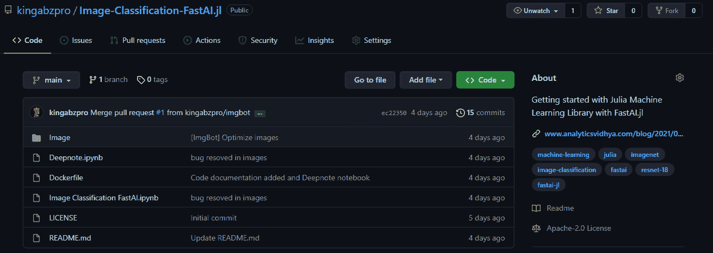
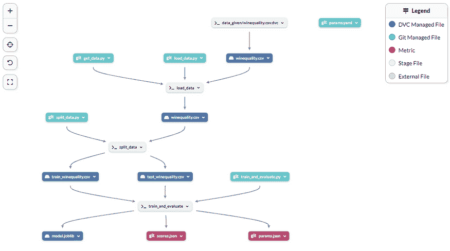
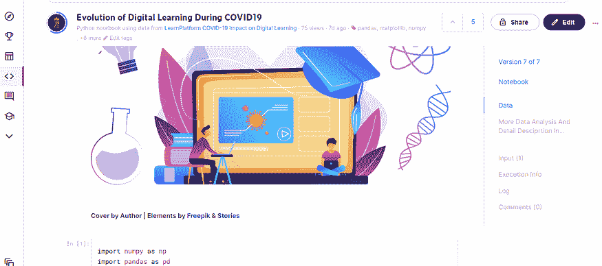
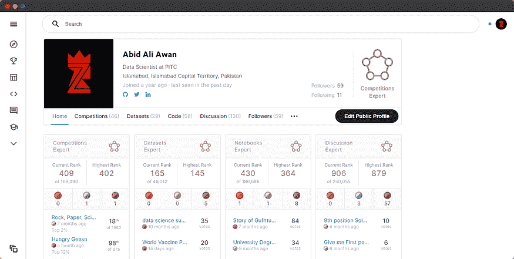
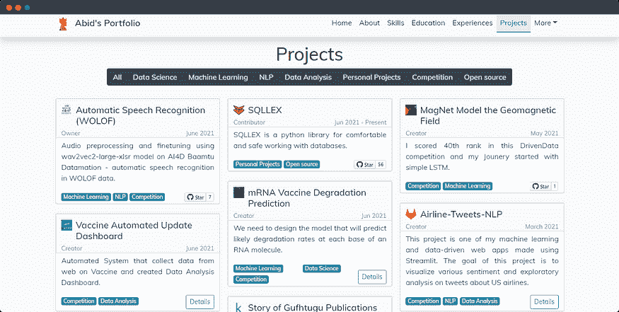
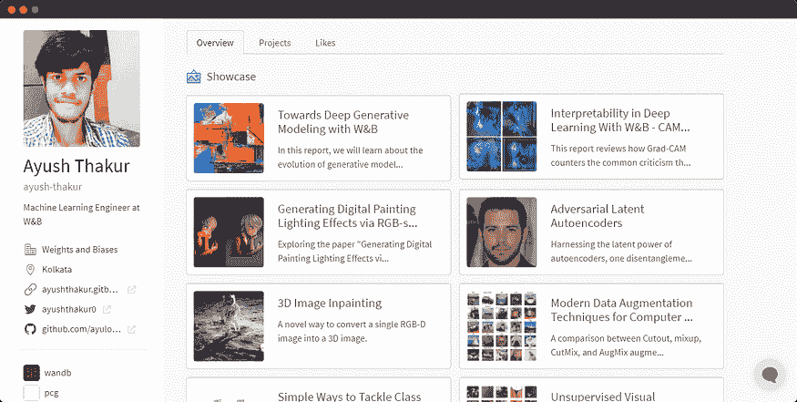
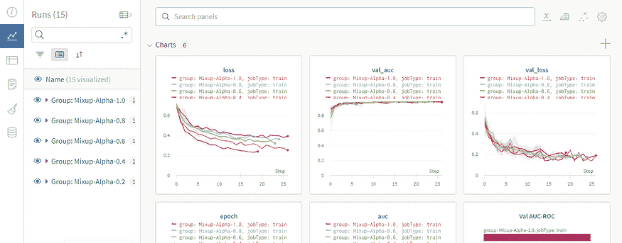

# 如何作为初学者建立强大的数据科学作品集

> 原文：[`www.kdnuggets.com/2021/10/strong-data-science-portfolio-as-beginner.html`](https://www.kdnuggets.com/2021/10/strong-data-science-portfolio-as-beginner.html)

图片来源：作者 | 元素来自 [Free Vector | 统计概念插图](https://www.freepik.com/free-vector/statistics-concept-illustration_5426309.htm#page=1&query=data&position=46)

* * *

## 我们的前 3 名课程推荐

 1\. [Google 网络安全证书](https://www.kdnuggets.com/google-cybersecurity) - 快速进入网络安全职业生涯。

 2\. [Google 数据分析专业证书](https://www.kdnuggets.com/google-data-analytics) - 提升你的数据分析技能

 3\. [Google IT 支持专业证书](https://www.kdnuggets.com/google-itsupport) - 支持你在组织中的 IT

* * *

作为初学者，我有很多关于如何开始的问题。我如何学习，或者在哪里获得项目的想法。因此，在长时间的搜索之后，我发现了一个数据分析项目。我花了三天时间编写代码，对第一次尝试很满意，但随后出现了一个大问题：我如何与世界分享它？我当时没有好的编码技能或文档技能来展示我的工作，所以我把它存储在云端并忘记了它。一个月后，我在 GitHub 上随机寻找更多项目时，发现了这个令人惊叹的 [个人资料](https://github.com/subhamrex)，它激励我创建了我的作品集。这是我做出的最好的决定，它让我进入了开发者社区的视野，不久之后，我开始收到招聘人员和初学者关于我项目的电子邮件。

**找工作**通常是建立作品集的主要原因。如果我们没有相关的教育或经验，有时这也是必要的（[eugeneyan.com](https://eugeneyan.com/writing/data-science-portfolio-how-why-what/)）。在现代社会，雇主对招聘新毕业生持怀疑态度，那么你怎么说服他们你最适合这个职位呢？你通过展示你在之前项目中的工作来展示你的技能。你的在线作品集越强大，你被聘用为理想工作的机会就越高。

> “作品集非常关键，因为当你在面试时，它展示了你的实际经验，这样你就可以从 A 到 Z 向雇主解释整个数据科学工作流程。”
> 
> — [David Yakobovitch](https://www.springboard.com/blog/data-science/springboard-mentor-david-yakobovitch/)

另一个动机是创建一个**个人项目**，满足你对学习新事物的好奇心。当我们学习新技能时，我们想要进行实验，最终构建一个可以在现实世界中使用的有效产品。

在这篇文章中，我们将学习作为数据科学初学者展示自己工作的方式。你将了解一些使你的生活更轻松的新平台以及构建强大作品集的技巧。

# GitHub

让我澄清一下数据科学家之间的误解。是的，[GitHub](https://github.com/)是必要的，我们都应该学习[git](https://git-scm.com/)。作为数据科学家，我每天使用 GitHub，在这里寻找有趣的数据集和项目。这是开发者中最受欢迎的平台，老实说，招聘人员在邀请你面试之前确实会查看你的 GitHub 个人资料。

作者提供的图片 | [github](https://github.com/kingabzpro/Image-Classification-FastAI.jl)

GitHub 是一个全球协作平台，人们在这里分享和合作项目。正如你在我的个人资料中看到的，我不仅为其他人的项目做出了贡献，也在自己项目上进行工作。

作者提供的图片 | [kingabzpro](https://github.com/kingabzpro)

**创建一个可靠个人资料的提示：**

1.  创建你的个人主页，完整教程请查看[Sarah Hart’s](https://sarah-hart-landolt.medium.com/6-easy-steps-to-create-a-beautiful-github-profile-readme-edc7840b2c7)的博客。

1.  用链接、封面图片和详细描述记录每个项目。

1.  Fork 你最喜欢的项目，并发送你的第一个拉取请求 ([freecodecamp.org](https://www.freecodecamp.org/news/how-to-make-your-first-pull-request-on-github-3/))。

1.  在这个平台上积极参与，包括贡献代码、报告漏洞和推进当前项目。

# Deepnote

[Deepnote](https://deepnote.com/)比 GitHub 简单得多，也很适合初学者。如果你熟悉[Jupyter notebook](https://jupyter.org/)，那么发布你的第一个项目将变得非常简单。我对 Deepnote 的体验绝对惊人，因为该平台提供了 GitHub 的所有功能，但更加简单，并专注于数据科学社区。

作者提供的图片 | [Pakistan Vaccination Progress](https://deepnote.com/@abid/Pakistan-Vaccination-Progress-sgGprLfPSHuLyI5XTrYiqQ)

最近，他们推出了一个 Deepnote 个人资料功能，可以展示你发布的所有笔记本以及你的信息和个人照片。

作者提供的图片 | [Deepnote](https://deepnote.com/@abid)

就像[GitHub Gist](https://gist.github.com/)一样，你可以与团队或公众分享代码片段。我在所有 Medium 出版物和社交媒体平台上使用了 Deepnote 单元。你可以查看我之前的[文章](https://towardsdatascience.com/deploying-your-first-machine-learning-api-1649236c695e)来了解如何实现 Deepnote 单元。使用带有输出的代码片段使你能够在多个平台上分享项目。

我更喜欢 Deepnote 内嵌单元格而不是 GitHub Gist，因为它不仅提供静态输出，还有互动功能。

你可以使用 Plotly 并在 Medium 文章中展示你的图表：

**创建扎实个人资料的技巧：**

1.  更新你的个人简介、头像和联系信息。

1.  始终通过使用 markdown 单元格添加关于你项目的详细描述。

1.  使用封面照片让你的项目脱颖而出。

1.  在 Deepnote 中使用应用功能创建互动网页应用。

1.  定期发布旧项目或重新发布来自 GitHub 的笔记本。

# DAGsHub

[DAGsHub](https://dagshub.com/) 对这个世界来说是新的，它通过为机器学习从业者和数据工程师提供一站式解决方案迅速崭露头角。DAGsHub 配备了一个 [DVC](https://dvc.org/) 服务器、[MLflow](https://mlflow.org/)、可视化管道和 GitHub 同步功能。我们不会深入探讨所有功能，而是专注于使其脱颖而出的功能。

DAGsHub 允许你分享你的 GitHub 仓库，并创建你的数据科学项目，能够可视化机器学习和数据管道。它还有一个隐藏功能 README.ipynb 作为你的项目描述文件，非常适合不习惯使用 markdown 的初学者和喜欢使用 Jupyter Notebook 的数据科学家。它类似于 GitHub，这意味着你需要学习 Git 和 DVC 才能正确使用这个平台。

> “我看到其他用户喜欢的功能是能够通过管道可视化他们的项目结构，以及能够将他们的数据和模型视为项目的一个组成部分。此外，我们基于开源工具而不是重新发明现有解决方案的事实也是人们喜欢的。”
> 
> — [Dean](https://www.linkedin.com/in/deanpleban/)

Dean 图片 | [dagshub](https://dagshub.com/Dean/DHEERAJKU)

我的个人资料还很新，但我喜欢这个平台，因为它为我提供了完整的机器学习生态系统。我认为在功能和用户界面简洁性方面，我更喜欢它而不是 GitHub。

作者图片 | [DAGsHub](https://dagshub.com/kingabzpro)

**创建扎实个人资料的技巧：**

1.  学习 [DVC](https://dvc.org/)、[Git](https://git-scm.com/) 和 [MLflow](https://mlflow.org/) 以充分利用它们。

1.  在你的笔记本和 README 中添加项目描述。

1.  通过添加个人简介、头像和联系信息来更新你的个人资料。

1.  尝试在你的项目中添加 dvc.yaml 和 dvc.lock 以展示数据管道。更多信息，请查看 [定义管道](https://dagshub.com/docs/tutorial/pipeline/index.html)。

1.  通过参与开源项目和推动个人项目来保持活跃的个人资料。你可以使用 [fds](https://github.com/DAGsHub/fds) cli 来简化工作并避免错误。

1.  充分利用 DVC，将你的数据和模型上传到远程服务器。招聘者对了解从数据获取到仪表盘完整数据科学周期的候选人感兴趣。

# Kaggle

如果你想在数据科学领域更快地被注意到，你应该创建一个[Kaggle](https://www.kaggle.com/)账户，并开始参与竞赛、数据集、笔记本和讨论。当你成为大师时，人们会尊敬你，并为你提供更好的职业机会。如果你问我，我建议你在学习基础知识时创建一个 Kaggle 个人资料。向专家学习，发现你的专长。我非常喜欢这个平台，因为它为初学者提供了竞争和为各行各业开发创新解决方案的支持。它是 AI 研究的核心。

图片由作者提供 | [Kaggle](https://www.kaggle.com/kingabzpro/evolution-of-digital-learning-during-covid19)

你可以查看我下面的个人资料，因为从一开始我就在各种类别中贡献，以获得排名。目前，我是专家，但凭借一枚金牌和一枚银牌，我将成为大师，这并不容易，老实说，我尊敬大师们，因为他们证明了自己在其他数据从业者中是最优秀的。

图片由作者提供 | [Kaggle](https://www.kaggle.com/kingabzpro)

**创建一个扎实的个人资料的提示：**

1.  在平台上保持活跃，使用新数据集并创建数据分析或机器学习模型。

1.  参与讨论，向专家学习，并寻求帮助。

1.  使用网页抓取来发布新数据集。

1.  参加大多数竞赛，以学习多种类型的机器学习问题并获得徽章。

1.  专注于发布你最好的作品，附上详细描述和高质量的代码。

1.  在个人简介中写关于自己的内容并添加联系信息。

# 博客

撰写博客是创建项目后要做的下一步。如果你想扩大受众，我强烈建议你从[Medium](https://medium.com/)开始。写博客不是必需的，但你会从各个领域获得更多关注。Medium 平台允许你创建个人资料，并在各种出版物下发布你的文章，例如[Towards Data Science](https://towardsdatascience.com/)和[Towards AI](https://pub.towardsai.net/)。你可以开发自己的博客网站或使用其他类似平台，如[Analytics Vidhya](https://www.analyticsvidhya.com/)。

图片由作者提供 | [Medium](https://medium.com/@kingabzpro)

**创建一个扎实的个人资料的提示：**

1.  撰写关于你亲自参与的项目的博客。

1.  撰写关于新兴技术或数据科学新应用的博客。

1.  撰写博客时要进行适当的研究，并添加引用，以避免违反平台规则。

1.  为每个博客使用吸引人的封面照片。

1.  在开发数据科学项目时，总是写下你从经验中学到的东西。

1.  不要盲目跟随潮流，专注于你擅长的领域。

# 作品集网站

你还可以在个人网站上展示你的项目，如果你不是网页开发人员，也有一些简单的工具可以让这个过程变得非常容易。你可以查看 [如何使用 Hugo 和 GitHub Pages 构建数据科学作品集网站](https://www.youtube.com/watch?v=mEZ1Hj5yQ-8&t=235s) 和 [Hugo](https://gohugo.io/) 的各种模板。

我的作品集网站包括来自所有平台的项目，附有简短描述和子类别。我花了三天时间创建整个网站并将其部署到 GitHub Pages 上。

图片来源：作者 | [Portfolio](https://abidaliawan.me/)

**创建一个稳固的作品集网站的提示：**

1.  添加你的技能、简历和 CV。

1.  展示你的经验和一个

1.  展示你的项目，并提供指向你的 GitHub 或 Deepnote 项目的链接。

1.  使你的网站简洁而互动，以便招聘人员可以轻松浏览你的整个作品集。

1.  保持你的作品集网站更新，展示你正在进行的最新项目。

# Weight & Biases

我通常使用 [Weight & Biases](https://wandb.ai/) 进行机器学习实验，并记录模型的性能指标，但随着 W&B 个人资料的推出，这一点发生了变化。你可以通过使用嵌入链接和图表集成撰写关于你当前项目的博客。这与我提到的其他作品集平台类似，但它具有与 Python 库的直接集成的优势。

[Ayush](https://wandb.ai/ayush-thakur) 的个人资料给我留下了深刻印象，因为他在撰写有关机器学习的博客的同时，也为其他组织做出贡献。

图片来源：Ayush | [Weights & Biases](https://wandb.ai/ayush-thakur)

W&B 项目具有模型性能指标，如下所示。

图片来源：作者 | [kaggle-seti](https://wandb.ai/ayush-thakur/kaggle-seti-exp2?workspace=user-kingabzpro)

**创建一个稳固的个人资料的提示：**

1.  加入其他数据科学组织，并参与小组项目。

1.  使用 W&B API 显示你的机器学习项目结果。

1.  使用 W&B 指标集成撰写博客。

1.  添加个人简介、头像和联系信息。

1.  尝试参与社区讨论，并始终寻找新的有趣项目。

# 结论

W&B 是一个全能工具，它以记录实验而闻名，而不是作品集，但互动博客的引入让我们独特地展示了你的项目并创建了一个强大的作品集。

如果你是初学者，我建议你从 Deepnote 开始，因为它对团队免费，并且提供了适合初学者的工具。如果你希望在数据科学社区中获得关注，可以尝试在 GitHub 和 Kaggle 上创建个人档案。如果你想打造自己的品牌，可以从博客网站入手或创建你的网站。

最后，我希望大家在上述提到的所有平台上创建个人档案，因为它们都具有在潜在雇主面前留下深刻印象的独特优势。我知道刚开始时可能会有些不知所措，但一旦你习惯了记录和展示你的项目，这一切都会变得简单。

[**Abid Ali Awan**](https://www.polywork.com/kingabzpro) ([@1abidaliawan](https://twitter.com/1abidaliawan)) 是一位认证的数据科学专业人士，热衷于构建机器学习模型。目前，他专注于内容创作和撰写关于机器学习和数据科学技术的技术博客。Abid 拥有技术管理硕士学位和电信工程学士学位。他的愿景是利用图神经网络为面临心理健康问题的学生构建一个人工智能产品。

### 更多相关话题

+   [7 个免费平台帮助建立强大的数据科学作品集](https://www.kdnuggets.com/2022/10/7-free-platforms-building-strong-data-science-portfolio.html)

+   [5 个免费平台帮助建立强大的数据科学作品集](https://www.kdnuggets.com/5-free-platforms-for-building-a-strong-data-science-portfolio)

+   [如何设计你的数据科学作品集](https://www.kdnuggets.com/2022/01/design-data-science-portfolio.html)

+   [水银概述：创建数据科学作品集和…](https://www.kdnuggets.com/2022/05/overview-mercury-creating-data-science-portfolio-notebook-based-webapps.html)

+   [托管数据科学作品集的 5 个最佳地点](https://www.kdnuggets.com/2022/07/5-best-places-host-data-science-portfolio.html)

+   [2022 年能让你找到工作的数据科学作品集](https://www.kdnuggets.com/2022/10/data-science-portfolio-land-job-2022.html)
