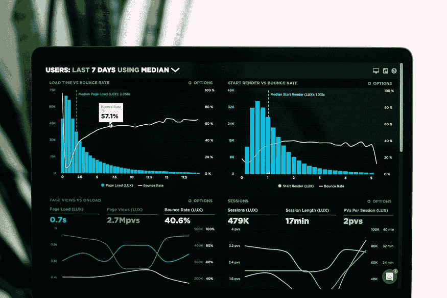

# 如何从零开始使用 Python 创建令人惊叹的可视化

> 原文：[`www.kdnuggets.com/2021/02/stunning-visualizations-using-python.html`](https://www.kdnuggets.com/2021/02/stunning-visualizations-using-python.html)

评论

**作者 [Sharan Kumar R](https://twitter.com/rsharankumar)，数据科学家 | 作者**。

* * *

## 我们的三大课程推荐

 1\. [Google 网络安全证书](https://www.kdnuggets.com/google-cybersecurity) - 快速进入网络安全职业轨道

 2\. [Google 数据分析专业证书](https://www.kdnuggets.com/google-data-analytics) - 提升你的数据分析技能

 3\. [Google IT 支持专业证书](https://www.kdnuggets.com/google-itsupport) - 支持你的组织的 IT 需求

* * *

*照片由 [Luke Chesser](https://unsplash.com/@lukechesser?utm_source=unsplash&utm_medium=referral&utm_content=creditCopyText) 供稿，来源于 [Unsplash](https://unsplash.com/s/photos/dashboard?utm_source=unsplash&utm_medium=referral&utm_content=creditCopyText)。*

可视化是数据科学家重要的技能。良好的可视化可以帮助清晰地传达分析过程中发现的见解，并且是更好地理解数据集的好技术。我们的脑袋在处理视觉数据时，更容易提取模式或趋势，相比于通过阅读或其他方式提取细节。

在这篇文章中，我将从基础开始讲解 Python 中的可视化概念。以下是从基础学习可视化的步骤，

+   **步骤 1:** 导入数据

+   **步骤 2:** 使用 Matplotlib 进行基本可视化

+   **步骤 3:** 使用 Matplotlib 进行更高级的可视化

+   **步骤 4:** 使用 Seaborn 进行数据分析的快速可视化

+   **步骤 5:** 创建互动图表

到这段旅程结束时，你将掌握构建可视化所需的一切。虽然我们不会覆盖每一种可视化，但你将学习构建图表的概念，因此你可以轻松构建本文未覆盖的任何新图表。

本文中使用的脚本和数据也可以在 git 仓库中找到，[这里](https://github.com/rsharankumar/Learn_Data_Science_in_100Days)。所有数据可以在提到的 git 仓库中的“Data”文件夹中找到，脚本可在‘Day23, Day 24, 和 Day25’文件夹中获取。

### 导入数据

第一步是读取所需的数据集。我们可以使用 pandas 来读取数据。以下是一个简单的命令，可用于从 CSV 文件中读取数据，

在读取数据集时，重要的是对数据进行转换，使其适合我们将要应用的可视化。例如，假设我们有客户级别的销售数据，如果我们想要构建一个显示日销售趋势的图表，则需要对数据进行分组并在日级别上进行汇总，然后使用趋势图。

### 使用 Matplotlib 进行基本可视化

让我们从一些基本的可视化开始。最好使用代码‘fig,ax=plt.subplots()’，其中‘plt.subplots()’是一个函数，将返回一个包含图形和坐标轴对象的元组，并将其分别分配给变量‘fig’和‘ax’。虽然不使用此方法也可以绘制图表，但使用此方法可以对图形进行修改，比如根据需要调整图表大小，并保存图表。此外，这里的‘ax’变量可以用于为坐标轴提供标签。下面是一个简单的示例，我将数据作为数组传递，并直接打印为图表，

在上述代码中，首先导入所需的库，然后使用‘plt.subplots()’函数生成图形和坐标轴对象，然后将数据直接作为数组传递给坐标轴对象以绘制图表。在第二个图表中，坐标轴变量‘ax’接受了针对 x 轴、y 轴和标题的标签输入。

**趋势图**

现在，让我们开始使用一些真实数据，了解如何构建有趣的图表并对其进行自定义以使其更直观。如前所述，在大多数实际使用案例中，数据需要进行一些转换以使其适用于图表。下面是一个示例，我使用了 Netflix 数据，但将数据转换为按年份整合的电影和电视节目的数量。然后，我使用了‘plt.subplots()’函数，但还添加了一些额外的细节，使图表更加直观和自解释。

对上述图表可以进行更多的自定义，比如创建双坐标轴。在上述情况下，电影和电视节目数量之间的差异不大，因此数据看起来还可以。如果它们之间有很大的差异，那么图表可能不太清晰，在这种情况下，我们可以利用双坐标轴，使小值属性也与其他属性对齐。

**散点图**

我们还可以使用散点图来揭示我们绘制的变量之间的关系。该图有助于揭示变量之间的相关性，比如当一个属性增加/减少时，另一个属性会发生什么。

### 更高级的可视化，仍使用 Matplotlib

一旦你对我们迄今为止涵盖的简单趋势图感到熟悉，你就可以开始使用稍微高级的图表和功能，以更好地自定义你的可视化。

**条形图**

条形图帮助我们通过并排绘制多个值来进行比较。有不同种类的条形图，

+   垂直条形图

+   水平条形图

+   堆叠条形图

以下是条形图的一个示例。该图进行了多项自定义，包括，

+   添加了坐标轴标签和标题

+   提供了字体大小

+   还提供了图形大小（默认图表会显得较小且混乱）

+   使用函数生成并添加值到每个条形图的顶部，以帮助观众获取实际细节

**水平和堆叠条形图**

垂直条形图最为常见，但我们也可以使用水平条形图，特别是当数据标签有很长的名称时，很难将其打印在垂直条形图下方。在堆叠条形图的情况下，条形图会在一个类别中相互堆叠。以下是水平和堆叠条形图实现的示例。下面的代码还包括了图表颜色的自定义。

**饼图和甜甜圈图**

饼图用于显示数据中不同类别的比例，这些饼图可以通过用一个圆圈覆盖饼图的中心部分并重新对齐文本/值来轻松修改为甜甜圈图。以下是一个简单的示例，其中我实现了饼图并将其修改为甜甜圈图，

**为什么学习 Matplotlib 很重要？**

Matplotlib 是 Python 中一个非常重要的可视化库，因为许多其他 Python 可视化库都依赖于 Matplotlib。学习 Matplotlib 的一些优势/好处包括，

+   易于学习

+   它是高效的

+   允许大量自定义，使得几乎可以构建任何类型的可视化

+   像 Seaborn 这样的库是建立在 Matplotlib 之上的

我只涵盖了 Matplotlib 中最基本的可视化，但重要的是，通过实践这些图表，你将获得构建更多可视化的知识。Matplotlib 支持许多可视化，[这里](https://matplotlib.org/3.1.0/gallery/index.html) 是所有支持图表的画廊链接。

### 使用 Seaborn 构建数据分析的快速可视化

我们已经覆盖了使用 Matplotlib 库的各种可视化。我不确定你是否注意到了，虽然 matplotlib 提供了高度的自定义，但它涉及大量编码，因此可能会很耗时，特别是当你进行探索性分析时，想要快速绘制一些图表以更好地理解数据并更快做出决策。这正是 Seaborn 库所提供的。以下是使用 seaborn 库的一些好处，

+   默认主题仍然很吸引人

+   简单且快速构建可视化，特别是用于数据分析

+   它的声明式 API 使我们能够专注于图表的关键元素

也有一些缺点，比如它不提供很多自定义选项，而且在处理大型数据集时可能会导致内存问题。但总体而言，好处大于坏处。

**只需一行代码的可视化**

以下是一些使用 Seaborn 库仅用一行代码实现的简单可视化。

如上图所示，这些可视化仅用一行代码创建，并且看起来相当可呈现。Seaborn 库在数据分析阶段广泛使用，因为我们可以轻松地快速构建图表，并且最小化/没有对图表的呈现效果产生影响。可视化在数据分析中至关重要，因为它们有助于揭示数据中的模式，而 Seaborn 库非常适合这一目的。

**热力图**

热力图是另一种有趣的可视化，广泛用于时间序列数据中，以揭示数据集中的季节性和其他模式。然而，要构建热力图，我们需要将数据转换为特定格式，以支持热力图绘制。以下是一个示例代码，用于转换数据以适应热力图绘制，并使用 Seaborn 库构建热力图。

**Pair Plot — 我最喜欢的 Seaborn 功能**

我认为 Pair Plot 是 Seaborn 库中最好的功能之一。它通过可视化帮助比较数据集中每个属性与其他每个属性的关系，并且只需一行代码。以下是构建 Pair Plot 的示例代码。当我们处理的数据集包含大量列时，使用 Pair Plot 可能不太可行。在这种情况下，可以使用 Pair Plot 来分析特定属性集之间的关系。

### 构建交互式图表

在进行数据科学项目时，有时需要与业务团队分享一些可视化内容。虽然仪表板工具广泛用于此目的，但假设在数据分析过程中你发现了一个有趣的模式，并希望与业务用户分享。如果以图片的形式分享，业务用户可能无能为力，但如果以交互式图表的形式分享，就可以让业务用户通过缩放或使用其他功能与图表互动，从而查看详细信息。以下是一个示例，我们创建了一个 HTML 文件作为输出，包含了可以与其他用户共享并可在网页浏览器中简单打开的可视化内容。

如果你想学习使用 Python 进行可视化，请查看下面我的播放列表。它包含三个视频，总教程时长稍超过一个小时。

查看 [www.youtube.com/watch?list=PLH5lMW7dI2qeI8-85o0eCPDAGANUpUNHm&v=Rdwik2Eh8f0](https://www.youtube.com/watch?list=PLH5lMW7dI2qeI8-85o0eCPDAGANUpUNHm&v=Rdwik2Eh8f0)

[原文](https://towardsdatascience.com/how-to-do-visualization-using-python-from-scratch-651304b5ee7a)。经许可转载。

**简介：** [Sharan Kumar R](https://twitter.com/rsharankumar) 是一位拥有超过 10 年经验的数据科学专家，曾著有两本数据科学书籍，现可在[此处](https://www.amazon.com/Sharan-Kumar-Ravindran/e/B015SUYR2S/ref=dp_byline_cont_ebooks_1)购买。Sharan 还主持一个[YouTube 频道](https://www.youtube.com/c/DataSciencewithSharan)，用于教授和讨论各种数据科学概念。

**相关：**

+   [这些数据科学技能将成为你的超级力量](https://www.kdnuggets.com/2020/08/data-science-skills-superpower.html)

+   [每个数据科学家都应掌握的前 10 大数据可视化工具](https://www.kdnuggets.com/2020/05/top-10-data-visualization-tools-every-data-scientist.html)

+   [如何在 Python（和 R）中可视化数据](https://www.kdnuggets.com/2019/11/visualize-data-python-and-r.html)

### 了解更多相关内容

+   [使用管道编写干净的 Python 代码](https://www.kdnuggets.com/2021/12/write-clean-python-code-pipes.html)

+   [建立一个强大的数据团队](https://www.kdnuggets.com/2021/12/build-solid-data-team.html)

+   [用 ChatGPT 在几秒钟内创建惊艳的数据可视化](https://www.kdnuggets.com/create-stunning-data-viz-in-seconds-with-chatgpt)

+   [成为优秀数据科学家所需的 5 项关键技能](https://www.kdnuggets.com/2021/12/5-key-skills-needed-become-great-data-scientist.html)

+   [每个初学者数据科学家应掌握的 6 种预测模型](https://www.kdnuggets.com/2021/12/6-predictive-models-every-beginner-data-scientist-master.html)

+   [2021 年最佳 ETL 工具](https://www.kdnuggets.com/2021/12/mozart-best-etl-tools-2021.html)
