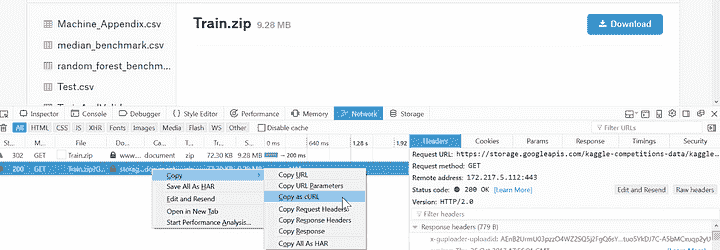
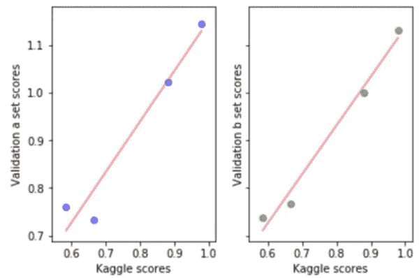

# fast.ai 机器学习课程笔记

> 原文：[`www.kdnuggets.com/2018/07/suenaga-fast-ai-machine-learning-notes.html`](https://www.kdnuggets.com/2018/07/suenaga-fast-ai-machine-learning-notes.html)

 评论

**作者：[Hiromi Suenaga](https://www.linkedin.com/in/hiromis/)，fast.ai 学生**

> **编辑注释：** 这是系列文章之一，汇集了关于 fast.ai 机器学习和深度学习课程的一组极好的笔记，这些课程[在线免费提供](http://www.fast.ai/)。所有这些笔记的作者，[Hiromi Suenaga](https://www.linkedin.com/in/hiromis/)，这些笔记既可以作为课程的补充复习材料，也可以作为独立资源使用，旨在确保在这些总结中给予课程创作者 Jeremy Howard 和 Rachel Thomas 足够的致谢。
> 
> 以下是此系列帖子的链接，并附有每个帖子的摘录。这个首个系列仅包含 3 门课程的笔记，而后续的总结（针对深度学习课程）包含完整的课程集。然而，笔记仍然非常有用。[在这里查找更多 Hiromi 的笔记](https://medium.com/@hiromi_suenaga)。

*这是我从[机器学习课程](http://forums.fast.ai/t/another-treat-early-access-to-intro-to-machine-learning-videos/6826/1)中整理的个人笔记。这些笔记会随着我对课程的进一步复习而不断更新和完善，以“真正”理解课程内容。非常感谢[Jeremy](https://twitter.com/jeremyphoward)和[Rachel](https://twitter.com/math_rachel)给予我这次学习的机会。*

[**机器学习 1：第 1 课**](https://medium.com/@hiromi_suenaga/machine-learning-1-lesson-1-84a1dc2b5236)

**问题**：那么维度灾难呢？你经常会听到两个概念——维度灾难和无免费午餐定理。它们在很大程度上是没有意义的，基本上是愚蠢的，然而许多领域的人不仅知道这些，还认为正好相反，因此值得解释。维度灾难的想法是，列数越多，就会创建一个越来越空的空间。有一个迷人的数学概念，即维度越多，所有点就越趋向于这个空间的边缘。如果你只有一个维度，事情是随机的，那么它们会分布在各处。否则，如果是一个方形，那么它们在中间的概率意味着它们不能处于任一维度的边缘，因此不在边缘的可能性稍微小一点。每增加一个维度，点不在至少一个维度的边缘的可能性就会按乘法减少，因此在高维空间中，一切都位于边缘。这在理论上的含义是点之间的距离变得不那么有意义。因此，如果我们假设这很重要，那么这将表明，当你有很多列时，如果不小心移除那些不相关的列，事情将不会正常工作。这实际上并不是这种情况，有许多原因。

**[机器学习 1：第二课](https://medium.com/@hiromi_suenaga/machine-learning-1-lesson-2-d9aebd7dd0b0)**

**问题**：你能解释一下验证集和测试集之间的区别吗 [20:58]？今天我们要学习的内容之一是如何设置超参数。超参数是调整模型行为的参数。如果你只有一个留出的数据集（即你不用于训练的数据集），而且我们用它来决定使用哪个超参数。如果我们尝试一千组不同的超参数，我们可能会出现过拟合到这个留出集的情况。因此，我们想要做的是拥有第二个留出集（测试集），在我们尽力做到最好之后，就在最后一次检查它是否有效。

你必须实际将第二个留出集（测试集）从数据中移除，交给其他人，并告诉他们不要让你查看，直到你保证完成。否则，很难不去查看。在心理学和社会学领域，这被称为复制危机或 P-hacking。这就是为什么我们要有一个测试集。

**[机器学习 1：第三课](https://medium.com/@hiromi_suenaga/machine-learning-1-lesson-3-fa4065d8cb1e)**

**优质验证集的重要性**：如果没有一个良好的验证集，很难，甚至不可能，创建一个好的模型。如果你尝试预测下个月的销售并建立了模型。如果你没有办法知道你建立的模型是否能够很好地预测一个月后的销售，那你就没有办法知道在实际应用中你的模型是否会有效。你需要一个你知道可靠的验证集，以判断你的模型在投入生产或在测试集上使用时是否可能表现良好。

通常你不应该在比赛结束或项目结束时使用测试集以外的其他用途。但有一件事你可以额外使用测试集——那就是校准你的验证集。

**简介： [Hiromi Suenaga](https://www.linkedin.com/in/hiromis/)** 是 fast.ai 的学生。

**相关：**

+   表格数据深度学习简介

+   使用 fast.ai 的日期快速特征工程

+   3 个流行深度学习课程概述

* * *

## 我们的前三课程推荐

 1\. [Google 网络安全证书](https://www.kdnuggets.com/google-cybersecurity) - 快速进入网络安全职业生涯。

 2\. [Google 数据分析专业证书](https://www.kdnuggets.com/google-data-analytics) - 提升你的数据分析技能

 3\. [Google IT 支持专业证书](https://www.kdnuggets.com/google-itsupport) - 支持你的组织进行 IT 工作

* * *

### 更多相关话题

+   [SQL 专业笔记：免费的电子书评审](https://www.kdnuggets.com/2022/05/sql-notes-professionals-free-ebook-review.html)

+   [KDnuggets 新闻，5 月 11 日：SQL 专业笔记；如何…](https://www.kdnuggets.com/2022/n19.html)

+   [简单快速的数据流处理，用于机器学习项目](https://www.kdnuggets.com/2022/11/simple-fast-data-streaming-machine-learning-projects.html)

+   [通过快速克里金法（FKR）加速机器学习](https://www.kdnuggets.com/2022/06/vmc-speed-machine-learning-fast-kriging.html)

+   [实用深度学习，来自 fast.ai 的回归！](https://www.kdnuggets.com/2022/07/practical-deep-learning-fastai-2022.html)

+   [BERT 在稀疏性下的速度有多快？](https://www.kdnuggets.com/2022/04/fast-bert-go-sparsity.html)
