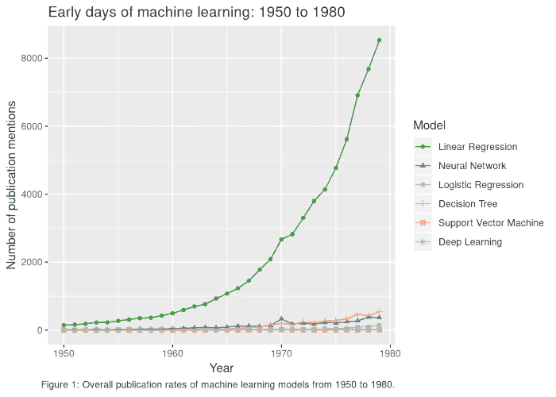
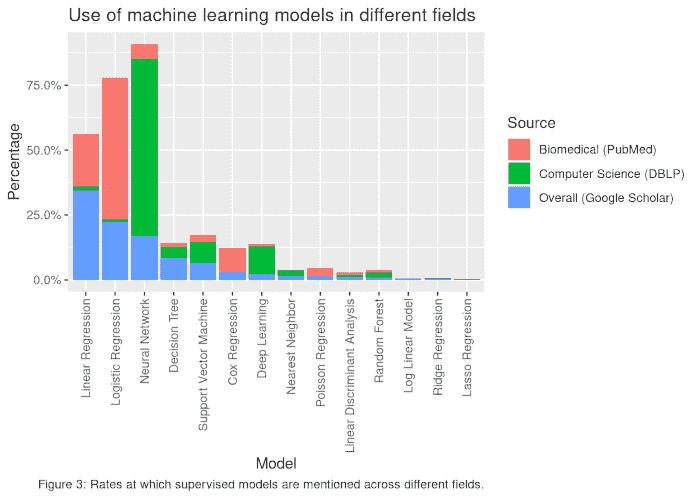

# 监督学习：从过去到现在的模型流行度

> 原文：[`www.kdnuggets.com/2018/12/supervised-learning-model-popularity-from-past-present.html`](https://www.kdnuggets.com/2018/12/supervised-learning-model-popularity-from-past-present.html)

 评论

**作者：[Matthias Döring](https://linkedin.com/in/matthias-doering)**

在过去几十年中，机器学习领域经历了巨大的变化。诚然，一些方法已经存在了很长时间，并且仍然是该领域的主流。例如，最小二乘法的概念早在 19 世纪初就已由[勒让德](https://archive.org/details/nouvellesmthode00legegoog/)和[高斯](https://www.e-rara.ch/zut/content/titleinfo/142787)提出。其他方法如神经网络，[其最基本的形式在 1958 年被引入](http://psycnet.apa.org/record/1959-09865-001)，在过去几十年中得到了显著的进展，而像[支持向量机（SVMs）](https://link.springer.com/article/10.1007/BF00994018)这样的方法则更为近期。

* * *

## 我们的前三大课程推荐

 1\. [Google 网络安全证书](https://www.kdnuggets.com/google-cybersecurity) - 快速进入网络安全职业生涯。

 2\. [Google 数据分析专业证书](https://www.kdnuggets.com/google-data-analytics) - 提升你的数据分析技能

 3\. [Google IT 支持专业证书](https://www.kdnuggets.com/google-itsupport) - 支持你的组织的 IT

* * *

由于监督学习方法的种类繁多，通常会提出以下问题：**哪个模型最好？** 正如乔治·博克著名地指出的那样，这个问题很难回答，因为*所有模型都是错误的，但有些是有用的*。特别是，模型的有用性在很大程度上取决于手头的数据。因此，这个问题没有普遍的答案。一个更容易回答的问题是：**哪个模型最受欢迎？** 这将是本文讨论的内容。

### 测量机器学习模型的流行度

在本文中，我将使用频率学派的方法来定义流行度。更准确地说，我将使用提及个别监督学习模型的科学出版物数量作为流行度的替代指标。当然，这种方法也有一些局限性：

+   可能存在比出版数量更准确的流行度概念。例如，批评某一模型的出版物并不一定意味着该模型很受欢迎。

+   分析受到使用的搜索词的影响。为了确保高特异性，我没有考虑模型缩写，这也是我可能未能检索到所有潜在结果的原因。此外，对于那些也被未纳入分析的搜索词提及的模型，灵敏度可能较低。

+   文献数据库并不完美：有时，出版物会存储有错误的元数据（例如错误的年份），或者可能存在重复出版物。因此，出版频率中会有一些噪声是可以预期的。

对于这部分内容，我进行了两项分析。第一次分析是对出版频率的纵向分析，而第二次分析则比较了不同领域与机器学习模型相关的整体出版数量。

对于第一次分析，我通过从 Google Scholar 抓取数据来确定出版物的数量，该数据考虑了科学出版物的标题和摘要。为了识别与单个监督学习方法相关的出版物数量，我确定了 1950 年至 2017 年间 Google Scholar 的搜索结果数量。由于从 Google Scholar 抓取数据非常困难，我依靠了[ScrapeHero 的有用建议](https://www.scrapehero.com/how-to-fake-and-rotate-user-agents-using-python-3/)来收集数据。

我在分析中包括了以下 13 种监督学习方法：神经网络、深度学习、支持向量机、随机森林、决策树、线性回归、逻辑回归、泊松回归、岭回归、套索回归、k-最近邻、线性判别分析和对数线性模型。请注意，对于套索回归，考虑了*套索回归*和*套索模型*这两个术语。对于最近邻，考虑了*k-最近邻*和*k-最近邻*这两个术语。结果数据集显示了[从 1950 年至今与每种监督模型相关的出版数量](https://www.datascienceblog.net/data-sets/ml_models_timeline.csv)。

### 从 1950 年至今使用监督学习模型

为了分析纵向数据，我将区分两个时期：机器学习的早期（1950 年至 1980 年），在此期间模型较少，以及形成时期（1980 年至今），在此期间机器学习的兴趣激增，许多新模型得到开发。请注意，在以下可视化中仅显示最相关的方法。

### 早期：线性回归的主导地位

从图 1 中可以看出，线性回归在 1950 年至 1980 年间是主导方法。相比之下，其他机器学习模型在科学文献中极少被提及。然而，从 1960 年代开始，我们可以看到神经网络和决策树的受欢迎程度开始增长。我们还可以看到逻辑回归尚未广泛应用，1970 年代末期提及数量仅有轻微增加。

### 成长岁月：神经网络的多样化与兴起

图 2 表明，从 1980 年代末期开始，在科学出版物中提及的监督模型变得显著多样化。重要的是，机器学习模型在科学文献中的提及率一直稳步增加，直到 2013 年。图中特别显示了线性回归、逻辑回归和神经网络的受欢迎程度。正如我们之前看到的，线性回归在 1980 年之前已经非常流行。然而，从 1980 年开始，神经网络和逻辑回归的受欢迎程度迅速增长。虽然逻辑回归在 2010 年达到了顶峰，与线性回归几乎持平，但神经网络和深度学习（图 2 中的*神经网络/深度学习*曲线）的整体受欢迎程度在 2015 年甚至超过了线性回归的受欢迎程度。

神经网络变得极为流行，因为它们在图像识别（[ImageNet](http://papers.nips.cc/paper/4824-imagenet-classification-with-deep-convolutional-neural-networks)，2012 年）、面部识别（[DeepFace](https://www.cv-foundation.org/openaccess/content_cvpr_2014/html/Taigman_DeepFace_Closing_the_2014_CVPR_paper.html)，2014 年）和游戏（[AlphaGo](https://ai.googleblog.com/2016/01/alphago-mastering-ancient-game-of-go.html)，2016 年）等机器学习应用中取得了突破。Google Scholar 的数据表明，近几年神经网络在科学文章中的提及频率略有下降（图 2 中未显示）。这可能是因为*深度学习*（多层神经网络）在某种程度上取代了*神经网络*这一术语。使用[Google Trends](https://trends.google.com/trends/explore?date=all&q=deep%20learning,neural%20network)也可以得到相同的发现。

剩下的稍微不那么受欢迎的监督方法是决策树和支持向量机。与前三种方法相比，这些方法的提及率明显较低。另一方面，这些方法在文献中的提及频率似乎也波动较小。值得注意的是，决策树和支持向量机的受欢迎程度尚未下降。这与其他方法如线性回归和逻辑回归形成对比，后者的提及数量在近年来显著减少。在决策树和支持向量机之间，支持向量机的提及量似乎展现了更有利的增长趋势，因为支持向量机在其发明仅 15 年后就超越了决策树。

所考虑的机器学习模型的提及数量在 2013 年达到了峰值（589,803 篇出版物），此后略有下降（2017 年为 462,045 篇出版物）。

### 不同领域的监督学习模型的受欢迎程度

在第二次分析中，我想调查不同社区是否依赖不同的机器学习技术。为此，我依赖了三个科学出版物的数据库：[Google Scholar](https://scholar.google.com) 用于一般出版物，[dblp](https://dblp.uni-trier.de/) 用于计算机科学出版物，以及 [PubMed](https://www.ncbi.nlm.nih.gov/pubmed/) 用于生物医学科学的出版物。在这三个数据库中，我确定了 [13 种机器学习模型出现的频率](https://www.datascienceblog.net/data-sets/ml_models_overall.csv)。结果显示在图 3 中。

图 3 展示了许多方法对于个别领域是非常特定的。接下来，让我们分析每个领域中最受欢迎的模型。

### 监督学习模型的总体使用情况

根据 Google Scholar，这五种最常用的监督模型是：

1.  **线性回归：** 3,580,000 (34.3%) 篇论文

1.  **逻辑回归：** 2,330,000 (22.3%) 篇论文

1.  **神经网络：** 1,750,000 (16.8%) 篇论文

1.  **决策树：** 875,000 (8.4%) 篇论文

1.  **支持向量机：** 684,000 (6.6%) 篇论文

总体而言，线性模型明显占据主导地位，占监督模型的超过 50%的提及。非线性方法虽然不远远落后：神经网络以 16.8%的论文量排第三，紧随其后的是决策树（8.4% 的论文）和支持向量机（6.6% 的论文）。

### 生物医学科学中的模型使用

根据 PubMed，生物医学科学中最受欢迎的五种机器学习模型是：

1.  **逻辑回归：** 229,956 (54.5%) 篇论文

1.  **线性回归：** 84,850 (20.1%) 篇论文

1.  **Cox 回归：** 38,801 (9.2%) 篇论文

1.  **神经网络：** 23,883 (5.7%) 篇论文

1.  **泊松回归：** 12,978 (3.1%) 篇论文

在生物医学科学中，我们看到与线性模型相关的提及数量过多：五种最受欢迎的方法中有四种是线性的。这可能由于两个原因。首先，在医学环境中，样本数量通常太少，无法拟合复杂的非线性模型。其次，解释结果的能力对于医学应用至关重要。由于非线性方法通常更难以解释，因此不太适合医学应用，因为仅仅高预测性能通常是不够的。

PubMed 数据中逻辑回归的流行可能与大量展示临床研究的出版物有关。在这些研究中，分类结果（即治疗成功）通常使用逻辑回归进行分析，因为它非常适合解释特征对结果的影响。请注意，Cox 回归在 PubMed 数据中如此受欢迎，因为它常用于分析 Kaplan-Meier 生存数据。

### 计算机科学中的模型使用

从 dblp 检索的计算机科学参考文献中，五种最受欢迎的模型是：

1.  **神经网络：** 63,695 (68.3%) 篇论文

1.  **深度学习：** 10,157 (10.9%) 篇论文

1.  **支持向量机：** 7,750 (8.1%) 篇论文

1.  **决策树：** 4,074 (4.4%) 篇论文

1.  **最近邻：** 3,839 (2.1%) 篇论文

计算机科学出版物中提到的机器学习模型的分布非常独特：大多数出版物似乎涉及最近的非线性方法（例如神经网络、深度学习和支持向量机）。如果我们包括深度学习，那么检索到的计算机科学出版物中超过四分之三的内容涉及神经网络。

### 社区之间的分裂

图 4 总结了文献中提到的参数模型（包括半参数模型）和非参数模型的百分比。条形图显示，机器学习研究中探讨的模型（计算机科学出版物的证据）与实际应用的模型类型（生物医学和总体出版物的证据）之间存在很大差异。尽管超过 90% 的计算机科学出版物涉及非参数模型，但大约 90% 的生物医学出版物涉及参数模型。这表明机器学习研究高度集中于最先进的方法，如深度神经网络，而机器学习的用户往往依赖于更具可解释性的参数模型。

### 摘要

对科学文献中个体监督学习模型提及的分析展示了人工神经网络的高度普及。然而，我们也看到不同类型的机器学习模型在不同领域的使用情况。特别是在生物医学科学领域，研究人员仍然大量依赖参数模型。值得关注的是，是否更复杂的模型会在生物医学领域得到广泛应用，还是这些模型由于解释性不足和在样本量小的情况下泛化能力差，而不适用于该领域的典型应用。

**个人简介**：[马蒂亚斯·多林](https://linkedin.com/in/matthias-doering)从萨尔大学获得生物信息学硕士学位。他目前是马克斯·普朗克信息学研究所的博士生，专注于开发改进病毒感染治疗和预防的计算方法。除了监督学习，他还对通过网络服务部署机器学习模型感兴趣，并在 [datascienceblog.net](https://www.datascienceblog.net/) 上撰写关于数据科学应用的博客。

**资源：**

+   [在线和基于网络的：分析、数据挖掘、数据科学、机器学习教育](https://www.kdnuggets.com/education/online.html)

+   [用于分析、数据科学、数据挖掘和机器学习的软件](https://www.kdnuggets.com/software/index.html)

**相关：**

+   [使用 Doc2Vec 和逻辑回归进行多分类文本分类](https://www.kdnuggets.com/2018/11/multi-class-text-classification-doc2vec-logistic-regression.html)

+   [成为数据科学家时学习逻辑回归的 5 个理由](https://www.kdnuggets.com/2018/05/5-reasons-logistic-regression-first-data-scientist.html)

+   [新手机器学习的前 10 大算法巡礼](https://www.kdnuggets.com/2018/02/tour-top-10-algorithms-machine-learning-newbies.html)

### 更多相关内容

+   [数据可视化的心理学：如何展示具有说服力的数据](https://www.kdnuggets.com/the-psychology-of-data-visualization-how-to-present-data-that-persuades)

+   [机器学习中使用的主要监督学习算法](https://www.kdnuggets.com/2022/06/primary-supervised-learning-algorithms-used-machine-learning.html)

+   [KDnuggets 新闻，6 月 22 日：主要监督学习算法…](https://www.kdnuggets.com/2022/n25.html)

+   [实践监督学习：线性回归](https://www.kdnuggets.com/handson-with-supervised-learning-linear-regression)

+   [理解监督学习：理论与概述](https://www.kdnuggets.com/understanding-supervised-learning-theory-and-overview)

+   [DINOv2：Meta AI 的自监督计算机视觉模型](https://www.kdnuggets.com/2023/05/dinov2-selfsupervised-computer-vision-models-meta-ai.html)
